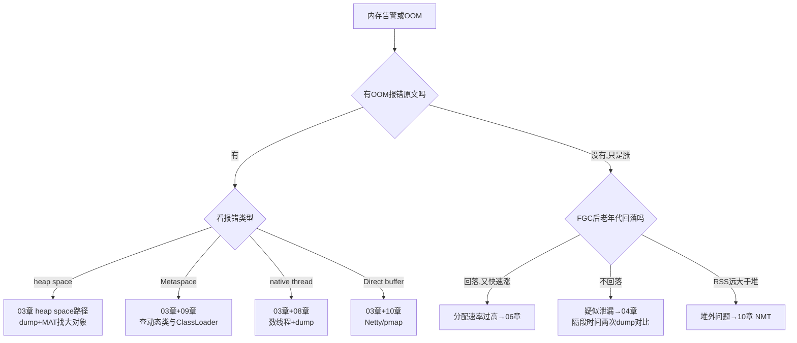
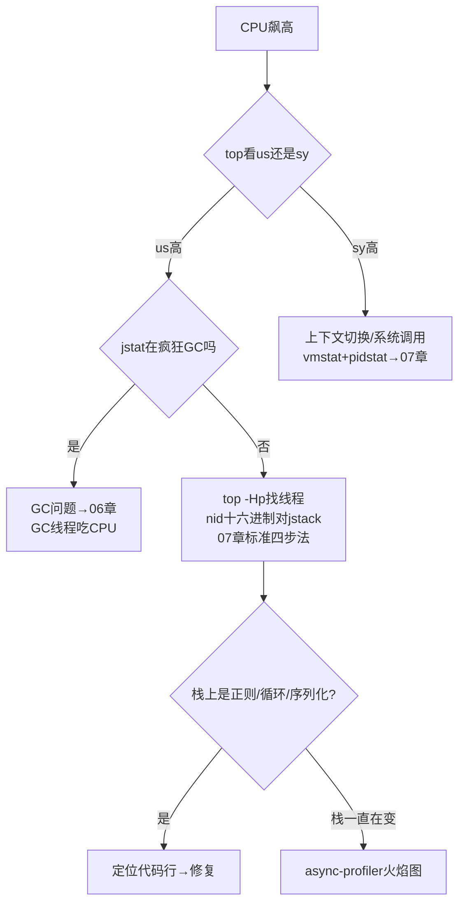
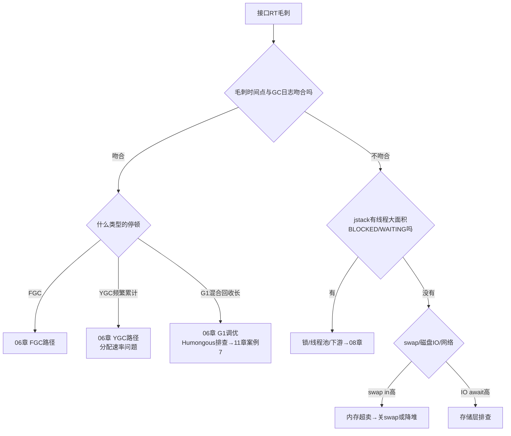
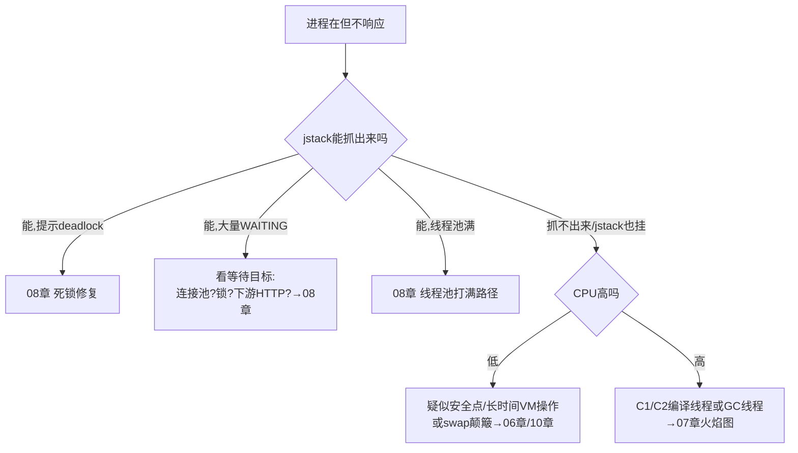
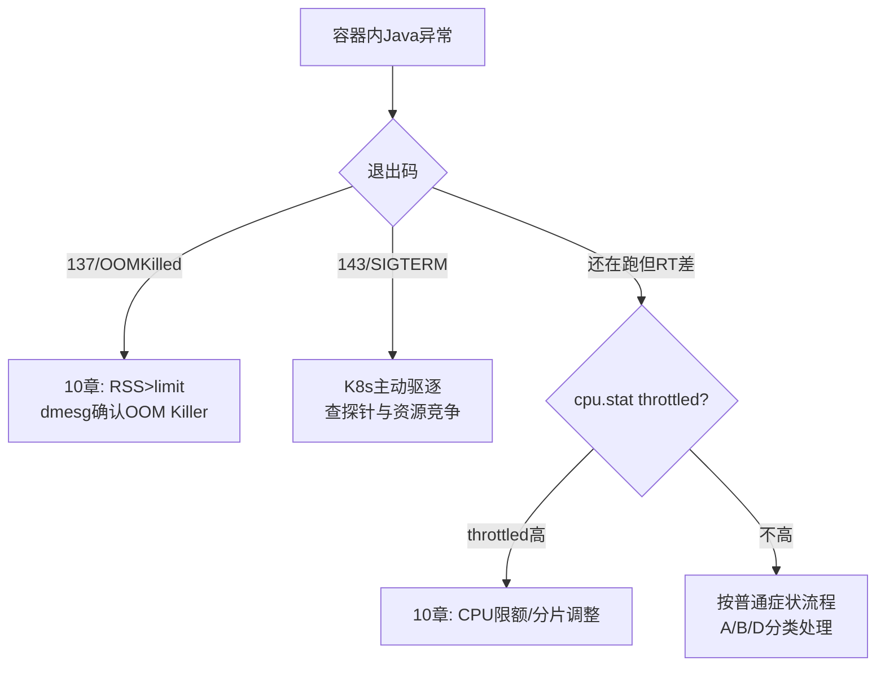

[📖 返回目录](README.md) · [➡️ 下一章](01-methodology-toolbox.md)
# 00 · 快速索引：症状 → 定位 → 解决 路由表

> **本章定位**：整本手册的入口。线上出问题时，从这里按症状找到「第一反应动作」和对应章节。
>
> **📌 30 秒速览**
> 1. 先止血再查根因：能重启的先重启/摘流量，保住现场（堆 dump + GC 日志 + 线程 dump）再动。
> 2. 症状只有五大类：**内存类（OOM/上涨）、GC 类（停顿/频繁）、CPU 类、线程类（卡死/打满）、环境类（容器）**——先归类，再进章节。
> 3. 80% 的突发问题用四条命令起步：`jcmd <pid> VM.uptime`（确认进程状态）→ `top -Hp`（CPU 归属）→ `jstat -gcutil`（GC 压力）→ `jstack`（线程现场）。
> 4. 所有 dump/日志先落盘再分析：`jmap -dump` 会触发一次 Full GC，大堆慎用，优先 `jcmd GC.heap_dump` 或 JFR。

---

## 使用方法

1. 在下面「症状总路由表」里找到最像的一行；
2. 点开对应章节，直接跳到该章的「定位手段」一节照着做；
3. 拿不准就先跑「黄金五分钟」采集包（见文末），把现场保住。

---

## 症状总路由表

### A. 内存类

| # | 症状 | 高概率原因 | 第一反应命令 | 详见 |
|---|------|-----------|-------------|------|
| A1 | 报错 `OutOfMemoryError: Java heap space` | 大对象查询/无界缓存/泄漏 | `-XX:+HeapDumpOnOutOfMemoryError` 的 dump + MAT | [03 §3.1](03-oom-scenarios.md) |
| A2 | 报错 `OutOfMemoryError: Metaspace` / `Metadata GC Threshold` | 动态类生成失控（Groovy/CGLIB/反射） | `jcmd GC.class_stats` / MAT 查 ClassLoader 数量 | [03 §3.2](03-oom-scenarios.md)、[09](09-classloading-metaspace.md) |
| A3 | 报错 `unable to create new native thread` | 线程数暴涨（递归创建/线程池误用） | `jstack` + `ls /proc/<pid>/task \| wc -l` | [03 §3.5](03-oom-scenarios.md)、[08 §8.4](08-thread-lock.md) |
| A4 | 报错 `Direct buffer memory` | Netty/NIO 堆外泄漏或超限 | `pmap` 对比增长 + Netty 泄漏检测开关 | [03 §3.6](03-oom-scenarios.md)、[10 §10.2](10-offheap-container.md) |
| A5 | 报错 `GC overhead limit exceeded` | 堆快满且 GC 空转（98% 时间回收<2%） | 按 A1 处理（本质是堆 OOM 前兆） | [03 §3.7](03-oom-scenarios.md) |
| A6 | 内存缓慢上涨、重启后复发，暂未 OOM | 缓存无淘汰策略 / 泄漏 / 元空间涨 | 隔天对比两份 dump（MAT 对比直方图） | [04](04-memory-leak.md) |
| A7 | RSS 远大于 Xmx（容器里被 kill） | 堆外+元空间+线程栈超出容器 limit | `NMT summary` + 容器 memory limit 核对 | [10 §10.2-10.3](10-offheap-container.md) |
| A8 | 进程突然消失、退出码 137 | K8s/Linux OOM Killer 杀进程 | `dmesg \| grep -i oom` + 容器 events | [10 §10.3](10-offheap-container.md) |

### B. GC 类

| # | 症状 | 高概率原因 | 第一反应命令 | 详见 |
|---|------|-----------|-------------|------|
| B1 | YGC 频繁（每秒多次） | Eden 太小 / 短命对象分配速率过高 | `jstat -gcutil <pid> 1000` 看 YGC 频率与晋升量 | [06 §6.2](06-gc-tuning.md) |
| B2 | FGC 频繁但老年代回收不掉 | 内存泄漏 / 元空间触顶 / `System.gc()` | `jstat -gcutil` + dump 分析 + 查调用来源 | [06 §6.3](06-gc-tuning.md) |
| B3 | 单次 GC 停顿几百 ms～秒级 | 大堆 Full GC / G1 Humongous / 跨代引用扫描 | 开 GC 日志看停顿构成（`-Xlog:gc*`） | [06 §6.4](06-gc-tuning.md) |
| B4 | 服务周期性毛刺（如每 30 分钟一次） | 定时任务大对象 / 缓存批量过期 / swap | GC 日志时间点对齐业务日志 | [06 §6.4](06-gc-tuning.md)、[11 §11.8](11-production-cases.md) |
| B5 | `Allocation Failure` 占满日志 | Eden 分配过快 | 加大新生代或排查分配热点（JFR Allocation profiling） | [06 §6.2](06-gc-tuning.md) |
| B6 | G1 出现 `to-space exhausted` / Full GC | 混合回收跟不上 / 大对象泛滥 | 看 humongous 区块占比，调 G1HeapRegionSize | [06 §6.5](06-gc-tuning.md) |

### C. CPU 类

| # | 症状 | 高概率原因 | 第一反应命令 | 详见 |
|---|------|-----------|-------------|------|
| C1 | `us` 高（用户态 90%+） | 业务死循环 / 正则回溯 / 序列化热点 / GC 线程 | `top -Hp <pid>` 找线程 → `printf '%x'` → jstack 对号 | [07 §7.2](07-cpu-hot.md) |
| C2 | `sy` 高（内核态高） | 频繁系统调用/锁竞争/上下文切换 | `vmstat`/`pidstat -w` 看上下文切换次数 | [07 §7.6](07-cpu-hot.md) |
| C3 | CPU 高但 jstack 里业务线程都 WAITING | GC 线程在烧 CPU（并发标记/Full GC） | `jstat -gcutil` 看是否在疯狂 GC | [07 §7.4](07-cpu-hot.md) |
| C4 | 容器内 CPU 打满但限流不均 / RT 毛刺 | cgroup CPU throttling | `/sys/fs/cgroup/cpu.stat` 看 nr_throttled | [10 §10.4](10-offheap-container.md) |
| C5 | 压测时 CPU 上不去、吞吐上不去 | 锁竞争 / 线程池太小 / IO 阻塞 | jstack 多次采样看 BLOCKED 分布 | [08 §8.5](08-thread-lock.md) |

### D. 线程与响应类

| # | 症状 | 高概率原因 | 第一反应命令 | 详见 |
|---|------|-----------|-------------|------|
| D1 | 接口全部超时、进程还在（假死） | 死锁 / 线程池队列堆积 / 下游阻塞 | `jstack` 连抓 3 次（间隔 5s）对比线程状态 | [08 §8.2/§8.6](08-thread-lock.md) |
| D2 | jstack 直接显示 "Found one Java-level deadlock" | 死锁（锁顺序不一致等） | 按 dump 里提示的两条线程链路改加锁顺序 | [08 §8.2](08-thread-lock.md) |
| D3 | 线程池打满、队列无限增长 | 任务耗时突增 / 线程池参数不合理 / 无界队列 | dump 看 pool 线程都在执行什么 | [08 §8.3](08-thread-lock.md)、[11 §11.4](11-production-cases.md) |
| D4 | 大量线程 BLOCKED on 同一把锁 | 慢 SQL/慢下游持锁时间长 | dump 统计 blocked 目标锁地址 | [08 §8.5](08-thread-lock.md)、[11 §11.3](11-production-cases.md) |
| D5 | 线程数持续上涨到几千 | 未复用的线程池 / Timer 滥用 / 库 bug | `jstack` 看线程名分布统计 | [08 §8.4](08-thread-lock.md) |
| D6 | 部分 RT 长尾、其他正常 | 个别线程卡在 IO/锁（如连接池耗尽） | 抓 dump 找 WAITING on 连接池 acquire | [08 §8.6](08-thread-lock.md)、[11 §11.10](11-production-cases.md) |

### E. 类加载与环境类

| # | 症状 | 高概率原因 | 第一反应命令 | 详见 |
|---|------|-----------|-------------|------|
| E1 | `NoClassDefFoundError`（第一次好第二次坏） | 类初始化失败（静态块抛异常）后缓存 | 看完整异常链里的 `Caused by` | [09 §9.4](09-classloading-metaspace.md) |
| E2 | `ClassNotFoundException` | 依赖缺失 / 类加载器隔离（Tomcat/JarHell） | `-verbose:class` 或 `-Xlog:class+load` | [09 §9.4](09-classloading-metaspace.md) |
| E3 | 热更新/脚本引擎跑久了元空间涨 | ClassLoader 泄漏 | MAT 查重复类与 ClassLoader 实例 | [09 §9.3](09-classloading-metaspace.md)、[11 §11.5](11-production-cases.md) |
| E4 | 容器里堆设成物理机一半仍被杀 | JVM 没感知容器 limit / 堆外超限 | 确认 JDK 版本 ≥8u191 且配 MaxRAMPercentage | [10 §10.3](10-offheap-container.md) |

---

## 五大症状决策流程图

### 内存上涨 / OOM 怎么查



### CPU 100% 怎么查



### 服务卡顿/毛刺怎么查



### 进程假死/无响应怎么查



### 容器内异常怎么查



---

## 黄金五分钟：现场保全清单

出事后 **5 分钟内**按序执行（假设进程号 `$PID`），全部输出落到独立目录：

```bash
mkdir -p /tmp/incident-$(date +%m%d%H%M) && cd /tmp/incident-*
# ① 进程基本盘（秒级）
jcmd $PID VM.uptime; jcmd $PID VM.flags > vmflags.txt
jcmd $PID GC.heap_info > heapinfo.txt
# ② GC 现场（秒级）
jstat -gcutil $PID 1000 30 > gcutil.txt        # 30 秒采样
jcmd $PID GC.log_info 2>/dev/null || true       # 若已开启则看日志文件
# ③ 线程现场（秒级，连抓 3 次）
for i in 1 2 3; do jstack $PID > thread-dump-$i.txt; sleep 5; done
# ④ 内存现场（大堆慎用，会触发 Full GC；优先已有 HeapDumpOnOOM 文件）
jcmd $PID GC.heap_dump /tmp/incident-*/heap.hprof   # 可选
# ⑤ 若怀疑 CPU：记录 top -Hp 快照
top -b -H -n 1 -p $PID > top-hp.txt
```

> 注意：`jmap -dump:live` 与 `jcmd GC.heap_dump` 都会先触发 Full GC；几十 GB 大堆且服务还活着时，优先依赖 `-XX:+HeapDumpOnOutOfMemoryError` 已生成的 dump，或改用 JFR 低开销采集。

采完这五样，无论后面怎么处置（重启/回滚），根因分析都有据可依。之后进入对应章节走完整个定位链路。

---

## 考点速查表

| 考点 | 一句话要点 |
|------|-----------|
| 止血优先 | 先摘流量/重启保 SLA，但必须先留现场（dump+日志+jstack） |
| 五大症状分类 | 内存/GC/CPU/线程/环境，先归类再进章节，不要上来就猜 |
| 四条起步命令 | `jcmd VM.uptime`、`top -Hp`、`jstat -gcutil`、`jstack` |
| dump 触发 FGC | live dump 会 Full GC，大堆在线慎取，靠 OOM 自动 dump 兜底 |
| OOM 报错即路由 | heap→03/metaspace→03+09/thread→03+08/direct→03+10 |
| 退出码 137 | Linux/K8s OOM Killer，查 dmesg 与容器 limit，不是 JVM 自己退 |
| us vs sy | us 高查应用（含 GC），sy 高查系统调用与锁自旋 |
| 假死三连拍 | jstack 每 5 秒抓一次连抓 3 次，看线程状态演化而不是单帧 |
| 现场落盘 | 所有诊断输出先写文件再分析，避免处置动作覆盖证据 |

---

[📖 返回目录](README.md) · [➡️ 下一章](01-methodology-toolbox.md)
