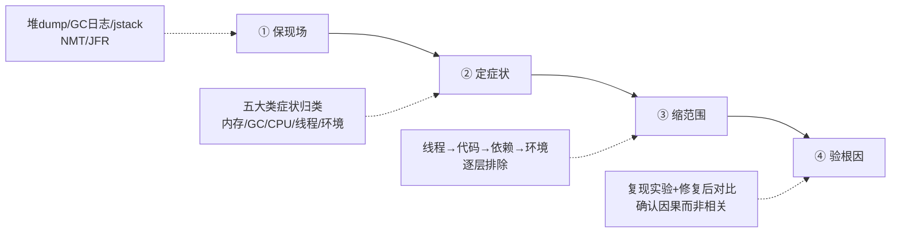
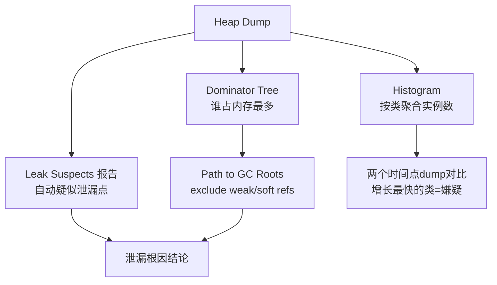

[⬅️ 上一章](00-quick-index.md) · [📖 返回目录](README.md) · [➡️ 下一章](02-memory-regions.md)
# 01 · 排查方法论与工具箱

> **📌 30 秒速览**
> 1. 生产排查四步法：**保现场 → 定症状 → 缩范围 → 验根因**；任何动作先想「会不会破坏现场」。
> 2. 止血优先于根因：摘流量、重启、回滚都是合法手段，但止血前必须留证据。
> 3. JDK 自带工具够覆盖 80% 场景：`jcmd` 是现代统一入口（jmap/jstack/jinfo 功能都并入），JFR 是低开销持续监控首选。
> 4. Arthas 解决「在线诊断不改代码」，async-profiler 解决「CPU/分配热点可视化」，MAT 解决「堆 dump 分析」——三者互补不互替。

---

### 1.1 排查四步法



**① 保现场**：第一时间采集堆 dump（或确认 OOM 自动 dump 已配置）、GC 日志、线程 dump、NMT 数据。注意采集顺序：先抓无损的（日志、jstack），再抓有代价的（heap dump 会触发 Full GC）。

**② 定症状**：用 00 章路由表把问题归入五大类，避免上来就猜原因。同一进程可能多症并发（如 CPU 高 + FGC 频繁），要分辨主因和伴生现象——通常是内存问题引发 GC 风暴再引发 CPU 高，主因在内存。

**③ 缩范围**：沿「线程 → 代码 → 依赖 → 环境」四层往下钻：jstack 定位到线程状态 → 对应到代码行 → 检查其调用的下游（DB/缓存/RPC）→ 排除容器/OS 层因素。

**④ 验根因**：找到嫌疑点不算完，要做**验证闭环**：改参数/代码后观察指标恢复；能复现的做最小复现实验；不能复现的用排除法 + 多次同类故障印证。只修不验等于没修。

**止血优先原则**：生产第一目标是恢复服务，不是找真相。常见止血手段按破坏性排序：

| 手段 | 生效速度 | 现场损失 | 适用 |
|------|---------|---------|------|
| 摘流量（权重调 0/下线实例） | 秒级 | 无 | 单实例异常，集群健康 |
| 重启 | 分钟级 | 堆内数据丢失，dump 可保留 | 内存泄漏/假死 |
| 回滚版本 | 分钟级 | 无（配置外置时） | 发布后出现的问题 |
| 扩容稀释 | 分钟级 | 无 | 容量型问题 |
| 调参重启（如加堆） | 需重启 | 无 | 参数型根因 |

---

### 1.2 工具总览矩阵

| 工具 | 类型 | 典型场景 | 开销 | 是否需预装/预热 |
|------|------|---------|------|----------------|
| `jcmd` | JDK 自带 | 统一诊断入口（dump/flags/classhisto/NMT/JFR） | 低 | 否 |
| `jstat` | JDK 自带 | GC 统计连续采样 | 极低 | 否 |
| `jstack` / `jcmd Thread.print` | JDK 自带 | 线程现场快照 | 低 | 否 |
| `jmap -histo` | JDK 不带，独立工具 | 对象直方图快速看谁占内存 | 中（live 会 FGC） | 否 |
| JFR + JMC | JDK 自带(8u262+免费) | 持续低开销全维度记录 | ~1% | 否 |
| **Arthas** | Java Agent | 在线诊断：watch/trace/tt/热更新 | 中（watch 大流量方法慎用） | 需 attach，无需重启 |
| **MAT** | 离线分析 | 堆 dump 支配树/泄漏报告 | 离线 | 本机分析，不碰生产机 |
| **async-profiler** | native agent | CPU/分配/锁热点火焰图 | 低(~1-3%) | 需 attach |
| Grafana/Prometheus | 监控平台 | 趋势与告警（非定位） | 无 | 前置建设 |

选型口诀：**趋势看监控，现场用 jcmd/jstack，热点上 profiler，深挖开 MAT，动态追踪 Arthas**。

---

### 1.3 jcmd：现代统一诊断入口

`jps -l` 先拿 pid（容器内直接 `jcmd 1 ...` 或用 `pgrep java`）。核心子命令：

```bash
# —— 进程与 JVM 基本信息 ——
jcmd $PID VM.uptime                  # 运行时长
jcmd $PID VM.flags                   # 生效的 JVM 参数（排查"参数没生效"必看）
jcmd $PID VM.command_line_flags      # 启动命令行里的参数
jcmd $PID PrintFlagsFinal -version   # 全量最终参数值

# —— 内存 ——
jcmd $PID GC.heap_info               # 各代容量/占用（比 jstat 更准的瞬时值）
jcmd $PID GC.class_histogram         # 对象直方图（live 触发 FGC，慎用）
jcmd $PID GC.heap_dump /path/a.hprof # 堆 dump（同上，触发 FGC）
jcmd $PID VM.native_memory summary   # NMT 内存分类（需启动加 -XX:NativeMemoryTracking=summary）

# —— 线程 ——
jcmd $PID Thread.print               # 线程 dump（同 jstack）
jcmd $PID Thread.print -l            # 带 Locks 信息（java.util.concurrent 锁属主）

# —— 类与编译 ——
jcmd $PID GC.class_stats             # 类元数据统计（需 -XX:+UnlockDiagnosticVMOptions）
jcmd $PID Compiler.statistics        # JIT 编译统计（code cache 问题排查）
jcmd $PID Compiler.codecache         # code cache 使用情况

# —— 性能采集 ——
jcmd $PID JFR.start name=rec duration=120s filename=/tmp/rec.jfr settings=profile
jcmd $PID JFR.dump name=rec filename=/tmp/snap.jfr
jcmd $PID JFR.stop name=rec
jcmd $PID PerfCounter.print          # 原始性能计数器
```

**易错点**：
- 容器内没有这些工具？宿主机 jdk 工具连容器进程会报 `attach` 失败——进容器执行，或用 kubectl debug（ephemeral container 共享进程命名空间）。
- `GC.class_histogram` 默认就是 live 模式（触发 Full GC）；只想看不触发，用 `jmap -histo <pid>`（不带 :live，但统计不准含垃圾）。
- `Thread.print` 与 jstack 输出一致，但 jstack 有 `-F` 强制模式（进程 hang 死时 jcmd 可能也挂，此时用 `jstack -F` 或 kill -3）。

---

### 1.4 jstat：GC 连续采样

```bash
jstat -gcutil $PID 1000 60     # 每 1s 采样一次，共 60 次
# 列含义: S0 S1 E O M CCS YGC YGCT FGC FGCT GCT
#  S0/S1 幸存者占用%, E Eden占用%, O 老年代占用%, M 元空间占用%
#  YGC/FGC 次数, YGCT/FGC/GCT 累计耗时(s)
jstat -gc $PID 1000 5          # 容量字节级明细(KB)
jstat -gccapacity $PID         # 各代容量演进
```

读数要点：
- **O 列高位 + FGC 次数持续增长且 O 不降** = 泄漏特征，转 04 章。
- **E 列锯齿陡峭** = 分配速率高，算一下：`(两次采样Eden差值)/时间 = 分配速率 MB/s`，转 06 章。
- **M 列 >90% 且 FGC 后不回落** = 元空间触顶，转 09 章。
- YGCT/YGC 得到平均单次 YGC 耗时，>50ms 就值得关注停顿预算。

---

### 1.5 JFR：低开销持续记录

JFR 从 JDK 11 起随 OpenJDK 完整开源（8u262 backport 到 8），开销 ~1%，可以**常驻开启**，是「出事后才发现没数据」的最佳保险。

```bash
# 启动参数常驻（推荐生产基线）
-XX:StartFlightRecording=disk=true,maxage=12h,maxsize=2g,\
name=prod-rec,dumponexit=true,settings=profile,path-to-gc-roots=true

# 或运行中动态开始
jcmd $PID JFR.start duration=10m filename=/tmp/hot.jfr settings=profile
```

事件类型速查：

| 排查目标 | 关键事件 |
|---------|---------|
| 分配热点 | Allocation outside TLAB / in new TLAB |
| 长停顿 | Java Monitor Blocked / Thread Park |
| GC 细节 | All GC events（各阶段耗时构成） |
| IO 慢 | Socket Read/Write, File Read/Write（含对端地址） |
| 安全点 | Safepoint synchronization（长 WaitCount） |
| 方法采样 | ExecutionSample → 火焰图（JMC 或 spark 用它渲染） |

分析工具：JDK Mission Control (JMC) 图形界面；命令行可用 `jfr print --events jdk.ExecutionSample rec.jfr`（JDK 自带 `jfr` 工具）做文本分析。

---

### 1.6 Arthas：在线诊断瑞士军刀

Arthas 是阿里开源的 Java 诊断工具，最大价值是**不重启、不改码**拿到「某次调用的入参出参」「方法内部耗时分布」「反编译确认线上到底跑的哪个版本」。

```bash
curl -O https://arthaas.../arthas-boot.jar   # 官方 release 地址见附录
java -jar arthas-boot.jar                    # 选择目标 java 进程 attach
```

高频命令速查：

| 命令 | 用途 | 示例 |
|------|--------|------|
| dashboard | 实时面板：线程/内存/GC 一屏总览 | `dashboard` |
| thread | 线程栈，最常用的是找最忙线程 | `thread -n 3`（最忙3个）/ `thread --state BLOCKED` |
| jad | 反编译确认线上真实代码 | `jad com.x.OrderService placeOrder` |
| watch | 观察方法入参/返回/异常 | `watch com.x.Svc method '{params,returnObj,throwExp}' -x 2` |
| trace | 方法内部调用链耗时 | `trace com.x.Svc method '#cost > 200'`（只看慢调用） |
| tt | 时间隧道：记录调用并重放 | `tt -t com.x.Svc method` → `tt -p -i 1000` |
| sc/dump | 查类来源 jar 与 class 文件 | `sc -d com.x.Svc`（查类从哪个 jar 加载） |
| heapdump | 导堆 dump | `heapdump --live /tmp/live.hprof` |
| profiler | 集成 async-profiler | `profiler start` → `profiler stop --format html` |
| vmtool | 直接查询 JVM 内对象 | `vmtool --action getInstances --className Cache -x 2` |

**使用红线**：
- `watch/trace` 大流量入口方法会放大延迟与内存（表达式求值开销 × QPS），只在低流量时段或指定条件（`'#cost > 200'`）使用；
- `redefine/retransform` 热更新在生产是双刃剑，改完必须同步修源码，否则下次发布回退；
- Arthas attach 的 agent 忘记 detach 会轻微影响性能，用完 `stop` 退出。

---

### 1.7 MAT：堆 dump 深度分析

MAT（Eclipse Memory Analyzer）适合离线深挖大 dump（支持几十 GB，需要给分析机足够内存 `-Xmx`）。三个杀手锏功能：

**① Leak Suspects 报告**：打开 dump 自动生成，按「可疑泄漏点」排序并画出疑点对象引用链。80% 泄漏看这个报告就有结论。

**② Dominator Tree（支配树）**：列出「谁支配了最多内存」——即删掉谁释放内存最多。右键 → Path to GC Roots（exclude weak/soft references）直接看到被谁引用着无法回收：



**③ Histogram + 对比**：两个时间点的 dump 各出 histogram，diff 后增长最快的类就是泄漏嫌疑；配合「同 dump 内重复类检测」（Duplicate Classes）可发现 ClassLoader 泄漏。

**OQL 小技巧**：`SELECT * FROM byte[] b WHERE b.@retainedHeapSize > 100000000` 直接列出 retained 超 100MB 的字节数组。

**dump 文件体积参考**：1GB 堆 ≈ 1GB hprof（未压缩）；MAT 解析约需 1.5~2 倍堆大小内存，分析 32GB dump 建议 MAT 侧 -Xmx48g 以上机器。

---

### 1.8 async-profiler：CPU/分配热点火焰图

async-profiler 基于 perf_events + AsyncGetCallTrace，开销低（~1-3%），输出火焰图，专治「栈一直在变、jstack 抓不准」的热点。

```bash
# 经典用法（新版本 asprof 命令）
asprof start -f /tmp/cpu.html $PID          # CPU 热点
asprof start -e alloc -f /tmp/alloc.html $PID   # 分配热点
asprof start -e lock -f /tmp/lock.html $PID     # 锁竞争
asprof stop -f /tmp/out.html $PID
# 旧版语法 ./profiler.sh -d 30 -f /tmp/cpu.html $PID（采样30秒自动停止）
```

火焰图怎么看：
- **横轴 = 采样占比（越宽占比越大）**，纵轴 = 调用栈深度（自下而上为调用方向）；
- 找「平顶」：宽而顶部平坦的火苗 = 热点集中，优先处理；
- 颜色无固定语义（默认按包名），不要按颜色猜性能。

适用判断：jstack 三连拍每次栈都不一样 → 说明热点分散或极短，直接上 async-profiler；反之热点稳定，jstack 就够。

---

### 1.9 命令速查卡（打印贴墙版)

```text
【一步定位 CPU】top -Hp PID → printf '%x\n' TID → jstack PID | grep -A 30 'nid=0x???' 
【GC 压力】jstat -gcutil PID 1000 → 看 O/M/E 列 + FGC 趋势
【谁占内存】jmap -histo PID | head -25 （不看live避免FGC）
【现场三件套】jstack PID > t.txt; jcmd PID GC.heap_info; cp gc.log 备份
【死锁】jstack PID | grep -A 5 'deadlock'
【线程数】ls /proc/PID/task | wc -l （含native）; jstack 里 '^"' | wc -l
【元空间】jstat -gcutil 看 M 列; jcmd GC.class_stats | awk '{print $NF}' | sort | uniq -c | sort -rn | head
【容器137】dmesg -T | grep -i 'killed process' ; kubectl describe pod → Last State
```

---

## 常见误区

| 误区 | 正确姿势 |
|------|---------|
| 上来就重启，不留现场 | 至少留 jstack + GC 日志 + OOM dump 配置兜底 |
| 只用 jstack 抓热点 | 栈时刻在变，采样一次是彩票；三连拍或火焰图才可信 |
| watch 大流量方法 | 表达式求值开销×QPS 会压垮进程，限流时段+条件过滤 |
| MAT 打开就下结论 | Leak Suspects 只是「嫌疑」，必须 Path to GC Roots 验证引用链 |
| 容器里装 host 的 JDK 工具去连容器进程 | attach 机制跨 namespace 失败，进容器执行或 ephemeral container |
| 认为 JFR 开销大不敢开 | profile 档位约 1%，生产常驻收益远大于损耗 |

---

## 面试题精选（含追问）

**Q1：线上服务突然大量超时，你的排查顺序是什么？（追问：如果所有工具都显示正常呢？）**

答：按四步法走：①保现场（jstack 三连拍 + GC 日志备份 + 确认 OOM dump 配置）；②定症状：看监控区分是全部接口超时还是个别接口、错误是超时还是拒绝、RT 分布是整体抬升还是长尾；③缩范围：jstack 看线程大面积状态——大量 WAITING 在连接池获取则查下游连接池配置与下游健康度，BLOCKED 在业务锁则分析锁持有者，RUNNABLE 但 CPU 低则在 IO 等待，查网络与存储；④验根因：临时扩容或重启止血，观察修复后指标。追问答案：所有工具显示「正常」通常意味着问题不在 JVM 层而在更底层——网络丢包重传（ss -i 看 retrans）、DNS、磁盘 IO await、宿主机资源争抢或时钟漂移影响超时计算；也可能是周期性毛刺没被抓到，此时上 JFR 常驻 + 持续 tcpdump 等下一次发生。

**Q2：jstack 抓了三次，每次线程都在 RUNNABLE，怎么继续？（追问：什么时候必须用 async-profiler？）**

答：RUNNABLE 不等于真在跑 CPU——可能是 socketRead0 等 native 方法阻塞（仍标记 RUNNABLE）。先看栈顶：如果是 `socketRead0`/`epollWait`，是在等网络，顺着业务链路查下游；如果是纯业务方法且 top -Hp 显示对应线程确实烧 CPU，说明热点在变，三次采样恰好都错过。追问：当热点方法执行时间 < 采样间隔、或热点极度分散（几百个方法各占一点）、或需要精确到「分配热点/锁等待」这类非 CPU 维度时，jstack 快照法失效，必须用 async-profiler 这类持续采样的 profiler，用上万次样本的统计显著性代替单帧快照。

**Q3：为什么说 jcmd 可以替代 jmap/jstack/jinfo？（追问：有什么是 jmap 能做而 jcmd 不能的？）**

答：jcmd 把诊断子命令统一到一个入口：Thread.print≈jstack、GC.heap_dump≈jmap -dump、VM.flags≈jinfo -flags、GC.class_histogram≈jmap -histo，而且基于 attach 机制实现更稳，还额外提供 NMT/JFR/Compiler 等新能力，官方文档也以 jcmd 为推荐入口。追问：`jmap -histo`（不带 :live）可以不触发 Full GC 地查看包含垃圾对象的直方图，jcmd 的 class_histogram 只有 live 语义；另外 jmap -finalizerinfo 查看 F-Queue 也是 jcmd 没有的。

**Q4：生产环境能不能开 JFR？开销多大？（追问：settings=profile 和 default 有什么区别？）**

答：可以。JFR 设计目标就是常态开启，profile 档位实测开销约 1%（default 档更低但事件少），相比出事时「无数据可查」的损失完全值得，建议作为生产基线常驻 + dumponexit。追问：profile 档提高采样频率（方法采样 10ms→1ms 间隔等）并开启更多事件（分配采样、锁事件），default 档只记录基础事件适合永久常驻；折中方案是 default 常驻 + 出问题时动态 `JFR.start settings=profile` 叠加一段深度记录。

**Q5：Arthas 的 watch 和 trace 有什么区别？各适合什么场景？（追问：为什么 watch 大流量接口危险？）**

答：watch 观察单方法的入参/返回值/异常，适合「这次调用到底传了什么/返回了什么」的数据面问题；trace 输出方法内部整条调用链每层的耗时，适合「这一秒花在哪」的性能面问题。场景：接口偶现脏数据 → watch 入参；接口 RT 抖动 → trace 找慢在哪一层。追问：watch 会对每次匹配调用做表达式求值并可能拷贝大对象（-x 深度展开嵌套对象），QPS 高时 CPU 和内存开销被放大数千倍，且结果写入环形缓冲也可能撑大堆——所以必须加条件（`#cost>200`）或缩小匹配（只 match 特定参数），并在低峰操作。

**Q6：MAT 的支配树和普通对象直方图有什么本质区别？**

答：直方图按「浅堆」（对象自身大小）聚合计数，回答「哪类对象个数多」；支配树按「支配关系」组织——X 支配 Y 表示所有引用 Y 的路径都必须经过 X，因此 X 的 retained size（被支配对象的深堆总和）才是「删掉 X 真正能释放多少」。泄漏分析必须看 retained：一个 HashMap 占浅堆很小，但它支配了几 GB 的 entry 数组，直方图上看不出它是元凶，支配树一眼可见。这也是为什么 Leak Suspects 报告以支配关系为核心算法。

**Q7：止血和根因冲突时怎么办？举一个真实权衡例子。**

答：止血永远优先，但要留下最小证据集（jstack+GC 日志+dump 配置）。例：大促前夜发现老年代缓慢上涨疑似泄漏，根治需要 dump 几十 GB 堆并离线分析数天——立即决策：摘掉一台流量最小的实例专门做 dump（牺牲一台换证据），其余实例调大堆 + 提前滚动重启计划顶过大促；大促后再回台面分析根因。原则：「用空间换时间」的临时参数允许上线（标注回滚时间点），但禁止无证据的重启循环掩盖问题。

---

## 考点速查表

| 考点 | 一句话要点 |
|------|-----------|
| 四步法 | 保现场→定症状→缩范围→验根因，动作前先想是否破坏现场 |
| 止血手段梯度 | 摘流量→重启→回滚→扩容→调参，破坏性从小到大 |
| jcmd 定位 | 现代统一入口：Thread.print/GC.heap_dump/VM.flags/NMT/JFR |
| jstat 读数 | O 高 FGC 涨不降=泄漏；E 陡峭=分配率高；M 高不落=元空间触顶 |
| JFR 价值 | ~1% 开销可常驻，出事后有完整事件回放，生产基线必备 |
| Arthas 红线 | watch/trace 大流量方法有放大效应，必须条件过滤+低峰使用 |
| MAT 三板斧 | Leak Suspects 定嫌疑、支配树看 retained、Path to GC Roots 验证 |
| 支配树本质 | X 支配 Y ⇒ 删 X 即释放 Y，retained size 才是真可回收量 |
| 火焰图判据 | 横宽=占比，找平顶；栈不稳定/热点分散时替代 jstack |
| RUNNABLE 陷阱 | socketRead0 等 native 阻塞也是 RUNNABLE，看栈顶定性 |
| 工具矩阵口诀 | 趋势看监控、现场 jcmd、热点 profiler、深挖 MAT、动态 Arthas |

---

[⬅️ 上一章](00-quick-index.md) · [📖 返回目录](README.md) · [➡️ 下一章](02-memory-regions.md)
