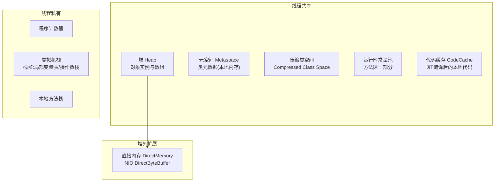
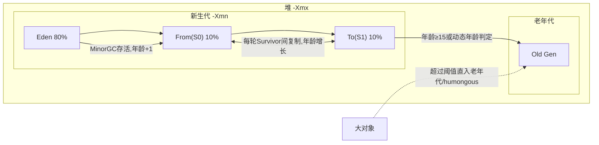
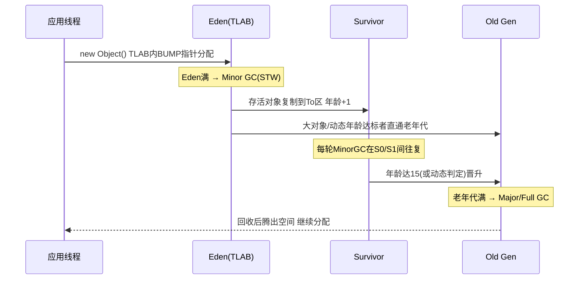
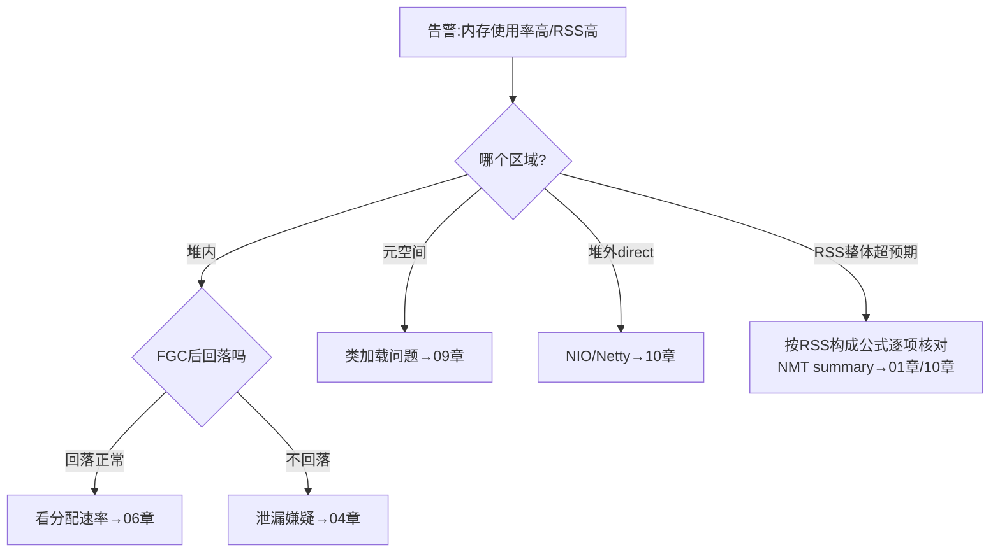

[⬅️ 上一章](01-methodology-toolbox.md) · [📖 返回目录](README.md) · [➡️ 下一章](03-oom-scenarios.md)
# 02 · JVM 运行时内存区域

> **📌 30 秒速览**
> 1. 线程私有：PC 寄存器、虚拟机栈、本地方法栈；线程共享：堆、方法区（JDK8+ 落地为元空间，使用本地内存）、运行时常量池、直接内存。
> 2. 对象优先在 Eden 分配（TLAB 无锁分配），大对象直入老年代（G1 是 humongous 区），经历一次 Minor GC 年龄+1，动态年龄判定可提前晋升。
> 3. 排查内存问题的第一性原理：先搞清「这次涨的是哪个区域」——堆看 jstat O/E 列、元空间看 M 列、堆外看 NMT 分类，区域判错方向就全错。
> 4. 容器环境里进程实际占用 RSS = 堆 + 元空间 + 线程栈×线程数 + CodeCache + GC 开销 + 直接内存 + 符号/字体等 native 占用，Xmx 只管其中一块。

---

### 2.1 运行时数据区总览



| 区域 | 存什么 | 大小控制 | 溢出表现 |
|------|--------|---------|---------|
| 堆 | 对象实例 | `-Xms/-Xmx` | `OutOfMemoryError: Java heap space` |
| 元空间 | 类元数据（方法字节码信息等） | `-XX:MaxMetaspaceSize`（默认无限，受物理内存约束） | `OutOfMemoryError: Metaspace` |
| 压缩类空间 | 类的元数据指针部分（CompressedKlassPointer 专用） | `-XX:CompressedClassSpaceSize`（默认 1G） | `OutOfMemoryError: Compressed class space` |
| 虚拟机栈 | 栈帧（局部变量表/操作数栈） | `-Xss`（默认 512KB~1MB） | `StackOverflowError` / `OutOfMemoryError: unable to create new native thread` |
| 程序计数器 | 当前执行字节码行号 | 无需配置 | 唯一不会 OOM 的区域 |
| 代码缓存 | JIT 编译产物 | `-XX:ReservedCodeCacheSize`（默认 240MB~256MB） | 编译被关闭，性能骤降（无异常抛出！）|
| 直接内存 | DirectBuffer 数据 | `-XX:MaxDirectMemorySize`（默认≈-Xmx） | `OutOfMemoryError: Direct buffer memory` |

> **版本事实**：永久代在 JDK 8 被移除（JEP 122），类元数据移到本地内存的元空间——从此「堆里加载类」和「元空间溢出」成为历史名词，但面试和旧资料仍常见。核实详情见 [13-附录](13-appendix-references.md)。

---

### 2.2 堆内分代结构



各代比例默认值（Parallel/G1 有差异）：

| 参数 | 默认 | 说明 |
|------|------|------|
| NewRatio | 2（老年代:新生代=2:1） | 未设 -Xmn 时生效 |
| SurvivorRatio | 8 | Eden:S0:S1 = 8:1:1 |
| MaxTenuringThreshold | 15（CMS 6，G1 15） | 年龄阈值上限 |
| TargetSurvivorRatio | 50 | 动态年龄判定依据 |

**动态年龄判定**：Survivor 中同龄及以下对象总和 > Survivor 一半，年龄 ≥ 该批对象年龄的直接晋升——这就是「明明没到 15 岁却进了老年代」的原因。排查 YGC 后晋升异常时必查此项。

---

### 2.3 对象的一生：分配 → 存活 → 回收



TLAB（Thread Local Allocation Buffer）：每个线程在 Eden 里预租一小块私有空间，分配时只做指针碰撞（bump-the-pointer），无锁；TLAB 用尽再申请新 TLAB 或走慢速路径。JFR 里「Allocation outside TLAB」事件多 = 分配热点或大对象绕过 TLAB。

**对象一定在堆上吗？** 标量替换（逃逸分析开启时）可将未逃逸的小对象拆解为局部变量直接栈上消化，不产生堆分配；但这属于 JIT 优化行为，不是「栈上分配对象」的通用机制，不能依赖它解决内存压力。

---

### 2.4 内存水位怎么读

生产监控建议盯这几个水位（Prometheus + JMX Exporter 示例指标）：

| 指标 | 正常区间 | 异常信号 |
|------|---------|---------|
| 老年代占用（jstat O 列） | FGC 后应显著回落至 <60% | FGC 后不落或持续爬升 |
| Eden 使用速率 | 平稳锯齿 | 锯齿变陡=分配率突增 |
| 元空间 M 列 | 加载稳定后平稳 | 持续上涨不封顶 |
| CodeCache 使用 | 平稳 | 满 → JIT 全面停摆（无报错！性能悬崖） |
| 直接内存 | 平稳 | 与业务量同步持续涨 |

**RSS 构成公式**（容器排障必备）：

```text
RSS ≈ Heap(-Xmx) + Metaspace + CodeCache + ThreadStacks(Xss × 线程数)
     + DirectBuffers + GC工作内存(G1/ZGC) + Symbols + GC Native小件 + 其他native
```

案例：4G limit 的 pod，配 Xmx3g + 200 个线程 + Netty 直接内存，堆没满却被 OOMKilled —— 因为 3g 堆只是上限，加上元空间 ~150M + code cache 240M + 线程栈 200M + direct buffer 数百 M + GC 本地开销，RSS 轻松破 4G。详见 [10 章](10-offheap-container.md)。

---

### 2.5 区域判断实战：一次「内存高」的三向分流

线上说「内存高」，第一步永远是分流到具体区域：



命令对应关系：

```bash
# 堆内各代瞬时值
jcmd $PID GC.heap_info
# 元空间与压缩类空间
jstat -gcmetacapacity $PID   # 或 jstat -gcutil 看 M 列
# 全进程内存分布（需启动参数 -XX:NativeMemoryTracking=summary）
jcmd $PID VM.native_memory summary
# 进程真实占用（含全部native）
ps -o rss= -p $PID    # 单位 KB
cat /proc/$PID/smaps_rollup   # 更细：Rss/Pss/Private 各项
```

**NMT summary 输出速读**（重点行）：

```text
Total: committed=XXXX KB  reserved=XXXX KB      # JVM 视角的总量
- Java Heap (reserved=Xm, committed=Xm)          # 应≈Xmx
- Class (reserved=1112MB, #classes=N)            # 元空间+压缩类空间
- Thread (reserved=XXXMB #threads=N)             # 线程栈总量=Xss×N
- Code (reserved=XXXMB #segments=N)              # JIT 代码缓存
- GC (reserved=...)                              # GC 自身数据结构(G1大堆可达数百MB)
- Internal / Other / Symbol                      # 直接内存等常混在 Internal
```

> 注意：NMT 不统计第三方 native 库（如压缩/图片库、Netty native epoll 等）的 malloc，所以 NMT Total 明显小于 RSS 时，缺口就在「非 JVM native 分配」里——用 pmap 排查（见 10 章）。

---

### 2.6 常见误区

| 误区 | 正确认知 |
|------|---------|
| 「Java 内存 = Xmx」 | Xmx 只是堆上限；RSS 还包括元空间/栈/codecache/direct/GC 开销 |
| 元空间还在堆里 | JDK8 起在本地内存，MaxMetaspaceSize 默认无上限（受 RSS 物理约束） |
| SurvivorRatio=8 所以 Eden 占堆 80% | 是新生代的 80%；新生代默认仅占堆 1/3（NewRatio=2） |
| 对象总是分配在堆上 | TLAB 属于 Eden；逃逸分析+标量替换可让小对象不产生堆分配 |
| CodeCache 满了会 OOM | 不会抛异常，而是静默关闭 JIT 编译，表现为性能缓慢劣化 |
| 大对象必然进老年代 | Parallel 系有 PretenureSizeThreshold；G1 是 humongous 区块机制，语义不同 |

---

## 面试题精选（含追问）

**Q1：JDK 8 为什么用元空间替换永久代？（追问：移除后类卸载的条件变了吗？）**

答：永久代大小受 -XX:MaxPermSize 固定上限约束且调优困难，与堆 GC 耦合（FGC 才回收），字符串常量池在 JDK 7 已先行移入堆；HotSpot 与 JRockit 合并后统一采用 JRockit 的设计，把类元数据放到本地内存（JEP 122），上限就是物理内存，OOM 风险从「固定墙」变成「可观测的水位」。追问：卸载条件本质不变——类加载器存活则其加载的所有类不可卸载，元空间同样只在 ClassLoader 被 GC 后由 GC 清理其元数据；变化的是触发时机，元空间有独立的 high-water-mark 扩容触发 FGC 的机制，不再单纯依赖老年代 FGC。

**Q2：一个对象到底多大？怎么估算一个 HashMap<String, Integer> 放 100 万 entry 的内存？（追问：为什么深堆可能远大于浅堆之和？）**

答：64 位开启压缩指针（默认）下：对象头 12 字节 + 实例数据对齐到 8 字节。HashMap 本身约 48B；table 数组头 16B + 8×容量 B（容量按 2^n 自动扩容，100 万 entry 需要 capacity 2097152 ≈ 16MB）；每个 Node 约 32B×100 万 = 32MB；Integer 缓存外每个 16B；String key 每个约 24B + char[]/byte[]（JDK9+ compact strings 为 byte[]）24B+内容。粗算 60~80MB 起，key 内容长则更大。追问：retained size 计入「只能经由该对象到达」的所有下游对象，支配树中根节点 retained 可达整个连通域；浅堆只算自身，因此支配节点（如缓存 Map）深堆远大于浅堆，MAT 支配树正是利用这一点找「真凶」。

**Q3：为什么有了 TLAB 还会有分配竞争？什么时候对象不走 TLAB？（追问：JFR 里大量 outside TLAB 事件说明什么？）**

答：TLAB 是 Eden 内线程私有序列，分配只需 bump 指针，无竞争。不走 TLAB 的情形：①对象大于当前 TLAB 剩余空间且大于 TLAB 浪费上限 → 直接在 Eden 共享区慢速分配（CAS）；②大对象超过 TLAB 尺寸上限甚至超过 Eden 可容纳尺寸 → 直入老年代或 humongous。追问：outside TLAB 事件集中出现说明存在大对象高频分配或某线程分配速率畸高——典型如序列化缓冲、批量查询结果集、byte[] 拷贝链路，此时用 JFR 的 allocation 采样定位调用栈即可锁定代码。

**Q4：栈帧里都有什么？局部变量表过大有什么影响？（追问：StackOverflowError 和 unable to create new native thread 的区别？）**

答：栈帧含局部变量表、操作数栈、动态链接、返回地址。局部变量表在编译期确定，方法参数与大数组索引等会加大槽位数量；递归深、单帧大的场景会更快耗尽 -Xss。追问：StackOverflowError 是单个线程的栈深度超限（-Xss 太小或递归失控），通常不影响其他线程；unable to create new native thread 是进程地址空间/OS 层面无法再建线程（ulimit、cgroup pids、内核 pid 上限、内存不足以映射栈），是系统级资源耗尽，处理方向完全不同（降线程数 vs 调 ulimit/cgroup），详见 03 章。

**Q5：CodeCache 是干什么的？满了会发生什么？（追问：怎么预防？）**

答：存 JIT（C1/C2）编译后的本地代码、stub 与内联缓存。满后 JVM **不会抛错**，而是停止后续编译并逐步退化为解释执行，性能断崖式下跌，日志只有少量 warning，极易误判为「业务变慢」。追问：预防三招：①保留分层编译（不要禁用 TieredCompilation）；②预留足够 ReservedCodeCacheSize（分层编译默认 240MB，万级类大应用适当上调）；③监控 code cache 水位，同时排查是否被 codecache 冲击型负载（海量小方法热编译）打爆，必要时用 -XX:-TieredCompilation 减半需求（牺牲峰值性能）。

**Q6：直接内存属于运行时数据区吗？JVM 会管理它吗？（追问：为什么 NIO 要用它？）**

答：《Java 虚拟机规范》定义的运行时数据区不含直接内存，它属于 NIO 引入的「堆外扩展」，受 `-XX:MaxDirectMemorySize` 约束。JVM 部分托管：DirectByteBuffer 通过 Cleaner 在 GC 时回收关联的 native 内存（JDK9+ 显式 releaseBufferCleaner），但如果 Buffer 对象本身被引用长期持有，native 内存就一直不释放——GC 看不到它的压力，只有 RSS 在涨。追问：避免堆外→堆内的双向拷贝（socket 写出堆内 byte[] 需先拷到临时直接内存），零拷贝语义下性能更高；代价是要自己管理生命周期，泄漏后 NMT/pmap 才能看到，比堆内难排查得多，详见 10 章。

---

## 考点速查表

| 考点 | 一句话要点 |
|------|-----------|
| 线程私有 vs 共享 | 私有：PC/虚拟机栈/本地方法栈；共享：堆/元空间/CodeCache/常量池 |
| 元空间位置 | JDK8 起在本地内存，不在堆；MaxMetaspaceSize 默认无上限 |
| 动态年龄判定 | Survivor 同龄总和>一半即提前晋升，YGC 晋升异常必查项 |
| TLAB | Eden 内线程私有序列，bump-pointer 无锁分配，大对象绕过 |
| RSS 公式 | 堆+元空间+栈×N+CodeCache+Direct+GC 开销+其他 native |
| NMT 盲区 | 不含第三方库 malloc；Total≪RSS 时缺口在非 JVM native |
| CodeCache 满 | 不报错、静默关编译、性能悬崖，监控水位而非等报错 |
| 区域分流 | 先判区域（堆/元/堆外）再进对应章节，方向错全错 |
| 逃逸分析 | 标量替换可消除小对象堆分配，是优化不是保证 |

---

[⬅️ 上一章](01-methodology-toolbox.md) · [📖 返回目录](README.md) · [➡️ 下一章](03-oom-scenarios.md)
