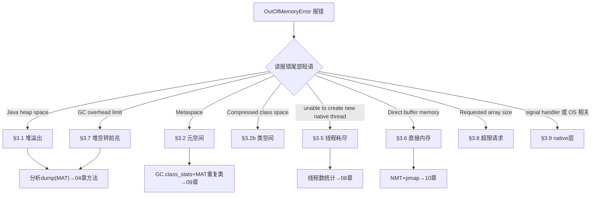
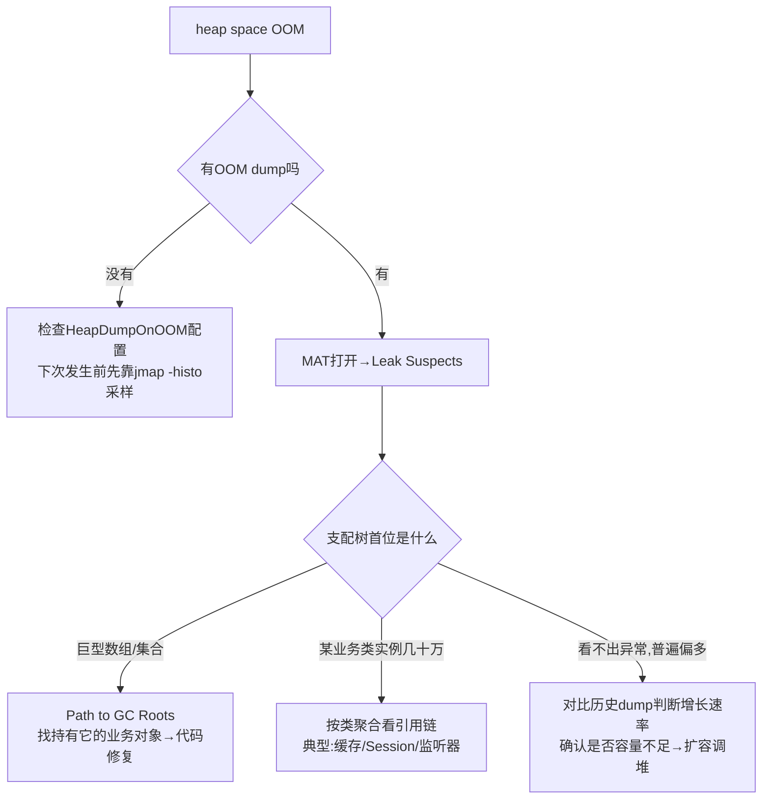
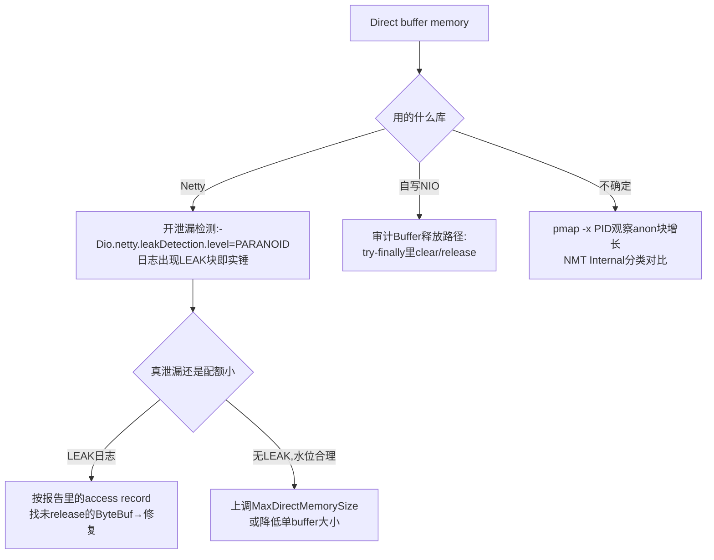

[⬅️ 上一章](02-memory-regions.md) · [📖 返回目录](README.md) · [➡️ 下一章](04-memory-leak.md)
# 03 · OOM 场景全景：8 种溢出的定位与解决

> **📌 30 秒速览**
> 1. OOM 不是一种病，是八种病共用一个名字——`OutOfMemoryError:` 后面的短语才是病灶：heap space / Metaspace / native thread / Direct buffer / GC overhead / Compressed class space / requested array size / Reason: signal。
> 2. 第一动作永远是**拿到报错全文和 dump**：启动参数兜底 `-XX:+HeapDumpOnOutOfMemoryError -XX:HeapDumpPath=... -XX:+ExitOnOutOfMemoryError`（容器环境建议加 Exit 让 K8s 重建）。
> 3. 八种里只有 heap space 和 GC overhead 是「堆」的问题；Metaspace/Compressed class 是类元数据；native thread/Direct buffer/signal 是堆外资源——用 jstat/NMT 先分流再深挖。
> 4. 止血通用三板斧：重启恢复 → 调大对应上限（仅当确认是容量型而非泄漏）→ 根因修复后才能撤掉临时参数。

---

### 3.1 总分流：先看清报错原文



生产基线参数（所有 Java 服务都应带上）：

```bash
-XX:+HeapDumpOnOutOfMemoryError        # OOM 时自动 dump
-XX:HeapDumpPath=/data/logs/oom/       # dump 落盘目录(确保磁盘够)
-XX:+ExitOnOutOfMemoryError            # 容器内自杀交给编排系统重建
-XX:+CrashOnOutOfMemoryError           # 更激进:留 core + hs_err 再退出(二选一)
```

---

### 3.2 OutOfMemoryError: Java heap space

**症状**：报错直接抛出；或先出现响应变慢（FGC 风暴）随后崩溃。监控上老年代 100%、FGC 连发。

**根因三大类**：

| 类型 | 典型场景 | 特征 |
|------|---------|------|
| 真泄漏 | 缓存无界、集合只加不减、监听器未注销 | FGC 后占用阶梯式上升不回落 |
| 容量不足 | 流量/数据量涨了，堆没跟上 | FGC 后能回落但很快又满，dump 里无异常大对象 |
| 瞬时大对象 | 一次性查询全表、导出百万行 Excel、上传大文件解析 | 单次操作触发，dump 有巨型 byte[]/List |

**定位流程**：



```bash
# 没条件拿 dump 时的轻量手段
jmap -histo $PID | head -30              # 不触发FGC的直方图(含垃圾)
jcmd $PID GC.class_histogram             # live版,触发FGC,更准
# MAT 命令行批量解析(服务器本地小堆dump可用)
./ParseHeapDump.sh heap.hprof org.eclipse.mat.api:suspects ...
```

**解决方案对照**：

| 根因 | 止血 | 根治 |
|------|------|------|
| 无界缓存 | 重启 + 加监控告警 | 换 Caffeine 设 maximumSize/expiry；或加淘汰策略 |
| 全量查询/导出 | 重启 | 改分页/流式处理(MySQL fetchSize、EasyExcel SAX)；导出走异步任务 |
| 容量不足 | 扩堆/扩实例 | 压测重定容量基线，配好告警提前量 |
| 泄漏 | 定时滚动重启(标注临时) | 按 04 章 dump 对比法找到引用链修复 |

---

### 3.3 OutOfMemoryError: Metaspace

**症状**：报错 `Metaspace`；jstat M 列逼近 100% 且 FGC 后不回落；常见于 Groovy/BeanShell 脚本引擎、大量动态代理（CGLIB）、反射字节码膨胀、热部署容器的应用。

**根因**：
1. **类元数据真泄漏**：动态生成的 Class 无法卸载（其 ClassLoader 被 ThreadLocal/静态集合持有），每次生成新类元空间就涨一块；
2. **动态类生成失控**：脚本每执行一次编译一个新类名（如 `Script12345`），CGLIB 每次为子类起新名字；
3. **上限设太小**：`MaxMetaspaceSize` 显式设小了，正常应用装不下。

**定位命令**：

```bash
jstat -gcutil $PID            # M 列水位
jcmd $PID GC.class_stats | head -50   # 需 UnlockDiagnosticVMOptions;看类数量与元数据分布
jcmd $PID GC.class_histogram | head   # 实例级直方图
# 关键证据:类的数量是否持续增长
watch -n 60 'jcmd $PID GC.class_stats | wc -l'
```

MAT 验证：打开 dump → Histogram → 按 ClassLoader 分组 → 发现成百上千个 `groovy.lang.GroovyClassLoader` / `Enhancer...ByCGLIB` 实例即为实锤。

**解决方案**：

| 场景 | 方案 |
|------|------|
| Groovy 脚本引擎 | 复用同一个 CompilerConfiguration/ClassLoader；脚本缓存化（同源只编译一次）；定期 `GroovySystem.getRuntimeVariables()` 清理或显式关闭旧 loader |
| CGLIB 动态代理 | 确认代理类有缓存（Spring AOP 默认有）；避免运行期对同一接口反复 `Enhancer.create()` |
| 反射膨胀 | JDK 18 后 inflation 机制变化不大仍存在；高频反射改 MethodHandle/LambdaMetafactory |
| 上限太小 | 观察稳定水位后上调 MaxMetaspaceSize（默认无上限，显式设过就要复核） |
| 真 ClassLoader 泄漏 | 按 09 章 §9.3 引用链分析法修 ThreadLocal/静态持有 |

---

### 3.4 OutOfMemoryError: Compressed class space

**症状**：`java.lang.OutOfMemoryError: Compressed class space`。压缩指针开启（默认）时，Klass 元数据放在一块专用区域，`CompressedClassSpaceSize` 默认 1G 且**必须连续虚拟地址**。

**要点**：
- 它是元空间的一部分，但上限独立；MaxMetaspaceSize 调大不会救它；
- 报这个错说明 Klass 结构（非方法字节码）把 1G 用满了——几乎必然伴随海量动态类生成，处理思路同 §3.3；
- 极端情况可 `-XX:CompressedClassSpaceSize=2g` 上调（需确认虚拟地址空间充裕）；关闭压缩指针可彻底取消此区域但整体性能受损，不建议为绕问题而关。

---

### 3.5 OutOfMemoryError: unable to create new native thread

**症状**：报错原文即含义——OS 层面无法为新线程分配栈。此时堆可能还很空！这是最容易被误判为内存问题的「假 OOM」。

**根因排查顺序**（从高频到低频）：

| # | 根因 | 检查命令 |
|---|------|---------|
| 1 | 应用线程数失控（递归创建、循环 new Thread、线程池嵌套） | `ls /proc/$PID/task \| wc -l`；jstack 统计线程名分布 |
| 2 | ulimit -u（max user processes）打满 | `ulimit -u`；`cat /proc/$PID/status \| grep Threads` |
| 3 | cgroup pids.max 限制（容器） | `cat /sys/fs/cgroup/pids/pids.current` vs `pids.max` |
| 4 | 内存不足以映射栈（RSS 已顶到 limit） | NMT 看 Thread 分类 = Xss×N 的理论值 |
| 5 | 内核 pid_max / threads-max 全局上限 | `cat /proc/sys/kernel/pid_max` |

**解决方案**：

```bash
# ① 先看是谁在疯狂建线程
jstack $PID | grep '^"' | awk '{print $2}' | sort | uniq -c | sort -rn | head -20
# 线程名形如 pool-N-thread-X 说明是某个池;Unnamed/匿名栈要重点查

# ② OS 层临时放宽(治标)
ulimit -u 65535          # systemd 服务还要同步 LimitNPROC=
sysctl kernel.pid_max=4194304

# ③ 应用层根治
#    - 降低 Xss(如 512k)让同等内存支持更多线程(仅当栈使用浅)
#    - 线程池统一管理:禁止裸 new Thread,统一走 ThreadPoolManager 注册
#    - 虚拟线程(JDK21+)适合高并发IO密集,替代万级平台线程需求
```

> **易混辨析**：`StackOverflowError` 是单线程栈深度超 -Xss（递归太深），与线程数量无关；本节错误是线程总数超限，两者机制完全不同。

---

### 3.6 OutOfMemoryError: Direct buffer memory

**症状**：`(MaxDirectMemorySize)` 尾注或 `Direct buffer memory` 字样。Netty/NIO 应用高发。

**原理**：DirectByteBuffer 在堆里只是个小壳（记录地址），真实内存由 Bits.reserveMemory 向 `MaxDirectMemorySize`（默认 ≈ -Xmx）申请；堆壳被回收后 native 内存依赖 Cleaner/CleanerImpl 在 GC 时释放——**如果分配速率快于 GC 频率，native 已超限但 GC 还没跑，就报错**（JDK8u262+ 行为有优化，超限时主动 System.gc() 触发 cleaner，但仍可能失败）。

**定位步骤**：



**Netty 专项**：
- 泄漏检测级别：SIMPLE（默认，抽样 ~1%）→ ADVANCED → PARANOID（全量，只用于测试环境）；
- `ReferenceCountUtil.release(buf)` / try-with-resources 配套；池化内存 `PooledByteBufAllocator` 下漏 release 会占住 arena chunk；
- 排查工具：`PlatformDependent.usedDirectMemory()` 反射读取当前用量（Arthas vmtool 可在线查）。

**方案速查**：真泄漏修 release 路径；容量不足调 `-XX:MaxDirectMemorySize=`实际需要值 并纳入 RSS 公式核算（见 10 章）；高频短命 buffer 可考虑改用堆内缓冲让 GC 管理（牺牲拷贝性能换安全）。

---

### 3.7 OutOfMemoryError: GC overhead limit exceeded

**含义**：JDK 自检发现「98% 时间在做 GC 却只收回不到 2% 的堆」，判定为无效空转主动抛错。本质是 **heap space 的前兆形态**——堆几乎全满且大多是活对象。

**处置**：
- 分析方向与 §3.2 完全一致（dump + MAT 找谁占着不放）；
- 不建议用 `-XX:-UseGCOverheadLimit` 关掉这个保护——那只会让服务在 FGC 风暴中僵持更久才死；
- 该检查在 Parallel GC 生效；G1/ZGC 下少见此报错，但同样语义的问题（回收收益趋零）会表现为 FGC 频繁 + 停顿暴涨，按 06 章路径走。

---

### 3.8 OutOfMemoryError: Requested array size exceeds VM limit

**含义**：请求的数组长度超过 VM 硬限制（如 `Integer.MAX_VALUE - 2`）。特征：**不需要堆真有那么大空间就立刻报错**，是纯逻辑错误。

**处置**：查代码里数组长度计算——通常是 `int` 溢出、乘法越界、或对超大输入做 `new byte[totalLength]` 未校验。修复 = 加长度上限校验 + 改流式处理。这类 OOM 与内存配置无关，别去调堆。

---

### 3.9 其他 native 层 OOM 形态

| 报错形态 | 含义与处理 |
|---------|-----------|
| `OutOfMemoryError: signal handler` / `Reason: ... signal` | native 层信号处理异常，常伴随 hs_err_pid.log 生成；按 crash 日志 #C 区帧分析 |
| 进程消失 + hs_err_pid*.log | JVM crash（段错误/SIGSEGV）：看文件头 `Problematic frame`——指向 libjvm.so 多为 JVM bug 或参数问题；指向第三方 .so（如 netty-native、压缩库、JNI）则查对应库版本兼容性 |
| `mmap failed ... Cannot allocate memory` | 地址空间/物理内存耗尽，32 位 JVM 大堆高发（迁移 64 位根治）|
| 容器内 exit 137 无任何 Java 报错 | 不是 JVM 抛的，是 Linux OOM Killer 干的——见 10 章 §10.3 |

hs_err 文件五步读法：①头部 error 信息 → ②`# Problematic frame`（哪个 so 出的事）→ ③Current thread（是不是编译/GC 线程）→ ④Memory 区域（是否 OOM 前兆）→ ⑤VM_Operation（正在做什么 VM 操作时死的）。

---

## 常见误区

| 误区 | 正确认知 |
|------|---------|
| 所有 OOM 都调大堆 | metaspace/thread/direct 三类与堆无关，方向错了白重启 |
| unable to create thread = 内存不够 | 更多是 ulimit/cgroup/pids 配置或线程失控，先数线程数 |
| 关闭 GCOverheadLimit 保护 | 保护在救你；关掉只是延后死亡且死得更难看 |
| Direct buffer 由 GC 完全管理 | 只在堆壳被 GC 时才释放 native；高频分配会先于 GC 超限 |
| OOM 了 dump 一定有 | 没配 HeapDumpOnOutOfMemoryError 就没有；OOM 时现场抓 dump 也常失败 |
| ExitOnOutOfMemoryError 很危险 | 容器编排时代恰恰相反：快速失败+重建优于僵尸进程硬撑 |

---

## 面试题精选（含追问）

**Q1：八种 OOM 分别是什么？哪些调堆有用哪些没用？**

答：heap space（堆满）、GC overhead limit（堆空转前兆）——调堆可能缓解容量型，泄漏型无效；Metaspace 与 Compressed class space（类元数据）——调各自上限或修动态类生成，调堆无用；unable to create new native thread——查线程数与 ulimit/cgroup，与堆无关；Direct buffer memory——调 MaxDirectMemorySize 或修 ByteBuf 释放；Requested array size exceeds VM limit——纯代码 bug，任何参数都救不了；native/signal 类——查 crash 日志定位 so 库。口诀：先读后缀再定器官，堆外三类（thread/direct/native）调堆全是徒劳。

**Q2：HeapDumpOnOutOfMemoryError 的 dump 为什么有时拿不到？（追问：ExitOnOutOfMemoryError 和 CrashOnOutOfMemoryError 选哪个？）**

答：三种情况拿不到：①OOM 发生在 native 申请路径（thread/direct 类），JVM 直接失败没走到 dump 逻辑；②磁盘不够或 HeapDumpPath 不可写；③多个线程连环 OOM 时 dump 竞争或被运维脚本抢先 kill -9。追问：容器环境选 Exit——干净退出码 1，K8s 按策略重建，配合 HeapDumpOnOutOfMemoryError 先落盘再退；Crash 会额外生成 core dump（可能数十 GB）与 hs_err，适合需要 native 层证据的疑难杂症，平时开着容易撑爆节点磁盘。

**Q3：线上 Groovy 脚本功能上线一周后 Metaspace 报警，怎么定位和根治？（追问：为什么每个脚本都会生成新类？）**

答：定位三步：①jstat 看 M 列趋势确认持续上涨；②`jcmd GC.class_stats` 或 MAT 按 ClassLoader 分组，看到几百个 GroovyClassLoader 各挂一批 `ScriptXXXX` 类即实锤；③代码审计脚本执行入口。根治：脚本内容做哈希缓存，相同源码复用同一 CompiledClass；Loader 用完显式关闭并解除静态引用；给 MaxMetaspaceSize 设合理上限让问题尽早暴露而非拖到 OOM。追问：Groovy 每次编译都生成新的类名（Script1、Script2…）挂在新建的 GroovyClassLoader 下；类卸载要求 ClassLoader 整体不可达，只要有一个 Script 类还被引用，整个 loader 及其全部元数据都无法回收，于是每跑一次涨一块。

**Q4：unable to create new native thread 时堆内存很充足，为什么？（追问：Xss 调小有什么副作用？）**

答：因为线程创建消耗的是 OS 资源而非堆：每个线程要在进程地址空间映射一块栈（Xss 大小）+ 内核 task_struct 等；限制来自 max user processes/ulimit、cgroup pids.max、pid_max 或剩余可映射内存——堆空闲与此无关。追问：Xss 从 1M 降到 512k 可让同等限额下容纳翻倍线程，但栈变浅后深层递归、深调用链框架（AOP 层叠）更容易 StackOverflowError；正确姿势是先治理线程数（池化复用、虚拟线程），实在降不了再缩栈并压测验证最深栈深。

**Q5：Netty 服务周期性 Direct buffer memory 报错但找不到 LEAK 日志，为什么？（追问：怎么在不升级的情况下增强检测？）**

答：三个可能：①默认 SIMPLE 级别只抽样约 1%，低频泄漏大概率漏报；②泄漏发生在 Pooled allocator 的切片归还路径，检测器只在 GC 回收时才报告，间隔长；③报错可能是瞬时峰值超限（如大流量突刺批量分配），并非泄漏。追问：临时把 `-Dio.netty.leakDetection.level=advanced`（或 paranoid 于灰度实例）加上并保留 access record 输出，同时用 Arthas 在线查 `PlatformDependent.usedDirectMemory()` 观察水位斜率；若确认是突刺型，调大 MaxDirectMemorySize 并给写入侧加背压。

**Q6：为什么说 GC overhead limit exceeded 是 heap space 的前兆而不是独立疾病？**

答：触发条件是 GC 时间占比 >98% 且回收率 <2%，这描述的是「堆里几乎全是活对象」的状态——离真正的 heap space 只差一次分配。两者的 dump 高度相似，根因集也一致（泄漏或容量不足）。区别只是 JVM 在彻底失败前主动拉了个警报：此时介入成本最低（还能响应摘流量、dump），等 heap space 抛出时往往已伴随 FGC 风暴影响全链路。所以看到它应该按 heap space 的完整流程处理，而不是简单调参消音。

---

## 考点速查表

| 考点 | 一句话要点 |
|------|-----------|
| 读报错后缀 | OOM 八种病一个名字，后缀决定器官：堆/元/线程/直接内存/代码bug |
| 生产兜底四件套 | HeapDumpOnOOM + Path + ExitOnOOM + 监控告警，缺一不可 |
| heap space 三根因 | 泄漏(FGC不落)/容量不足(回落又满)/瞬时大对象(单笔巨大) |
| Metaspace 主因 | 动态类生成失控+ClassLoader 泄漏，类数量持续增长是铁证 |
| 假 OOM | unable to create native thread 与堆无关，先数线程查 ulimit/cgroup |
| Direct buffer 机制 | 堆壳 GC 时才放 native，分配快于 GC 即超限；Netty 开 leakDetection |
| GC overhead limit | 98%/2% 保护性报警=heap space 前兆，禁用保护等于掩耳盗铃 |
| array size 超限 | 纯 int 计算溢出 bug，与内存配置无关 |
| hs_err 五步读法 | 错误头→Problematic frame→线程→内存区→VM_Operation |

---

[⬅️ 上一章](02-memory-regions.md) · [📖 返回目录](README.md) · [➡️ 下一章](04-memory-leak.md)
