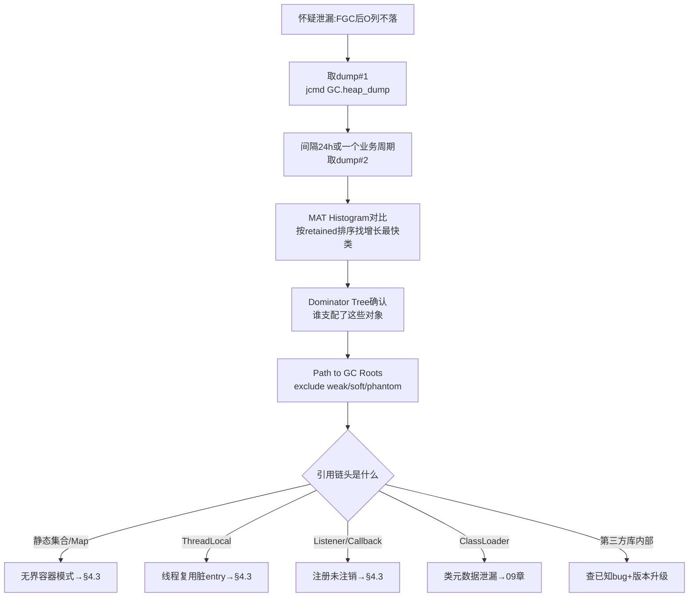
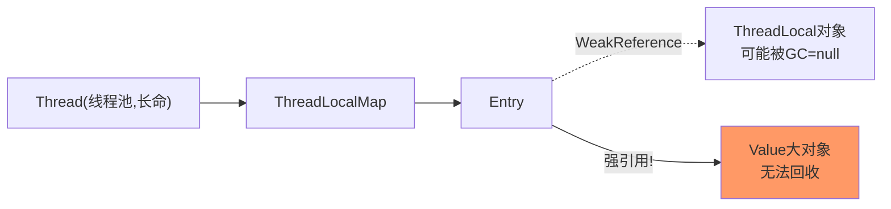

[⬅️ 上一章](03-oom-scenarios.md) · [📖 返回目录](README.md) · [➡️ 下一章](05-gc-fundamentals.md)
# 04 · 内存泄漏：判定、定位与经典模式

> **📌 30 秒速览**
> 1. Java 有 GC 也有泄漏——泄漏的本质是「**仍然可达但不再使用**」的对象：GC 够得着（不是垃圾），业务用不上（白占内存）。
> 2. 判定标准不是「内存高」，而是 **FGC 后老年代不回落 + 多次 dump 对比持续单调上涨**。缓存类应用要区分「缓存增长」与「真泄漏」。
> 3. 定位黄金组合：MAT Leak Suspects 找嫌疑 → Dominator Tree 看 retained 排序 → Path to GC Roots (exclude weak/soft) 看引用链 → 落到具体代码字段。
> 4. 高频泄漏源 Top4：无界容器、ThreadLocal、监听器/回调未注销、ClassLoader 类元数据。

---

### 4.1 泄漏 vs 正常缓存 vs 容量不足

| 维度 | 内存泄漏 | 正常缓存膨胀 | 容量不足 |
|------|---------|-------------|---------|
| FGC 后老年代 | 不回落，阶梯上升 | 回落明显，随后再涨 | 能回落到较低水位 |
| dump 特征 | 少数对象支配巨量内存 | 缓存条目数≈业务键数量，合理分布 | 无异常大户，普遍偏多 |
| 增长曲线 | 单调递增，与流量无关 | 与业务量正相关后趋平 | 流量涨才出现 |
| 重启后 | 一段时间后复发 | 复发速度与流量相关 | 高负载即触发 |

**判定实验**：对疑似泄漏实例做「静置观察」——摘掉流量后老年代占用应逐步回落（缓存过期）或维持不变；如果连 Full GC 都拉不下来，基本实锤泄漏（活引用还在）。

---

### 4.2 泄漏定位标准流程



操作细节：
- dump 间隔选择：覆盖至少一个完整的业务周期（天级任务选 25h）；两次都在**FGC 刚结束后**取，排除垃圾干扰；
- MAT 对比：Histogram 视图顶部下拉切换到第二个 dump → 右键 List objects 或直接看 `+/-` 增量列；
- 引用链判读：从可疑对象往上读，直到 GC Roots（线程栈局部变量 / 静态字段 / JNI 引用），**链上最后一个业务类字段就是修复点**。

---

### 4.3 经典泄漏模式 Top10

| # | 模式 | 典型代码特征 | 修复 |
|---|------|-------------|------|
| 1 | 无界静态集合当缓存 | `static Map<K,V> cache = new HashMap<>()` 只 put 不删 | Caffeine：maximumSize + expireAfterWrite |
| 2 | ThreadLocal 忘 remove | 线程池线程复用，value 常驻 | try-finally 里 remove；或阿里 TransmittableThreadLocal 规范用法 |
| 3 | 监听器/回调只注册不注销 | `addListener(this)` 无对应 remove | 生命周期对称管理（@PreDestroy 注销）|
| 4 | ClassLoader 泄漏 | 热部署/Groovy 动态生成新 loader | 复用 loader、显式 close（见 09 章） |
| 5 | 连接池/流未关闭 | 异常路径跳过 close | try-with-resources 全覆盖 |
| 6 | 自定义 equals/hashCode 缺失 | 对象放入 Map 后无法 get/remove（永远 miss） | 补齐两方法或改用不可变键 |
| 7 | 可变对象作 key 后被修改 | hashCode 变化导致 entry 成孤儿 | key 用不可变对象 |
| 8 | 子系统持有外部大对象 | Session/Context 里塞全量数据 | 只存标识，数据外置 Redis |
| 9 | 非堆内 native 资源 | DirectBuffer/JNI/ZipFile 未释放 | 显式 release/close（见 10 章） |
| 10 | 过期引用堆积 | 数组池化后不清尾元素（object pool） | 归还时清空槽位引用 |

**ThreadLocal 专项原理**：每个 Thread 内有 ThreadLocalMap，Entry 的 key 是 WeakReference 指向 ThreadLocal 对象，**value 是强引用**。GC 后 key 可能变 null 但 value 还挂着（stale entry）——线程不死则 value 永不回收。这就是「线程池 + ThreadLocal + 大对象 = 泄漏三兄弟」的机制根源：



---

### 4.4 MAT 实操速成

```bash
# 服务端抓 dump
jcmd $PID GC.heap_dump /data/dump/app-$(date +%m%d).hprof
# 下载到分析机(MAT 侧 -Xmx ≥ dump×1.5)
scp ... ; # 或走对象存储中转
```

MAT 四个视图的任务分工：

| 视图 | 回答的问题 | 用法要点 |
|------|-----------|---------|
| Overview → Leak Suspects | 「最可疑的泄漏点是哪？」 | 自动报告，先看 Problem Suspect 1/2 |
| Histogram | 「哪类对象最多/最大？」 | 按 Retained Heap 排序；右键 Merge Shortest Paths to GC Roots |
| Dominator Tree | 「谁占着内存不放？」 | 按 Retained 排序；展开树看它支配什么 |
| OQL | 「精确捞某类对象」 | `SELECT s FROM java.lang.String s WHERE s.@retainedHeapSize > 1048576` |

**Path to GC Roots 的选项语义**：`exclude weak/soft references` 是默认推荐——弱软引用随时可回收，不算泄漏根；勾上 include 反而会误导。若链头是 `Finalizer` 相关，转查 finalize 重载与 F-Queue 积压（`jmap -finalizerinfo`）。

**两个 dump 对比实操**：MAT 主界面 → Open Heap Dump 选 dump#1 → Histogram → 顶部工具栏「Compare to another Heap Dump」选 dump#2 → 结果按 Objects 增量排序列出增长最快类。

---

### 4.5 运行时轻量排查手段（拿不到 dump 时）

```bash
# 直方图采样:每10分钟记一次Top20,观察哪些类单调增长
while true; do jmap -histo $PID | head -23 >> histo.log; sleep 600; done
# 分析:awk统计同名类的实例数随时间的变化趋势

# Arthas 在线查静态集合大小
sc -d com.app.CacheHolder          # 确认类来自哪个jar
vmtool --action getInstances --className com.app.CacheHolder \
       --express 'instances[0].cache.size'   # 直接看缓存条数
```

JFR 辅助：开启 OldObjectSample 事件（profile 档默认开）记录「长寿对象」的分配栈，直接回答「这批 8 小时没被回收的对象是在哪里创建的」——JMC 里 Old Object 视图按存活时长排序，比 dump 更早发现泄漏苗头。

---

### 4.6 常见误区

| 误区 | 正确认知 |
|------|---------|
| 内存高就是泄漏 | 先做 FGC 回落实验 + 曲线形态判断，缓存/容量问题很常见 |
| 用 jmap -histo:live 当监控 | 每次 live 都触发 Full GC，高频执行会自己制造 GC 风暴 |
| WeakHashMap 万无一失 | value 强引用 key 时形成环，照样泄漏；且无淘汰策略语义 |
| dump 分析只看最大对象 | 要看 retained（支配树），浅堆最大的往往不是真凶 |
| 泄漏一定在业务代码 | 第三方库 bug（连接池/序列化缓存）占比不低，结合版本 changelog 查 |
| 软引用缓存很安全 | 内存压力下才回收，堆没到阈值前一样无限堆积拖慢 GC |

---

## 面试题精选（含追问）

**Q1：Java 有 GC 为什么还会内存泄漏？（追问：什么对象 GC 永远不会回收？）**

答：GC 回收的前提是「不可达」，泄漏对象是「可达但无用」——静态集合、运行中的线程、加载器等仍持有强引用，可达性分析认为它们是活的。典型如 static Map 缓存只增不减、ThreadLocal 在线程池场景忘 remove。追问：只要从 GC Roots（线程栈、静态字段、JNI 全局引用、活跃的 ClassLoader 及其类）出发存在强引用链的对象永不回收；特殊的是 String 常量池里的 intern 字符串和 Class 对象本身——生命周期跟随其 ClassLoader，bootstrap 层的基本伴随 JVM 终身。

**Q2：怎么在不重启服务的前提下判断是不是泄漏？（追问：dump 太大下载不动怎么办？）**

答：三板斧：①jstat -gcutil 观察 FGC 后 O 列是否回落（连续多次 FGC 不落→高度怀疑）；②定时采样 jmap -histo（不带 live）Top20，看头部类的实例数是否单调上涨；③Arthas vmtool 直接读嫌疑缓存的 size 与抽样内容。三者互相印证即可定性，不必立刻 dump。追问：①服务器本地装 MAT headless 解析出 HTML 报告（ParseHeapDump.sh + suspects 配置）只下载报告；②jmap -histo 输出留存代替 dump；③JFR OldObjectSample 记录长寿对象分配栈，文件只有几十 MB；④确实要 dump 时用 gzip（hprof 压缩比约 3~5 倍）+ 分块传输。

**Q3：ThreadLocal 为什么会导致泄漏？remove 之后呢？（追问：InheritableThreadLocal 在线程池里有什么坑？）**

答：Thread 的 ThreadLocalMap 中 Entry 的 key 是弱引用、value 是强引用；key 被 GC 后 Entry 变 stale（key=null），但 value 仍被线程强引用无法回收，线程池线程长命则堆积。set 相同 ThreadLocal 会覆盖、remove 会清理该 Entry——所以规范是 finally 里 remove。另外 Map 自身在 set/get/remove 时有探测式清理（expungeStaleEntry）兜底，但不保证及时。追问：ITL 只在创建子线程时拷贝一次父线程的值；线程池线程是复用的，子任务拿到的是「上一个任务残留的值」而非当前调用方上下文——链路追踪/用户态传递场景必须用 TTL（TransmittableThreadLocal）并在提交时 wrap，否则既脏又漏。

**Q4：MAT 里浅堆（Shallow）、深堆（Retained）的区别？为什么泄漏分析以 retained 为准？（追问：什么是支配关系？）**

答：浅堆是对象自身占用的堆大小（含头与字段引用槽）；深堆是该对象的 retained size——若它被回收能连带释放的总大小，等于自身浅堆加所有「仅经由它可达」对象的深堆。泄漏分析关心「删谁能释放多少」，所以以 retained 为准。追问：X 支配 Y 指「Y 的所有可达路径都经过 X」；把支配关系建成树就是 Dominator Tree，根节点 retained≈整个堆。注意深堆之和可能大于浅堆之和（共享对象被计入多个支配节点时 MAT 会做精确去重计算），也可能远小于直觉（被更上游节点支配的下级不再重复计）。

**Q5：Caffeine 缓存为什么能防住大部分缓存型泄漏？它自己的坑是什么？（追问：weakKeys 有什么副作用？）**

答：强制 maximumSize/Weight 上限 + W-TinyLFU 淘汰策略 + expireAfter 写入/访问过期，容量天然封顶；相比手动 HashMap 它把「忘记删」的风险收敛为配置问题。坑：①weigher 设置不当会让权重恒 0 导致上限失效；②异步 loading 缓存击穿时要配 sync 构造；③监控命中率与条目数，防止上限本身设得过大变成合法的「慢泄漏」。追问：weakKeys 使 key 进入弱引用，比较时改用 ==（身份相等）而非 equals——自定义 key 类若重写过 equals/hashCode，weakKeys 下会出现「看似相同实则不同条目」的重复缓存，语义完全改变，多数业务场景应该用 expireAfter 而非 weakKeys。

**Q6：线上怀疑第三方 SDK 泄漏，怎么举证推动修复？**

答：四步举证：①dump 引用链显示泄漏对象链头在 SDK 包内（Path to GC Roots 截图）；②检索该 SDK issue 列表与 changelog 是否已有同类问题与修复版本；③最小复现 demo：单独进程调用 SDK 同样路径，复现内存单调上涨（排除自家代码干扰）；④给出规避方案验证：升级到修复版/降级/替换实现后曲线恢复平稳。带着证据提 issue 或推动升级，比「我觉得是它的锅」有效得多。

---

## 考点速查表

| 考点 | 一句话要点 |
|------|-----------|
| 泄漏本质 | 可达但不可用：GC 够得着、业务用不上 |
| 判定标准 | FGC 后 O 不落 + 双 dump 对比单调涨，二者同时成立才算 |
| 定位链路 | Leak Suspects→Dominator Tree→Path to GC Roots(exclude weak/soft) |
| Top 模式 | 无界容器/ThreadLocal/监听器/ClassLoader/流未关/坏 hashCode |
| ThreadLocal 机制 | key 弱 value 强，stale entry 随线程长命堆积，finally remove |
| MAT 对比法 | Histogram Compare to Heap Dump，增量排序锁定增长类 |
| 轻量替代 | histo 定时采样 + Arthas vmtool 读缓存 size + JFR OldObjectSample |
| Caffeine 防漏 | 上限+过期+淘汰把风险变配置问题；weigher=0 是隐形坑 |
| 举证第三方 | 引用链截图+issue 检索+最小复现+替换验证四步闭环 |

---

[⬅️ 上一章](03-oom-scenarios.md) · [📖 返回目录](README.md) · [➡️ 下一章](05-gc-fundamentals.md)
