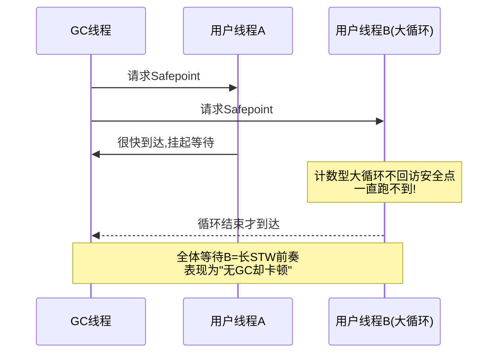
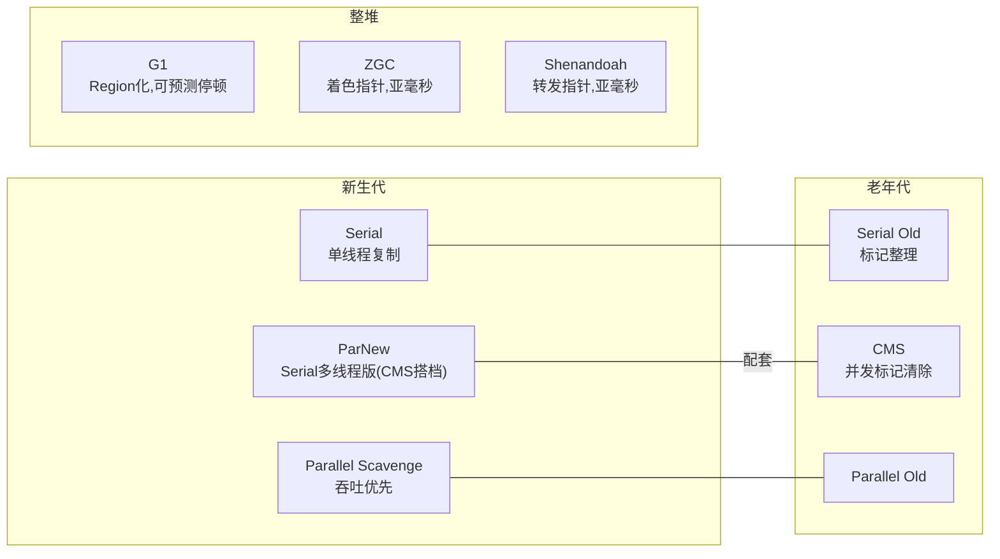
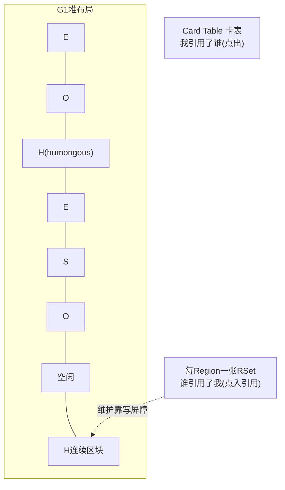
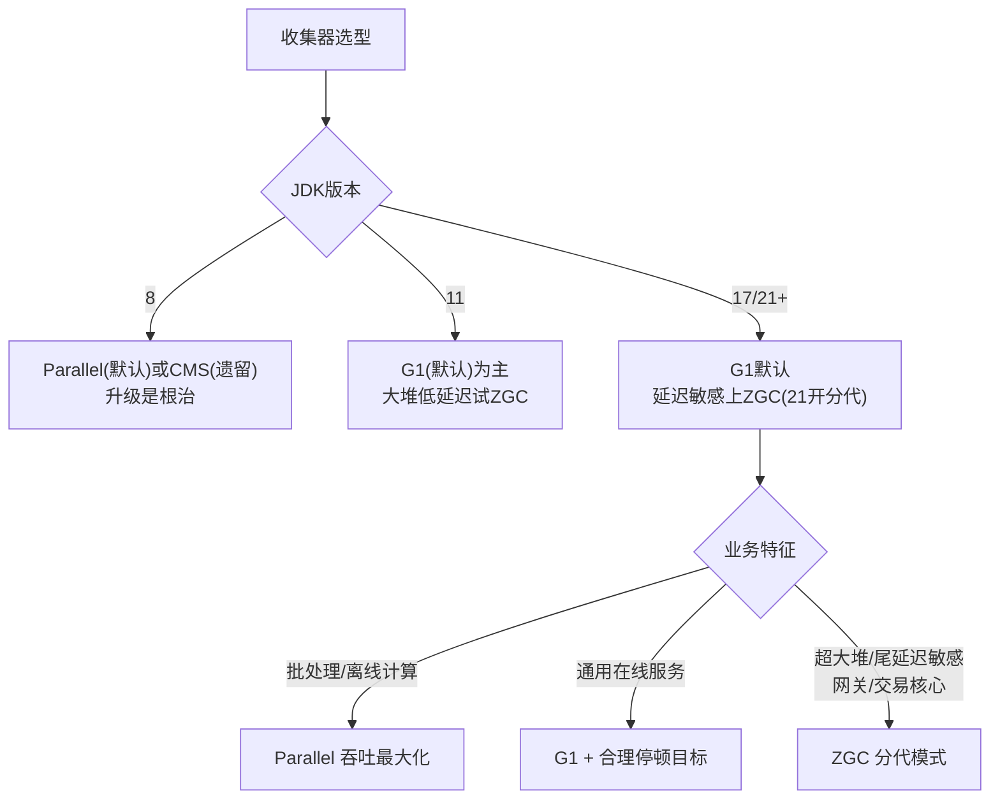

[⬅️ 上一章](04-memory-leak.md) · [📖 返回目录](README.md) · [➡️ 下一章](06-gc-tuning.md)
# 05 · GC 基础原理与收集器演进

> **📌 30 秒速览**
> 1. 所有 GC 的核心是三件事：**怎么找到垃圾**（可达性分析）、**怎么回收空间**（复制/标记-清除/标记-整理）、**怎么让世界停下**（安全点/Safepoint）。
> 2. 三色标记是并发标记的理论底座；漏标的两个条件由「增量更新」（CMS）与「原始快照 SATB」（G1/Shenandoah/ZGC）分别堵住。
> 3. 收集器演进主线 = **停顿越来越短、堆越来越大、并发化程度越来越高**：Serial → Parallel（吞吐优先）→ CMS（低停顿先行者，JDK9 弃用 JEP 291、JDK14 移除 JEP 363）→ G1（JDK9 起默认）→ ZGC/Shenandoah（亚毫秒停顿，ZGC 分代模式 JDK21 落地 JEP 439）。
> 4. 选型不是越新越好：吞吐型批处理 Parallel 依然能打；通用服务 G1 是默认答案；超大堆+极致尾延迟才上 ZGC。核实时间线见 [13-附录](13-appendix-references.md)。

---

### 5.1 垃圾判定：引用计数 vs 可达性分析

| 方案 | 原理 | 缺陷 | 采用者 |
|------|------|------|--------|
| 引用计数 | 对象被引用数+1，失效-1，0 即垃圾 | 循环引用无法回收；计数维护开销 | CPython（辅以分代）、COM |
| 可达性分析 | 从 GC Roots 出发遍历对象图 | 需要 STW 一致性快照（或并发协议） | HotSpot 及主流 JVM |

GC Roots 清单：虚拟机栈局部变量表引用的对象、方法区静态字段与常量引用、JNI 全局引用、活跃线程本身、同步锁持有的对象、JMXBean 等。

四种引用强度与回收时机：

| 引用 | 回收时机 | 典型用途 | 类 |
|------|---------|---------|-----|
| 强 | 永不（可达时） | 普通变量 | - |
| 软 SoftReference | 内存不足时 | 缓存 | `SoftReference` |
| 弱 WeakReference | 下次 GC 必收 | ThreadLocalMap key、WeakHashMap | `WeakReference` |
| 虚 PhantomReference | 随时可收，仅用于通知 | 堆外内存释放回调（Cleaner 底座） | `PhantomReference` |

---

### 5.2 三色标记与并发标记的两个问题

**并发标记的核心矛盾**：用户线程与 GC 线程同时改引用，可能把「黑→白」直接相连且「灰→白」路径断开，导致白色对象被误杀——即**浮动垃圾**（多标，可容忍，下轮再收）与**对象消失**（漏标，致命）。

漏标同时满足两个条件：
1. 赋值器插入了一条或多条**黑到白**的新引用；
2. 赋值器删除了全部**灰到白**的直接或间接引用。

两大流派各堵一个条件：

| 方案 | 堵哪个条件 | 实现 | 使用者 |
|------|-----------|------|--------|
| 增量更新 Incremental Update | 条件1（黑挂新白→把黑变灰重扫） | 写屏障记录新增引用 | CMS |
| 原始快照 SATB | 条件2（灰断旧白→按快照当活处理） | 写屏障记录删除引用 | G1、Shenandoah |

SATB 产生浮动垃圾但标记更快（一次搞定）；增量更新需 rescan 黑色节点，CMS 最终标记耗时波动大——这是 G1 替代 CMS 的理论优势之一。

**写屏障**：在引用赋值前后插入的 AOP 式小段代码（类似拦截器），把变更记入队列供并发标记修正。它是并发标记正确性的执行机制，也是 G1 维护 Remembered Set 的手段。

---

### 5.3 安全点与安全区域

STW 操作（Young GC、Final Mark、偏向锁撤销等）必须等所有用户线程跑到安全点（Safepoint）才能开始。安全点是指令流中特定位置（方法调用、循环回跳、异常跳转），保证此处寄存器/栈帧的引用信息可被准确枚举。

排查线索：日志出现 `Reaching safepoint` 耗时高（`-Xlog:safepoint`），但真正 GC 操作很短——就是有线程迟迟到不了安全点。JDK10 后引入循环分层数（loop strip mining）缓解计数循环问题。

**安全区域**是安全点的扩展：线程处于 Sleep/Blocked 时无法主动跑到安全点，用安全区域（一段引用关系不变的代码区间）登记后即可安心睡，醒来时检查是否度过了发起阶段。

---

### 5.4 经典收集器谱系

| 收集器 | 算法 | 线程 | 目标 | 状态 |
|--------|------|------|------|------|
| Serial / Serial Old | 复制 / 标整理 | 单线程 | 简单高效 | 客户端/小内存仍在用 |
| ParNew | 复制 | 多线程 | 配合 CMS | JDK14 随 CMS 移除 |
| Parallel Scavenge / Old | 复制 / 标整理 | 多线程 | **吞吐量**最大 | 吞吐场景默认(JDK8 默认) |
| CMS | 标记-清除 | 并发 | **停顿**最短(当时) | JDK9 弃用→JDK14 移除 |
| G1 | Region 化标整(整体) | 并发 | 停顿可控可预测 | **JDK9+ 服务端默认** |
| ZGC | 着色指针+读屏障 | 并发(几乎全程) | 亚毫秒停顿 | JDK11 实验→15 生产→21 分代 |
| Shenandoah | 转发指针+读屏障 | 并发 | 亚毫秒停顿 | Red Hat 主导，OpenJDK 提供 |
| Epsilon | 无操作 | - | 实验基准/短命任务 | 不回收，跑完就退 |

**CMS 七阶段速记**（面试高频）：初始标记(STW,只标 Roots 直连) → 并发标记(与用户并发) → 重新标记(STW,修正并发期变动,增量更新) → 并发清除 → 并发重置。三个痛点：CPU 敏感（并发占核）、浮动垃圾（标记期间新垃圾只能下次）、**标记-清除碎片**（大对象放不下提前触发 Full GC）+ 并发失败退化为 Serial Old（concurrent mode failure）。

---

### 5.5 G1：Region 化与可预测停顿

G1 把堆切成 ~2048 个等大 Region（1~32MB，2 的幂），每个 Region 动态扮演 Eden/Survivor/Old/Humongous 角色，不再物理隔离各代：

关键机制：
- **Humongous 判定**：对象 ≥ Region 一半即为 humongous，占用一个或多个连续 Region，逻辑上属老年代——**大对象泛滥会打乱 G1 的回收节奏与停顿预测**（06 章实战）；
- **RSet（Remembered Set）**：解决「老年代单独分区指向新生代」的点入引用，避免回收单区时全堆扫描；代价是写屏障维护开销与额外内存（大堆可达数百 MB）；
- **停顿预测模型**：统计每个 Region 回收成本（历史均值），每次 Young GC / Mixed GC 在 `-XX:MaxGCPauseMillis`（默认 200ms）预算内挑性价比最高的 Region 集合（CSet）来收；
- **Mixed GC**：老年代占比达 `InitiatingHeapOccupancyPercent`(IHOP,默认45%) 后启动并发周期，随后几轮 Young GC 顺带回收部分老年代 Region；
- **失败退化链**：并发标记跟不上分配 → `to-space exhausted` → Full GC（单线程 Serial Old 兜底，JDK10 后并行化）——这是 G1 最需要避免的雪崩路径。

---

### 5.6 ZGC 与 Shenandoah：亚毫秒时代

**ZGC 核心技术**：
- **着色指针（Colored Pointers）**：64 位指针中借几位存 GC 元数据（Marked0/Marked1/Remapped/Finalizable），GC 状态直接编码在指针里；
- **读屏障（Load Barrier）**：线程加载引用时检查指针颜色，发现过期则触发「自愈」——更新为最新地址后再返回。应用看到的永远是有效引用；
- **并发整理**：对象搬迁（Relocation）阶段用户线程几乎不停——因为读屏障自愈兜住了「搬到一半被读到」的情况；停顿只存在于根部扫描等极小窗口，与堆大小无关；
- **分代 ZGC（JEP 439, JDK21）**：非分代版本对短命对象也要全堆标记，浪费明显；分代后年轻代独立回收，吞吐损失大幅缩小，成为生产推荐形态（详见附录核实条目）。

**Shenandoah 差异点**：不用着色指针（兼容更多平台），改用 **Brooks 转发指针**（对象头前加一跳转槽，搬迁后旧对象指向新地址），配合读写屏障实现并发整理。OpenJDK 内置，Oracle JDK 不含。

**两者共同适用边界**：停顿 <1ms 且与堆解耦（TB 级堆同样亚毫秒）；代价是吞吐损失（历史上 10%~15%，分代 ZGC 后大幅改善）与更高 CPU/内存开销。中小堆、吞吐敏感服务留在 G1 通常更优。

---

### 5.7 选型决策

常见误区提示：MaxGCPauseMillis 设得过小（如 20ms）会让 G1 把新生代压得过小 → YGC 变得极频繁 → 总吞吐崩塌；参数调优见 06 章。

---

## 面试题精选（含追问）

**Q1：CMS 和 G1 的区别？为什么 CMS 被 G1 取代？（追问：CMS 的 concurrent mode failure 是什么？）**

答：算法层面 CMS 是纯标记-清除（碎片累积），G1 是 Region 化的标记-整理（Region 间复制，无碎片）；范围层面 CMS 只管老年代（配 ParNew），G1 整堆管理；停顿控制上 CMS 只能被动接受，G1 有停顿预测模型主动挑选 CSet 凑预算；工程层面 G1 的 SATB 重标记比 CMS 增量更新的 rescan 更稳，RSet 让增量回收成为可能。取代原因还包括 CMS 维护成本高（JEP 291 弃用理由：历史包袱重、新特性无法受益）。追问：并发回收速度赶不上老年代填充（预留空间耗尽）触发 concurrent mode failure，退化为单线程 Serial Old Full GC，停顿秒级——预防手段是合理调 CMSInitiatingOccupancyFraction 触发阈值并留足老年代余量。

**Q2：什么是三色标记？SATB 和增量更新的本质差异？（追问：为什么 G1 选 SATB？）**

答：三色是把对象分为未访问(白)/已访问未扫完(灰)/已扫完(黑)的标记抽象；并发标记下若「黑新增到白的引用」与「灰到白的引用全断」同时发生，白对象会被漏标误杀。增量更新破坏条件一（黑挂白时把黑重新变灰，CMS 用），SATB 破坏条件二（删除引用时按标记开始时的快照视存活，G1/Shenandoah 用）。追问：SATB 的重标记只需处理快照期间的引用删除记录，工作量小且稳定；增量更新要重新扫描所有变黑的节点，最终标记时长不可控——对追求停顿可预测的 G1 来说 SATB 是必然选择，代价是产生浮动垃圾（本轮多标，下轮回收，不影响正确性）。

**Q3：安全点是什么？为什么会有「GC 日志正常但服务还是卡了一下」？（追问：怎么定位到不了安全点的线程？）**

答：安全点是线程可以暂停下来让 JVM 枚举引用的特定位置；只有全体线程都到达安全点，STW 操作才能开始。「GC 正常却卡顿」的经典原因就是 Reaching Safepoint 时间长——某线程在计数型大循环/大数组操作里长时间不经过安全点，其他线程全部挂着等它。追问：加 `-Xlog:safepoint`（JDK8 为 `-XX:+PrintSafepointStatistics`）看每次停顿的 spin/block/walk 分解，walk 高=有线程晚到；再用 JFR 的 Safepoint Begin/End 事件对齐线程 dump 找到那个还在 RUNNABLE 干活的线程；根治是拆解超长循环（编译器会在 counted loop 插安全点，某些 int 计数循环优化后反而不插，JDK10 loop strip mining 已缓解）。

**Q4：G1 的 Humongous 对象为什么是问题之源？怎么治理？（追问：G1HeapRegionSize 怎么定？）**

答：≥Region 一半的对象走 humongous 通道：①占用连续 Region 且逻辑属老年代，年轻代回收碰不到它；②分配时可能触发并发标记提前启动（IHOP 抢占）；③大量中等偏大的对象把 Region 打碎，CSet 选择余地变小，停顿预测失准；④回收依赖并发周期，清理不及时就会 to-space exhausted。治理：排查大分配来源（JFR allocation 事件/火焰图）、业务侧切片化传输、必要时调大 RegionSize 让对象不再过半。追问：G1 自动把平均堆大小切 2048 份取 2 的幂（如 32G 堆≈16M Region）；显式设置的原则是「预期最大常规对象的一半以下」，比如业务峰值对象 4MB 就设 8M Region；设太大浪费空间（humongous 判定变严反而好，但小 Region 数减少影响并行度），一般保持自动 + 治理大对象。

**Q5：ZGC 为什么能把停顿做到亚毫秒且和堆大小无关？（追问：分代 ZGC 解决什么问题？）**

答：三个支柱：①着色指针把 GC 元数据内嵌指针，状态判断 O(1)；②读屏障+自愈让「访问被搬移对象」的用户线程自己完成引用修复，无需停下来等 GC；③几乎所有重活（标记、搬迁、重映射）都与用户线程并发，STW 只剩根节点扫描的小窗口，而这个窗口随根集合而非堆大小增长——所以 TB 级堆照样亚毫秒。追问：非分代 ZGC 对绝大多数「朝生夕死」的对象也做全堆标记，标记成本高、吞吐损失明显（这也是它长期不如 G1 普及的主因）；JDK21 的 JEP 439 引入分代支持，年轻代独立快速回收，吞吐损失大幅收敛，官方建议默认开启分代模式。

**Q6：吞吐量优先和延迟优先怎么量化取舍？（追问：给出你选 G1 参数的第一组基线。）**

答：吞吐=应用时间/(应用时间+GC时间)，延迟=单次停顿与尾延迟分布。二者结构性冲突：并发收集器用更多 CPU 换停顿（总吞吐下降但响应变好）。量化方法：从 SLA 反推——接口 P99 要求 100ms 时，单次 GC 停顿预算不能超过其零头（如 50ms）；批处理任务则看总完成时间，Parallel 的 STW 频率虽高但每次利用率最高。追问：G1 起步基线：MaxGCPauseMillis=200（先保守，观察真实分布再收紧）、堆 Xms=Xmx 防伸缩抖动、InitiatingHeapOccupancyPercent 保持自适应（JDK9+ 默认随停顿目标动态调整）、开启 `-Xlog:gc*,gc+heap=debug` 观察真实停顿构成后再迭代。

---

## 考点速查表

| 考点 | 一句话要点 |
|------|-----------|
| 垃圾判定 | 可达性分析为准；强软弱虚四级引用决定回收时机 |
| 三色漏标条件 | 黑挂新白 + 灰断旧白同时发生才漏；两流派各堵其一 |
| SATB vs 增量更新 | G1/Shenandoah 用 SATB(快照)，CMS 用增量更新(重扫黑) |
| 安全点卡顿 | Reaching safepoint 长=有线程晚到，-Xlog:safepoint 定位 |
| CMS 七字诀 | 初标(STW)→并发标→重标(STW)→并发清；碎片+CMF 两死穴 |
| G1 核心 | Region 化+RSet 点入引用+停顿预测选 CSet+Mixed GC |
| Humongous | ≥Region/2 进特殊区，打乱节奏；治理靠切片/调 RegionSize |
| G1 雪崩链 | 并发慢于分配→to-space exhausted→Serial Old Full GC |
| ZGC 三支柱 | 着色指针+读屏障自愈+几乎全程并发；21 起分代成推荐 |
| 选型口诀 | 吞吐 Parallel、通用 G1、超大堆低延迟 ZGC；版本决定可选集 |

---

[⬅️ 上一章](04-memory-leak.md) · [📖 返回目录](README.md) · [➡️ 下一章](06-gc-tuning.md)
