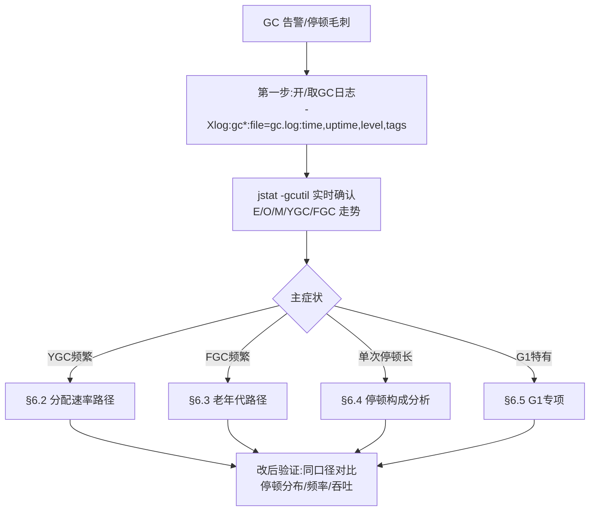
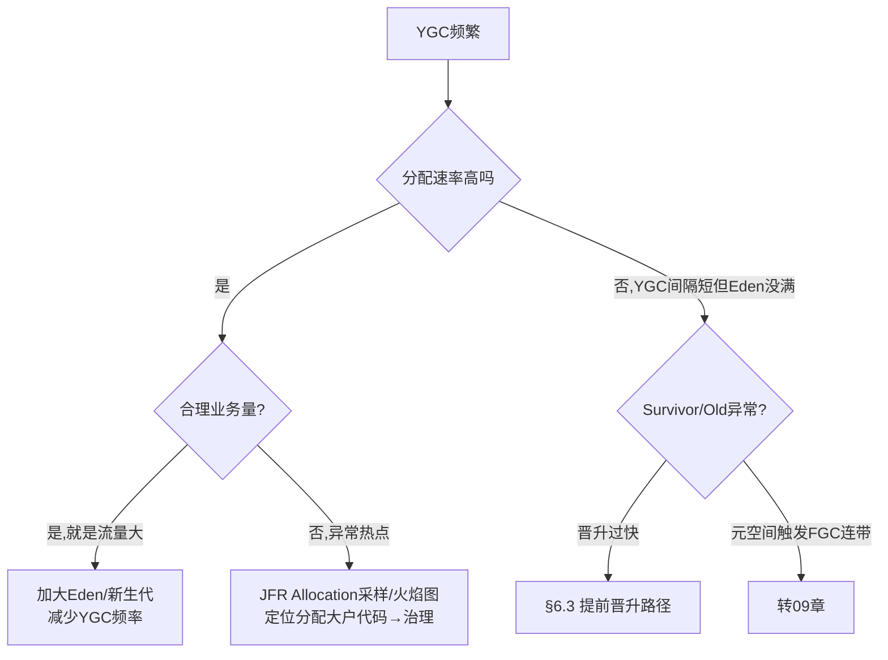
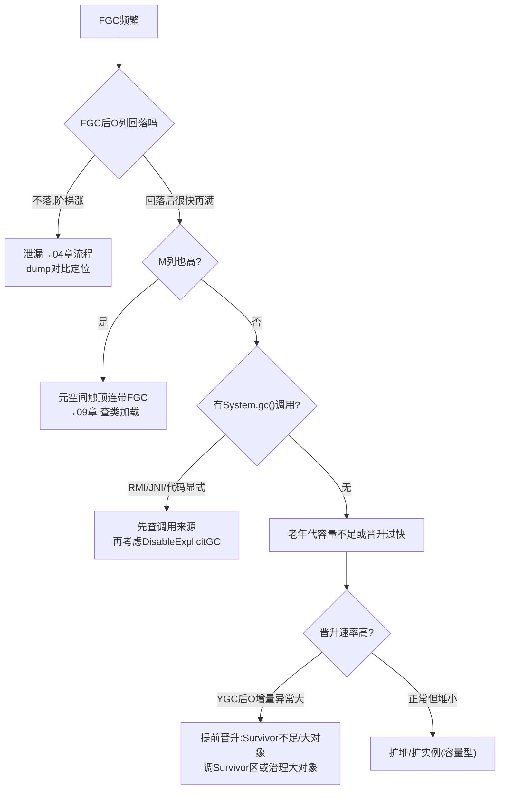
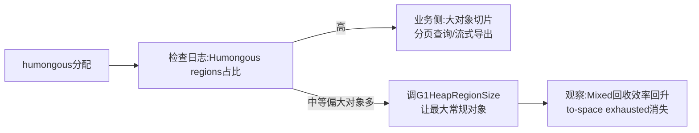

[⬅️ 上一章](05-gc-fundamentals.md) · [📖 返回目录](README.md) · [➡️ 下一章](07-cpu-hot.md)
# 06 · GC 问题定位与调优实战

> **📌 30 秒速览**
> 1. GC 问题三大症状：**YGC 频繁**（分配速率问题）、**FGC 频繁**（老年代/元空间问题）、**单次停顿长**（大堆 Full GC / G1 混收 / Humongous）。先归类再调参，方向错全错。
> 2. 调优第一原则：**先看分配速率再看堆参数**——分配速率过高时任何收集器都救不了，治理对象创建才是根。
> 3. GC 日志是唯一事实：`-Xlog:gc*`（JDK9+）/ `-XX:+PrintGCDetails`（JDK8）必开，用 GCEasy/gcviewer 离线分析。
> 4. G1 调优先校准 `MaxGCPauseMillis` 与 Humongous；ZGC 调优先确认分代模式与并发线程数。不要一次改多个参数。

---

### 6.1 GC 问题定位总框架



日志格式速查（JDK9+ 统一日志）：

```bash
# 基础(生产常驻)
-Xlog:gc:file=/data/logs/gc.log:time,uptime:filecount=5,filesize=50m
# 详细(排查期)
-Xlog:gc*:file=/data/logs/gc.log:time,uptime,level,tags:filecount=5,filesize=100m
# JDK8 对应
-XX:+PrintGCDetails -XX:+PrintGCDateStamps -Xloggc:/data/logs/gc.log \
-XX:+UseGCLogFileRotation -XX:NumberOfGCLogFiles=5 -XX:GCLogFileSize=50M
```

一条 YGC 日志的读法：`[Pause Young (Normal) (G1 Evacuation Pause)] 2048M->256M(8192M) 45ms`——回收前后存活对比、总堆、停顿。重点看**回收后的存活量**（256M 是真实工作集）与**停顿分布**而非单次值。

---

### 6.2 YGC 频繁：分配速率问题

**判定**：jstat 观察 E 列从满到清的周期；计算分配速率 = Eden 大小 ÷ YGC 间隔。健康参考：普通服务 <1GB/s，超过说明有热点分配或流量突增。



高频分配热点代码模式（火焰图上常见平顶）：

| 模式 | 例 | 治理 |
|------|-----|------|
| 循环内拼接 | `+=` 字符串循环拼接 | StringBuilder 预分配 |
| 日志滥用 | 高频 debug 未判级别直接拼参 | 占位符 `{}` + isDebugEnabled |
| 序列化反复构造 | 每次 RPC new ObjectMapper | 静态复用（它线程安全） |
| 包装类装箱 | Long/Integer 大量自动装箱循环 | 改原生类型流/局部变量 |
| 正则每次编译 | `str.matches()` 隐式 Pattern.compile | Pattern 预编译 static |
| 流式中间集合 | stream 多次 map 产生中间容器 | 合并转换步骤 |

**方案**：
1. 治理热点（根治，优先）；
2. 加大新生代：`-Xmn` 或 G1 下放宽 pause 目标让 G1 自动扩 young——注意新生代过大拉长单次 YGC 复制时间，需看单次停顿是否可接受；
3. Survivor 不足导致「复制多次才死」的对象过早晋升 → 见 §6.3。

---

### 6.3 FGC 频繁：老年代与元空间问题

**判定**：jstat O 列高位、FGC 计数持续增长；每次 FGC 后 O 回落程度决定方向。



**提前晋升（premature promotion）识别**：每次 YGC 日志里 `-> XXXM` 后半段（晋升量）长期偏高，且 YGC 间隔规律性变短——Survivor 太小装不下存活对象，被迫挤进老年代。验证：JDK8 用 `-XX:+PrintTenuringDistribution` 看各年龄对象体积分布。

**System.gc() 排查**：JDK9+ 加 `-Xlog:gc+cause=debug`，日志会记录每次 GC 的触发原因与调用来源；RMI 定时触发、JNI 库、业务显式调用是三大常见源。注意：NIO 的 Bits.reserveMemory 在直接内存超限时也会主动 System.gc()（见 03 章 Direct buffer），此时 DisableExplicitGC 反而有害——需要配合 MaxDirectMemorySize 充足。

---

### 6.4 单次停顿长：停顿构成分析

停顿长的四类来源：

| 类型 | 特征 | 定位 |
|------|------|------|
| 真·Full GC | 日志明确 Full GC 字样 | 按 §6.3 查根因 |
| G1 Mixed GC 长 | Pause Young (Mixed) 停顿远超目标 | §6.5 CSet 过大 |
| Humongous 分配卡顿 | 日志 humongous allocation 相关 + 停顿尖刺同步 | §6.5 |
| 非 GC 停顿 | GC 正常但 STW 时间对不上 | 安全点问题(05章§5.3)/偏向锁撤销/类加载 |

分析工具链：

```bash
# 离线分析(推荐):上传到 gceasy.io 或本地 gcviewer
# 关注:停顿分布(P99/P999) 而非平均值;Promotion 速率;FGC 原因分布
# JFR 补充:看每阶段耗时构成
jfr print --events jdk.GarbageCollection rec.jfr | head -50
```

**停顿预算思维**：SLA 要求 P99 < 200ms 时，单次 GC 停顿应 <50ms 且频率可控。把「停顿×频率」算成每天的总 STW 预算，超了才动手，避免过度调优。

**swap 专项**：停顿异常长（秒级）且 CPU 低时查 swap：`vmstat` si/so 列持续非零 = 内存页被换出，GC 扫描时缺页重试。处理：关 swap（生产 JVM 标配 `vm.swappiness=1`）或降内存占用。

---

### 6.5 G1 专项调优

G1 调优先回答三个问题。

**① 停顿目标合理吗？**
MaxGCPauseMillis 是硬约束的「愿望」：设太小 → young 区被压小 → YGC 频率暴涨 → 吞吐崩塌。校准方法：从默认 200ms 出发，观察真实停顿分布，逐步收紧到「90% 达标」的水平，不追求 100%。

**② Humongous 泛滥吗？**



日志证据：`Pre Evacuation Collection Set` 阶段耗时高、`Humongous regions: X->Y` 数量大、to-space exhausted 出现即告警级事件。

**③ 并发周期跟得上吗？**
IHOP 自适应（JDK9+ 默认开启 `-XX:+G1UseAdaptiveIHOP`）一般不用手动设；若并发标记期间老年代增速超过标记速度，会 to-space exhausted → Full GC。手段：降低分配/晋升速率（治本）、预留更多堆余量、极端时手动下调 InitiatingHeapOccupancyPercent 提前启动并发周期。

**G1 参数速查表**：

| 参数 | 默认 | 说明 |
|------|------|------|
| MaxGCPauseMillis | 200ms | 停顿目标，过小适得其反 |
| G1HeapRegionSize | 自动(~2048份取2^n) | 手动设需评估最大对象 |
| InitiatingHeapOccupancyPercent | 45(自适应) | 并发周期启动阈值 |
| G1ReservePercent | 10 | 预留防 to-space exhausted |
| ConcGCThreads | 自动 | 并发标记线程数 |
| G1MixedGCCountTarget | 8 | 一轮混收拆几次 |
| G1HeapWastePercent | 5 | 可浪费比例,低于则停止混收 |

---

### 6.6 ZGC 专项要点

- **确认分代模式**：JDK21+ 默认启用分代（核实见附录）；JDK17 用非分代版本，吞吐损失明显；
- 关键参数少而精：`-XX:+UseZGC -XX:+ZGenerational`(21)；堆给足——ZGC 以空间换延迟，建议 Xmx 为工作集 2~3 倍；
- 停顿仍偶发毫秒级时的排查点：`-Xlog:gc*` 看 `Pause Mark Start/End`、`Pause Relocate Start` 三段耗时；Load Barrier 开销体现在用户线程变慢而非停顿数字里；
- 容器内注意 ZGC 的元数据内存会让 RSS 显著高于 Xmx，RSS 公式要放大预估（见 10 章）。

---

### 6.7 调优案例模板（照此复盘）

> **背景**：网关服务 8C16G，JDK17 G1，Xmx8g。高峰期 P999 从 80ms 劣化到 800ms。
> **定位**：GC 日志显示 Pause Young (Mixed) 单次 300ms+；Humongous regions 高峰 400+；业务侧有大报文 JSON 解析。
> **动作**：①大报文改流式解析（根治分配源头）；②RegionSize 保持自动，观察 humongous 降到 <50；③pause 目标从 200 收紧到 100，让 young 更积极回收短命对象。
> **结果**：P999 回落到 120ms；Mixed GC 停顿 P99 45ms。
> **教训**：先治分配再调参数；每次只改一个变量并观察一个完整高峰周期。

---

## 常见误区

| 误区 | 正确认知 |
|------|---------|
| 上来就换 ZGC 解决一切 | 分配速率过高时 ZGC 也救不了；先治热点再谈收集器 |
| MaxGCPauseMillis 设越小越好 | 过小→新生代压缩→YGC 暴涨→吞吐崩塌，反向操作 |
| 只看平均停顿 | 决定用户体验的是 P999 与毛刺，必须看分布 |
| DisableExplicitGC 万能 | 会害死 NIO 直接内存回收路径，先查 System.gc() 来源 |
| 新生代越大越好 | 复制时间随存活量涨，YGC 停顿同步变长，需平衡 |
| 调优一次改多个参数 | 无法归因；单变量原则+完整周期观察 |
| FGC 少就万事大吉 | 单次秒级 FGC 比频繁 50ms 更伤 SLA，看总停顿预算 |

---

## 面试题精选（含追问）

**Q1：线上 YGC 每分钟 30 次，怎么优化？（追问：为什么加大新生代后 YGC 反而变慢了？）**

答：三步走：①jstat -gcutil 算分配速率=Eden÷间隔，判断是流量合理增长还是异常热点；②异常热点用 JFR Allocation 采样/火焰图锁定代码（常见：循环拼串、重复 Pattern.compile、反复 new ObjectMapper）；③治理后仍高则加大 Eden 减少频率，同时盯单次 YGC 停顿是否可接受。追问：新生代变大后需要复制的存活对象可能没变多，但扫描范围与卡表维护变大，且 Survivor 同比变大后对象在 Survivor 间来回复制次数增多——若大部分对象其实活不过一轮，更大的新生代只是把同样的复制成本攒到一次做，表现为频率降了但单次更慢；正确目标是「频率×单次成本」最小化，不是单一指标最优。

**Q2：FGC 频繁但 dump 显示没有明显泄漏大户，可能是什么？（追问：DisableExplicitGC 有什么风险？）**

答：五个方向逐一排除：①元空间触顶连带 FGC（jstat M 列）；②System.gc() 显式调用（RMI 定时任务/JNI 库/业务代码），gc log cause 字段直接可见；③提前晋升——Survivor 太小或动态年龄判定导致年轻代存活大量涌入老年代，特征是 YGC 后 O 列跳升明显；④堆容量确实不足（流量涨了），FGC 后能回落但水位整体抬升；⑤碎片化（CMS 时代）或 G1 humongous 占用导致「看着满」。追问：风险在于 NIO 的 Bits.reserveMemory 在直接内存超限时靠主动 System.gc() 触发 Cleaner 回收堆壳；禁掉后该路径失效，Direct buffer memory OOM 概率大增——必须配合充足的 MaxDirectMemorySize 并排查调用方。

**Q3：G1 出现 to-space exhausted 怎么处理？（追问：G1ReservePercent 为什么能预防？）**

答：含义是疏散（evacuation）时预留空间耗尽，本次 Young/Mixed GC 升级为 Full GC（历史上退化为串行）。处理顺序：①查 humongous 是否泛滥（连续 Region 吃掉预留），治理大对象；②看并发标记是否滞后于晋升——降低分配速率或提前启动并发周期；③上调 G1ReservePercent（默认 10%）扩大预留。追问：G1 的疏散是「先拷到新 Region 再释放旧的」，必须持有目标空间；ReservePercent 就是从堆里划出的应急缓冲池，to-space exhausted 本质是这块空间+自由 Region 同时枯竭——扩大它等于给洪峰留泄洪区，代价是常态可用堆变小，需权衡。

**Q4：怎么从日志判断「停顿是 GC 引起的」还是「别的原因卡顿」？（追问：安全点日志怎么看？）**

答：对齐三个时间轴：应用慢请求时间戳、GC 停顿区间、STW 总时长（含非 GC STW）。GC 停顿解释不了的长尾就是别的 STW：安全点等待、偏向锁批量撤销、类加载/反优化。追问：JDK9+ 用 `-Xlog:safepoint` 输出每次进入安全点的 spin+block+walk 时长分解；walk 大=有线程晚到安全点；结合 `-Xlog:gc+cause=debug` 区分停顿 cause；JFR 的 Safepoint Begin/Wait 事件可视化更直观，对长 walk 时段的线程栈快照一抓一个准。

**Q5：给出你接手一个新服务的 GC 配置基线与观察指标。（追问：什么时候考虑升级 JDK 版本而不是继续调参？）**

答：基线：Xms=Xmx（防伸缩抖动）、G1 默认收集器 + MaxGCPauseMillis=200、开统一 GC 日志轮转、HeapDumpOnOutOfMemoryError 兜底、容器按 12 章 MaxRAMPercentage 基线。观察一周后按症状迭代：分配率高→治理热点；Mixed 长→humongous 治理；YGC 频繁→Eden 校准。指标：停顿分布（P99/P999）、YGC 间隔、晋升速率、FGC 归因分布、总 STW 占比。追问：三类信号时升级优于调参：①需要的特性只在新版存在（分代 ZGC、虚拟线程）；②当前版本有已知 GC bug 且修复在新版；③同硬件新版基准性能显著更高。升级前压测回归，重点验证停顿分布而非吞吐均值。

**Q6：为什么 ZGC 推荐堆给到工作集 2~3 倍？（追问：这和它的并发整理机制有什么关系？）**

答：ZGC 几乎全程并发，整理期间新旧两份对象共存（搬迁未完成时原位置与新位置都占内存），加上浮动垃圾与标记期间的新分配，瞬时峰值占用可达工作集两倍以上；堆不足会触发分配停顿（Allocation Stall）反而伤延迟。追问：读屏障自愈机制允许用户线程读到「已搬迁但引用未更新」的对象并当场修复，这要求搬迁采取「先复制后清源」的乐观策略——空间冗余正是这个策略的安全边际；G1 的疏散同理但以 Region 粒度控制节奏，ZGC 粒度更细所以对余量更宽容，但底线同样是不能没有余量。

---

## 考点速查表

| 考点 | 一句话要点 |
|------|-----------|
| 三大症状归类 | YGC 频繁=分配率；FGC 频繁=老年代/元空间；单次长=Full/混收/Humongous |
| 分配速率公式 | Eden÷YGC间隔；先治热点再调堆，方向不能反 |
| 提前晋升信号 | YGC 后 O 跳升大；Survivor 不足或动态年龄判定所致 |
| System.gc() 三源 | 业务显式/RMI/JNI+NIO 直接内存兜底，禁用前先查来源 |
| 停顿预算法 | SLA 反推单次停顿上限与每日总 STW 预算，超了才动 |
| G1 停顿目标 | 过小适得其反；从 200 出发按真实分布逐步收紧 |
| to-space exhausted | 疏散空间枯竭→退化 Full GC；治 humongous+提预留 |
| swap 干扰 | si/so 非零=缺页拖慢 GC；swappiness=1 或关 swap |
| ZGC 空间换延迟 | 堆=工作集 2~3 倍；不足触发 Allocation Stall |
| 单变量原则 | 一次只改一个参数，观察一个完整业务周期再迭代 |

---

[⬅️ 上一章](05-gc-fundamentals.md) · [📖 返回目录](README.md) · [➡️ 下一章](07-cpu-hot.md)
