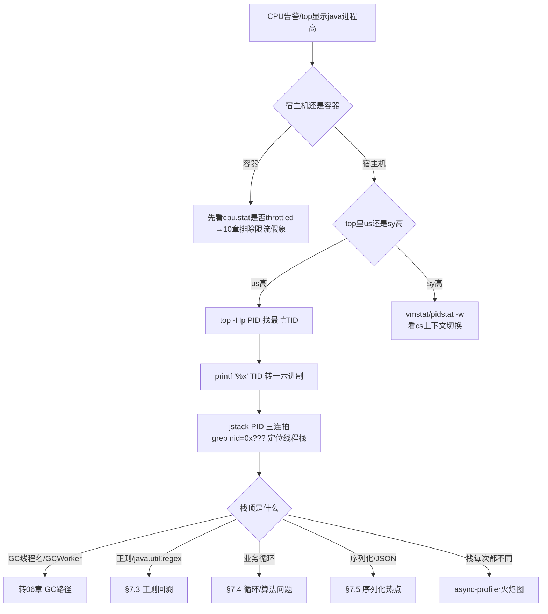
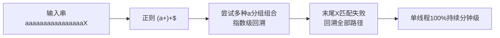

[⬅️ 上一章](06-gc-tuning.md) · [📖 返回目录](README.md) · [➡️ 下一章](08-thread-lock.md)
# 07 · CPU 飙高：定位四步法与高频根因

> **📌 30 秒速览**
> 1. 先分清 `us`（应用+GC）/`sy`（内核+锁自旋）/`wa`（IO 等待）：us 高走「top -Hp → printf 十六进制 → jstack 对号」标准链路；sy 高查上下文切换与系统调用。
> 2. jstack 单帧不可信——线程栈时刻在变，**三连拍（间隔 5s）对比**或直接 async-profiler 火焰图才有统计意义。
> 3. CPU 高但业务线程都 WAITING？大概率是 GC 线程在烧 CPU，转 GC 排查路径（06 章）。
> 4. 高频根因 Top4：正则灾难回溯、循环失控/死循环、序列化热点、GC 自身。容器里还要先排除 CPU throttle 假象（10 章）。

---

### 7.1 定位总流程



标准四步法命令（背下来）：

```bash
# ① 找到进程内最忙的线程
top -b -H -p $PID -n 1          # 记录 %CPU 最高的 TID（如 21781）
# ② TID 转十六进制
printf '%x\n' 21781              # 输出 5515
# ③ 线程 dump 里对号（连抓 3 次，间隔 5 秒）
for i in 1 2 3; do jstack $PID > /tmp/jstack-$i.txt; sleep 5; done
grep -A 30 'nid=0x5515' /tmp/jstack-*.txt
# ④ 一条龙替代方案(Arthas)
thread -n 3                      # 直接列出最忙 3 个线程及栈
```

读栈要点：`nid=0x…` 后面的十六进制就是 native 线程 id（即 top -Hp 的 TID）；栈顶前 5 行决定性质（`socketRead0`=等网络、`unsafe.park`=等锁/条件、正则/循环/编译=真在算）。

---

### 7.2 us 高：按栈顶分流

| 栈顶特征 | 病因 | 转向 |
|---------|------|------|
| `java.util.regex.Pattern$…match/matcher` | 正则灾难回溯 | §7.3 |
| 业务方法自身/明显循环调用链 | 死循环或算法复杂度爆炸 | §7.4 |
| `ObjectMapper.serialize`/JSON/XML 相关 | 大报文高频序列化 | §7.5 |
| `GCTaskThread`/`GC Thread#N`/`VM Thread` | GC 在烧 CPU | 06 章 |
| `C2 CompilerThread` 占满 | JIT 编译风暴（大量新类热编译） | 02 章 CodeCache |
| 每次 dump 栈都在变 | 热点分散/极短方法 | async-profiler（01 章 §1.8） |

---

### 7.3 正则灾难回溯：最高频的「一行代码打挂服务」

**原理**：NFA 引擎对 `a+` 这类贪婪量词做回溯试探，形如 `(a+)+$`、`(\w+\s?)*$` 的嵌套量词在「接近匹配但最终失败」的输入上产生指数级回溯路径——O(2^n)，一个 30 字符的恶意串就能烧满一个核数分钟。



**定位特征**：栈顶反复出现在 `java.util.regex` 包；CPU 只有个别线程 100%（每个卡死的请求占一个线程）；流量中混入特定格式的字符串后爆发。

**解决**：

| 层次 | 手段 |
|------|------|
| 根治 | 改写正则消除嵌套量词（`(a+)+`→`a+`）；能用 `String` 方法不用正则 |
| 防护 | 输入长度上限校验；对用户可控输入的正则白名单化 |
| 兜底 | 线程池隔离正则密集操作；超时熔断 |
| 升级 | JDK 不支持原子组/占有量词的完整语义时考虑 RE2J 等线性引擎 |

经典危险模式清单：`(a+)+`、`([a-zA-Z]+)*`、`(a|a)*`、`(.*a){20}`。写正则记住两条：嵌套量词是雷，交替分支里的重复量词也是雷。

---

### 7.4 死循环与算法复杂度爆炸

常见形态：

1. **显式死循环**：while 条件依赖外部状态未更新（如等标志位但没 volatile，读到旧值永不退出）；
2. **隐式死循环**：迭代器误用（在遍历中 add 导致一直追不上）、自旋 CAS 重试失败无限循环；
3. **复杂度爆炸**：数据量从千涨到百万后，O(n²) 的双重循环/嵌套查询从 10ms 变成小时级——代码没改，「数据改了行为」；
4. **递归无出口**：配合 StackOverflowError 或被 catch 后继续跑。

**定位**：三连拍栈完全相同 = 死循环实锤，栈顶即案发现场；三连拍栈不同但都集中在同一个类的不同行 = 复杂度爆炸（在正常干活，只是干不完）。后者用 async-profiler 火焰图确认宽火苗的具体函数，再评估数据量增长曲线。

**解决**：循环加边界与超时；共享可变状态用并发工具（CountDownLatch/CyclicBarrier）替代自旋；慢算法加缓存/索引/分批；给批量接口加最大处理量保护。

---

### 7.5 序列化与反射热点

特征：火焰图宽火苗落在 Jackson/Kotlinx/Fastjson/Gson 的序列化方法、或 `Class.newInstance`/`Method.invoke` 反射链。

高频场景：
- 网关/聚合层对大 JSON 反复序列化反序列化（同一份报文转换多次）；
- 日志框架对大对象做无谓 toString/JSON 化（日志序列化比业务还忙）；
- 反射高频调用未走 LambdaMetafactory/MethodHandle；
- 每次请求 new ObjectMapper（它创建开销大且应复用，线程安全）。

解决方向：减少转换次数（一次解析处处使用）、复用 Mapper、大对象日志脱敏摘要化、反射改 MethodHandle/LambdaMetafactory、必要时换高性能序列化（protobuf 类二进制）。

---

### 7.6 sy 高与上下文切换

`sy` 高说明内核在忙：系统调用密集、锁自旋（sync 汇编陷入内核）、上下文切换风暴。

```bash
vmstat 1                 # cs列:上下文切换次数;in列:中断
pidstat -w -p $PID 1     # 进程级 voluntary/nonvoluntary switches
mpstat -P ALL 1          # 各核%sys分布,判断是否单核被打爆
perf top -p $PID         # 内核符号占比(需权限)
```

Java 侧常见根因：
- **大量线程阻塞唤醒**：连接池/锁竞争激烈，park/unpark 频繁——表现为 cs 数十万/秒，jstack 见大量 WAITING/BLOCKED（转 08 章）；
- **io 密集小包读写**：未用缓冲流，每字节一次 syscall；
- **Netty/NIO epoll 空转 bug**：老版本 JDK 的 epoll 空轮询问题（select 一直立即返回），特征是单核 100% 且栈顶在 `EPollArrayWait.epollWait`——升级 JDK 或 Netty 的 SelectedSelectionKeySet 优化修复。

---

## 常见误区

| 误区 | 正确认知 |
|------|---------|
| load average 高 = CPU 问题 | Linux load 含 D 状态（IO 等待）线程，先看 us/sy/wa 分解再定性 |
| jstack 抓一帧就下结论 | 单帧是彩票；三连拍一致才可信，不一致上 profiler |
| RUNNABLE 就是在烧 CPU | socketRead0 等 native 等待也标 RUNNABLE，看栈顶定性 |
| CPU 高一定是代码慢 | GC 线程、JIT 编译线程、epoll 空转都不是「你的代码」 |
| 容器 CPU 打满=应用故障 | 可能是 cgroup quota 太低导致 throttling 假象（10 章）|
| 正则只在小输入上用就安全 | 回溯复杂度看内容形态不看长度直觉；20 字符恶意串即可打挂 |

---

## 面试题精选（含追问）

**Q1：线上一个 Java 进程 CPU 100%，说出你的完整排查步骤。（追问：如果是偶发的怎么抓？）**

答：①top 确认是 us 还是 sy；②top -H 找最忙 TID，printf 转 16 进制；③jstack 三连拍按 nid 对号，看栈顶定性：正则包→回溯，业务循环→死循环/复杂度，GC 线程→转 GC 路径，栈不定→async-profiler 火焰图采样 30 秒看平顶；④sy 高则 vmstat/pidstat 看上下文切换与中断，结合 jstack 的 BLOCKED 分布判断锁竞争。追问：偶发 CPU 尖刺抓不住现场——三层兜底：监控侧配置秒级采集 top -H 快照的告警联动脚本；常驻 JFR（default 档）事后回放 ExecutionSample；async-profiler 挂 `-e cpu -d 300` 定期循环采样落盘，出事后翻对应时间片。

**Q2：为什么嵌套量词的正则会指数回溯？举例并给出安全改法。（追问：JDK 有没有原生防护？）**

答：NFA 引擎遇到 `(a+)+` 会为「这串 a 怎么分组」枚举所有切分方式，匹配失败的输入让全部组合试完才放弃，路径数随 a 的个数呈 2^n。例：`"(a+)+$".matches("aaaaaaaaaaaaaaaaaaaaaaaaaaX")` 单线程可烧数分钟。安全改法：消除嵌套——本例直接 `a+$`；用占有量词 `a++` 或原子组 `(?>a+)` 阻止交还字符（JDK 支持 possessive quantifier 与 atomic group）；或换 RE2J 线性引擎处理用户可控输入。追问：JDK 没有全局回溯步数限制开关（不像 .NET 的 Timeout）；防护靠输入校验、超时隔离与代码评审清单，这也是为什么安全编码规范把正则 DoS（ReDoS）列为独立检查项。

**Q3：CPU 高但 jstack 里所有业务线程都 WAITING，可能是什么？（追问：怎么确认是 GC？）**

答：业务线程等待而 CPU 满，消耗者必然是 JVM 自身线程：GC 工作线程（并行回收/并发标记）、JIT 编译线程、VM Thread（偏向锁撤销等 VM 操作）。也可能是有线程在做 native 计算（JNI）不在 Java 栈体现。追问：三步确认 GC：①top -H 看 CPU 高的线程名是否带 GC/Compiler 字样；②jstat -gcutil 同步采样，若 YGC/FGC 计数狂跳即实锤；③GC 日志对齐时间戳。确认后转 GC 路径：通常是分配速率异常或内存即将耗尽引发的回收风暴，治内存而非治 CPU。

**Q4：什么是 JVM 的 epoll 空轮询 bug？现象和处理？（追问：为什么它只发生在部分机器上？）**

答：JDK NIO 的老 bug：内核事件丢失后 select/poll 立即返回 0 且无事件可处理，Selector 进入空转，单核 100%，栈顶 `EPollArrayWait.epollWait`，伴随 Selector 重建日志。Netty 曾提供 SelectedSelectionKeySet 规避与自动检测重建 Selector 的机制。处理：升级到修复版 JDK（8 高版本已修大部分）、Netty 开启 `-Dio.netty.noKeySetOptimization=false` 默认优化、极端情况监听 CPU 自动重建 Selector。追问：与内核版本、epoll 实现差异、网卡中断亲和性都相关，特定内核+特定负载（大量连接快速建立关闭）才触发，所以只在部分机器复现——这也是「测试环境好好的，线上某台机器抽风」的经典来源之一。

**Q5：火焰图怎么看？横轴纵轴各是什么？（追问：为什么颜色不重要？）**

答：横轴是采样占比（越宽该调用栈占用 CPU 时间越多），纵轴是调用栈深度（下面是被调上面是调用方，火焰向上生长）；找「平顶」——又宽又顶部平坦的火苗意味着大量样本停在同一个函数，即热点。颜色默认按包名哈希区分，无性能含义。追问：因为宽度才携带信息，颜色只是视觉分隔；如果按「热度着色」反而诱导按颜色下结论，所以主流实现刻意用无语义配色。分析口诀：先找最宽的山谷（入口），再找谷里的平顶（热点），最后对照源码判断是否可优化。

**Q6：上下文切换多少算异常？Java 服务怎么降低 cs？（追问：voluntary 和 nonvoluntary 的区别说明什么？）**

答：健康参考：空闲系统几百/秒，普通服务数千至数万/秒；单机数十万/秒基本可判定竞争异常。降低手段：减少线程数（池化合理配置）、缩小锁粒度或换无锁结构、避免频繁 park/unpark 的设计（如用队列批处理代替逐条唤醒）、绑核减少迁移。追问：voluntary 是主动让出（等锁/IO/sleep），多说明等待资源；nonvoluntary 是时间片用尽被内核抢占，多说明计算密集或多线程超额争抢 CPU——前者查锁与 IO，后者查 CPU 配额与线程数是否超过核数太多。

---

## 考点速查表

| 考点 | 一句话要点 |
|------|-----------|
| us/sy/wa 三分 | us 查应用与 GC；sy 查系统调用与锁自旋；wa 查 IO |
| 标准四步 | top -Hp → printf 十六进制 → jstack 对号 → 栈顶定性 |
| 三连拍原则 | 栈时刻在变，间隔 5s 三次一致才算实锤，否则上火焰图 |
| ReDoS | 嵌套量词指数回溯；possessive/原子组/RE2J 防御 |
| 死循环 vs 复杂度 | 三连拍同栈=死循环；异栈同类=数据量引爆 O(n²) |
| GC 假象 | 业务全 WAITING 而 CPU 满=JVM 自身线程，先查 jstat |
| epoll 空转 | 单核满+epollWait 栈顶+Selector 异常，升级 JDK/Netty |
| cs 异常阈值 | 数十万/秒必查；voluntary 查锁 IO，nonvoluntary 查配额 |
| 容器前提 | 先排除 cgroup throttling 再进应用排查（10 章） |

---

[⬅️ 上一章](06-gc-tuning.md) · [📖 返回目录](README.md) · [➡️ 下一章](08-thread-lock.md)
