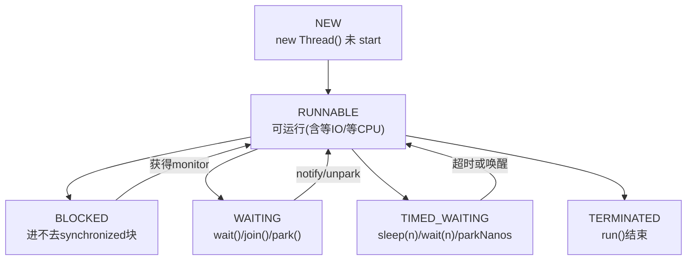
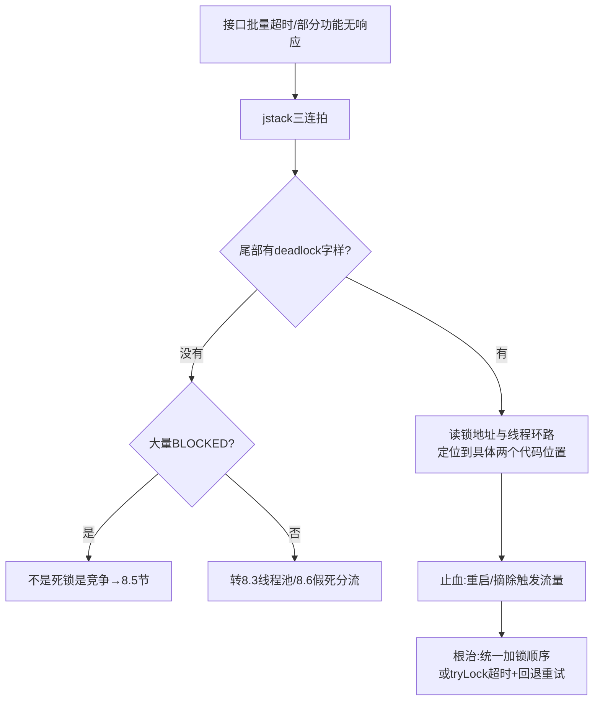
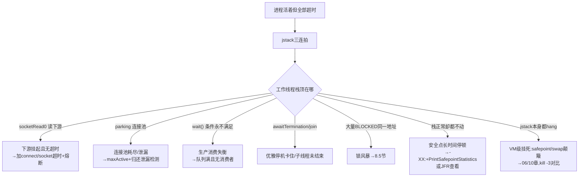

[⬅️ 上一章](07-cpu-hot.md) · [📖 返回目录](README.md) · [➡️ 下一章](09-classloading-metaspace.md)
# 08 · 线程与锁问题：死锁、线程池与假死全解

> **📌 30 秒速览**
> 1. 线程类问题的第一现场是**线程 dump 三连拍**（间隔 5 秒连抓 3 次）：单帧是照片，三连拍才是录像，看的是**状态演化**而不是快照。
> 2. Java 线程状态只有 6 种。`BLOCKED` 密集=锁竞争；`WAITING on condition`=等资源（连接池/队列/下游）；栈顶 `socketRead0` 却标 RUNNABLE=在等 IO，不是真在跑。
> 3. **死锁**：jstack 尾部会自动检测并打印 `Found one Java-level deadlock`（含 synchronized 与 ReentrantLock）；修复靠破坏四条件之一，最常用**全局锁排序**。
> 4. **线程池打满**三步查：看池参数 → 看队列是否有界 → 看 worker 线程栈顶卡在哪。`Executors.newFixedThreadPool` 的无界队列和 `newCachedThreadPool` 的无限线程是两大经典事故源。
> 5. **线程暴涨**：先按线程名统计分布找来源，再查 ulimit/内核上限/栈内存三道闸；`unable to create new native thread` 不是堆 OOM，别去加 `-Xmx`。
> 6. **服务假死**=进程活着、端口通着、就是不干活。本质几乎都是「所有工作线程被同一件事挂住」——按栈顶等待目标分流即可。

---

### 8.1 背景原理：线程状态机与锁的实现

**六种 JVM 线程状态**（`java.lang.Thread.State`，注意它不是操作系统线程状态）：



关键认知：**RUNNABLE ≠ 在烧 CPU**。JVM 层面只要线程「能跑」就是 RUNNABLE，底层卡在 `socketRead0`（等网络）、`epollWait`（等事件）时依然标 RUNNABLE。判断真实行为要看**栈顶帧**，这也是 07 章「栈顶定性」原则的由来。反过来，OS 层面的 `TASK_INTERRUPTIBLE`（等 IO 的睡眠态）在 jstack 里可能对应多种 Java 状态。

**锁的两套实现**：

| 维度 | synchronized（monitor） | ReentrantLock（AQS） |
|------|------------------------|---------------------|
| 实现 | JVM 内置，字节码 monitorenter/exit | Java 代码，AQS CLH 队列 + CAS + LockSupport.park |
| 状态表现 | BLOCKED（等 monitor entry） | WAITING（park，dump 里显示 `parking to wait for <AQS>`） |
| 高级能力 | 无 | 可中断、超时 `tryLock`、公平锁、多 Condition |
| 性能 | JDK6 后锁升级优化，差距极小 | 复杂场景略优且可控 |
| 死锁检测 | jstack 自动识别 | jstack 通过 `locked ownable synchronizers` 同样能识别 |
| 选型建议 | 默认首选，简单够用 | 需要超时/中断/公平性时才用 |

synchronized 的**锁升级路径**：无锁 → 偏向锁 → 轻量级锁（CAS 自旋）→ 重量级锁（OS mutex，线程真正阻塞）。注意：**偏向锁自 JDK 15 起默认禁用并废弃（JEP 374）**——维护成本高于收益，现代应用不要基于「偏向锁很快」做旧书知识答题。轻量级锁自旋失败前不会让线程休眠，这就是 `sy` 高时「锁自旋烧内核时间」的来源（呼应 07 章 §7.6）。

`Object.wait()` 与 `LockSupport.park()` 都会让出锁/等待唤醒，但 wait 必须持有 monitor 才能调用且释放锁，park 不需要任何前置条件（所以 AQS 能用它构建任意同步器）。

---

### 8.2 死锁：检测、定位与修复

**产生的四个必要条件**（同时成立才会死锁，破坏任何一个即可预防）：

1. **互斥**：资源一次只能一个线程占用；
2. **持有并等待**：拿着 A 去申请 B；
3. **不可剥夺**：不能强行抢走别人手里的锁；
4. **循环等待**：T1 持 A 等 B，T2 持 B 等 A，形成环。

**jstack 直接实锤**——dump 文件尾部：

```text
Found one Java-level deadlock:
=============================
"Thread-A":
  waiting to lock monitor 0x00007f... (object 0x000000076ab62208, a java.lang.Object),
  which is held by "Thread-B"
"Thread-B":
  waiting to lock monitor 0x00007f... (object 0x000000076ab621f8, a java.lang.Object),
  which is held by "Thread-A"

Java stack information for the threads listed above:
...
```

看到这段就不用再猜了：两把锁地址 + 两条线程名已经把环路写明白，对照业务代码改加锁顺序即可。**ReentrantLock 死锁同样能检出**：jstack 会列出各线程 `locked ownable synchronizers`（AQS 对象），据此还原环路。但注意 jstack 只能检测「卡住的互等」，**活锁、饥饿、无限重试检测不了**。

**定位流程**：



**修复三板斧**（按优先级）：

| 手段 | 做法 | 适用 |
|------|------|------|
| 全局锁排序 | 所有代码路径按同一顺序获取多把锁（如按对象 hashCode/id 升序） | 多把锁交互的代码，治本 |
| tryLock 超时 | `lock.tryLock(1, SECONDS)` 拿不到就释放已有锁并退避重试 | 无法理清锁序的遗留代码 |
| 缩小锁范围 | 一个方法只拿一把锁，跨锁操作改为不可变数据传递 | 架构层面消灭「持锁再要锁」 |

数据库层的死锁（MySQL `Deadlock found when trying to get lock`）是另一套机制（行锁 + innodb_wait/lock_timeout 自动回滚一方），定位靠 `SHOW ENGINE INNODB STATUS` 的 LATEST DETECTED DEADLOCK 段，思路同源：也是「事务内按固定顺序访问行」。两类死锁经常并发出现——应用锁内嵌数据库事务时尤其危险。

---

### 8.3 线程池打满：队列堆积与拒绝策略

**ThreadPoolExecutor 任务投递规则**（面试高频，也是事故根源）：来任务先填 core 线程 → core 满了进**队列** → 队列满了才扩到 max 线程 → max 也满了执行**拒绝策略**。推论：**用了无界队列，max 和拒绝策略永远轮不到执行**——堆积只会无限增长直到 OOM 或响应退化成分钟级。

**症状识别**：接口整体变慢但 GC/CPU 正常；`queue.size()` 监控持续上涨；dump 里池 worker 线程全部 WAITING/RUNNABLE 卡在同一类调用上。

**定位分流**——抓 dump，看池线程栈顶在干什么：

| worker 线程栈顶特征 | 含义 | 转向 |
|--------------------|------|------|
| `socketRead0`（HTTP/DB client 内） | 下游变慢拖住所有任务 | 治下游：超时+熔断+隔离 |
| `parking to wait for` 连接池对象 | 连接池比线程池小，借不到连接 | §8.6 连接池配置 |
| 业务正常计算逻辑 | 流量涨了/任务变重，池真的不够 | 加线程或加节点 |
| `LinkedBlockingQueue.take` 而 active=0 | 消费者停了（如 shutdown 后又提交） | 查生命周期管理 |

**四大内置拒绝策略选型**：

| 策略 | 行为 | 坑 |
|------|------|-----|
| AbortPolicy（默认） | 抛 `RejectedExecutionException` | 上层没接住就是 500，但至少快速失败可见 |
| CallerRunsPolicy | 提交者自己执行 | 天然限流背压；**Web 容器场景是大坑**——Tomcat 工作线程亲自下场跑慢任务，整个容器吞吐塌方 |
| DiscardPolicy | 静默丢弃 | 出问题无感知，生产基本禁用 |
| DiscardOldestPolicy | 丢队首最老任务再重试 | 会丢「最早但可能是最重要」的任务 |

**工程实践要点**：

1. **手动 new ThreadPoolExecutor**，不用 `Executors` 快捷工厂：`newFixedThreadPool`/`newSingleThreadExecutor` 用的是 `LinkedBlockingQueue(Integer.MAX_VALUE)` 无界队列，`newCachedThreadPool` 的 max 是 `Integer.MAX_VALUE`——阿里 Java 规范明令禁止的原因；
2. 有界队列长度 ≈ 「可接受的秒级延迟 × 吞吐」，给监控留出告警窗口，而不是越大越好；
3. 运行时可调：`setCorePoolSize`/`setMaximumPoolSize` 即时生效（配合配置中心做动态线程池，如美团 DynamicTp 思路）；
4. 监控三指标必埋点：活跃线程数 `getActiveCount()`、队列深度 `getQueue().size()`、累计完成任务 `getCompletedTaskCount()`，Micrometer 有现成 `ExecutorServiceMetrics`；
5. 快速现场工具：Arthas `thread --state BLOCKED`、`thread -b`（直接找出死锁元凶）、`thread -n 3`（最忙线程）。

---

### 8.4 线程暴涨：从统计到根因

**先量化再定性**：

```bash
# JVM 视角线程数
jstack $PID | grep '^"' | wc -l
# OS 视角原生线程数（两者应接近，差值大说明 dump 不完整）
ls /proc/$PID/task | wc -l
# 按线程名前缀统计分布——暴涨来源一眼可见
jstack $PID | grep '^"' | sed 's/^"\(.*\)".*/\1/' \
  | sed 's/[0-9]\+$//' | sort | uniq -c | sort -rn | head -20
```

**按分布对号入座**：

| 分布特征 | 根因 | 处理 |
|---------|------|------|
| `pool-N-thread-M` 几千个 | 每次 new 一个池用完不关（最常见：在循环/请求里 `Executors.newXxx()`） | 改为单例池；排查代码中所有 Executors 调用点 |
| `Timer-N` 大量 | 每个 new Timer() 起一个线程且 Timer 单线程易堆积 | 换 ScheduledExecutorService |
| 同名业务线程重复 | 自建 ThreadFactory 无编号或库 bug 反复创建 | 加编号+监控告警 |
| `NioProcessor`/`xNIO-N` 类 | Netty/XNIO 配置错（每请求建 worker） | 核对框架线程模型 |
| 总数不高但仍 OOM | 不是数量问题，是栈内存总量大 | 见下「三道闸」 |

**`unable to create new native thread` 的三道闸**（报错时逐道检查）：

1. **JVM 层**：`-XX:MaxJavaStackTraceDepth`/栈内存——每个线程默认 1MB 栈（`-Xss`），1000 线程 ≈ 1GB 非堆内存。降 `-Xss256k~512k` 是治标扩容手段；
2. **OS 层**：`ulimit -u`（max user processes）、`/etc/security/limits.conf`；容器里还要看 pids cgroup 上限（`cat /sys/fs/cgroup/pids/pids.max`）；
3. **物理层**：`vm.max_map_count`（每线程约占 2 个 memory map）与真实内存余量。

> 关键认知：这个 OOM 与堆大小无关，**加 `-Xmx` 反而挤占 native 内存让它更容易触发**。正确方向是「查谁创建了不该有的线程」+ 必要时调小 `-Xss`/放宽 ulimit。

**预防**：线程创建全部收口到统一池管理（如 Spring 的 `ThreadPoolTaskExecutor` bean）；上线前 code review 强制检查 `new Thread(`/`Executors.new` 出现位置；监控埋线程总数告警（如 >800 报警）。

---

### 8.5 锁竞争热点：BLOCKED 风暴

死锁是「全停」，锁竞争是「变慢」——后者在生产远更常见。**症状**：CPU 不高但吞吐上不去；dump 里十几条线程 BLOCKED 在同一个锁地址上；`pidstat -w` 的 cs 异常升高（07 章 §7.6）。

**定位**：三连拍后统计 BLOCKED 目标：

```bash
# 统计所有 BLOCKED 线程正在等待的锁地址
grep -A1 'java.lang.Thread.State: BLOCKED' jstack-*.txt \
  | grep 'waiting to lock' | awk '{print $5}' | sort | uniq -c | sort -rn
# 再反查持有者：哪个线程 locked 了该地址
grep -B5 '<0x000000076ab62208>' jstack-*.txt | grep -E '^"|locked'
```

**常见热点根因与解法**（按优先级）：

| 根因 | 典型场景 | 解法 |
|------|---------|------|
| 锁内做慢操作（IO/RPC/大计算） | synchronized 块里调下游接口 | 缩小临界区：只保护共享变量读写，IO 移出锁外 |
| 单例全局锁 | 全局一个对象锁挡住所有请求 | 分段锁（ConcurrentHashMap 思路）/按 key 哈希多把锁 |
| 数据结构选型 | `Collections.synchronizedXxx` / Vector / Hashtable | 换 ConcurrentHashMap、CopyOnWriteArrayList |
| 读多写少还互斥 | 读写共用一把锁 | StampedLock / ReentrantReadWriteLock |
| 计数器也上锁 | `synchronized` 统计计数 | AtomicLong / LongAdder（高并发写首选） |

**原理补充**：为什么竞争会让 CPU 也异常——重量级 monitor 阻塞涉及线程挂起/唤醒（futex 陷入内核），轻量级阶段自旋烧 CPU，两种都推高上下文切换。所以「锁问题」可能以 CPU 问题（07 章 sy 高）或 RT 问题（本章）两种面孔出现，jstack 一抓便知。

---

### 8.6 服务假死：进程活着但不干活

**定义**：端口在监听、健康检查可能还通（TCP 探活层面），但业务请求全部超时或无响应。**本质**：几乎所有工作线程被同一件事永久挂住。假死是最考验「读栈」功力的场景。



**高频案例模式**：

1. **无超时的 HTTP 客户端**：下游服务 hang 住，本服务连接池（如 200 个连接）被逐个借走挂在 `socketRead0` 上，几分钟内全军覆没——**所有外呼必须显式设 connectTimeout + socketTimeout**，这是生产铁律；
2. **连接池配置倒挂**：线程池 100 线程共享连接池 maxActive=10，高峰期 90 个线程 park 等连接。比例原则：连接池 ≈ 并发线程数的同量级或明确背压设计；
3. **连接泄漏**：借了不还（异常路径漏 finally close），慢慢耗干。开启泄漏检测（HikariCP `leakDetectionThreshold`、Druid `removeAbandoned`）+ 监控 active/idle 曲线；
4. **优雅停机卡死**：shutdown 后 awaitTermination 无限等非守护线程——给 awaitTermination 加时限，超时 shutdownNow；
5. **Class 初始化死锁**：静态初始化块互相引用形成类加载层面的死锁，jstack 显示两线程 BLOCKED 在 `<clinit>`（`class init` 状态标记）。少见但极隐蔽，解法同样是打破循环引用。

**止血通用套路**：摘流量 → 抓现场（黄金五分钟清单，00 章）→ 重启恢复。根治必须回到「为什么所有线程能被同时挂住」——答案几乎总是「缺超时或缺隔离」。

---

## 常见误区

| 误区 | 正确认知 |
|------|---------|
| RUNNABLE 就是在执行代码 | 等 IO/epoll 也标 RUNNABLE，看栈顶帧定性（07 章同源原则） |
| WAITING 就是闲着没事 | 业务线程 WAITING on condition 多半是「资源没等到」，正是事故本体 |
| 死锁只能靠人工肉眼找 | jstack 尾部自动检测 synchronized 与 ReentrantLock 互等环路 |
| 线程越多吞吐越高 | 超过核数×(1+等待比) 后上下文切换吃掉收益；IO 密集用异步化而不是堆线程 |
| CallerRunsPolicy 万金油 | Web 容器里等于让 Tomcat 线程亲自跑任务，会拖垮整个容器 |
| unable to create thread 加 Xmx | 方向反了：加大堆挤占 native 内存更易触发；应查线程来源与 -Xss/ulimit |
| 队列设得越大越保险 | 大队列只是延迟暴露故障，RT 先劣化、内存后爆炸；有界+合理拒绝才是正道 |
| jstack 抓一帧就能定案 | 三连拍看演化：一次是快照，三次是录像 |

---

## 面试题精选（含追问）

**Q1：线上服务突然大面积接口超时，你怎么用线程 dump 定位？（追问：怎么判断是不是死锁？）**

答：先保现场：连抓 3 次 jstack（间隔 5s）+ top -Hp + jstat 排除 GC。然后三步读 dump：①看文件尾部有没有 `Found one Java-level deadlock`，有则直接读环路修复；②统计线程状态分布，BLOCKED 集中在同一锁地址→锁竞争热点，WAITING 集中在连接池→资源耗尽；③看池 worker 线程栈顶：socketRead0=下游拖挂，业务方法=流量真涨了。追问：jstack 自动检测两类死锁——monitor（synchronized）与 ownable synchronizers（ReentrantLock/AQS）；但注意它检不出活锁、饥饿和数据库行锁死锁，后者要看 `SHOW ENGINE INNODB STATUS`。

**Q2：ThreadPoolExecutor 的执行顺序是什么？为什么阿里规范禁止使用 Executors 创建线程池？（追问：corePoolSize=0 时任务一定进队列吗？）**

答：core → 队列 → max → 拒绝策略四步：来任务先起 core 线程；core 满了排队；队列满才扩到 max；max 满执行拒绝策略。禁令原因：newFixedThreadPool/newSingleThreadExecutor 用无界 LinkedBlockingQueue，堆积可致 OOM 且 max/拒绝策略形同虚设；newCachedThreadPool 最大 Integer.MAX_VALUE 可能创建海量线程。所以手动 new 并显式给出有界队列+命名 ThreadFactory+合适拒绝策略。追问：不一定——提交任务时若工作线程数为 0，会先创建一个线程直接执行（prestartAllCoreThreads 或首个任务路径），只有 core 都忙才入队；另外队列 offer 成功与否取决于队列类型，SynchronousQueue 零容量会让流程直达 max。

**Q3：synchronized 和 ReentrantLock 怎么选？说下锁升级过程。（追问：偏向锁为什么被废弃？）**

答：默认 synchronized（简单、JIT 协同优化好、不用操心 unlock）；需要 tryLock 超时、可中断获取、公平性、多 Condition 时用 ReentrantLock。锁升级：无锁→偏向锁（单线程重入只比对 ThreadID）→轻量级锁（CAS 自旋）→重量级锁（OS mutex 阻塞），升级不可逆。追问：偏向锁的撤销需要等全局安全点且批量撤销逻辑复杂，在现代高并发应用里收益为负，维护成本高于性能收益，故 JEP 374 在 JDK 15 默认禁用并标记废弃（JDK 18 相关代码进一步清理）——答题时不要再用「开偏向锁提速」的旧结论。

**Q4：什么是线程饥饿？和死锁、活锁的区别？（追问：线程池里怎么发生饥饿？）**

答：死锁=双方持锁互等，永久停止；活锁=线程不停让步重试但没有进展（像两人走廊互相让路），CPU 在烧但无进展；饥饿=低优先级/ unlucky 线程长期拿不到资源但系统整体还在动。追问：经典形态是「池中任务又向同一个池提交子任务并等待结果」——父任务占满所有 worker，子任务永远排不上队（thread starvation deadlock）。解法：父子任务拆到不同池，或改用 CompletableFuture 组合/composition 而不是池内嵌套 get。

**Q5：服务假死了，jstack 能抓但看不出明显 BLOCKED，还有哪些可能？（追问：安全点是什么？怎么确认？）**

答：按栈顶分流：①大量 socketRead0 无超时挂下游（最常见）；②连接池 park 耗尽；③都在 `Object.wait()` 等永不到来的 notify；④安全点长时间停顿——所有线程其实停在 safepoint 等 VM 操作完成，dump 里线程状态「看起来正常」；⑤jstack 能抓说明 JVM 还活着但 VM 层可能半挂死（G1 巨型对象回收/swap 颠簸）。追问：安全点是所有线程都到达「栈一致状态」的停顿点，GC、偏向锁撤销、deoptimization 都需要；确认手段：`-Xlog:safepoint`（JDK9+）或 JFR 的 Safepoint Begin/End 事件，看哪类操作（如 RevokeBias/Cleanup）耗时；时间很长就转 GC 章（06）排查。

**Q6：如何设计一个生产级线程池？（追问：动态调整怎么实现？）**

答：五要素：①手动 ThreadPoolExecutor，有界队列（长度=可接受秒级延迟×吞吐）；②拒绝策略按业务语义选（核心链路 Abort 快速失败+上层兜底，可容忍丢失的 DiscardOldest 要谨慎）；③命名 ThreadFactory 利于 dump 分析；④埋点活跃数/队列深度/完成数接入 Micrometer；⑤参数放配置中心支持热更。追问：setCorePoolSize/setMaximumPoolSize 运行时即时生效（扩容会预热线程，缩容多余空闲线程逐步退出）；开源实现如美团的 DynamicTp、 Hippo4j 都是这个思路的产品化；配合压测确定基线，避免拍脑袋。

**Q7：一个接口偶发 30 秒超时，其余正常，怎么查？（追问：如果日志显示连接池 acquire 等待超时呢？）**

答：长尾问题优先怀疑「个别请求撞上独占资源」：①Arthas trace 该接口各子调用耗时，锁定慢在哪一段；②若慢在 DB/Redis，查对应连接池监控（active 是否顶格、等待队列）；③抓 dump 看 WAITING 线程 park 在哪个池对象上；④核对是否有定时任务周期性占用连接/锁（毛刺时间点对齐 crontab）。追问：acquire timeout 说明连接池供不应求——三种可能：池太小、慢 SQL 占用时间长、连接泄漏慢性损耗。对症：扩池只是缓解，重点是压 SQL 耗时 + 开 leak detection 找泄漏点；同时把 acquire timeout 从无限改为有限值，快速失败保护上游。

---

## 考点速查表

| 考点 | 一句话要点 |
|------|-----------|
| 三连拍原则 | jstack 间隔 5s 连抓 3 次，看状态演化而非单帧 |
| 六种状态 | NEW/RUNNABLE/BLOCKED/WAITING/TIMED_WAITING/TERMINATED；RUNNABLE≠在跑，看栈顶 |
| 死锁四条件 | 互斥/持有等待/不可剥夺/循环等待；破坏其一即预防，常用全局锁排序 |
| jstack 检测能力 | 自动检出 monitor 与 ReentrantLock 互等；检不出活锁/饥饿/DB 死锁 |
| TPE 四步投递 | core→队列→max→拒绝策略；无界队列使后两步失效 |
| Executors 禁令 | Fixed 用无界队列、Cached 无限线程；手动 new + 有界 + 命名工厂 |
| 拒绝策略坑 | CallerRuns 让容器线程下场跑任务；Discard 静默丢；Abort 至少可见 |
| 线程暴涨 | 先 uniq -c 统计名字分布找源头；OOM native thread 别加 Xmx，查 -Xss/ulimit/pids cgroup |
| 锁竞争热点 | grep waiting to lock 统计目标地址；缩小临界区/分段锁/LongAdder |
| 假死本质 | 所有工作线程被同一事件挂住；socketRead0 无超时与连接池耗尽占大头 |
| 外呼铁律 | 所有远程调用显式 connect+read 超时；连接池配 leak detection |
| 安全点停顿 | 线程「看似正常」实则全体停在 safepoint；-Xlog:safepoint/JFR 确认 |

---

[⬅️ 上一章](07-cpu-hot.md) · [📖 返回目录](README.md) · [➡️ 下一章](09-classloading-metaspace.md)
