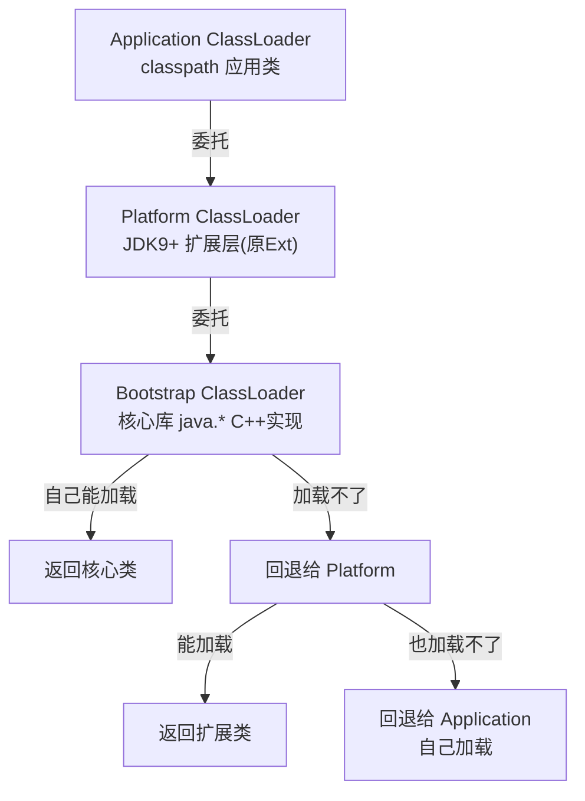
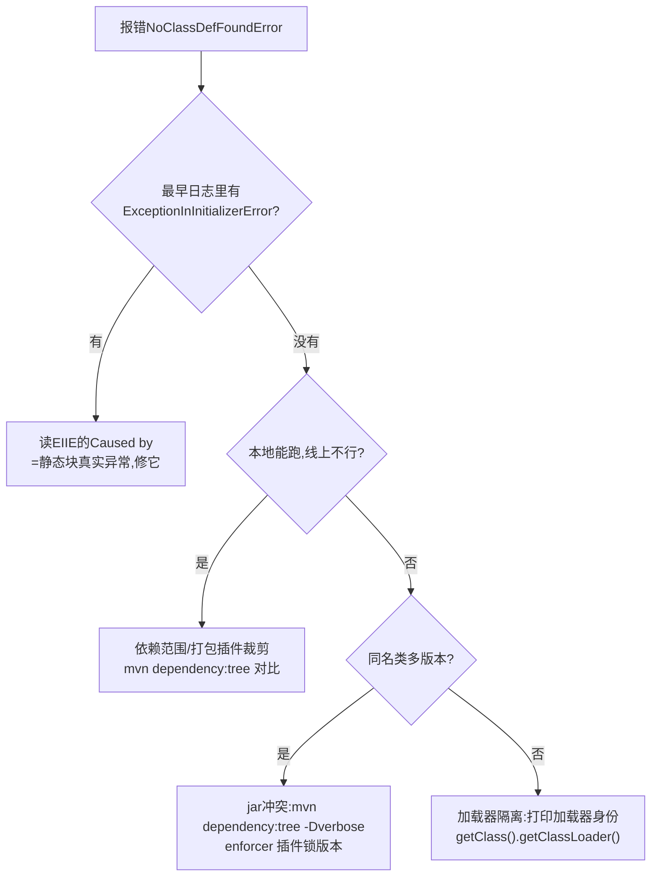

[⬅️ 上一章](08-thread-lock.md) · [📖 返回目录](README.md) · [➡️ 下一章](10-offheap-container.md)
# 09 · 类加载与元空间：从双亲委派到 ClassLoader 泄漏

> **📌 30 秒速览**
> 1. 类生命周期五阶段：**加载→验证→准备→解析→初始化**。运行期类相关问题几乎都出在「加载」（找不到/冲突）和「初始化」（静态块抛异常）两步。
> 2. **双亲委派**是防混乱的层级过滤：子加载器先问父辈，父辈管不了才自己来。破坏它的合法场景只有三类：SPI（线程上下文加载器）、容器隔离（Tomcat）、热替换。
> 3. **Metaspace（JDK8+ 取代 PermGen，JEP 122）默认无上限**，但会被动态类生成悄悄吃光：Groovy 脚本、CGLIB 代理、失控反射是三大来源。
> 4. `ClassNotFoundException`=「压根没找到字节码」；`NoClassDefFoundError`=「编译时有、运行时没了」或「**初始化失败被缓存**」。后者最阴险：第一次抛 `ExceptionInInitializerError`，之后全部 NCDFE。
> 5. 类加载器泄漏的本质：**Class 对象被其加载器钉住，加载器又被某个全局引用钉住**——一个没关的线程、一条缓存、一个 JDBC 驱动都能让整个 webapp 无法卸载。
> 6. 排查三板斧：`-Xlog:class+load`（谁加载了什么）、`jcmd GC.class_stats`（类统计）、MAT「重复类 + ClassLoader 引用链」（泄漏实锤）。

---

### 9.1 背景原理：类加载体系

**三层加载器与委派模型**：



**为什么要双亲委派**：①安全——用户自定义 `java.lang.String` 永远轮不到自己加载，防止核心 API 被篡改；②唯一性——同一个类只被加载一次，全 JVM 共享一份 `Class` 对象。「相同类」的判定是 **加载器实例 + 全限定名** 二元组：同一个类被两个加载器各加载一次，互不兼容，赋值直接 `ClassCastException`。

**打破委派的三个合法理由**：

| 场景 | 打破方式 | 代表 |
|------|---------|------|
| SPI 服务发现 | 核心库反过来用 `Thread.currentThread().getContextClassLoader()` 加载实现类 | JDBC DriverManager 加载 mysql-connector |
| 容器应用隔离 | 子加载器先自己加载（child-first），每个 webapp 一个独立加载器 | Tomcat WebappClassLoader |
| 热替换 | 新建加载器重新加载同名类，旧的丢弃 | JRebel、脚本引擎 |

Tomcat 的 WebappClassLoader 是「混合模式」：JRE 核心类走委派（先父后己），webapp 自己的类 child-first 先自己找——既隔离了不同应用的同名依赖版本，又保证核心库唯一。

**类的卸载条件**（三者同时满足）：该类所有实例已回收；加载它的 ClassLoader 已回收；对应 Class 对象没有被引用。这就是为什么**类加载器泄漏必然伴随元空间上涨**——加载器活着，它加载的上万个 Class 全都活着。

---

### 9.2 Metaspace：从 PermGen 到元空间

JDK 8 移除永久代（JEP 122），类元数据移入 native 内存。关键差异与水位认知：

| 维度 | PermGen（≤JDK7） | Metaspace（≥JDK8） |
|------|------------------|--------------------|
| 位置 | 堆内连续区域 | native 内存（堆外） |
| 上限 | `-XX:MaxPermSize` 默认很小易炸 | 默认**无上限**（仅受进程内存约束） |
| 回收时机 | Full GC 时 | Full GC / 达到 `MetaspaceSize` 阈值触发回收 |
| 字符串常量池 | 在 PermGen 里 | 已在 JDK7 移入堆（别再用旧结论答题） |
| 相关参数 | PermSize/MaxPermSize（已废弃） | `MetaspaceSize`（首次触发阈值）、`MaxMetaspaceSize`、`CompressedClassSpaceSize` |

**两个容易误解的点**：

1. `MetaspaceSize` 不是初始大小，而是**首次触发元空间回收的水位线**（类似 GC 触发阈值）；默认约 20.8M 就开始回收，频繁触发会拖慢启动；
2. 使用压缩指针时类元数据放在 Compressed Class Space（默认上限 1GB），`java.lang.OutOfMemoryError: Compressed class space` 是独立于 Metaspace OOM 的另一种死法——大量类时两个都要盯。

监控命令：

```bash
jstat -gcmetacapacity $PID          # MC/MU 列看容量与使用
jcmd $PID GC.heap_info              # 输出含 metaspace 与 class space 两行
jcmd $PID GC.class_stats            # 需 -XX:+UnlockDiagnosticVMOptions,按字段统计类开销
jcmd $PID VM.class_hierarchy        # 类继承树+每类加载器
jcmd $PID GC.class_loader_stats     # 各加载器:已加载类数/元空间占用(最直观)
```

---

### 9.3 类加载器泄漏与元空间膨胀

**典型症状**：热部署/长驻进程元空间缓慢上涨，FGC 后不回落；最终 `Metaspace` 或 `Compressed class space` OOM。普通应用不热部署也可能中招——只要运行期动态生成类。

**三大类生成来源**：

| 来源 | 机制 | 防控 |
|------|------|------|
| Groovy/Jython/JS 脚本引擎 | 每次编译脚本都生成新 Class + 新加载器 | 脚本缓存编译结果；限制执行次数；定期重建引擎实例 |
| CGLIB/ByteBuddy 动态代理 | 每个代理类都是真 Class；key 含 ClassLoader 组合 | 复用 Enhancer 配置；注意以业务对象为 key 的缓存别把代理类越积越多 |
| 反射膨胀 | 同一方法反射调用超阈值（默认 15 次）后 JDK 生成 BytecodeAccessor | 正常行为；失控场景是海量不同 Method 各自膨胀，用 MethodHandle 替代 |

**MAT 定位泄漏四步**：

1. dump 后打开 Histogram 按 `java.lang.Class` 聚合，或直接用 **Duplicate Classes** 查询——同一个类出现几百次=被反复加载；
2. 打开 **Class Loader Explorer**：按加载器分组看各类加载了几个类、占多少元空间；
3. 对可疑 ClassLoader 做 **Path to GC Roots**（exclude weak/soft references）：找到钉住它的那个强引用——常见是未停止的线程（ThreadLocal）、静态 Map 缓存、JDBC DriverManager 注册表；
4. 修复后验证：连续 FGC 两次元空间应明显回落，否则还有别的引用链。

**经典泄漏源清单**：

- 线程池没 shutdown：线程活着→ThreadLocal/上下文类加载器活着→webapp 加载器卸不掉；
- JDBC 驱动注册：`DriverManager` 是 Bootstrap 加载的，驱动对象反向引用 webapp 加载器（容器环境需 deregister 或依赖容器清理）；
- `shutDownHook`/`ThreadLocal.set` 未 remove；
- LogFactory / SPI 缓存持有旧加载器实例；
- 缓存 key 用了带 ClassLoader 的对象（如代理类本身）。

---

### 9.4 CNFE 与 NCDFE：一对最易混淆的异常

| 异常 | 全名 | 触发方式 | 典型根因 |
|------|------|---------|---------|
| ClassNotFoundException | 受检异常 | `Class.forName`/`ClassLoader.loadClass` 显式找不到字节码 | 依赖缺失/classpath 不对/加载器隔离（如 SPI 在错误的加载器里找实现） |
| NoClassDefFoundError | Error | JVM 隐式解析时（new/访问静态成员）找不到**已编译进代码**的类 | 运行时缺 jar、版本冲突被裁剪；或下述「初始化失败缓存」 |
| ExceptionInInitializerError | Error | 静态初始化块/静态字段抛异常 | NCDFE 的前奏：第一次失败后该类被标记为失败状态 |

**「第二次全变 NoClassDefFoundError」机制**（高频考点）：JVM 保证每个类只初始化一次，**失败的初始化也会被记住**。第一次访问抛 `ExceptionInInitializerError`（含原始堆栈），之后所有访问直接抛 `NCDFE`（往往只有一行，无根因信息）。所以看到成片 NCDFE 时必须翻最早的日志找 EIIE——`Caused by` 才是真相。



排查工具：

```bash
# 谁在什么时候从哪里加载了某个类(启动参数加)
-Xlog:class+load=info            # JDK9+; JDK8 用 -verbose:class
-Xlog:class+load=info:file=/tmp/cl.log   # 落盘分析

# 确认线上到底有没有这个类
jcmd $PID GC.class_stats | grep com.foo.Bar
```

> 实战提示：`ClassCastException: A cannot be cast to A` 这种「自己转自己失败」就是双加载器的铁证——两个 A 的定义相同但来自不同加载器。打印两侧 `getClassLoader()` 立刻水落石出。

---

### 9.5 常见误区

| 误区 | 正确认知 |
|------|---------|
| Metaspace 无上限就不用管 | 只是默认不限；吃的是进程 native 内存，会挤压堆外空间并触发系统 OOM Killer |
| NCDFE 就是缺 jar | 初始化失败被缓存同样表现为 NCDFE，先查最早的 EIIE |
| 字符串常量池在永久代/元空间 | JDK7 起已移入堆； PermGen 相关旧结论全部过时 |
| 双亲委派绝对不可破坏 | SPI/容器隔离/热替换是标准打破场景，关键是知道谁在什么层打破 |
| 类加载慢无所谓 | 大量 JAR 扫描(SPI/注解扫描)拖慢启动；启动期可用 `-Xlog:class+load` 分析耗时热点 |
| 重复类无害 | 同名类多版本=行为取决于加载顺序的「薛定谔依赖」，是线上偶现 bug 之源 |

---

### 9.6 面试题精选（含追问）

**Q1：什么是双亲委派？为什么需要它？（追问：哪些场景破坏了它？为什么可以破坏？）**

答：子加载器收到加载请求先上抛父级，父级无法完成才自己加载。意义：核心类唯一且安全——自定义 java.lang.String 到不了自己的加载逻辑，避免核心 API 被替换；同时保证同一类全局只有一份 Class。追问：三个标准破坏点：①SPI——Bootstrap 无法加载 classpath 实现，通过线程上下文类加载器反向委托（JDBC）；②Tomcat child-first 实现应用隔离；③热替换每次新建加载器。可破坏的前提是理解「委派只是默认策略」，JVM 只校验类的命名空间一致性而不强制委派路径。

**Q2：Metaspace 和 PermGen 区别？（追问：Metaspace 会溢出吗？怎么防？）**

答：JDK8 起 PermGen 移除（JEP 122），元数据入 native 内存；上限从 MaxPermSize 变为默认无界；字符串常量池早在 JDK7 已入堆。追问：会——MaxMetaspaceSize 未设时受制于进程地址空间与物理内存，最终系统级 OOM；动态类生成（Groovy/CGLIB/反射 accessor）持续增长时必然触顶。防护：设 MaxMetaspaceSize 强制提前暴露问题、监控 jstat MC/MU 斜率、MAT 查重复类与加载器引用链。

**Q3：ClassNotFoundException 与 NoClassDefFoundError 区别？（追问：为什么修复了静态块异常之后还偶发 NCDFE？）**

答：CNFE 是显式加载找不到字节的受检异常；NCDFE 是隐式解析时类缺失的 Error——常见于运行时缺包或多版本裁剪。追问：因为类初始化失败会被缓存：首次抛 EIIE 并把类标记失败，后续所有使用直接 NCDFE 且不带原因。若只修了部分实例（比如仅某台机器的环境变量问题），其他机器仍会在首次访问时失败再进入缓存态，看起来就像「修了还犯」；彻底修复要保证静态初始化幂等且不依赖不稳定外部状态。

**Q4：如何定位一个类到底被哪个 ClassLoader 加载？（追问：生产环境没有重启窗口怎么办？）**

答：开发期直接 `obj.getClass().getClassLoader()` 打印；启动期开 `-Xlog:class+load` 看「来源 jar + 加载器」。追问：不停机方案：Arthas `sc -d com.foo.Bar` 直接输出类加载器链与来源 URL；`classloader` 命令列出全部加载器树；配合 `jad` 反编译确认运行中的实际版本。这套组合拳对排查「多版本 jar 冲突」「类被谁加载」几乎零成本。

**Q5：一个跑了两年的老系统突然频繁 Full GC 且元空间涨满，你怎么下手？（追问：如果 MAT 显示几千个重复类呢？）**

答：三步：①确认涨幅曲线——持续涨不回落即泄漏而非配置不足；②dump 后看 Class Loader Explorer 哪个加载器类数暴涨；③对该加载器做 GC Roots 引用链找钉住它的对象（常见：未关闭线程池/ThreadLocal/JDBC 注册）。追问：几千个重复类说明同名类被反复加载——基本锁定脚本引擎或动态代理在批量生成。顺着 Duplicate Classes 的类名前缀定位到具体框架（Groovy 脚本名/CGLIB 的 $$EnhancerBySpringCGILIB 标识），然后治源头：脚本结果缓存、代理配置复用，而不是盲目调大 MaxMetaspaceSize 掩盖问题。

---

### 9.7 考点速查表

| 考点 | 一句话要点 |
|------|-----------|
| 类生命周期 | 加载→验证→准备→解析→初始化；问题集中在加载与初始化两步 |
| 双亲委派 | 子问父父不知再自载；安全+唯一；SPI/容器/热替换三类合法破坏 |
| 相同类判定 | ClassLoader 实例 + 全限定名；跨加载器赋值 CCE |
| Metaspace 要点 | JDK8 取代 PermGen(JEP122)；MetaspaceSize=回收水位非初始值；CompressedClassSpace 单独有上限 |
| NCDFE 双面性 | 缺 jar 或初始化失败缓存；先翻最早日志找 EIIE 的 Caused by |
| 泄漏本质 | Class 钉住 Loader，Loader 被线程/缓存/SPI 钉住；MAT 引用链定位 |
| 动态类三源 | Groovy 脚本、CGLIB 代理、反射 accessor 膨胀 |
| 排查三板斧 | -Xlog:class+load / jcmd GC.class_loader_stats / MAT Duplicate Classes |

---

[⬅️ 上一章](08-thread-lock.md) · [📖 返回目录](README.md) · [➡️ 下一章](10-offheap-container.md)
