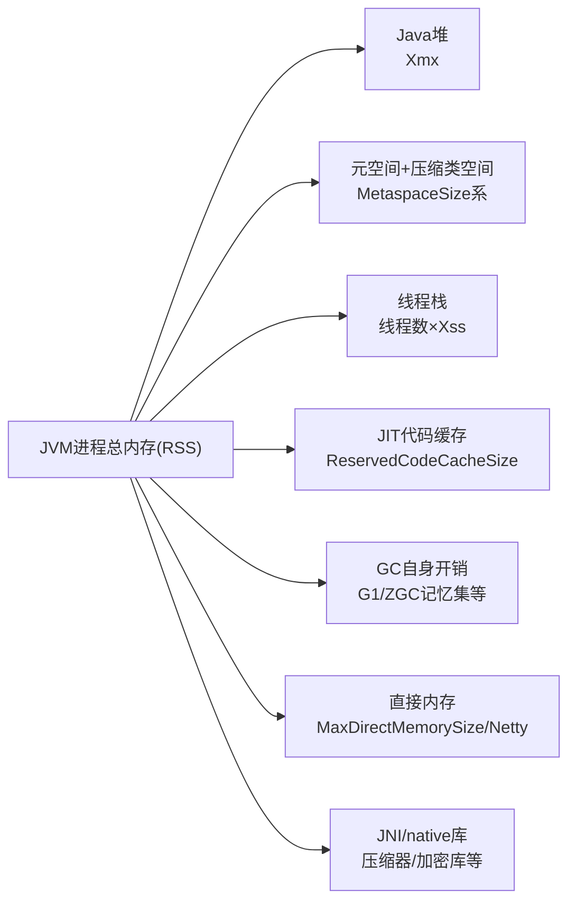
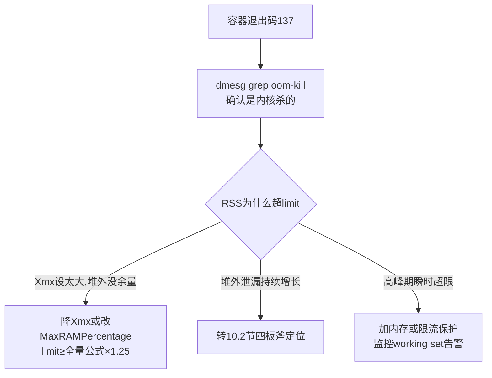

[⬅️ 上一章](09-classloading-metaspace.md) · [📖 返回目录](README.md) · [➡️ 下一章](11-production-cases.md)
# 10 · 堆外内存与容器环境：DirectBuffer、Netty 与 K8s

> **📌 30 秒速览**
> 1. 堆外问题三症状：**RSS 远大于 Xmx**、`Direct buffer memory` OOM、容器里被 OOMKilled(137)——共同点是「堆看着健康，进程却死了」。
> 2. 进程内存 = **堆 + 元空间 + 线程栈 + CodeCache + GC 开销 + DirectBuffer/Netty 堆外 + JNI**。设 `-Xmx=容器 limit` 必死，堆外全家桶没留位置。
> 3. 定位堆外泄漏的顺序：NMT 看大盘 → pmap 看地址空间 → NativeMemoryTracking detail 分账 → Netty 泄漏检测开关抓真凶。
> 4. 容器 CPU 问题先看 `cpu.stat` 的 `nr_throttled`——**throttling 造成 RT 毛刺是「应用没病但被限流」的头号假象**。
> 5. JDK ≥8u191 才完整感知 cgroup；容器内推荐 `-XX:MaxRAMPercentage` 而不是写死 `-Xmx`。

---

### 10.1 背景：Java 进程的内存全景



**关键结论**：`-Xmx` 只管第一块。生产估算 RSS 上限时用经验公式：

```text
RSS ≈ Xmx + MaxMetaspaceSize(默认无界!) + 线程数×Xss
      + ReservedCodeCacheSize(默认240M~512M) + DirectBuffer上限
      + Netty池化内存 + GC工作集 + ~200MB杂项
```

K8s 里给容器的 memory limit 至少要 = 上式总和 × 1.25 余量，否则流量高峰随时被内核 OOM Killer 收割。

---

### 10.2 堆外泄漏定位四板斧

**第一步：确认是不是真的堆外问题**

```bash
# 对比:堆使用 vs 进程RSS
jcmd $PID GC.heap_info            # 堆水位正常甚至很低
ps -o rss= -p $PID                # RSS 却远大于 Xmx+合理杂项
# 持续观察增长斜率:每分钟采样一次,涨不停=泄漏,平稳=配置不足或一次性开销
while true; do ps -o rss=,etime= -p $PID; sleep 60; done | tee rss-growth.log
```

**第二步：NMT 大盘分账**（需启动参数 `-XX:NativeMemoryTracking=summary`，性能损耗 <1%）

```bash
jcmd $PID VM.native_memory summary
# 关键看这几行与历史基线对比:
#   Internal / Other (DirectBuffer 计入这里)
#   Class (元空间)
#   Thread (栈)
#   Code (JIT)
# diff 模式看增量:jcmd PID VM.native_memory baseline 后过段时间再 diff
```

> 注意：NMT **看不到** JNI 库 malloc 的内存和部分 Netty 直接内存（它们绕过 JVM 记账），NMT 干净而 RSS 涨 = 嫌疑转向 native 库或 Netty。

**第三步：pmap 地址空间画像**

```bash
pmap -x $PID | sort -k3 -rn | head -20   # 按 RSS 排序找大块匿名内存
# 64MB 一档的大块 anon 是 glibc malloc arena 的典型特征
# 多线程程序 arena 数暴涨导致虚拟内存巨大:export MALLOC_ARENA_MAX=2 或换 jemalloc
```

**第四步：按嫌疑对象收网**

| 嫌疑 | 特征 | 抓捕手段 |
|------|------|---------|
| DirectBuffer 泄漏 | NMT Internal/Other 增长；`Bits.reserveMemory` 相关栈 | MAT dump 查 `java.nio.DirectByteBuffer` 实例总量与保留对象 |
| Netty ByteBuf 泄漏 | Netty 应用；PooledByteBufAllocator | `-Dio.netty.leakDetection.level=paranoid`(采样全开,仅排障期) 日志出现 LEAK 记录即实锤 |
| glibc arena 碎片 | pmap 大量 64MB 匿名块；线程多 | MALLOC_ARENA_MAX=2 或 LD_PRELOAD=jemalloc/tcmalloc |
| JNI 库泄漏 | NMT 不动但 RSS 涨 | pmap 对比 + `perf top -g` 看 native 分配热点 |

---

### 10.3 容器内存：OOMKilled 与感知参数

**退出码 137 的完整链路**：容器 RSS 超过 cgroup memory limit → 内核 OOM Killer 选中该进程 → SIGKILL → `docker inspect` 显示 `OOMKilled: true`，K8s Events 里出现 `Reason: OOMKilled`。**JVM 收不到任何机会打日志**——这是和 Java OOM 最本质的区别。



**容器感知演进**（版本事实，面试常考）：

| JDK 版本 | 感知能力 |
|---------|---------|
| ≤8u131 | 完全不感知 cgroup，按宿主机 CPU/内存自适配 → 经典事故源 |
| 8u191+（Backport of JDK10 JEP 298 系修复） | 完整感知 cpu/memory limit，UseContainerSupport 默认开启 |
| JDK 10+ | JEP 298 原生支持；`Runtime.availableProcessors()` 返回 cgroup 配额 |

所以「容器里 JVM 把宿主机 128 核当自己的核数」只发生在老版本——GC 线程数、ForkJoinPool.commonPool 并行度全部按核数膨胀，小 limit 容器直接被拖死。升级到 8u191+ 是治本，`-XX:ActiveProcessorCount=n` 是应急手动指定。

**推荐参数基线**：

```bash
# 容器内不写死 Xmx,用百分比(默认25%太保守)
-XX:MaxRAMPercentage=75.0        # 堆占 limit 的 75%
-XX:InitialRAMPercentage=75.0
-XX:MaxMetaspaceSize=256m        # 元空间必须封顶!默认无界是隐患
-XX:MaxDirectMemorySize=512m     # 显式限制直接内存
-Xss512k                          # 高线程数服务降栈
# 验证:
jcmd 1 VM.flags | grep -o 'MaxHeapSize=[^ ]*'
```

> 为什么是 75% 不是 90%：剩余 25% 要容纳元空间 + 栈 + CodeCache + DirectBuffer + GC 开销。堆吃满 limit 的场景下，一次 Metaspace 扩容就足以触发 OOMKill。

---

### 10.4 容器 CPU：throttling 假象

**现象**：RT 毛刺、压测吞吐上不去，但应用日志干净、GC 正常、CPU 使用率看着还「不高」。**根因**：CFS 配额机制——limit=2 核时每 100ms 周期只允许消耗 200ms CPU 时间，多线程瞬间用光配额后**全体线程被冻结到下个周期**。

```bash
cat /sys/fs/cgroup/cpu.stat      # cgroup v1; v2 在 /sys/fs/cgroup/<path>/cpu.stat
# nr_periods   :总周期数
# nr_throttled :被限流的周期数  ←关键指标
# throttled_time/nr_throttled :平均每次被冻结多久
```

**判读标准**：`nr_throttled/nr_periods > 10%` 且业务毛刺时间点吻合 = throttling 实锤。Prometheus 里对应 `container_cpu_cfs_throttled_periods_total` 指标，务必加告警。

**解决选项**（按代价排序）：

1. **调大 CPU limit** 或干脆去掉 limit 只留 request（BestEffort/Burstable 有争议但很多团队实践如此）；
2. **降低突发并行度**：减少容器内线程数（Tomcat maxThreads、池大小），让配额平滑消耗；
3. **cpu.cfs_period 调优**：100ms 默认周期对低延迟服务太粗，缩短 period 可减小单次冻结时长（需改节点配置，谨慎）；
4. **JDK 侧配合**：`-XX:+UseContainerCpuShares`(旧版) / 确保 ActiveProcessorCount 与实际配额一致，避免 JIT/GC 线程过多抢业务线程配额。

---

### 10.5 Netty 堆外内存专项

Netty 是堆外问题最大来源，单独展开。**PooledByteBufAllocator** 默认开启，内存走 `PlatformDependent.usedDirectMemory()` 记账（受 `-Dio.netty.maxDirectMemory` 控制，0 表示跟随 JVM Bits 记账）。

**泄漏检测分级**：

```bash
-Dio.netty.leakDetection.level=simple    # 默认:采样约1%的Buf
-Dio.netty.leakDetection.level=advanced  # 采样+访问点堆栈
-Dio.netty.leakDetection.level=paranoid  # 全量检测,仅排障期用,性能损耗大
```

日志出现 `LEAK: ByteBuf.release() was not called before it's garbage-collected` 即有 Buf 忘了 release。**常见泄漏姿势**：①自定义 Handler 异常路径没在 finally 里 release；②`ctx.writeAndFlush(retainedDuplicate())` 后误以为自动释放；③把 Buf 存进集合/异步回调后无人负责释放；④pipeline 断链导致 TailContext 兜底逻辑没走到。

**无 dump 定位法**（线上首选）：

```bash
# Netty 自带指标:jcmd 看不到,用代码埋点或 Arthas
watch io.netty.util.internal.PlatformDependent usedDirectMemory -n 1
# 观察增长斜率;配合 leakDetection=paranoid 跑一段时间,LEAK 日志会给出
# 最近一次访问的堆栈(RECENT 记录),直接指向忘 release 的业务代码行
```

**堆外 vs 堆内 Buf 选择**：堆外省一次 socket 写出前的拷贝，但生命周期管理更危险。原则：**谁分配谁负责释放，跨线程传递用 `retain()/release()` 配对或 touch() 标记**；不确定时用 `ReferenceCountUtil.releaseLater()` 兜底（仅测试期）。

---

### 10.6 常见误区

| 误区 | 正确认知 |
|------|---------|
| Xmx 设为容器 limit 的 100% | 堆外全家桶没空间，必 OOMKill；堆 ≤limit 的 75% |
| NMT 能看到所有 native 内存 | JNI malloc 和部分 Netty 内存绕过记账；NMT 干净≠真干净 |
| RSS 大就是泄漏 | glibc arena/一次性映射也撑大 RSS；先看斜率再定性 |
| 老 JDK 在容器里没问题 | ≤8u131 不感知 cgroup，GC 线程按宿主机核数膨胀；至少升 8u191+ |
| CPU 用率不高就没瓶颈 | CFS quota 下 throttling 时使用率反而不饱和；看 nr_throttled |
| Netty LEAK 日志可以忽略 | 每条都是真实的释放遗漏；量大后直接演化为 DirectMemory OOM |

---

### 10.7 面试题精选（含追问）

**Q1：容器里的 Java 服务频繁被杀（退出码137），排查思路？（追问：怎么预防而不是事后救火？）**

答：137=SIGKILL，先 `dmesg | grep -i oom` 与 K8s events 确认 OOMKilled 而非人为 kill。然后算账：对比 limit 与进程 RSS 构成——jcmd VM.native_memory 分账（堆/元空间/栈/CodeCache/Direct），缺 NMT 就用 pmap 画像。三种结局：Xmx 占比过大→降到 MaxRAMPercentage=75；堆外泄漏→四板斧定位（NMT/pmap/Netty检测/MAT）；峰值瞬时超限→扩 limit 或限流。追问：预防三件套：①MaxMetaspaceSize/MaxDirectMemorySize 全部显式封顶，消灭「默认无界」；②working set 监控告警设在 limit 的 80%；③压测覆盖峰值流量并验证 RSS 平台期，上线前就知道真实水位。

**Q2：Direct memory OOM 的原理？-XX:MaxDirectMemorySize 到底限制了什么？（追问：System.gc() 和它有什么关系？）**

答：DirectByteBuffer 分配时向 `Bits.reserveMemory` 申请额度，超过 MaxDirectMemorySize 时先主动 `System.gc()` 尝试回收已废弃的 Buffer（仅 Reference 清理），仍不够则抛 `OutOfMemoryError: Direct buffer memory`。它只限制 java.nio 的 Bits 记账通道；Netty 有自己的计数（io.netty.maxDirectMemory），JNI 库完全不在此列。追问：正因分配失败会触发 System.gc()，禁用 `-XX:+DisableExplicitGC` 后这个兜底失效，DirectBuffer 回收只能等 RMI/其他路径的 GC，堆外更容易先炸——这就是「加了 DisableExplicitGC 反而堆外 OOM」经典事故的机理；正确做法是 `-XX:+ExplicitGCInvokesConcurrent` 让显式 GC 走并发回收。

**Q3：什么是 CPU throttling？为什么 CPU 使用率 60% 还会有性能问题？（追问：怎么一劳永逸解决？）**

答：cgroup CFS 对容器限速：period（默认100ms）内累计运行时间不得超过 quota=limit×period。突发多线程瞬间耗尽 quota，其余时间整组线程被 throttle 冻结——表现为 RT 毛刺而平均使用率不高。确认看 cpu.stat 的 nr_throttled/nr_periods 比例与毛刺时间对齐。追问：「一劳永逸」分两层：资源层调大 limit 或去 limit 留 request；应用层控制容器内并行度（线程池、连接数与配额匹配）。没有银弹——quota 本质是可用资源上限，任何方案都是在「资源够不够」和「突发削峰」之间做工程取舍。

**Q4：Netty 的 ByteBuf 为什么要有引用计数？和 JVM GC 什么关系？（追问：leak detection 原理是什么？）**

答：ByteBuf 是堆外内存的直接包装，GC 只管 Java 对象壳，native 内存在对象不可达后要等 Cleaner/PhantomReference 兜底才释放——延迟不可控且依赖 GC 时机。引用计数把释放时机交给代码显式控制：retain()+1，release()-1 归零即归还内存池，确定性高、复用率高。追问：leak detection 利用弱引用：Buf 创建时生成 PhantomReference 挂入追踪集，GC 回收后检查 refCnt 是否已归零——未归零说明「对象都没了还没释放」，报告 RECENT/ADVANCED 等级的访问记录堆栈帮定位遗漏点；paranoid 级全量追踪故开销大，仅排障开。

**Q5：如何估算一个 Java 微服务的容器内存规格？（追问：给出参数模板。）**

答：五步：①确定堆：MaxRAMPercentage=75%×目标limit；②累加固定项：Metaspace(封顶256m)+CodeCache(240m)+线程栈(线程数×512k)+DirectBuffer(封顶)；③预留 GC 工作集与碎片 ~15%；④压测验证 RSS 平台期不超过 limit×85%，留告警缓冲；⑤写进部署模板并加 working set 告警。追问模板：`-XX:MaxRAMPercentage=75 -XX:MaxMetaspaceSize=256m -XX:MaxDirectMemorySize=512m -Xss512k -XX:+UseG1GC`，limit=预期峰值RSS×1.25，同时确保 JDK ≥8u191。

---

### 10.8 考点速查表

| 考点 | 一句话要点 |
|------|-----------|
| 进程内存构成 | 堆+元空间+栈+CodeCache+GC开销+DirectBuffer+JNI；Xmx 只管第一项 |
| RSS 公式 | ≈Xmx+Meta+线程数×Xss+CodeCache+Direct+~200M 杂项；limit 再 ×1.25 |
| 137 处理链 | dmesg 确认 OOM Killer → 算账分摊 → 封顶无界项 → 泄漏另查 |
| 容器感知分界 | ≤8u131 不感知；8u191+/JDK10(JEP298) 完整感知；ActiveProcessorCount 应急 |
| MaxRAMPercentage | 容器首选而非写死 Xmx；75% 给堆外留活路 |
| NMT 边界 | summary/detail 分账，baseline/diff 看增量；看不到 JNI 与部分 Netty |
| pmap 特征 | 64MB 匿名块=glibc arena；MALLOC_ARENA_MAX=2 或 jemalloc |
| throttling 判据 | nr_throttled/nr_periods>10% 且毛刺吻合；使用率不高也会卡 |
| Netty 泄漏检测 | simple 默认 1% 采样；paranoid 全量排障；LEAK 日志即实锤 |
| DisableExplicitGC 坑 | 禁了显式 GC 后 DirectBuffer 分配失败的 System.gc() 兜底失效 |

---

[⬅️ 上一章](09-classloading-metaspace.md) · [📖 返回目录](README.md) · [➡️ 下一章](11-production-cases.md)
