# Java 生产问题排查手册

> **定位**：面向生产环境的 Java 问题排查与解决方案手册。以 JVM 相关问题为主（内存、GC、CPU、线程、类加载、堆外/容器），按「**症状 → 定位 → 原理 → 解决**」四段式组织，既可当**应急快查手册**（线上出事时直接翻），也可当**体系化教程**（平时系统学）。
>
> **适用人群**：1 年以上 Java 后端工程师；对 JVM 有基本概念（堆/栈/GC 名词），但遇到线上问题不知道从哪下手，或知道工具却讲不清原理的工程师。

---

## 这本手册解决什么问题

生产问题的排查知识通常散落在博客、源码注释和一次次的故障复盘中，不成体系。本手册把它整理成三层：

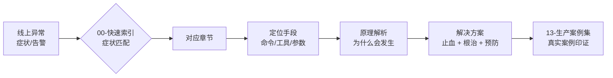

每个问题域一章，每章统一结构：

| 结构段 | 内容 | 什么时候看 |
|--------|------|-----------|
| **📌 30 秒速览** | 本章核心结论速览 | 复习 / 快速回忆 |
| **背景原理** | 该问题域的底层机制 | 想搞懂"为什么" |
| **症状识别** | 典型表现、监控特征、误判排除 | 判断是不是这个问题 |
| **定位手段** | 具体命令、工具用法、输出怎么读 | 现场操作 |
| **解决方案** | 止血方案 → 根治方案 → 预防措施 | 落地修复 |
| **常见误区** | 高频踩坑点 | 避免二次事故 |
| **考点速查表** | 全章知识点一句话浓缩 | 最后过一遍 |

---

## 使用说明：三种模式

| 模式 | 场景 | 怎么用 |
|------|------|--------|
| **应急快查** | 线上正在出问题 | 直接打开 [00-快速索引](00-quick-index.md)，按症状找行 → 跳转对应章节「定位手段」 |
| **系统学习** | 平时提升 / 面试准备 | 按 [学习路线图](#学习路线图) 从 01 顺序读到 12，每章做一遍速查表 |
| **查漏补缺** | 只想补某个专题 | 目录表直达对应章节，先读「📌 30 秒速览」再决定是否细读 |

---

## 完整目录

| 文件 | 内容 | 关键词 |
|------|------|--------|
| [00-快速索引](00-quick-index.md) | 症状→原因→命令→章节 的总路由表，手册入口 | OOM/CPU/FGC/卡死 对照 |
| [01-排查方法论与工具箱](01-methodology-toolbox.md) | 排查四步法、止血优先原则、jcmd/jstat/jmap/jstack/JFR、Arthas、MAT、async-profiler 工具矩阵 | 工具选型 |
| [02-JVM运行时内存区域](02-memory-regions.md) | 堆/栈/元空间/代码缓存/直接内存布局，对象分配路径，内存水位怎么看 | 内存模型 |
| [03-OOM场景全景](03-oom-scenarios.md) | 8 种 OOM 的报错原文、根因分类、定位命令、解决方案对照 | heap space/metaspace/thread/direct buffer |
| [04-内存泄漏](04-memory-leak.md) | 泄漏 vs 正常缓存、经典泄漏模式 Top10、MAT 支配树实操、泄漏判定标准 | MAT/dominator tree |
| [05-GC基础与收集器演进](05-gc-fundamentals.md) | 分代假说、三色标记、安全点、CMS→G1→ZGC/Shenandoah 演进与选型 | 三色标记/写屏障 |
| [06-GC问题定位与调优](06-gc-tuning.md) | YGC 频繁/FGC 频繁/长停顿三大问题的定位流程、G1/ZGC 调优参数实战、GC 日志解读 | GC日志/停顿毛刺 |
| [07-CPU飙高](07-cpu-hot.md) | us/sy/wa 区分、top -Hp+printf 十六进制转换法、火焰图、正则回溯等高频根因 | top/arthas profiler |
| [08-线程与锁问题](08-thread-lock.md) | 死锁四条件与检测、线程池打满/拒绝策略、线程暴涨、服务假死 | jstack/死锁/线程池 |
| [09-类加载与元空间](09-classloading-metaspace.md) | 双亲委派、类加载器泄漏、动态类生成膨胀、NCDFE/CNFE 区分 | ClassLoader/元空间 |
| [10-堆外内存与容器环境](10-offheap-container.md) | DirectBuffer/Netty 堆外泄漏定位、K8s 内存 limit 与 OOMKilled(137)、CPU throttling、容器感知参数 | Netty/OOMKilled/throttle |
| [11-生产案例集](11-production-cases.md) | 15+ 个真实案例：症状→排查过程→根因→修复，含复盘要点 | 真实案例 |
| [12-JVM参数速查](12-jvm-flags.md) | 常用/易错参数表、容器推荐基线、各 JDK 版本默认值变化、危险参数黑名单 | 参数基线 |
| [13-附录·资料与版本事实](13-appendix-references.md) | JDK 版本时间线、GC 演进大事记（联网核实）、参考资料索引 | 版本事实 |

> 合并版单文件：[Java生产问题排查手册-完整版.md](Java生产问题排查手册-完整版.md)（全部章节按序合并，适合本地 Typora/VS Code 阅读）。

---

## 学习路线图

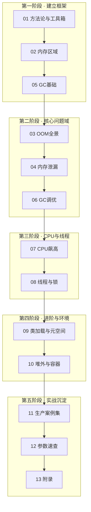

**最小应急技能集**（如果只学一天）：`01 章`的四步法 + `00 章`快速索引 + `07 章`的 top -Hp 法 + `08 章`的 jstack 死锁分析 —— 覆盖约 70% 的线上突发场景。

---

## 生产状态表

| 文件 | 行数 | 状态 |
|------|------|------|
| README.md | 116 | ✅ 完成 |
| 00-quick-index.md | 192 | ✅ 完成（含 5 张决策流程图） |
| 01-methodology-toolbox.md | 303 | ✅ 完成 |
| 02-memory-regions.md | 223 | ✅ 完成 |
| 03-oom-scenarios.md | 278 | ✅ 完成 |
| 04-memory-leak.md | 170 | ✅ 完成 |
| 05-gc-fundamentals.md | 220 | ✅ 完成 |
| 06-gc-tuning.md | 237 | ✅ 完成 |
| 07-cpu-hot.md | 188 | ✅ 完成 |
| 08-thread-lock.md | 291 | ✅ 完成（状态机/死锁/线程池/暴涨/锁竞争/假死） |
| 09-classloading-metaspace.md | 186 | ✅ 完成（双亲委派/Metaspace/泄漏/CNFE-NCDFE） |
| 10-offheap-container.md | 222 | ✅ 完成（NMT/OOMKilled/throttling/Netty） |
| 11-production-cases.md | 172 | ✅ 完成（10 个真实案例复盘+方法论） |
| 12-jvm-flags.md | 151 | ✅ 完成（参数表/容器基线/黑名单/版本变化） |
| 13-appendix-references.md | 77 | ✅ 完成（联网核实版本事实+来源索引） |
| 合并版完整文件 | 3080 | ✅ 已生成 |

全库合计约 **3000+ 行**、**36 张 mermaid 图**，全部章节按统一结构交付。

---

## 维护约定

- 内容以 **JDK 8 / 11 / 17 / 21** 为主基线（生产主流 LTS），新特性标注适用版本起始。
- 所有版本号、JEP 编号、工具版本均经联网核实（2026-08），核实记录见 `13-附录`。
- 案例来自公开技术社区（美团技术团队、阿里云开发者社区、HeapDump 社区等），均已注明出处。

---

# 00 · 快速索引：症状 → 定位 → 解决 路由表

> **本章定位**：整本手册的入口。线上出问题时，从这里按症状找到「第一反应动作」和对应章节。
>
> **📌 30 秒速览**
> 1. 先止血再查根因：能重启的先重启/摘流量，保住现场（堆 dump + GC 日志 + 线程 dump）再动。
> 2. 症状只有五大类：**内存类（OOM/上涨）、GC 类（停顿/频繁）、CPU 类、线程类（卡死/打满）、环境类（容器）**——先归类，再进章节。
> 3. 80% 的突发问题用四条命令起步：`jcmd <pid> VM.uptime`（确认进程状态）→ `top -Hp`（CPU 归属）→ `jstat -gcutil`（GC 压力）→ `jstack`（线程现场）。
> 4. 所有 dump/日志先落盘再分析：`jmap -dump` 会触发一次 Full GC，大堆慎用，优先 `jcmd GC.heap_dump` 或 JFR。

---

## 使用方法

1. 在下面「症状总路由表」里找到最像的一行；
2. 点开对应章节，直接跳到该章的「定位手段」一节照着做；
3. 拿不准就先跑「黄金五分钟」采集包（见文末），把现场保住。

---

## 症状总路由表

### A. 内存类

| # | 症状 | 高概率原因 | 第一反应命令 | 详见 |
|---|------|-----------|-------------|------|
| A1 | 报错 `OutOfMemoryError: Java heap space` | 大对象查询/无界缓存/泄漏 | `-XX:+HeapDumpOnOutOfMemoryError` 的 dump + MAT | [03 §3.1](03-oom-scenarios.md) |
| A2 | 报错 `OutOfMemoryError: Metaspace` / `Metadata GC Threshold` | 动态类生成失控（Groovy/CGLIB/反射） | `jcmd GC.class_stats` / MAT 查 ClassLoader 数量 | [03 §3.2](03-oom-scenarios.md)、[09](09-classloading-metaspace.md) |
| A3 | 报错 `unable to create new native thread` | 线程数暴涨（递归创建/线程池误用） | `jstack` + `ls /proc/<pid>/task \| wc -l` | [03 §3.5](03-oom-scenarios.md)、[08 §8.4](08-thread-lock.md) |
| A4 | 报错 `Direct buffer memory` | Netty/NIO 堆外泄漏或超限 | `pmap` 对比增长 + Netty 泄漏检测开关 | [03 §3.6](03-oom-scenarios.md)、[10 §10.2](10-offheap-container.md) |
| A5 | 报错 `GC overhead limit exceeded` | 堆快满且 GC 空转（98% 时间回收<2%） | 按 A1 处理（本质是堆 OOM 前兆） | [03 §3.7](03-oom-scenarios.md) |
| A6 | 内存缓慢上涨、重启后复发，暂未 OOM | 缓存无淘汰策略 / 泄漏 / 元空间涨 | 隔天对比两份 dump（MAT 对比直方图） | [04](04-memory-leak.md) |
| A7 | RSS 远大于 Xmx（容器里被 kill） | 堆外+元空间+线程栈超出容器 limit | `NMT summary` + 容器 memory limit 核对 | [10 §10.2-10.3](10-offheap-container.md) |
| A8 | 进程突然消失、退出码 137 | K8s/Linux OOM Killer 杀进程 | `dmesg \| grep -i oom` + 容器 events | [10 §10.3](10-offheap-container.md) |

### B. GC 类

| # | 症状 | 高概率原因 | 第一反应命令 | 详见 |
|---|------|-----------|-------------|------|
| B1 | YGC 频繁（每秒多次） | Eden 太小 / 短命对象分配速率过高 | `jstat -gcutil <pid> 1000` 看 YGC 频率与晋升量 | [06 §6.2](06-gc-tuning.md) |
| B2 | FGC 频繁但老年代回收不掉 | 内存泄漏 / 元空间触顶 / `System.gc()` | `jstat -gcutil` + dump 分析 + 查调用来源 | [06 §6.3](06-gc-tuning.md) |
| B3 | 单次 GC 停顿几百 ms～秒级 | 大堆 Full GC / G1 Humongous / 跨代引用扫描 | 开 GC 日志看停顿构成（`-Xlog:gc*`） | [06 §6.4](06-gc-tuning.md) |
| B4 | 服务周期性毛刺（如每 30 分钟一次） | 定时任务大对象 / 缓存批量过期 / swap | GC 日志时间点对齐业务日志 | [06 §6.4](06-gc-tuning.md)、[11 §11.8](11-production-cases.md) |
| B5 | `Allocation Failure` 占满日志 | Eden 分配过快 | 加大新生代或排查分配热点（JFR Allocation profiling） | [06 §6.2](06-gc-tuning.md) |
| B6 | G1 出现 `to-space exhausted` / Full GC | 混合回收跟不上 / 大对象泛滥 | 看 humongous 区块占比，调 G1HeapRegionSize | [06 §6.5](06-gc-tuning.md) |

### C. CPU 类

| # | 症状 | 高概率原因 | 第一反应命令 | 详见 |
|---|------|-----------|-------------|------|
| C1 | `us` 高（用户态 90%+） | 业务死循环 / 正则回溯 / 序列化热点 / GC 线程 | `top -Hp <pid>` 找线程 → `printf '%x'` → jstack 对号 | [07 §7.2](07-cpu-hot.md) |
| C2 | `sy` 高（内核态高） | 频繁系统调用/锁竞争/上下文切换 | `vmstat`/`pidstat -w` 看上下文切换次数 | [07 §7.6](07-cpu-hot.md) |
| C3 | CPU 高但 jstack 里业务线程都 WAITING | GC 线程在烧 CPU（并发标记/Full GC） | `jstat -gcutil` 看是否在疯狂 GC | [07 §7.4](07-cpu-hot.md) |
| C4 | 容器内 CPU 打满但限流不均 / RT 毛刺 | cgroup CPU throttling | `/sys/fs/cgroup/cpu.stat` 看 nr_throttled | [10 §10.4](10-offheap-container.md) |
| C5 | 压测时 CPU 上不去、吞吐上不去 | 锁竞争 / 线程池太小 / IO 阻塞 | jstack 多次采样看 BLOCKED 分布 | [08 §8.5](08-thread-lock.md) |

### D. 线程与响应类

| # | 症状 | 高概率原因 | 第一反应命令 | 详见 |
|---|------|-----------|-------------|------|
| D1 | 接口全部超时、进程还在（假死） | 死锁 / 线程池队列堆积 / 下游阻塞 | `jstack` 连抓 3 次（间隔 5s）对比线程状态 | [08 §8.2/§8.6](08-thread-lock.md) |
| D2 | jstack 直接显示 "Found one Java-level deadlock" | 死锁（锁顺序不一致等） | 按 dump 里提示的两条线程链路改加锁顺序 | [08 §8.2](08-thread-lock.md) |
| D3 | 线程池打满、队列无限增长 | 任务耗时突增 / 线程池参数不合理 / 无界队列 | dump 看 pool 线程都在执行什么 | [08 §8.3](08-thread-lock.md)、[11 §11.4](11-production-cases.md) |
| D4 | 大量线程 BLOCKED on 同一把锁 | 慢 SQL/慢下游持锁时间长 | dump 统计 blocked 目标锁地址 | [08 §8.5](08-thread-lock.md)、[11 §11.3](11-production-cases.md) |
| D5 | 线程数持续上涨到几千 | 未复用的线程池 / Timer 滥用 / 库 bug | `jstack` 看线程名分布统计 | [08 §8.4](08-thread-lock.md) |
| D6 | 部分 RT 长尾、其他正常 | 个别线程卡在 IO/锁（如连接池耗尽） | 抓 dump 找 WAITING on 连接池 acquire | [08 §8.6](08-thread-lock.md)、[11 §11.10](11-production-cases.md) |

### E. 类加载与环境类

| # | 症状 | 高概率原因 | 第一反应命令 | 详见 |
|---|------|-----------|-------------|------|
| E1 | `NoClassDefFoundError`（第一次好第二次坏） | 类初始化失败（静态块抛异常）后缓存 | 看完整异常链里的 `Caused by` | [09 §9.4](09-classloading-metaspace.md) |
| E2 | `ClassNotFoundException` | 依赖缺失 / 类加载器隔离（Tomcat/JarHell） | `-verbose:class` 或 `-Xlog:class+load` | [09 §9.4](09-classloading-metaspace.md) |
| E3 | 热更新/脚本引擎跑久了元空间涨 | ClassLoader 泄漏 | MAT 查重复类与 ClassLoader 实例 | [09 §9.3](09-classloading-metaspace.md)、[11 §11.5](11-production-cases.md) |
| E4 | 容器里堆设成物理机一半仍被杀 | JVM 没感知容器 limit / 堆外超限 | 确认 JDK 版本 ≥8u191 且配 MaxRAMPercentage | [10 §10.3](10-offheap-container.md) |

---

## 五大症状决策流程图

### 内存上涨 / OOM 怎么查

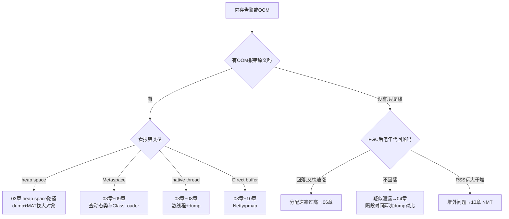

### CPU 100% 怎么查

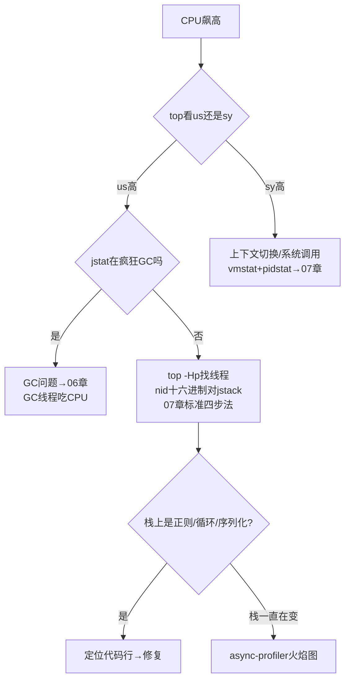

### 服务卡顿/毛刺怎么查

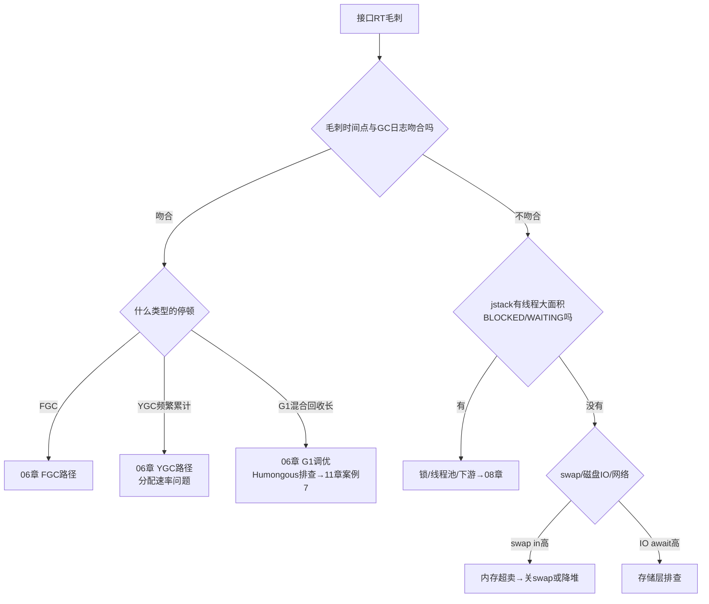

### 进程假死/无响应怎么查

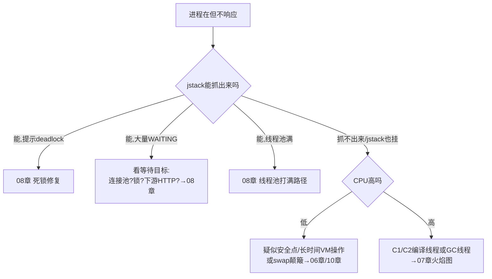

### 容器内异常怎么查

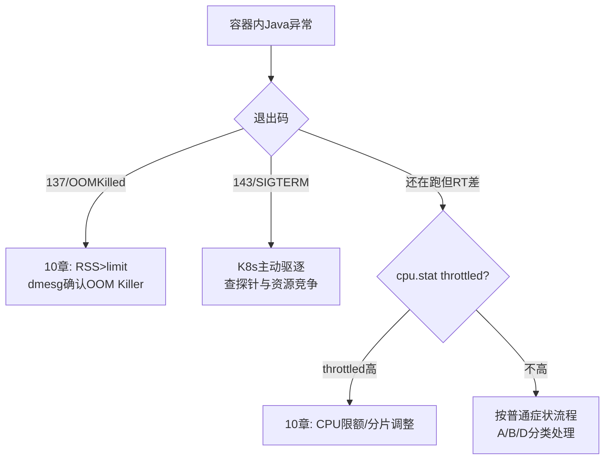

---

## 黄金五分钟：现场保全清单

出事后 **5 分钟内**按序执行（假设进程号 `$PID`），全部输出落到独立目录：

```bash
mkdir -p /tmp/incident-$(date +%m%d%H%M) && cd /tmp/incident-*
# ① 进程基本盘（秒级）
jcmd $PID VM.uptime; jcmd $PID VM.flags > vmflags.txt
jcmd $PID GC.heap_info > heapinfo.txt
# ② GC 现场（秒级）
jstat -gcutil $PID 1000 30 > gcutil.txt        # 30 秒采样
jcmd $PID GC.log_info 2>/dev/null || true       # 若已开启则看日志文件
# ③ 线程现场（秒级，连抓 3 次）
for i in 1 2 3; do jstack $PID > thread-dump-$i.txt; sleep 5; done
# ④ 内存现场（大堆慎用，会触发 Full GC；优先已有 HeapDumpOnOOM 文件）
jcmd $PID GC.heap_dump /tmp/incident-*/heap.hprof   # 可选
# ⑤ 若怀疑 CPU：记录 top -Hp 快照
top -b -H -n 1 -p $PID > top-hp.txt
```

> 注意：`jmap -dump:live` 与 `jcmd GC.heap_dump` 都会先触发 Full GC；几十 GB 大堆且服务还活着时，优先依赖 `-XX:+HeapDumpOnOutOfMemoryError` 已生成的 dump，或改用 JFR 低开销采集。

采完这五样，无论后面怎么处置（重启/回滚），根因分析都有据可依。之后进入对应章节走完整个定位链路。

---

## 考点速查表

| 考点 | 一句话要点 |
|------|-----------|
| 止血优先 | 先摘流量/重启保 SLA，但必须先留现场（dump+日志+jstack） |
| 五大症状分类 | 内存/GC/CPU/线程/环境，先归类再进章节，不要上来就猜 |
| 四条起步命令 | `jcmd VM.uptime`、`top -Hp`、`jstat -gcutil`、`jstack` |
| dump 触发 FGC | live dump 会 Full GC，大堆在线慎取，靠 OOM 自动 dump 兜底 |
| OOM 报错即路由 | heap→03/metaspace→03+09/thread→03+08/direct→03+10 |
| 退出码 137 | Linux/K8s OOM Killer，查 dmesg 与容器 limit，不是 JVM 自己退 |
| us vs sy | us 高查应用（含 GC），sy 高查系统调用与锁自旋 |
| 假死三连拍 | jstack 每 5 秒抓一次连抓 3 次，看线程状态演化而不是单帧 |
| 现场落盘 | 所有诊断输出先写文件再分析，避免处置动作覆盖证据 |

---

# 01 · 排查方法论与工具箱

> **📌 30 秒速览**
> 1. 生产排查四步法：**保现场 → 定症状 → 缩范围 → 验根因**；任何动作先想「会不会破坏现场」。
> 2. 止血优先于根因：摘流量、重启、回滚都是合法手段，但止血前必须留证据。
> 3. JDK 自带工具够覆盖 80% 场景：`jcmd` 是现代统一入口（jmap/jstack/jinfo 功能都并入），JFR 是低开销持续监控首选。
> 4. Arthas 解决「在线诊断不改代码」，async-profiler 解决「CPU/分配热点可视化」，MAT 解决「堆 dump 分析」——三者互补不互替。

---

### 1.1 排查四步法

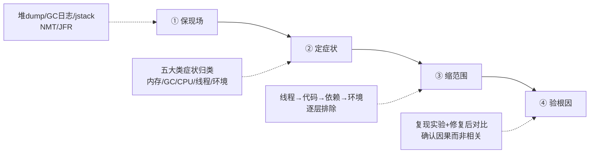

**① 保现场**：第一时间采集堆 dump（或确认 OOM 自动 dump 已配置）、GC 日志、线程 dump、NMT 数据。注意采集顺序：先抓无损的（日志、jstack），再抓有代价的（heap dump 会触发 Full GC）。

**② 定症状**：用 00 章路由表把问题归入五大类，避免上来就猜原因。同一进程可能多症并发（如 CPU 高 + FGC 频繁），要分辨主因和伴生现象——通常是内存问题引发 GC 风暴再引发 CPU 高，主因在内存。

**③ 缩范围**：沿「线程 → 代码 → 依赖 → 环境」四层往下钻：jstack 定位到线程状态 → 对应到代码行 → 检查其调用的下游（DB/缓存/RPC）→ 排除容器/OS 层因素。

**④ 验根因**：找到嫌疑点不算完，要做**验证闭环**：改参数/代码后观察指标恢复；能复现的做最小复现实验；不能复现的用排除法 + 多次同类故障印证。只修不验等于没修。

**止血优先原则**：生产第一目标是恢复服务，不是找真相。常见止血手段按破坏性排序：

| 手段 | 生效速度 | 现场损失 | 适用 |
|------|---------|---------|------|
| 摘流量（权重调 0/下线实例） | 秒级 | 无 | 单实例异常，集群健康 |
| 重启 | 分钟级 | 堆内数据丢失，dump 可保留 | 内存泄漏/假死 |
| 回滚版本 | 分钟级 | 无（配置外置时） | 发布后出现的问题 |
| 扩容稀释 | 分钟级 | 无 | 容量型问题 |
| 调参重启（如加堆） | 需重启 | 无 | 参数型根因 |

---

### 1.2 工具总览矩阵

| 工具 | 类型 | 典型场景 | 开销 | 是否需预装/预热 |
|------|------|---------|------|----------------|
| `jcmd` | JDK 自带 | 统一诊断入口（dump/flags/classhisto/NMT/JFR） | 低 | 否 |
| `jstat` | JDK 自带 | GC 统计连续采样 | 极低 | 否 |
| `jstack` / `jcmd Thread.print` | JDK 自带 | 线程现场快照 | 低 | 否 |
| `jmap -histo` | JDK 不带，独立工具 | 对象直方图快速看谁占内存 | 中（live 会 FGC） | 否 |
| JFR + JMC | JDK 自带(8u262+免费) | 持续低开销全维度记录 | ~1% | 否 |
| **Arthas** | Java Agent | 在线诊断：watch/trace/tt/热更新 | 中（watch 大流量方法慎用） | 需 attach，无需重启 |
| **MAT** | 离线分析 | 堆 dump 支配树/泄漏报告 | 离线 | 本机分析，不碰生产机 |
| **async-profiler** | native agent | CPU/分配/锁热点火焰图 | 低(~1-3%) | 需 attach |
| Grafana/Prometheus | 监控平台 | 趋势与告警（非定位） | 无 | 前置建设 |

选型口诀：**趋势看监控，现场用 jcmd/jstack，热点上 profiler，深挖开 MAT，动态追踪 Arthas**。

---

### 1.3 jcmd：现代统一诊断入口

`jps -l` 先拿 pid（容器内直接 `jcmd 1 ...` 或用 `pgrep java`）。核心子命令：

```bash
# —— 进程与 JVM 基本信息 ——
jcmd $PID VM.uptime                  # 运行时长
jcmd $PID VM.flags                   # 生效的 JVM 参数（排查"参数没生效"必看）
jcmd $PID VM.command_line_flags      # 启动命令行里的参数
jcmd $PID PrintFlagsFinal -version   # 全量最终参数值

# —— 内存 ——
jcmd $PID GC.heap_info               # 各代容量/占用（比 jstat 更准的瞬时值）
jcmd $PID GC.class_histogram         # 对象直方图（live 触发 FGC，慎用）
jcmd $PID GC.heap_dump /path/a.hprof # 堆 dump（同上，触发 FGC）
jcmd $PID VM.native_memory summary   # NMT 内存分类（需启动加 -XX:NativeMemoryTracking=summary）

# —— 线程 ——
jcmd $PID Thread.print               # 线程 dump（同 jstack）
jcmd $PID Thread.print -l            # 带 Locks 信息（java.util.concurrent 锁属主）

# —— 类与编译 ——
jcmd $PID GC.class_stats             # 类元数据统计（需 -XX:+UnlockDiagnosticVMOptions）
jcmd $PID Compiler.statistics        # JIT 编译统计（code cache 问题排查）
jcmd $PID Compiler.codecache         # code cache 使用情况

# —— 性能采集 ——
jcmd $PID JFR.start name=rec duration=120s filename=/tmp/rec.jfr settings=profile
jcmd $PID JFR.dump name=rec filename=/tmp/snap.jfr
jcmd $PID JFR.stop name=rec
jcmd $PID PerfCounter.print          # 原始性能计数器
```

**易错点**：
- 容器内没有这些工具？宿主机 jdk 工具连容器进程会报 `attach` 失败——进容器执行，或用 kubectl debug（ephemeral container 共享进程命名空间）。
- `GC.class_histogram` 默认就是 live 模式（触发 Full GC）；只想看不触发，用 `jmap -histo <pid>`（不带 :live，但统计不准含垃圾）。
- `Thread.print` 与 jstack 输出一致，但 jstack 有 `-F` 强制模式（进程 hang 死时 jcmd 可能也挂，此时用 `jstack -F` 或 kill -3）。

---

### 1.4 jstat：GC 连续采样

```bash
jstat -gcutil $PID 1000 60     # 每 1s 采样一次，共 60 次
# 列含义: S0 S1 E O M CCS YGC YGCT FGC FGCT GCT
#  S0/S1 幸存者占用%, E Eden占用%, O 老年代占用%, M 元空间占用%
#  YGC/FGC 次数, YGCT/FGC/GCT 累计耗时(s)
jstat -gc $PID 1000 5          # 容量字节级明细(KB)
jstat -gccapacity $PID         # 各代容量演进
```

读数要点：
- **O 列高位 + FGC 次数持续增长且 O 不降** = 泄漏特征，转 04 章。
- **E 列锯齿陡峭** = 分配速率高，算一下：`(两次采样Eden差值)/时间 = 分配速率 MB/s`，转 06 章。
- **M 列 >90% 且 FGC 后不回落** = 元空间触顶，转 09 章。
- YGCT/YGC 得到平均单次 YGC 耗时，>50ms 就值得关注停顿预算。

---

### 1.5 JFR：低开销持续记录

JFR 从 JDK 11 起随 OpenJDK 完整开源（8u262 backport 到 8），开销 ~1%，可以**常驻开启**，是「出事后才发现没数据」的最佳保险。

```bash
# 启动参数常驻（推荐生产基线）
-XX:StartFlightRecording=disk=true,maxage=12h,maxsize=2g,\
name=prod-rec,dumponexit=true,settings=profile,path-to-gc-roots=true

# 或运行中动态开始
jcmd $PID JFR.start duration=10m filename=/tmp/hot.jfr settings=profile
```

事件类型速查：

| 排查目标 | 关键事件 |
|---------|---------|
| 分配热点 | Allocation outside TLAB / in new TLAB |
| 长停顿 | Java Monitor Blocked / Thread Park |
| GC 细节 | All GC events（各阶段耗时构成） |
| IO 慢 | Socket Read/Write, File Read/Write（含对端地址） |
| 安全点 | Safepoint synchronization（长 WaitCount） |
| 方法采样 | ExecutionSample → 火焰图（JMC 或 spark 用它渲染） |

分析工具：JDK Mission Control (JMC) 图形界面；命令行可用 `jfr print --events jdk.ExecutionSample rec.jfr`（JDK 自带 `jfr` 工具）做文本分析。

---

### 1.6 Arthas：在线诊断瑞士军刀

Arthas 是阿里开源的 Java 诊断工具，最大价值是**不重启、不改码**拿到「某次调用的入参出参」「方法内部耗时分布」「反编译确认线上到底跑的哪个版本」。

```bash
curl -O https://arthaas.../arthas-boot.jar   # 官方 release 地址见附录
java -jar arthas-boot.jar                    # 选择目标 java 进程 attach
```

高频命令速查：

| 命令 | 用途 | 示例 |
|------|--------|------|
| dashboard | 实时面板：线程/内存/GC 一屏总览 | `dashboard` |
| thread | 线程栈，最常用的是找最忙线程 | `thread -n 3`（最忙3个）/ `thread --state BLOCKED` |
| jad | 反编译确认线上真实代码 | `jad com.x.OrderService placeOrder` |
| watch | 观察方法入参/返回/异常 | `watch com.x.Svc method '{params,returnObj,throwExp}' -x 2` |
| trace | 方法内部调用链耗时 | `trace com.x.Svc method '#cost > 200'`（只看慢调用） |
| tt | 时间隧道：记录调用并重放 | `tt -t com.x.Svc method` → `tt -p -i 1000` |
| sc/dump | 查类来源 jar 与 class 文件 | `sc -d com.x.Svc`（查类从哪个 jar 加载） |
| heapdump | 导堆 dump | `heapdump --live /tmp/live.hprof` |
| profiler | 集成 async-profiler | `profiler start` → `profiler stop --format html` |
| vmtool | 直接查询 JVM 内对象 | `vmtool --action getInstances --className Cache -x 2` |

**使用红线**：
- `watch/trace` 大流量入口方法会放大延迟与内存（表达式求值开销 × QPS），只在低流量时段或指定条件（`'#cost > 200'`）使用；
- `redefine/retransform` 热更新在生产是双刃剑，改完必须同步修源码，否则下次发布回退；
- Arthas attach 的 agent 忘记 detach 会轻微影响性能，用完 `stop` 退出。

---

### 1.7 MAT：堆 dump 深度分析

MAT（Eclipse Memory Analyzer）适合离线深挖大 dump（支持几十 GB，需要给分析机足够内存 `-Xmx`）。三个杀手锏功能：

**① Leak Suspects 报告**：打开 dump 自动生成，按「可疑泄漏点」排序并画出疑点对象引用链。80% 泄漏看这个报告就有结论。

**② Dominator Tree（支配树）**：列出「谁支配了最多内存」——即删掉谁释放内存最多。右键 → Path to GC Roots（exclude weak/soft references）直接看到被谁引用着无法回收：

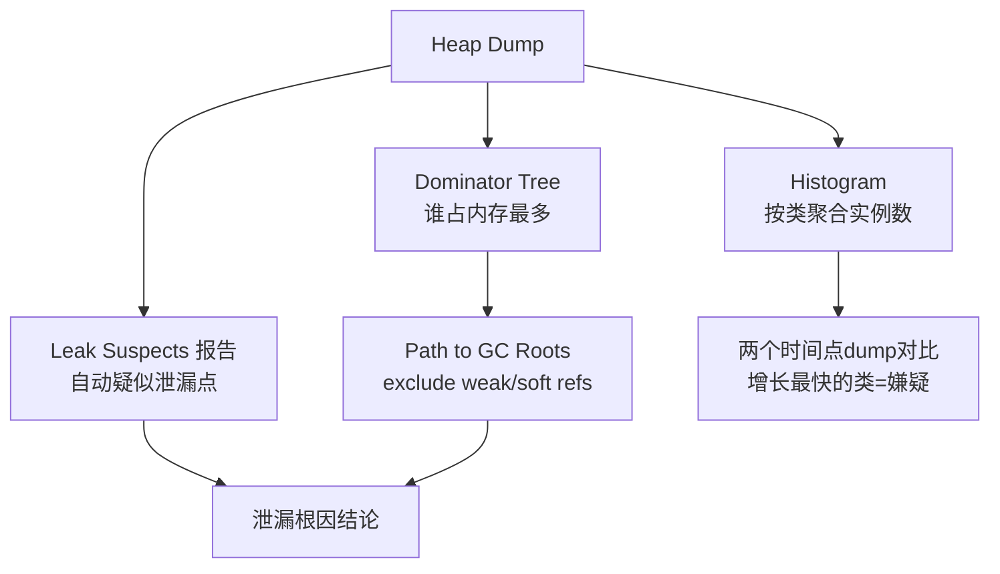

**③ Histogram + 对比**：两个时间点的 dump 各出 histogram，diff 后增长最快的类就是泄漏嫌疑；配合「同 dump 内重复类检测」（Duplicate Classes）可发现 ClassLoader 泄漏。

**OQL 小技巧**：`SELECT * FROM byte[] b WHERE b.@retainedHeapSize > 100000000` 直接列出 retained 超 100MB 的字节数组。

**dump 文件体积参考**：1GB 堆 ≈ 1GB hprof（未压缩）；MAT 解析约需 1.5~2 倍堆大小内存，分析 32GB dump 建议 MAT 侧 -Xmx48g 以上机器。

---

### 1.8 async-profiler：CPU/分配热点火焰图

async-profiler 基于 perf_events + AsyncGetCallTrace，开销低（~1-3%），输出火焰图，专治「栈一直在变、jstack 抓不准」的热点。

```bash
# 经典用法（新版本 asprof 命令）
asprof start -f /tmp/cpu.html $PID          # CPU 热点
asprof start -e alloc -f /tmp/alloc.html $PID   # 分配热点
asprof start -e lock -f /tmp/lock.html $PID     # 锁竞争
asprof stop -f /tmp/out.html $PID
# 旧版语法 ./profiler.sh -d 30 -f /tmp/cpu.html $PID（采样30秒自动停止）
```

火焰图怎么看：
- **横轴 = 采样占比（越宽占比越大）**，纵轴 = 调用栈深度（自下而上为调用方向）；
- 找「平顶」：宽而顶部平坦的火苗 = 热点集中，优先处理；
- 颜色无固定语义（默认按包名），不要按颜色猜性能。

适用判断：jstack 三连拍每次栈都不一样 → 说明热点分散或极短，直接上 async-profiler；反之热点稳定，jstack 就够。

---

### 1.9 命令速查卡（打印贴墙版)

```text
【一步定位 CPU】top -Hp PID → printf '%x\n' TID → jstack PID | grep -A 30 'nid=0x???' 
【GC 压力】jstat -gcutil PID 1000 → 看 O/M/E 列 + FGC 趋势
【谁占内存】jmap -histo PID | head -25 （不看live避免FGC）
【现场三件套】jstack PID > t.txt; jcmd PID GC.heap_info; cp gc.log 备份
【死锁】jstack PID | grep -A 5 'deadlock'
【线程数】ls /proc/PID/task | wc -l （含native）; jstack 里 '^"' | wc -l
【元空间】jstat -gcutil 看 M 列; jcmd GC.class_stats | awk '{print $NF}' | sort | uniq -c | sort -rn | head
【容器137】dmesg -T | grep -i 'killed process' ; kubectl describe pod → Last State
```

---

## 常见误区

| 误区 | 正确姿势 |
|------|---------|
| 上来就重启，不留现场 | 至少留 jstack + GC 日志 + OOM dump 配置兜底 |
| 只用 jstack 抓热点 | 栈时刻在变，采样一次是彩票；三连拍或火焰图才可信 |
| watch 大流量方法 | 表达式求值开销×QPS 会压垮进程，限流时段+条件过滤 |
| MAT 打开就下结论 | Leak Suspects 只是「嫌疑」，必须 Path to GC Roots 验证引用链 |
| 容器里装 host 的 JDK 工具去连容器进程 | attach 机制跨 namespace 失败，进容器执行或 ephemeral container |
| 认为 JFR 开销大不敢开 | profile 档位约 1%，生产常驻收益远大于损耗 |

---

## 面试题精选（含追问）

**Q1：线上服务突然大量超时，你的排查顺序是什么？（追问：如果所有工具都显示正常呢？）**

答：按四步法走：①保现场（jstack 三连拍 + GC 日志备份 + 确认 OOM dump 配置）；②定症状：看监控区分是全部接口超时还是个别接口、错误是超时还是拒绝、RT 分布是整体抬升还是长尾；③缩范围：jstack 看线程大面积状态——大量 WAITING 在连接池获取则查下游连接池配置与下游健康度，BLOCKED 在业务锁则分析锁持有者，RUNNABLE 但 CPU 低则在 IO 等待，查网络与存储；④验根因：临时扩容或重启止血，观察修复后指标。追问答案：所有工具显示「正常」通常意味着问题不在 JVM 层而在更底层——网络丢包重传（ss -i 看 retrans）、DNS、磁盘 IO await、宿主机资源争抢或时钟漂移影响超时计算；也可能是周期性毛刺没被抓到，此时上 JFR 常驻 + 持续 tcpdump 等下一次发生。

**Q2：jstack 抓了三次，每次线程都在 RUNNABLE，怎么继续？（追问：什么时候必须用 async-profiler？）**

答：RUNNABLE 不等于真在跑 CPU——可能是 socketRead0 等 native 方法阻塞（仍标记 RUNNABLE）。先看栈顶：如果是 `socketRead0`/`epollWait`，是在等网络，顺着业务链路查下游；如果是纯业务方法且 top -Hp 显示对应线程确实烧 CPU，说明热点在变，三次采样恰好都错过。追问：当热点方法执行时间 < 采样间隔、或热点极度分散（几百个方法各占一点）、或需要精确到「分配热点/锁等待」这类非 CPU 维度时，jstack 快照法失效，必须用 async-profiler 这类持续采样的 profiler，用上万次样本的统计显著性代替单帧快照。

**Q3：为什么说 jcmd 可以替代 jmap/jstack/jinfo？（追问：有什么是 jmap 能做而 jcmd 不能的？）**

答：jcmd 把诊断子命令统一到一个入口：Thread.print≈jstack、GC.heap_dump≈jmap -dump、VM.flags≈jinfo -flags、GC.class_histogram≈jmap -histo，而且基于 attach 机制实现更稳，还额外提供 NMT/JFR/Compiler 等新能力，官方文档也以 jcmd 为推荐入口。追问：`jmap -histo`（不带 :live）可以不触发 Full GC 地查看包含垃圾对象的直方图，jcmd 的 class_histogram 只有 live 语义；另外 jmap -finalizerinfo 查看 F-Queue 也是 jcmd 没有的。

**Q4：生产环境能不能开 JFR？开销多大？（追问：settings=profile 和 default 有什么区别？）**

答：可以。JFR 设计目标就是常态开启，profile 档位实测开销约 1%（default 档更低但事件少），相比出事时「无数据可查」的损失完全值得，建议作为生产基线常驻 + dumponexit。追问：profile 档提高采样频率（方法采样 10ms→1ms 间隔等）并开启更多事件（分配采样、锁事件），default 档只记录基础事件适合永久常驻；折中方案是 default 常驻 + 出问题时动态 `JFR.start settings=profile` 叠加一段深度记录。

**Q5：Arthas 的 watch 和 trace 有什么区别？各适合什么场景？（追问：为什么 watch 大流量接口危险？）**

答：watch 观察单方法的入参/返回值/异常，适合「这次调用到底传了什么/返回了什么」的数据面问题；trace 输出方法内部整条调用链每层的耗时，适合「这一秒花在哪」的性能面问题。场景：接口偶现脏数据 → watch 入参；接口 RT 抖动 → trace 找慢在哪一层。追问：watch 会对每次匹配调用做表达式求值并可能拷贝大对象（-x 深度展开嵌套对象），QPS 高时 CPU 和内存开销被放大数千倍，且结果写入环形缓冲也可能撑大堆——所以必须加条件（`#cost>200`）或缩小匹配（只 match 特定参数），并在低峰操作。

**Q6：MAT 的支配树和普通对象直方图有什么本质区别？**

答：直方图按「浅堆」（对象自身大小）聚合计数，回答「哪类对象个数多」；支配树按「支配关系」组织——X 支配 Y 表示所有引用 Y 的路径都必须经过 X，因此 X 的 retained size（被支配对象的深堆总和）才是「删掉 X 真正能释放多少」。泄漏分析必须看 retained：一个 HashMap 占浅堆很小，但它支配了几 GB 的 entry 数组，直方图上看不出它是元凶，支配树一眼可见。这也是为什么 Leak Suspects 报告以支配关系为核心算法。

**Q7：止血和根因冲突时怎么办？举一个真实权衡例子。**

答：止血永远优先，但要留下最小证据集（jstack+GC 日志+dump 配置）。例：大促前夜发现老年代缓慢上涨疑似泄漏，根治需要 dump 几十 GB 堆并离线分析数天——立即决策：摘掉一台流量最小的实例专门做 dump（牺牲一台换证据），其余实例调大堆 + 提前滚动重启计划顶过大促；大促后再回台面分析根因。原则：「用空间换时间」的临时参数允许上线（标注回滚时间点），但禁止无证据的重启循环掩盖问题。

---

## 考点速查表

| 考点 | 一句话要点 |
|------|-----------|
| 四步法 | 保现场→定症状→缩范围→验根因，动作前先想是否破坏现场 |
| 止血手段梯度 | 摘流量→重启→回滚→扩容→调参，破坏性从小到大 |
| jcmd 定位 | 现代统一入口：Thread.print/GC.heap_dump/VM.flags/NMT/JFR |
| jstat 读数 | O 高 FGC 涨不降=泄漏；E 陡峭=分配率高；M 高不落=元空间触顶 |
| JFR 价值 | ~1% 开销可常驻，出事后有完整事件回放，生产基线必备 |
| Arthas 红线 | watch/trace 大流量方法有放大效应，必须条件过滤+低峰使用 |
| MAT 三板斧 | Leak Suspects 定嫌疑、支配树看 retained、Path to GC Roots 验证 |
| 支配树本质 | X 支配 Y ⇒ 删 X 即释放 Y，retained size 才是真可回收量 |
| 火焰图判据 | 横宽=占比，找平顶；栈不稳定/热点分散时替代 jstack |
| RUNNABLE 陷阱 | socketRead0 等 native 阻塞也是 RUNNABLE，看栈顶定性 |
| 工具矩阵口诀 | 趋势看监控、现场 jcmd、热点 profiler、深挖 MAT、动态 Arthas |

---

# 02 · JVM 运行时内存区域

> **📌 30 秒速览**
> 1. 线程私有：PC 寄存器、虚拟机栈、本地方法栈；线程共享：堆、方法区（JDK8+ 落地为元空间，使用本地内存）、运行时常量池、直接内存。
> 2. 对象优先在 Eden 分配（TLAB 无锁分配），大对象直入老年代（G1 是 humongous 区），经历一次 Minor GC 年龄+1，动态年龄判定可提前晋升。
> 3. 排查内存问题的第一性原理：先搞清「这次涨的是哪个区域」——堆看 jstat O/E 列、元空间看 M 列、堆外看 NMT 分类，区域判错方向就全错。
> 4. 容器环境里进程实际占用 RSS = 堆 + 元空间 + 线程栈×线程数 + CodeCache + GC 开销 + 直接内存 + 符号/字体等 native 占用，Xmx 只管其中一块。

---

### 2.1 运行时数据区总览

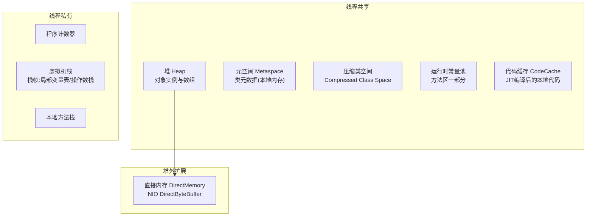

| 区域 | 存什么 | 大小控制 | 溢出表现 |
|------|--------|---------|---------|
| 堆 | 对象实例 | `-Xms/-Xmx` | `OutOfMemoryError: Java heap space` |
| 元空间 | 类元数据（方法字节码信息等） | `-XX:MaxMetaspaceSize`（默认无限，受物理内存约束） | `OutOfMemoryError: Metaspace` |
| 压缩类空间 | 类的元数据指针部分（CompressedKlassPointer 专用） | `-XX:CompressedClassSpaceSize`（默认 1G） | `OutOfMemoryError: Compressed class space` |
| 虚拟机栈 | 栈帧（局部变量表/操作数栈） | `-Xss`（默认 512KB~1MB） | `StackOverflowError` / `OutOfMemoryError: unable to create new native thread` |
| 程序计数器 | 当前执行字节码行号 | 无需配置 | 唯一不会 OOM 的区域 |
| 代码缓存 | JIT 编译产物 | `-XX:ReservedCodeCacheSize`（默认 240MB~256MB） | 编译被关闭，性能骤降（无异常抛出！）|
| 直接内存 | DirectBuffer 数据 | `-XX:MaxDirectMemorySize`（默认≈-Xmx） | `OutOfMemoryError: Direct buffer memory` |

> **版本事实**：永久代在 JDK 8 被移除（JEP 122），类元数据移到本地内存的元空间——从此「堆里加载类」和「元空间溢出」成为历史名词，但面试和旧资料仍常见。核实详情见 [13-附录](13-appendix-references.md)。

---

### 2.2 堆内分代结构

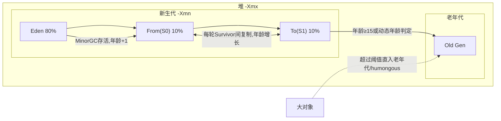

各代比例默认值（Parallel/G1 有差异）：

| 参数 | 默认 | 说明 |
|------|------|------|
| NewRatio | 2（老年代:新生代=2:1） | 未设 -Xmn 时生效 |
| SurvivorRatio | 8 | Eden:S0:S1 = 8:1:1 |
| MaxTenuringThreshold | 15（CMS 6，G1 15） | 年龄阈值上限 |
| TargetSurvivorRatio | 50 | 动态年龄判定依据 |

**动态年龄判定**：Survivor 中同龄及以下对象总和 > Survivor 一半，年龄 ≥ 该批对象年龄的直接晋升——这就是「明明没到 15 岁却进了老年代」的原因。排查 YGC 后晋升异常时必查此项。

---

### 2.3 对象的一生：分配 → 存活 → 回收

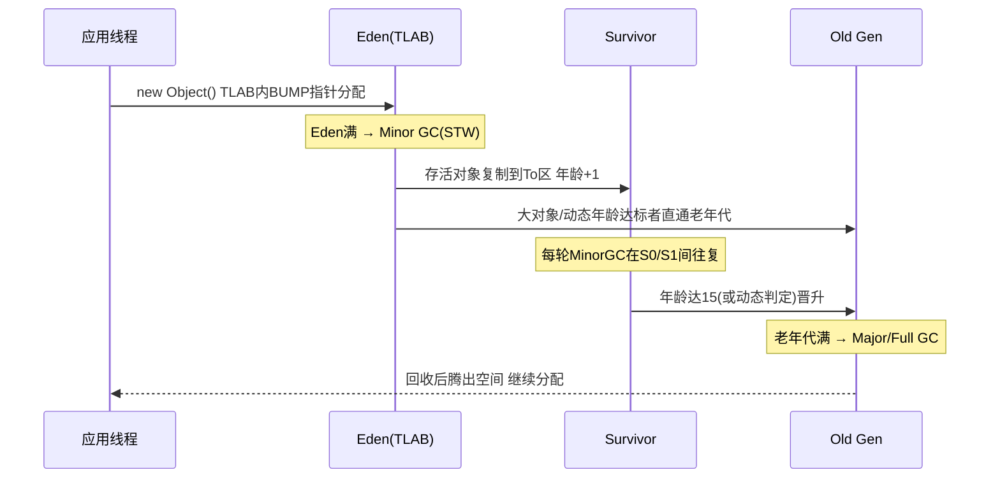

TLAB（Thread Local Allocation Buffer）：每个线程在 Eden 里预租一小块私有空间，分配时只做指针碰撞（bump-the-pointer），无锁；TLAB 用尽再申请新 TLAB 或走慢速路径。JFR 里「Allocation outside TLAB」事件多 = 分配热点或大对象绕过 TLAB。

**对象一定在堆上吗？** 标量替换（逃逸分析开启时）可将未逃逸的小对象拆解为局部变量直接栈上消化，不产生堆分配；但这属于 JIT 优化行为，不是「栈上分配对象」的通用机制，不能依赖它解决内存压力。

---

### 2.4 内存水位怎么读

生产监控建议盯这几个水位（Prometheus + JMX Exporter 示例指标）：

| 指标 | 正常区间 | 异常信号 |
|------|---------|---------|
| 老年代占用（jstat O 列） | FGC 后应显著回落至 <60% | FGC 后不落或持续爬升 |
| Eden 使用速率 | 平稳锯齿 | 锯齿变陡=分配率突增 |
| 元空间 M 列 | 加载稳定后平稳 | 持续上涨不封顶 |
| CodeCache 使用 | 平稳 | 满 → JIT 全面停摆（无报错！性能悬崖） |
| 直接内存 | 平稳 | 与业务量同步持续涨 |

**RSS 构成公式**（容器排障必备）：

```text
RSS ≈ Heap(-Xmx) + Metaspace + CodeCache + ThreadStacks(Xss × 线程数)
     + DirectBuffers + GC工作内存(G1/ZGC) + Symbols + GC Native小件 + 其他native
```

案例：4G limit 的 pod，配 Xmx3g + 200 个线程 + Netty 直接内存，堆没满却被 OOMKilled —— 因为 3g 堆只是上限，加上元空间 ~150M + code cache 240M + 线程栈 200M + direct buffer 数百 M + GC 本地开销，RSS 轻松破 4G。详见 [10 章](10-offheap-container.md)。

---

### 2.5 区域判断实战：一次「内存高」的三向分流

线上说「内存高」，第一步永远是分流到具体区域：

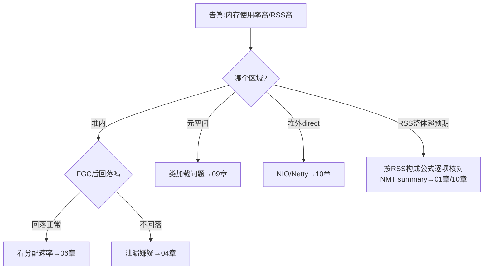

命令对应关系：

```bash
# 堆内各代瞬时值
jcmd $PID GC.heap_info
# 元空间与压缩类空间
jstat -gcmetacapacity $PID   # 或 jstat -gcutil 看 M 列
# 全进程内存分布（需启动参数 -XX:NativeMemoryTracking=summary）
jcmd $PID VM.native_memory summary
# 进程真实占用（含全部native）
ps -o rss= -p $PID    # 单位 KB
cat /proc/$PID/smaps_rollup   # 更细：Rss/Pss/Private 各项
```

**NMT summary 输出速读**（重点行）：

```text
Total: committed=XXXX KB  reserved=XXXX KB      # JVM 视角的总量
- Java Heap (reserved=Xm, committed=Xm)          # 应≈Xmx
- Class (reserved=1112MB, #classes=N)            # 元空间+压缩类空间
- Thread (reserved=XXXMB #threads=N)             # 线程栈总量=Xss×N
- Code (reserved=XXXMB #segments=N)              # JIT 代码缓存
- GC (reserved=...)                              # GC 自身数据结构(G1大堆可达数百MB)
- Internal / Other / Symbol                      # 直接内存等常混在 Internal
```

> 注意：NMT 不统计第三方 native 库（如压缩/图片库、Netty native epoll 等）的 malloc，所以 NMT Total 明显小于 RSS 时，缺口就在「非 JVM native 分配」里——用 pmap 排查（见 10 章）。

---

### 2.6 常见误区

| 误区 | 正确认知 |
|------|---------|
| 「Java 内存 = Xmx」 | Xmx 只是堆上限；RSS 还包括元空间/栈/codecache/direct/GC 开销 |
| 元空间还在堆里 | JDK8 起在本地内存，MaxMetaspaceSize 默认无上限（受 RSS 物理约束） |
| SurvivorRatio=8 所以 Eden 占堆 80% | 是新生代的 80%；新生代默认仅占堆 1/3（NewRatio=2） |
| 对象总是分配在堆上 | TLAB 属于 Eden；逃逸分析+标量替换可让小对象不产生堆分配 |
| CodeCache 满了会 OOM | 不会抛异常，而是静默关闭 JIT 编译，表现为性能缓慢劣化 |
| 大对象必然进老年代 | Parallel 系有 PretenureSizeThreshold；G1 是 humongous 区块机制，语义不同 |

---

## 面试题精选（含追问）

**Q1：JDK 8 为什么用元空间替换永久代？（追问：移除后类卸载的条件变了吗？）**

答：永久代大小受 -XX:MaxPermSize 固定上限约束且调优困难，与堆 GC 耦合（FGC 才回收），字符串常量池在 JDK 7 已先行移入堆；HotSpot 与 JRockit 合并后统一采用 JRockit 的设计，把类元数据放到本地内存（JEP 122），上限就是物理内存，OOM 风险从「固定墙」变成「可观测的水位」。追问：卸载条件本质不变——类加载器存活则其加载的所有类不可卸载，元空间同样只在 ClassLoader 被 GC 后由 GC 清理其元数据；变化的是触发时机，元空间有独立的 high-water-mark 扩容触发 FGC 的机制，不再单纯依赖老年代 FGC。

**Q2：一个对象到底多大？怎么估算一个 HashMap<String, Integer> 放 100 万 entry 的内存？（追问：为什么深堆可能远大于浅堆之和？）**

答：64 位开启压缩指针（默认）下：对象头 12 字节 + 实例数据对齐到 8 字节。HashMap 本身约 48B；table 数组头 16B + 8×容量 B（容量按 2^n 自动扩容，100 万 entry 需要 capacity 2097152 ≈ 16MB）；每个 Node 约 32B×100 万 = 32MB；Integer 缓存外每个 16B；String key 每个约 24B + char[]/byte[]（JDK9+ compact strings 为 byte[]）24B+内容。粗算 60~80MB 起，key 内容长则更大。追问：retained size 计入「只能经由该对象到达」的所有下游对象，支配树中根节点 retained 可达整个连通域；浅堆只算自身，因此支配节点（如缓存 Map）深堆远大于浅堆，MAT 支配树正是利用这一点找「真凶」。

**Q3：为什么有了 TLAB 还会有分配竞争？什么时候对象不走 TLAB？（追问：JFR 里大量 outside TLAB 事件说明什么？）**

答：TLAB 是 Eden 内线程私有序列，分配只需 bump 指针，无竞争。不走 TLAB 的情形：①对象大于当前 TLAB 剩余空间且大于 TLAB 浪费上限 → 直接在 Eden 共享区慢速分配（CAS）；②大对象超过 TLAB 尺寸上限甚至超过 Eden 可容纳尺寸 → 直入老年代或 humongous。追问：outside TLAB 事件集中出现说明存在大对象高频分配或某线程分配速率畸高——典型如序列化缓冲、批量查询结果集、byte[] 拷贝链路，此时用 JFR 的 allocation 采样定位调用栈即可锁定代码。

**Q4：栈帧里都有什么？局部变量表过大有什么影响？（追问：StackOverflowError 和 unable to create new native thread 的区别？）**

答：栈帧含局部变量表、操作数栈、动态链接、返回地址。局部变量表在编译期确定，方法参数与大数组索引等会加大槽位数量；递归深、单帧大的场景会更快耗尽 -Xss。追问：StackOverflowError 是单个线程的栈深度超限（-Xss 太小或递归失控），通常不影响其他线程；unable to create new native thread 是进程地址空间/OS 层面无法再建线程（ulimit、cgroup pids、内核 pid 上限、内存不足以映射栈），是系统级资源耗尽，处理方向完全不同（降线程数 vs 调 ulimit/cgroup），详见 03 章。

**Q5：CodeCache 是干什么的？满了会发生什么？（追问：怎么预防？）**

答：存 JIT（C1/C2）编译后的本地代码、stub 与内联缓存。满后 JVM **不会抛错**，而是停止后续编译并逐步退化为解释执行，性能断崖式下跌，日志只有少量 warning，极易误判为「业务变慢」。追问：预防三招：①保留分层编译（不要禁用 TieredCompilation）；②预留足够 ReservedCodeCacheSize（分层编译默认 240MB，万级类大应用适当上调）；③监控 code cache 水位，同时排查是否被 codecache 冲击型负载（海量小方法热编译）打爆，必要时用 -XX:-TieredCompilation 减半需求（牺牲峰值性能）。

**Q6：直接内存属于运行时数据区吗？JVM 会管理它吗？（追问：为什么 NIO 要用它？）**

答：《Java 虚拟机规范》定义的运行时数据区不含直接内存，它属于 NIO 引入的「堆外扩展」，受 `-XX:MaxDirectMemorySize` 约束。JVM 部分托管：DirectByteBuffer 通过 Cleaner 在 GC 时回收关联的 native 内存（JDK9+ 显式 releaseBufferCleaner），但如果 Buffer 对象本身被引用长期持有，native 内存就一直不释放——GC 看不到它的压力，只有 RSS 在涨。追问：避免堆外→堆内的双向拷贝（socket 写出堆内 byte[] 需先拷到临时直接内存），零拷贝语义下性能更高；代价是要自己管理生命周期，泄漏后 NMT/pmap 才能看到，比堆内难排查得多，详见 10 章。

---

## 考点速查表

| 考点 | 一句话要点 |
|------|-----------|
| 线程私有 vs 共享 | 私有：PC/虚拟机栈/本地方法栈；共享：堆/元空间/CodeCache/常量池 |
| 元空间位置 | JDK8 起在本地内存，不在堆；MaxMetaspaceSize 默认无上限 |
| 动态年龄判定 | Survivor 同龄总和>一半即提前晋升，YGC 晋升异常必查项 |
| TLAB | Eden 内线程私有序列，bump-pointer 无锁分配，大对象绕过 |
| RSS 公式 | 堆+元空间+栈×N+CodeCache+Direct+GC 开销+其他 native |
| NMT 盲区 | 不含第三方库 malloc；Total≪RSS 时缺口在非 JVM native |
| CodeCache 满 | 不报错、静默关编译、性能悬崖，监控水位而非等报错 |
| 区域分流 | 先判区域（堆/元/堆外）再进对应章节，方向错全错 |
| 逃逸分析 | 标量替换可消除小对象堆分配，是优化不是保证 |

---

# 03 · OOM 场景全景：8 种溢出的定位与解决

> **📌 30 秒速览**
> 1. OOM 不是一种病，是八种病共用一个名字——`OutOfMemoryError:` 后面的短语才是病灶：heap space / Metaspace / native thread / Direct buffer / GC overhead / Compressed class space / requested array size / Reason: signal。
> 2. 第一动作永远是**拿到报错全文和 dump**：启动参数兜底 `-XX:+HeapDumpOnOutOfMemoryError -XX:HeapDumpPath=... -XX:+ExitOnOutOfMemoryError`（容器环境建议加 Exit 让 K8s 重建）。
> 3. 八种里只有 heap space 和 GC overhead 是「堆」的问题；Metaspace/Compressed class 是类元数据；native thread/Direct buffer/signal 是堆外资源——用 jstat/NMT 先分流再深挖。
> 4. 止血通用三板斧：重启恢复 → 调大对应上限（仅当确认是容量型而非泄漏）→ 根因修复后才能撤掉临时参数。

---

### 3.1 总分流：先看清报错原文

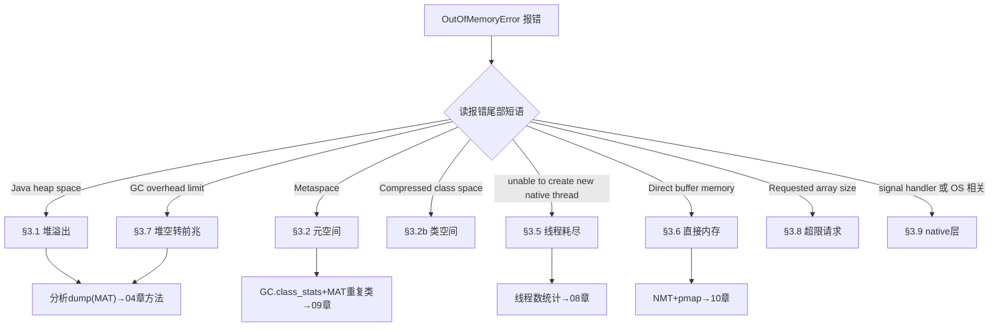

生产基线参数（所有 Java 服务都应带上）：

```bash
-XX:+HeapDumpOnOutOfMemoryError        # OOM 时自动 dump
-XX:HeapDumpPath=/data/logs/oom/       # dump 落盘目录(确保磁盘够)
-XX:+ExitOnOutOfMemoryError            # 容器内自杀交给编排系统重建
-XX:+CrashOnOutOfMemoryError           # 更激进:留 core + hs_err 再退出(二选一)
```

---

### 3.2 OutOfMemoryError: Java heap space

**症状**：报错直接抛出；或先出现响应变慢（FGC 风暴）随后崩溃。监控上老年代 100%、FGC 连发。

**根因三大类**：

| 类型 | 典型场景 | 特征 |
|------|---------|------|
| 真泄漏 | 缓存无界、集合只加不减、监听器未注销 | FGC 后占用阶梯式上升不回落 |
| 容量不足 | 流量/数据量涨了，堆没跟上 | FGC 后能回落但很快又满，dump 里无异常大对象 |
| 瞬时大对象 | 一次性查询全表、导出百万行 Excel、上传大文件解析 | 单次操作触发，dump 有巨型 byte[]/List |

**定位流程**：

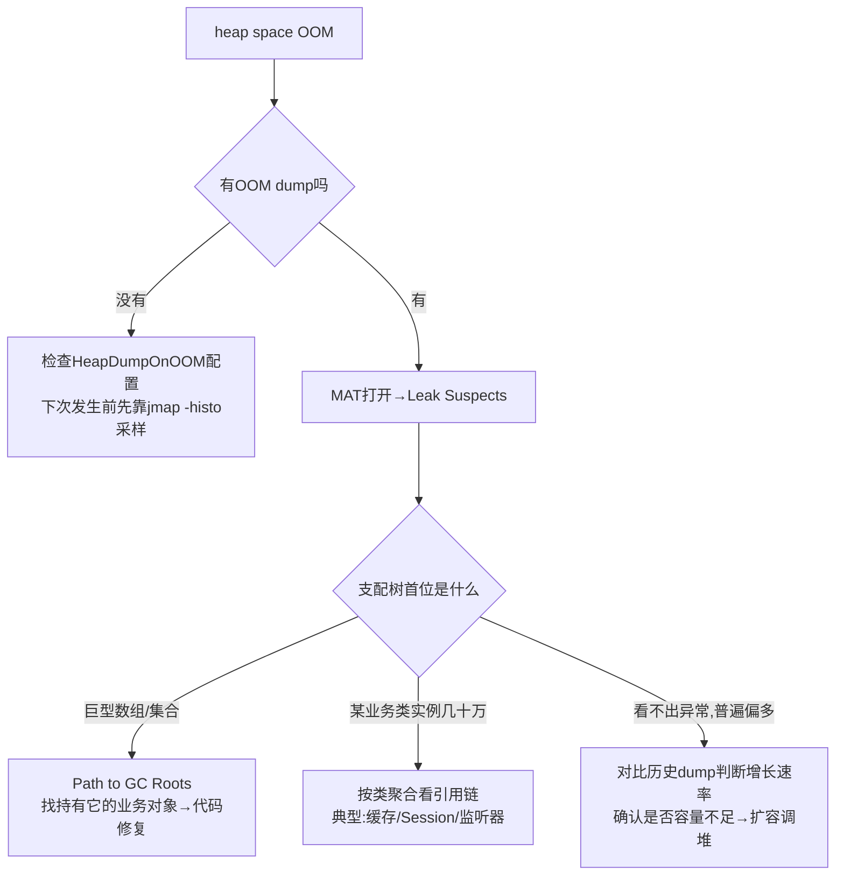

```bash
# 没条件拿 dump 时的轻量手段
jmap -histo $PID | head -30              # 不触发FGC的直方图(含垃圾)
jcmd $PID GC.class_histogram             # live版,触发FGC,更准
# MAT 命令行批量解析(服务器本地小堆dump可用)
./ParseHeapDump.sh heap.hprof org.eclipse.mat.api:suspects ...
```

**解决方案对照**：

| 根因 | 止血 | 根治 |
|------|------|------|
| 无界缓存 | 重启 + 加监控告警 | 换 Caffeine 设 maximumSize/expiry；或加淘汰策略 |
| 全量查询/导出 | 重启 | 改分页/流式处理(MySQL fetchSize、EasyExcel SAX)；导出走异步任务 |
| 容量不足 | 扩堆/扩实例 | 压测重定容量基线，配好告警提前量 |
| 泄漏 | 定时滚动重启(标注临时) | 按 04 章 dump 对比法找到引用链修复 |

---

### 3.3 OutOfMemoryError: Metaspace

**症状**：报错 `Metaspace`；jstat M 列逼近 100% 且 FGC 后不回落；常见于 Groovy/BeanShell 脚本引擎、大量动态代理（CGLIB）、反射字节码膨胀、热部署容器的应用。

**根因**：
1. **类元数据真泄漏**：动态生成的 Class 无法卸载（其 ClassLoader 被 ThreadLocal/静态集合持有），每次生成新类元空间就涨一块；
2. **动态类生成失控**：脚本每执行一次编译一个新类名（如 `Script12345`），CGLIB 每次为子类起新名字；
3. **上限设太小**：`MaxMetaspaceSize` 显式设小了，正常应用装不下。

**定位命令**：

```bash
jstat -gcutil $PID            # M 列水位
jcmd $PID GC.class_stats | head -50   # 需 UnlockDiagnosticVMOptions;看类数量与元数据分布
jcmd $PID GC.class_histogram | head   # 实例级直方图
# 关键证据:类的数量是否持续增长
watch -n 60 'jcmd $PID GC.class_stats | wc -l'
```

MAT 验证：打开 dump → Histogram → 按 ClassLoader 分组 → 发现成百上千个 `groovy.lang.GroovyClassLoader` / `Enhancer...ByCGLIB` 实例即为实锤。

**解决方案**：

| 场景 | 方案 |
|------|------|
| Groovy 脚本引擎 | 复用同一个 CompilerConfiguration/ClassLoader；脚本缓存化（同源只编译一次）；定期 `GroovySystem.getRuntimeVariables()` 清理或显式关闭旧 loader |
| CGLIB 动态代理 | 确认代理类有缓存（Spring AOP 默认有）；避免运行期对同一接口反复 `Enhancer.create()` |
| 反射膨胀 | JDK 18 后 inflation 机制变化不大仍存在；高频反射改 MethodHandle/LambdaMetafactory |
| 上限太小 | 观察稳定水位后上调 MaxMetaspaceSize（默认无上限，显式设过就要复核） |
| 真 ClassLoader 泄漏 | 按 09 章 §9.3 引用链分析法修 ThreadLocal/静态持有 |

---

### 3.4 OutOfMemoryError: Compressed class space

**症状**：`java.lang.OutOfMemoryError: Compressed class space`。压缩指针开启（默认）时，Klass 元数据放在一块专用区域，`CompressedClassSpaceSize` 默认 1G 且**必须连续虚拟地址**。

**要点**：
- 它是元空间的一部分，但上限独立；MaxMetaspaceSize 调大不会救它；
- 报这个错说明 Klass 结构（非方法字节码）把 1G 用满了——几乎必然伴随海量动态类生成，处理思路同 §3.3；
- 极端情况可 `-XX:CompressedClassSpaceSize=2g` 上调（需确认虚拟地址空间充裕）；关闭压缩指针可彻底取消此区域但整体性能受损，不建议为绕问题而关。

---

### 3.5 OutOfMemoryError: unable to create new native thread

**症状**：报错原文即含义——OS 层面无法为新线程分配栈。此时堆可能还很空！这是最容易被误判为内存问题的「假 OOM」。

**根因排查顺序**（从高频到低频）：

| # | 根因 | 检查命令 |
|---|------|---------|
| 1 | 应用线程数失控（递归创建、循环 new Thread、线程池嵌套） | `ls /proc/$PID/task \| wc -l`；jstack 统计线程名分布 |
| 2 | ulimit -u（max user processes）打满 | `ulimit -u`；`cat /proc/$PID/status \| grep Threads` |
| 3 | cgroup pids.max 限制（容器） | `cat /sys/fs/cgroup/pids/pids.current` vs `pids.max` |
| 4 | 内存不足以映射栈（RSS 已顶到 limit） | NMT 看 Thread 分类 = Xss×N 的理论值 |
| 5 | 内核 pid_max / threads-max 全局上限 | `cat /proc/sys/kernel/pid_max` |

**解决方案**：

```bash
# ① 先看是谁在疯狂建线程
jstack $PID | grep '^"' | awk '{print $2}' | sort | uniq -c | sort -rn | head -20
# 线程名形如 pool-N-thread-X 说明是某个池;Unnamed/匿名栈要重点查

# ② OS 层临时放宽(治标)
ulimit -u 65535          # systemd 服务还要同步 LimitNPROC=
sysctl kernel.pid_max=4194304

# ③ 应用层根治
#    - 降低 Xss(如 512k)让同等内存支持更多线程(仅当栈使用浅)
#    - 线程池统一管理:禁止裸 new Thread,统一走 ThreadPoolManager 注册
#    - 虚拟线程(JDK21+)适合高并发IO密集,替代万级平台线程需求
```

> **易混辨析**：`StackOverflowError` 是单线程栈深度超 -Xss（递归太深），与线程数量无关；本节错误是线程总数超限，两者机制完全不同。

---

### 3.6 OutOfMemoryError: Direct buffer memory

**症状**：`(MaxDirectMemorySize)` 尾注或 `Direct buffer memory` 字样。Netty/NIO 应用高发。

**原理**：DirectByteBuffer 在堆里只是个小壳（记录地址），真实内存由 Bits.reserveMemory 向 `MaxDirectMemorySize`（默认 ≈ -Xmx）申请；堆壳被回收后 native 内存依赖 Cleaner/CleanerImpl 在 GC 时释放——**如果分配速率快于 GC 频率，native 已超限但 GC 还没跑，就报错**（JDK8u262+ 行为有优化，超限时主动 System.gc() 触发 cleaner，但仍可能失败）。

**定位步骤**：

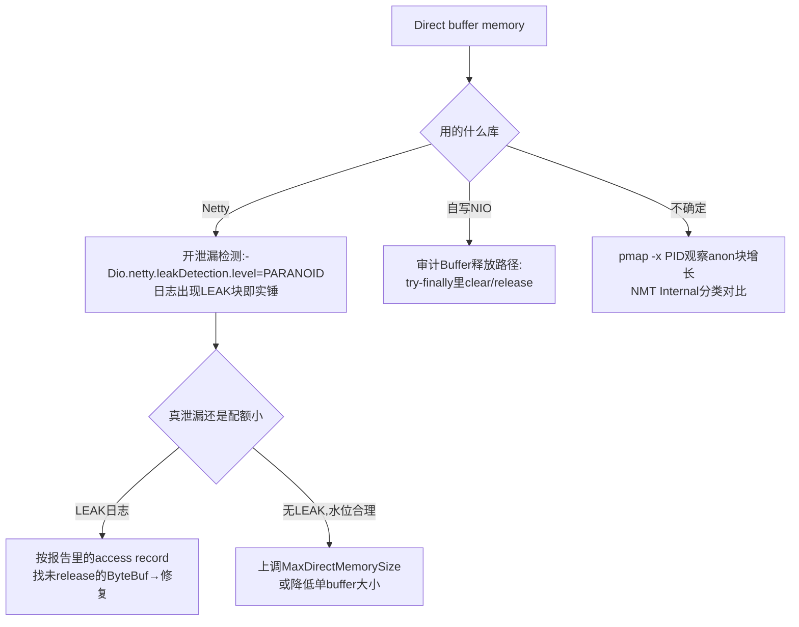

**Netty 专项**：
- 泄漏检测级别：SIMPLE（默认，抽样 ~1%）→ ADVANCED → PARANOID（全量，只用于测试环境）；
- `ReferenceCountUtil.release(buf)` / try-with-resources 配套；池化内存 `PooledByteBufAllocator` 下漏 release 会占住 arena chunk；
- 排查工具：`PlatformDependent.usedDirectMemory()` 反射读取当前用量（Arthas vmtool 可在线查）。

**方案速查**：真泄漏修 release 路径；容量不足调 `-XX:MaxDirectMemorySize=`实际需要值 并纳入 RSS 公式核算（见 10 章）；高频短命 buffer 可考虑改用堆内缓冲让 GC 管理（牺牲拷贝性能换安全）。

---

### 3.7 OutOfMemoryError: GC overhead limit exceeded

**含义**：JDK 自检发现「98% 时间在做 GC 却只收回不到 2% 的堆」，判定为无效空转主动抛错。本质是 **heap space 的前兆形态**——堆几乎全满且大多是活对象。

**处置**：
- 分析方向与 §3.2 完全一致（dump + MAT 找谁占着不放）；
- 不建议用 `-XX:-UseGCOverheadLimit` 关掉这个保护——那只会让服务在 FGC 风暴中僵持更久才死；
- 该检查在 Parallel GC 生效；G1/ZGC 下少见此报错，但同样语义的问题（回收收益趋零）会表现为 FGC 频繁 + 停顿暴涨，按 06 章路径走。

---

### 3.8 OutOfMemoryError: Requested array size exceeds VM limit

**含义**：请求的数组长度超过 VM 硬限制（如 `Integer.MAX_VALUE - 2`）。特征：**不需要堆真有那么大空间就立刻报错**，是纯逻辑错误。

**处置**：查代码里数组长度计算——通常是 `int` 溢出、乘法越界、或对超大输入做 `new byte[totalLength]` 未校验。修复 = 加长度上限校验 + 改流式处理。这类 OOM 与内存配置无关，别去调堆。

---

### 3.9 其他 native 层 OOM 形态

| 报错形态 | 含义与处理 |
|---------|-----------|
| `OutOfMemoryError: signal handler` / `Reason: ... signal` | native 层信号处理异常，常伴随 hs_err_pid.log 生成；按 crash 日志 #C 区帧分析 |
| 进程消失 + hs_err_pid*.log | JVM crash（段错误/SIGSEGV）：看文件头 `Problematic frame`——指向 libjvm.so 多为 JVM bug 或参数问题；指向第三方 .so（如 netty-native、压缩库、JNI）则查对应库版本兼容性 |
| `mmap failed ... Cannot allocate memory` | 地址空间/物理内存耗尽，32 位 JVM 大堆高发（迁移 64 位根治）|
| 容器内 exit 137 无任何 Java 报错 | 不是 JVM 抛的，是 Linux OOM Killer 干的——见 10 章 §10.3 |

hs_err 文件五步读法：①头部 error 信息 → ②`# Problematic frame`（哪个 so 出的事）→ ③Current thread（是不是编译/GC 线程）→ ④Memory 区域（是否 OOM 前兆）→ ⑤VM_Operation（正在做什么 VM 操作时死的）。

---

## 常见误区

| 误区 | 正确认知 |
|------|---------|
| 所有 OOM 都调大堆 | metaspace/thread/direct 三类与堆无关，方向错了白重启 |
| unable to create thread = 内存不够 | 更多是 ulimit/cgroup/pids 配置或线程失控，先数线程数 |
| 关闭 GCOverheadLimit 保护 | 保护在救你；关掉只是延后死亡且死得更难看 |
| Direct buffer 由 GC 完全管理 | 只在堆壳被 GC 时才释放 native；高频分配会先于 GC 超限 |
| OOM 了 dump 一定有 | 没配 HeapDumpOnOutOfMemoryError 就没有；OOM 时现场抓 dump 也常失败 |
| ExitOnOutOfMemoryError 很危险 | 容器编排时代恰恰相反：快速失败+重建优于僵尸进程硬撑 |

---

## 面试题精选（含追问）

**Q1：八种 OOM 分别是什么？哪些调堆有用哪些没用？**

答：heap space（堆满）、GC overhead limit（堆空转前兆）——调堆可能缓解容量型，泄漏型无效；Metaspace 与 Compressed class space（类元数据）——调各自上限或修动态类生成，调堆无用；unable to create new native thread——查线程数与 ulimit/cgroup，与堆无关；Direct buffer memory——调 MaxDirectMemorySize 或修 ByteBuf 释放；Requested array size exceeds VM limit——纯代码 bug，任何参数都救不了；native/signal 类——查 crash 日志定位 so 库。口诀：先读后缀再定器官，堆外三类（thread/direct/native）调堆全是徒劳。

**Q2：HeapDumpOnOutOfMemoryError 的 dump 为什么有时拿不到？（追问：ExitOnOutOfMemoryError 和 CrashOnOutOfMemoryError 选哪个？）**

答：三种情况拿不到：①OOM 发生在 native 申请路径（thread/direct 类），JVM 直接失败没走到 dump 逻辑；②磁盘不够或 HeapDumpPath 不可写；③多个线程连环 OOM 时 dump 竞争或被运维脚本抢先 kill -9。追问：容器环境选 Exit——干净退出码 1，K8s 按策略重建，配合 HeapDumpOnOutOfMemoryError 先落盘再退；Crash 会额外生成 core dump（可能数十 GB）与 hs_err，适合需要 native 层证据的疑难杂症，平时开着容易撑爆节点磁盘。

**Q3：线上 Groovy 脚本功能上线一周后 Metaspace 报警，怎么定位和根治？（追问：为什么每个脚本都会生成新类？）**

答：定位三步：①jstat 看 M 列趋势确认持续上涨；②`jcmd GC.class_stats` 或 MAT 按 ClassLoader 分组，看到几百个 GroovyClassLoader 各挂一批 `ScriptXXXX` 类即实锤；③代码审计脚本执行入口。根治：脚本内容做哈希缓存，相同源码复用同一 CompiledClass；Loader 用完显式关闭并解除静态引用；给 MaxMetaspaceSize 设合理上限让问题尽早暴露而非拖到 OOM。追问：Groovy 每次编译都生成新的类名（Script1、Script2…）挂在新建的 GroovyClassLoader 下；类卸载要求 ClassLoader 整体不可达，只要有一个 Script 类还被引用，整个 loader 及其全部元数据都无法回收，于是每跑一次涨一块。

**Q4：unable to create new native thread 时堆内存很充足，为什么？（追问：Xss 调小有什么副作用？）**

答：因为线程创建消耗的是 OS 资源而非堆：每个线程要在进程地址空间映射一块栈（Xss 大小）+ 内核 task_struct 等；限制来自 max user processes/ulimit、cgroup pids.max、pid_max 或剩余可映射内存——堆空闲与此无关。追问：Xss 从 1M 降到 512k 可让同等限额下容纳翻倍线程，但栈变浅后深层递归、深调用链框架（AOP 层叠）更容易 StackOverflowError；正确姿势是先治理线程数（池化复用、虚拟线程），实在降不了再缩栈并压测验证最深栈深。

**Q5：Netty 服务周期性 Direct buffer memory 报错但找不到 LEAK 日志，为什么？（追问：怎么在不升级的情况下增强检测？）**

答：三个可能：①默认 SIMPLE 级别只抽样约 1%，低频泄漏大概率漏报；②泄漏发生在 Pooled allocator 的切片归还路径，检测器只在 GC 回收时才报告，间隔长；③报错可能是瞬时峰值超限（如大流量突刺批量分配），并非泄漏。追问：临时把 `-Dio.netty.leakDetection.level=advanced`（或 paranoid 于灰度实例）加上并保留 access record 输出，同时用 Arthas 在线查 `PlatformDependent.usedDirectMemory()` 观察水位斜率；若确认是突刺型，调大 MaxDirectMemorySize 并给写入侧加背压。

**Q6：为什么说 GC overhead limit exceeded 是 heap space 的前兆而不是独立疾病？**

答：触发条件是 GC 时间占比 >98% 且回收率 <2%，这描述的是「堆里几乎全是活对象」的状态——离真正的 heap space 只差一次分配。两者的 dump 高度相似，根因集也一致（泄漏或容量不足）。区别只是 JVM 在彻底失败前主动拉了个警报：此时介入成本最低（还能响应摘流量、dump），等 heap space 抛出时往往已伴随 FGC 风暴影响全链路。所以看到它应该按 heap space 的完整流程处理，而不是简单调参消音。

---

## 考点速查表

| 考点 | 一句话要点 |
|------|-----------|
| 读报错后缀 | OOM 八种病一个名字，后缀决定器官：堆/元/线程/直接内存/代码bug |
| 生产兜底四件套 | HeapDumpOnOOM + Path + ExitOnOOM + 监控告警，缺一不可 |
| heap space 三根因 | 泄漏(FGC不落)/容量不足(回落又满)/瞬时大对象(单笔巨大) |
| Metaspace 主因 | 动态类生成失控+ClassLoader 泄漏，类数量持续增长是铁证 |
| 假 OOM | unable to create native thread 与堆无关，先数线程查 ulimit/cgroup |
| Direct buffer 机制 | 堆壳 GC 时才放 native，分配快于 GC 即超限；Netty 开 leakDetection |
| GC overhead limit | 98%/2% 保护性报警=heap space 前兆，禁用保护等于掩耳盗铃 |
| array size 超限 | 纯 int 计算溢出 bug，与内存配置无关 |
| hs_err 五步读法 | 错误头→Problematic frame→线程→内存区→VM_Operation |

---

# 04 · 内存泄漏：判定、定位与经典模式

> **📌 30 秒速览**
> 1. Java 有 GC 也有泄漏——泄漏的本质是「**仍然可达但不再使用**」的对象：GC 够得着（不是垃圾），业务用不上（白占内存）。
> 2. 判定标准不是「内存高」，而是 **FGC 后老年代不回落 + 多次 dump 对比持续单调上涨**。缓存类应用要区分「缓存增长」与「真泄漏」。
> 3. 定位黄金组合：MAT Leak Suspects 找嫌疑 → Dominator Tree 看 retained 排序 → Path to GC Roots (exclude weak/soft) 看引用链 → 落到具体代码字段。
> 4. 高频泄漏源 Top4：无界容器、ThreadLocal、监听器/回调未注销、ClassLoader 类元数据。

---

### 4.1 泄漏 vs 正常缓存 vs 容量不足

| 维度 | 内存泄漏 | 正常缓存膨胀 | 容量不足 |
|------|---------|-------------|---------|
| FGC 后老年代 | 不回落，阶梯上升 | 回落明显，随后再涨 | 能回落到较低水位 |
| dump 特征 | 少数对象支配巨量内存 | 缓存条目数≈业务键数量，合理分布 | 无异常大户，普遍偏多 |
| 增长曲线 | 单调递增，与流量无关 | 与业务量正相关后趋平 | 流量涨才出现 |
| 重启后 | 一段时间后复发 | 复发速度与流量相关 | 高负载即触发 |

**判定实验**：对疑似泄漏实例做「静置观察」——摘掉流量后老年代占用应逐步回落（缓存过期）或维持不变；如果连 Full GC 都拉不下来，基本实锤泄漏（活引用还在）。

---

### 4.2 泄漏定位标准流程

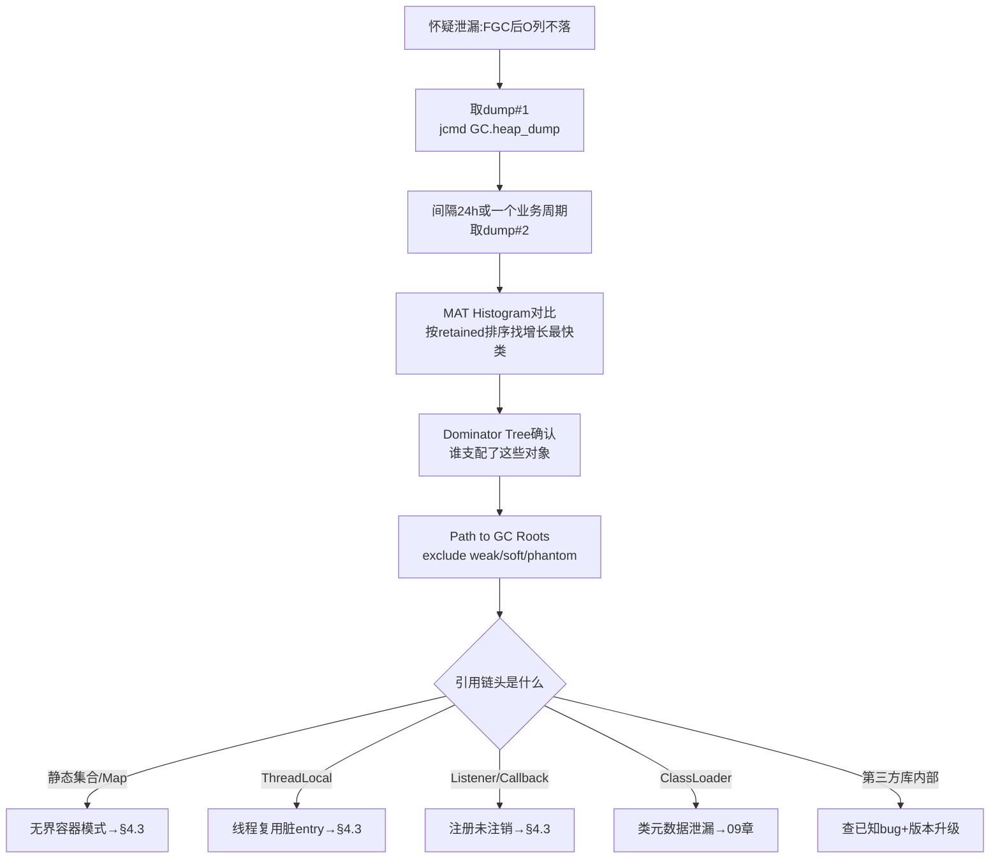

操作细节：
- dump 间隔选择：覆盖至少一个完整的业务周期（天级任务选 25h）；两次都在**FGC 刚结束后**取，排除垃圾干扰；
- MAT 对比：Histogram 视图顶部下拉切换到第二个 dump → 右键 List objects 或直接看 `+/-` 增量列；
- 引用链判读：从可疑对象往上读，直到 GC Roots（线程栈局部变量 / 静态字段 / JNI 引用），**链上最后一个业务类字段就是修复点**。

---

### 4.3 经典泄漏模式 Top10

| # | 模式 | 典型代码特征 | 修复 |
|---|------|-------------|------|
| 1 | 无界静态集合当缓存 | `static Map<K,V> cache = new HashMap<>()` 只 put 不删 | Caffeine：maximumSize + expireAfterWrite |
| 2 | ThreadLocal 忘 remove | 线程池线程复用，value 常驻 | try-finally 里 remove；或阿里 TransmittableThreadLocal 规范用法 |
| 3 | 监听器/回调只注册不注销 | `addListener(this)` 无对应 remove | 生命周期对称管理（@PreDestroy 注销）|
| 4 | ClassLoader 泄漏 | 热部署/Groovy 动态生成新 loader | 复用 loader、显式 close（见 09 章） |
| 5 | 连接池/流未关闭 | 异常路径跳过 close | try-with-resources 全覆盖 |
| 6 | 自定义 equals/hashCode 缺失 | 对象放入 Map 后无法 get/remove（永远 miss） | 补齐两方法或改用不可变键 |
| 7 | 可变对象作 key 后被修改 | hashCode 变化导致 entry 成孤儿 | key 用不可变对象 |
| 8 | 子系统持有外部大对象 | Session/Context 里塞全量数据 | 只存标识，数据外置 Redis |
| 9 | 非堆内 native 资源 | DirectBuffer/JNI/ZipFile 未释放 | 显式 release/close（见 10 章） |
| 10 | 过期引用堆积 | 数组池化后不清尾元素（object pool） | 归还时清空槽位引用 |

**ThreadLocal 专项原理**：每个 Thread 内有 ThreadLocalMap，Entry 的 key 是 WeakReference 指向 ThreadLocal 对象，**value 是强引用**。GC 后 key 可能变 null 但 value 还挂着（stale entry）——线程不死则 value 永不回收。这就是「线程池 + ThreadLocal + 大对象 = 泄漏三兄弟」的机制根源：

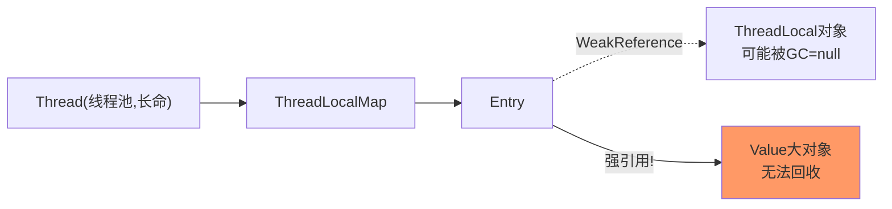

---

### 4.4 MAT 实操速成

```bash
# 服务端抓 dump
jcmd $PID GC.heap_dump /data/dump/app-$(date +%m%d).hprof
# 下载到分析机(MAT 侧 -Xmx ≥ dump×1.5)
scp ... ; # 或走对象存储中转
```

MAT 四个视图的任务分工：

| 视图 | 回答的问题 | 用法要点 |
|------|-----------|---------|
| Overview → Leak Suspects | 「最可疑的泄漏点是哪？」 | 自动报告，先看 Problem Suspect 1/2 |
| Histogram | 「哪类对象最多/最大？」 | 按 Retained Heap 排序；右键 Merge Shortest Paths to GC Roots |
| Dominator Tree | 「谁占着内存不放？」 | 按 Retained 排序；展开树看它支配什么 |
| OQL | 「精确捞某类对象」 | `SELECT s FROM java.lang.String s WHERE s.@retainedHeapSize > 1048576` |

**Path to GC Roots 的选项语义**：`exclude weak/soft references` 是默认推荐——弱软引用随时可回收，不算泄漏根；勾上 include 反而会误导。若链头是 `Finalizer` 相关，转查 finalize 重载与 F-Queue 积压（`jmap -finalizerinfo`）。

**两个 dump 对比实操**：MAT 主界面 → Open Heap Dump 选 dump#1 → Histogram → 顶部工具栏「Compare to another Heap Dump」选 dump#2 → 结果按 Objects 增量排序列出增长最快类。

---

### 4.5 运行时轻量排查手段（拿不到 dump 时）

```bash
# 直方图采样:每10分钟记一次Top20,观察哪些类单调增长
while true; do jmap -histo $PID | head -23 >> histo.log; sleep 600; done
# 分析:awk统计同名类的实例数随时间的变化趋势

# Arthas 在线查静态集合大小
sc -d com.app.CacheHolder          # 确认类来自哪个jar
vmtool --action getInstances --className com.app.CacheHolder \
       --express 'instances[0].cache.size'   # 直接看缓存条数
```

JFR 辅助：开启 OldObjectSample 事件（profile 档默认开）记录「长寿对象」的分配栈，直接回答「这批 8 小时没被回收的对象是在哪里创建的」——JMC 里 Old Object 视图按存活时长排序，比 dump 更早发现泄漏苗头。

---

### 4.6 常见误区

| 误区 | 正确认知 |
|------|---------|
| 内存高就是泄漏 | 先做 FGC 回落实验 + 曲线形态判断，缓存/容量问题很常见 |
| 用 jmap -histo:live 当监控 | 每次 live 都触发 Full GC，高频执行会自己制造 GC 风暴 |
| WeakHashMap 万无一失 | value 强引用 key 时形成环，照样泄漏；且无淘汰策略语义 |
| dump 分析只看最大对象 | 要看 retained（支配树），浅堆最大的往往不是真凶 |
| 泄漏一定在业务代码 | 第三方库 bug（连接池/序列化缓存）占比不低，结合版本 changelog 查 |
| 软引用缓存很安全 | 内存压力下才回收，堆没到阈值前一样无限堆积拖慢 GC |

---

## 面试题精选（含追问）

**Q1：Java 有 GC 为什么还会内存泄漏？（追问：什么对象 GC 永远不会回收？）**

答：GC 回收的前提是「不可达」，泄漏对象是「可达但无用」——静态集合、运行中的线程、加载器等仍持有强引用，可达性分析认为它们是活的。典型如 static Map 缓存只增不减、ThreadLocal 在线程池场景忘 remove。追问：只要从 GC Roots（线程栈、静态字段、JNI 全局引用、活跃的 ClassLoader 及其类）出发存在强引用链的对象永不回收；特殊的是 String 常量池里的 intern 字符串和 Class 对象本身——生命周期跟随其 ClassLoader，bootstrap 层的基本伴随 JVM 终身。

**Q2：怎么在不重启服务的前提下判断是不是泄漏？（追问：dump 太大下载不动怎么办？）**

答：三板斧：①jstat -gcutil 观察 FGC 后 O 列是否回落（连续多次 FGC 不落→高度怀疑）；②定时采样 jmap -histo（不带 live）Top20，看头部类的实例数是否单调上涨；③Arthas vmtool 直接读嫌疑缓存的 size 与抽样内容。三者互相印证即可定性，不必立刻 dump。追问：①服务器本地装 MAT headless 解析出 HTML 报告（ParseHeapDump.sh + suspects 配置）只下载报告；②jmap -histo 输出留存代替 dump；③JFR OldObjectSample 记录长寿对象分配栈，文件只有几十 MB；④确实要 dump 时用 gzip（hprof 压缩比约 3~5 倍）+ 分块传输。

**Q3：ThreadLocal 为什么会导致泄漏？remove 之后呢？（追问：InheritableThreadLocal 在线程池里有什么坑？）**

答：Thread 的 ThreadLocalMap 中 Entry 的 key 是弱引用、value 是强引用；key 被 GC 后 Entry 变 stale（key=null），但 value 仍被线程强引用无法回收，线程池线程长命则堆积。set 相同 ThreadLocal 会覆盖、remove 会清理该 Entry——所以规范是 finally 里 remove。另外 Map 自身在 set/get/remove 时有探测式清理（expungeStaleEntry）兜底，但不保证及时。追问：ITL 只在创建子线程时拷贝一次父线程的值；线程池线程是复用的，子任务拿到的是「上一个任务残留的值」而非当前调用方上下文——链路追踪/用户态传递场景必须用 TTL（TransmittableThreadLocal）并在提交时 wrap，否则既脏又漏。

**Q4：MAT 里浅堆（Shallow）、深堆（Retained）的区别？为什么泄漏分析以 retained 为准？（追问：什么是支配关系？）**

答：浅堆是对象自身占用的堆大小（含头与字段引用槽）；深堆是该对象的 retained size——若它被回收能连带释放的总大小，等于自身浅堆加所有「仅经由它可达」对象的深堆。泄漏分析关心「删谁能释放多少」，所以以 retained 为准。追问：X 支配 Y 指「Y 的所有可达路径都经过 X」；把支配关系建成树就是 Dominator Tree，根节点 retained≈整个堆。注意深堆之和可能大于浅堆之和（共享对象被计入多个支配节点时 MAT 会做精确去重计算），也可能远小于直觉（被更上游节点支配的下级不再重复计）。

**Q5：Caffeine 缓存为什么能防住大部分缓存型泄漏？它自己的坑是什么？（追问：weakKeys 有什么副作用？）**

答：强制 maximumSize/Weight 上限 + W-TinyLFU 淘汰策略 + expireAfter 写入/访问过期，容量天然封顶；相比手动 HashMap 它把「忘记删」的风险收敛为配置问题。坑：①weigher 设置不当会让权重恒 0 导致上限失效；②异步 loading 缓存击穿时要配 sync 构造；③监控命中率与条目数，防止上限本身设得过大变成合法的「慢泄漏」。追问：weakKeys 使 key 进入弱引用，比较时改用 ==（身份相等）而非 equals——自定义 key 类若重写过 equals/hashCode，weakKeys 下会出现「看似相同实则不同条目」的重复缓存，语义完全改变，多数业务场景应该用 expireAfter 而非 weakKeys。

**Q6：线上怀疑第三方 SDK 泄漏，怎么举证推动修复？**

答：四步举证：①dump 引用链显示泄漏对象链头在 SDK 包内（Path to GC Roots 截图）；②检索该 SDK issue 列表与 changelog 是否已有同类问题与修复版本；③最小复现 demo：单独进程调用 SDK 同样路径，复现内存单调上涨（排除自家代码干扰）；④给出规避方案验证：升级到修复版/降级/替换实现后曲线恢复平稳。带着证据提 issue 或推动升级，比「我觉得是它的锅」有效得多。

---

## 考点速查表

| 考点 | 一句话要点 |
|------|-----------|
| 泄漏本质 | 可达但不可用：GC 够得着、业务用不上 |
| 判定标准 | FGC 后 O 不落 + 双 dump 对比单调涨，二者同时成立才算 |
| 定位链路 | Leak Suspects→Dominator Tree→Path to GC Roots(exclude weak/soft) |
| Top 模式 | 无界容器/ThreadLocal/监听器/ClassLoader/流未关/坏 hashCode |
| ThreadLocal 机制 | key 弱 value 强，stale entry 随线程长命堆积，finally remove |
| MAT 对比法 | Histogram Compare to Heap Dump，增量排序锁定增长类 |
| 轻量替代 | histo 定时采样 + Arthas vmtool 读缓存 size + JFR OldObjectSample |
| Caffeine 防漏 | 上限+过期+淘汰把风险变配置问题；weigher=0 是隐形坑 |
| 举证第三方 | 引用链截图+issue 检索+最小复现+替换验证四步闭环 |

---

# 05 · GC 基础原理与收集器演进

> **📌 30 秒速览**
> 1. 所有 GC 的核心是三件事：**怎么找到垃圾**（可达性分析）、**怎么回收空间**（复制/标记-清除/标记-整理）、**怎么让世界停下**（安全点/Safepoint）。
> 2. 三色标记是并发标记的理论底座；漏标的两个条件由「增量更新」（CMS）与「原始快照 SATB」（G1/Shenandoah/ZGC）分别堵住。
> 3. 收集器演进主线 = **停顿越来越短、堆越来越大、并发化程度越来越高**：Serial → Parallel（吞吐优先）→ CMS（低停顿先行者，JDK9 弃用 JEP 291、JDK14 移除 JEP 363）→ G1（JDK9 起默认）→ ZGC/Shenandoah（亚毫秒停顿，ZGC 分代模式 JDK21 落地 JEP 439）。
> 4. 选型不是越新越好：吞吐型批处理 Parallel 依然能打；通用服务 G1 是默认答案；超大堆+极致尾延迟才上 ZGC。核实时间线见 [13-附录](13-appendix-references.md)。

---

### 5.1 垃圾判定：引用计数 vs 可达性分析

| 方案 | 原理 | 缺陷 | 采用者 |
|------|------|------|--------|
| 引用计数 | 对象被引用数+1，失效-1，0 即垃圾 | 循环引用无法回收；计数维护开销 | CPython（辅以分代）、COM |
| 可达性分析 | 从 GC Roots 出发遍历对象图 | 需要 STW 一致性快照（或并发协议） | HotSpot 及主流 JVM |

GC Roots 清单：虚拟机栈局部变量表引用的对象、方法区静态字段与常量引用、JNI 全局引用、活跃线程本身、同步锁持有的对象、JMXBean 等。

四种引用强度与回收时机：

| 引用 | 回收时机 | 典型用途 | 类 |
|------|---------|---------|-----|
| 强 | 永不（可达时） | 普通变量 | - |
| 软 SoftReference | 内存不足时 | 缓存 | `SoftReference` |
| 弱 WeakReference | 下次 GC 必收 | ThreadLocalMap key、WeakHashMap | `WeakReference` |
| 虚 PhantomReference | 随时可收，仅用于通知 | 堆外内存释放回调（Cleaner 底座） | `PhantomReference` |

---

### 5.2 三色标记与并发标记的两个问题


**并发标记的核心矛盾**：用户线程与 GC 线程同时改引用，可能把「黑→白」直接相连且「灰→白」路径断开，导致白色对象被误杀——即**浮动垃圾**（多标，可容忍，下轮再收）与**对象消失**（漏标，致命）。

漏标同时满足两个条件：
1. 赋值器插入了一条或多条**黑到白**的新引用；
2. 赋值器删除了全部**灰到白**的直接或间接引用。

两大流派各堵一个条件：

| 方案 | 堵哪个条件 | 实现 | 使用者 |
|------|-----------|------|--------|
| 增量更新 Incremental Update | 条件1（黑挂新白→把黑变灰重扫） | 写屏障记录新增引用 | CMS |
| 原始快照 SATB | 条件2（灰断旧白→按快照当活处理） | 写屏障记录删除引用 | G1、Shenandoah |

SATB 产生浮动垃圾但标记更快（一次搞定）；增量更新需 rescan 黑色节点，CMS 最终标记耗时波动大——这是 G1 替代 CMS 的理论优势之一。

**写屏障**：在引用赋值前后插入的 AOP 式小段代码（类似拦截器），把变更记入队列供并发标记修正。它是并发标记正确性的执行机制，也是 G1 维护 Remembered Set 的手段。

---

### 5.3 安全点与安全区域

STW 操作（Young GC、Final Mark、偏向锁撤销等）必须等所有用户线程跑到安全点（Safepoint）才能开始。安全点是指令流中特定位置（方法调用、循环回跳、异常跳转），保证此处寄存器/栈帧的引用信息可被准确枚举。

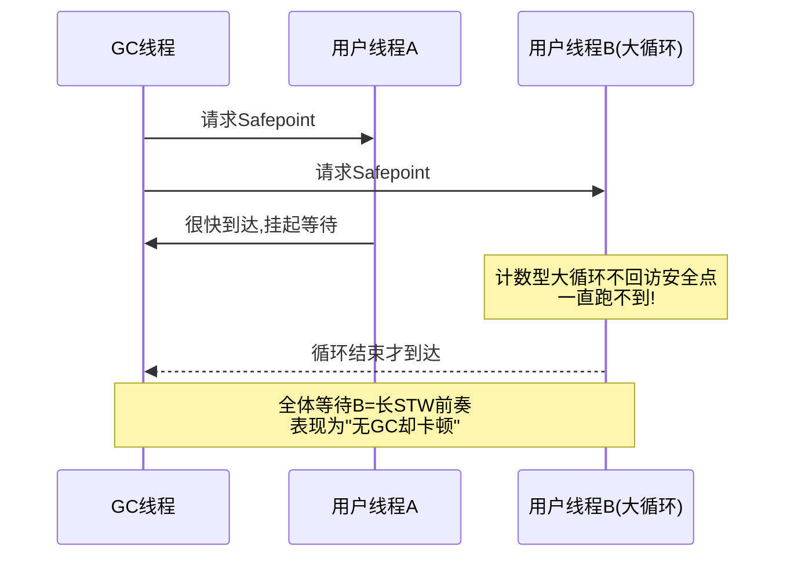

排查线索：日志出现 `Reaching safepoint` 耗时高（`-Xlog:safepoint`），但真正 GC 操作很短——就是有线程迟迟到不了安全点。JDK10 后引入循环分层数（loop strip mining）缓解计数循环问题。

**安全区域**是安全点的扩展：线程处于 Sleep/Blocked 时无法主动跑到安全点，用安全区域（一段引用关系不变的代码区间）登记后即可安心睡，醒来时检查是否度过了发起阶段。

---

### 5.4 经典收集器谱系

```mermaid
flowchart LR
    subgraph "新生代"
        SER["Serial<br/>单线程复制"] 
        PAR["ParNew<br/>Serial多线程版(CMS搭档)"]
        PSY["Parallel Scavenge<br/>吞吐优先"]
    end
    subgraph "老年代"
        SOC["Serial Old<br/>标记整理"]
        PCMS["CMS<br/>并发标记清除"]
        POC["Parallel Old"]
    end
    subgraph "整堆"
        G1["G1<br/>Region化,可预测停顿"]
        ZGC["ZGC<br/>着色指针,亚毫秒"]
        SH["Shenandoah<br/>转发指针,亚毫秒"]
    end
    SER --- SOC
    PAR ---|"配套"| PCMS
    PSY --- POC
```

| 收集器 | 算法 | 线程 | 目标 | 状态 |
|--------|------|------|------|------|
| Serial / Serial Old | 复制 / 标整理 | 单线程 | 简单高效 | 客户端/小内存仍在用 |
| ParNew | 复制 | 多线程 | 配合 CMS | JDK14 随 CMS 移除 |
| Parallel Scavenge / Old | 复制 / 标整理 | 多线程 | **吞吐量**最大 | 吞吐场景默认(JDK8 默认) |
| CMS | 标记-清除 | 并发 | **停顿**最短(当时) | JDK9 弃用→JDK14 移除 |
| G1 | Region 化标整(整体) | 并发 | 停顿可控可预测 | **JDK9+ 服务端默认** |
| ZGC | 着色指针+读屏障 | 并发(几乎全程) | 亚毫秒停顿 | JDK11 实验→15 生产→21 分代 |
| Shenandoah | 转发指针+读屏障 | 并发 | 亚毫秒停顿 | Red Hat 主导，OpenJDK 提供 |
| Epsilon | 无操作 | - | 实验基准/短命任务 | 不回收，跑完就退 |

**CMS 七阶段速记**（面试高频）：初始标记(STW,只标 Roots 直连) → 并发标记(与用户并发) → 重新标记(STW,修正并发期变动,增量更新) → 并发清除 → 并发重置。三个痛点：CPU 敏感（并发占核）、浮动垃圾（标记期间新垃圾只能下次）、**标记-清除碎片**（大对象放不下提前触发 Full GC）+ 并发失败退化为 Serial Old（concurrent mode failure）。

---

### 5.5 G1：Region 化与可预测停顿

G1 把堆切成 ~2048 个等大 Region（1~32MB，2 的幂），每个 Region 动态扮演 Eden/Survivor/Old/Humongous 角色，不再物理隔离各代：

```mermaid
flowchart TD
    subgraph "G1堆布局"
        R1["E"] --- R2["O"] --- R3["H(humongous)"] --- R4["E"] --- R5["S"] --- R6["O"] --- R7["空闲"] --- R8["H连续区块"]
    end
    RSET["每Region一张RSet<br/>谁引用了我(点入引用)"]
    CARD["Card Table 卡表<br/>我引用了谁(点出)"]
    RSET -.维护靠写屏障.-> R8
```

关键机制：
- **Humongous 判定**：对象 ≥ Region 一半即为 humongous，占用一个或多个连续 Region，逻辑上属老年代——**大对象泛滥会打乱 G1 的回收节奏与停顿预测**（06 章实战）；
- **RSet（Remembered Set）**：解决「老年代单独分区指向新生代」的点入引用，避免回收单区时全堆扫描；代价是写屏障维护开销与额外内存（大堆可达数百 MB）；
- **停顿预测模型**：统计每个 Region 回收成本（历史均值），每次 Young GC / Mixed GC 在 `-XX:MaxGCPauseMillis`（默认 200ms）预算内挑性价比最高的 Region 集合（CSet）来收；
- **Mixed GC**：老年代占比达 `InitiatingHeapOccupancyPercent`(IHOP,默认45%) 后启动并发周期，随后几轮 Young GC 顺带回收部分老年代 Region；
- **失败退化链**：并发标记跟不上分配 → `to-space exhausted` → Full GC（单线程 Serial Old 兜底，JDK10 后并行化）——这是 G1 最需要避免的雪崩路径。

---

### 5.6 ZGC 与 Shenandoah：亚毫秒时代

**ZGC 核心技术**：
- **着色指针（Colored Pointers）**：64 位指针中借几位存 GC 元数据（Marked0/Marked1/Remapped/Finalizable），GC 状态直接编码在指针里；
- **读屏障（Load Barrier）**：线程加载引用时检查指针颜色，发现过期则触发「自愈」——更新为最新地址后再返回。应用看到的永远是有效引用；
- **并发整理**：对象搬迁（Relocation）阶段用户线程几乎不停——因为读屏障自愈兜住了「搬到一半被读到」的情况；停顿只存在于根部扫描等极小窗口，与堆大小无关；
- **分代 ZGC（JEP 439, JDK21）**：非分代版本对短命对象也要全堆标记，浪费明显；分代后年轻代独立回收，吞吐损失大幅缩小，成为生产推荐形态（详见附录核实条目）。

**Shenandoah 差异点**：不用着色指针（兼容更多平台），改用 **Brooks 转发指针**（对象头前加一跳转槽，搬迁后旧对象指向新地址），配合读写屏障实现并发整理。OpenJDK 内置，Oracle JDK 不含。

**两者共同适用边界**：停顿 <1ms 且与堆解耦（TB 级堆同样亚毫秒）；代价是吞吐损失（历史上 10%~15%，分代 ZGC 后大幅改善）与更高 CPU/内存开销。中小堆、吞吐敏感服务留在 G1 通常更优。

---

### 5.7 选型决策

```mermaid
flowchart TD
    S["收集器选型"] --> Q1{"JDK版本"}
    Q1 -->|"8"| A1["Parallel(默认)或CMS(遗留)<br/>升级是根治"]
    Q1 -->|"11"| A2["G1(默认)为主<br/>大堆低延迟试ZGC"]
    Q1 -->|"17/21+"| A3["G1默认<br/>延迟敏感上ZGC(21开分代)"]
    A3 --> Q2{"业务特征"}
    Q2 -->|"批处理/离线计算"| B1["Parallel 吞吐最大化"]
    Q2 -->|"通用在线服务"| B2["G1 + 合理停顿目标"]
    Q2 -->|"超大堆/尾延迟敏感<br/>网关/交易核心"| B3["ZGC 分代模式"]
```

常见误区提示：MaxGCPauseMillis 设得过小（如 20ms）会让 G1 把新生代压得过小 → YGC 变得极频繁 → 总吞吐崩塌；参数调优见 06 章。

---

## 面试题精选（含追问）

**Q1：CMS 和 G1 的区别？为什么 CMS 被 G1 取代？（追问：CMS 的 concurrent mode failure 是什么？）**

答：算法层面 CMS 是纯标记-清除（碎片累积），G1 是 Region 化的标记-整理（Region 间复制，无碎片）；范围层面 CMS 只管老年代（配 ParNew），G1 整堆管理；停顿控制上 CMS 只能被动接受，G1 有停顿预测模型主动挑选 CSet 凑预算；工程层面 G1 的 SATB 重标记比 CMS 增量更新的 rescan 更稳，RSet 让增量回收成为可能。取代原因还包括 CMS 维护成本高（JEP 291 弃用理由：历史包袱重、新特性无法受益）。追问：并发回收速度赶不上老年代填充（预留空间耗尽）触发 concurrent mode failure，退化为单线程 Serial Old Full GC，停顿秒级——预防手段是合理调 CMSInitiatingOccupancyFraction 触发阈值并留足老年代余量。

**Q2：什么是三色标记？SATB 和增量更新的本质差异？（追问：为什么 G1 选 SATB？）**

答：三色是把对象分为未访问(白)/已访问未扫完(灰)/已扫完(黑)的标记抽象；并发标记下若「黑新增到白的引用」与「灰到白的引用全断」同时发生，白对象会被漏标误杀。增量更新破坏条件一（黑挂白时把黑重新变灰，CMS 用），SATB 破坏条件二（删除引用时按标记开始时的快照视存活，G1/Shenandoah 用）。追问：SATB 的重标记只需处理快照期间的引用删除记录，工作量小且稳定；增量更新要重新扫描所有变黑的节点，最终标记时长不可控——对追求停顿可预测的 G1 来说 SATB 是必然选择，代价是产生浮动垃圾（本轮多标，下轮回收，不影响正确性）。

**Q3：安全点是什么？为什么会有「GC 日志正常但服务还是卡了一下」？（追问：怎么定位到不了安全点的线程？）**

答：安全点是线程可以暂停下来让 JVM 枚举引用的特定位置；只有全体线程都到达安全点，STW 操作才能开始。「GC 正常却卡顿」的经典原因就是 Reaching Safepoint 时间长——某线程在计数型大循环/大数组操作里长时间不经过安全点，其他线程全部挂着等它。追问：加 `-Xlog:safepoint`（JDK8 为 `-XX:+PrintSafepointStatistics`）看每次停顿的 spin/block/walk 分解，walk 高=有线程晚到；再用 JFR 的 Safepoint Begin/End 事件对齐线程 dump 找到那个还在 RUNNABLE 干活的线程；根治是拆解超长循环（编译器会在 counted loop 插安全点，某些 int 计数循环优化后反而不插，JDK10 loop strip mining 已缓解）。

**Q4：G1 的 Humongous 对象为什么是问题之源？怎么治理？（追问：G1HeapRegionSize 怎么定？）**

答：≥Region 一半的对象走 humongous 通道：①占用连续 Region 且逻辑属老年代，年轻代回收碰不到它；②分配时可能触发并发标记提前启动（IHOP 抢占）；③大量中等偏大的对象把 Region 打碎，CSet 选择余地变小，停顿预测失准；④回收依赖并发周期，清理不及时就会 to-space exhausted。治理：排查大分配来源（JFR allocation 事件/火焰图）、业务侧切片化传输、必要时调大 RegionSize 让对象不再过半。追问：G1 自动把平均堆大小切 2048 份取 2 的幂（如 32G 堆≈16M Region）；显式设置的原则是「预期最大常规对象的一半以下」，比如业务峰值对象 4MB 就设 8M Region；设太大浪费空间（humongous 判定变严反而好，但小 Region 数减少影响并行度），一般保持自动 + 治理大对象。

**Q5：ZGC 为什么能把停顿做到亚毫秒且和堆大小无关？（追问：分代 ZGC 解决什么问题？）**

答：三个支柱：①着色指针把 GC 元数据内嵌指针，状态判断 O(1)；②读屏障+自愈让「访问被搬移对象」的用户线程自己完成引用修复，无需停下来等 GC；③几乎所有重活（标记、搬迁、重映射）都与用户线程并发，STW 只剩根节点扫描的小窗口，而这个窗口随根集合而非堆大小增长——所以 TB 级堆照样亚毫秒。追问：非分代 ZGC 对绝大多数「朝生夕死」的对象也做全堆标记，标记成本高、吞吐损失明显（这也是它长期不如 G1 普及的主因）；JDK21 的 JEP 439 引入分代支持，年轻代独立快速回收，吞吐损失大幅收敛，官方建议默认开启分代模式。

**Q6：吞吐量优先和延迟优先怎么量化取舍？（追问：给出你选 G1 参数的第一组基线。）**

答：吞吐=应用时间/(应用时间+GC时间)，延迟=单次停顿与尾延迟分布。二者结构性冲突：并发收集器用更多 CPU 换停顿（总吞吐下降但响应变好）。量化方法：从 SLA 反推——接口 P99 要求 100ms 时，单次 GC 停顿预算不能超过其零头（如 50ms）；批处理任务则看总完成时间，Parallel 的 STW 频率虽高但每次利用率最高。追问：G1 起步基线：MaxGCPauseMillis=200（先保守，观察真实分布再收紧）、堆 Xms=Xmx 防伸缩抖动、InitiatingHeapOccupancyPercent 保持自适应（JDK9+ 默认随停顿目标动态调整）、开启 `-Xlog:gc*,gc+heap=debug` 观察真实停顿构成后再迭代。

---

## 考点速查表

| 考点 | 一句话要点 |
|------|-----------|
| 垃圾判定 | 可达性分析为准；强软弱虚四级引用决定回收时机 |
| 三色漏标条件 | 黑挂新白 + 灰断旧白同时发生才漏；两流派各堵其一 |
| SATB vs 增量更新 | G1/Shenandoah 用 SATB(快照)，CMS 用增量更新(重扫黑) |
| 安全点卡顿 | Reaching safepoint 长=有线程晚到，-Xlog:safepoint 定位 |
| CMS 七字诀 | 初标(STW)→并发标→重标(STW)→并发清；碎片+CMF 两死穴 |
| G1 核心 | Region 化+RSet 点入引用+停顿预测选 CSet+Mixed GC |
| Humongous | ≥Region/2 进特殊区，打乱节奏；治理靠切片/调 RegionSize |
| G1 雪崩链 | 并发慢于分配→to-space exhausted→Serial Old Full GC |
| ZGC 三支柱 | 着色指针+读屏障自愈+几乎全程并发；21 起分代成推荐 |
| 选型口诀 | 吞吐 Parallel、通用 G1、超大堆低延迟 ZGC；版本决定可选集 |

---

# 06 · GC 问题定位与调优实战

> **📌 30 秒速览**
> 1. GC 问题三大症状：**YGC 频繁**（分配速率问题）、**FGC 频繁**（老年代/元空间问题）、**单次停顿长**（大堆 Full GC / G1 混收 / Humongous）。先归类再调参，方向错全错。
> 2. 调优第一原则：**先看分配速率再看堆参数**——分配速率过高时任何收集器都救不了，治理对象创建才是根。
> 3. GC 日志是唯一事实：`-Xlog:gc*`（JDK9+）/ `-XX:+PrintGCDetails`（JDK8）必开，用 GCEasy/gcviewer 离线分析。
> 4. G1 调优先校准 `MaxGCPauseMillis` 与 Humongous；ZGC 调优先确认分代模式与并发线程数。不要一次改多个参数。

---

### 6.1 GC 问题定位总框架

```mermaid
flowchart TD
    S["GC 告警/停顿毛刺"] --> L["第一步:开/取GC日志<br/>-Xlog:gc*:file=gc.log:time,uptime,level,tags"]
    L --> A["jstat -gcutil 实时确认<br/>E/O/M/YGC/FGC 走势"]
    A --> Q{"主症状"}
    Q -->|"YGC频繁"| Y1["§6.2 分配速率路径"]
    Q -->|"FGC频繁"| Y2["§6.3 老年代路径"]
    Q -->|"单次停顿长"| Y3["§6.4 停顿构成分析"]
    Q -->|"G1特有"| Y4["§6.5 G1专项"]
    Y1 --> V["改后验证:同口径对比<br/>停顿分布/频率/吞吐"]
    Y2 --> V
    Y3 --> V
    Y4 --> V
```

日志格式速查（JDK9+ 统一日志）：

```bash
# 基础(生产常驻)
-Xlog:gc:file=/data/logs/gc.log:time,uptime:filecount=5,filesize=50m
# 详细(排查期)
-Xlog:gc*:file=/data/logs/gc.log:time,uptime,level,tags:filecount=5,filesize=100m
# JDK8 对应
-XX:+PrintGCDetails -XX:+PrintGCDateStamps -Xloggc:/data/logs/gc.log \
-XX:+UseGCLogFileRotation -XX:NumberOfGCLogFiles=5 -XX:GCLogFileSize=50M
```

一条 YGC 日志的读法：`[Pause Young (Normal) (G1 Evacuation Pause)] 2048M->256M(8192M) 45ms`——回收前后存活对比、总堆、停顿。重点看**回收后的存活量**（256M 是真实工作集）与**停顿分布**而非单次值。

---

### 6.2 YGC 频繁：分配速率问题

**判定**：jstat 观察 E 列从满到清的周期；计算分配速率 = Eden 大小 ÷ YGC 间隔。健康参考：普通服务 <1GB/s，超过说明有热点分配或流量突增。

```mermaid
flowchart TD
    S["YGC频繁"] --> Q1{"分配速率高吗"}
    Q1 -->|"是"| Q2{"合理业务量?"}
    Q2 -->|"是,就是流量大"| A1["加大Eden/新生代<br/>减少YGC频率"]
    Q2 -->|"否,异常热点"| A2["JFR Allocation采样/火焰图<br/>定位分配大户代码→治理"]
    Q1 -->|"否,YGC间隔短但Eden没满"| Q3{"Survivor/Old异常?"}
    Q3 -->|"晋升过快"| A3["§6.3 提前晋升路径"]
    Q3 -->|"元空间触发FGC连带"| A4["转09章"]
```

高频分配热点代码模式（火焰图上常见平顶）：

| 模式 | 例 | 治理 |
|------|-----|------|
| 循环内拼接 | `+=` 字符串循环拼接 | StringBuilder 预分配 |
| 日志滥用 | 高频 debug 未判级别直接拼参 | 占位符 `{}` + isDebugEnabled |
| 序列化反复构造 | 每次 RPC new ObjectMapper | 静态复用（它线程安全） |
| 包装类装箱 | Long/Integer 大量自动装箱循环 | 改原生类型流/局部变量 |
| 正则每次编译 | `str.matches()` 隐式 Pattern.compile | Pattern 预编译 static |
| 流式中间集合 | stream 多次 map 产生中间容器 | 合并转换步骤 |

**方案**：
1. 治理热点（根治，优先）；
2. 加大新生代：`-Xmn` 或 G1 下放宽 pause 目标让 G1 自动扩 young——注意新生代过大拉长单次 YGC 复制时间，需看单次停顿是否可接受；
3. Survivor 不足导致「复制多次才死」的对象过早晋升 → 见 §6.3。

---

### 6.3 FGC 频繁：老年代与元空间问题

**判定**：jstat O 列高位、FGC 计数持续增长；每次 FGC 后 O 回落程度决定方向。

```mermaid
flowchart TD
    S["FGC频繁"] --> Q1{"FGC后O列回落吗"}
    Q1 -->|"不落,阶梯涨"| A1["泄漏→04章流程<br/>dump对比定位"]
    Q1 -->|"回落后很快再满"| Q2{"M列也高?"}
    Q2 -->|"是"| A2["元空间触顶连带FGC<br/>→09章 查类加载"]
    Q2 -->|"否"| Q3{"有System.gc()调用?"}
    Q3 -->|"RMI/JNI/代码显式"| A3["先查调用来源<br/>再考虑DisableExplicitGC"]
    Q3 -->|"无"| A4["老年代容量不足或晋升过快"]
    A4 --> Q4{"晋升速率高?"}
    Q4 -->|"YGC后O增量异常大"| A5["提前晋升:Survivor不足/大对象<br/>调Survivor区或治理大对象"]
    Q4 -->|"正常但堆小"| A6["扩堆/扩实例(容量型)"]
```

**提前晋升（premature promotion）识别**：每次 YGC 日志里 `-> XXXM` 后半段（晋升量）长期偏高，且 YGC 间隔规律性变短——Survivor 太小装不下存活对象，被迫挤进老年代。验证：JDK8 用 `-XX:+PrintTenuringDistribution` 看各年龄对象体积分布。

**System.gc() 排查**：JDK9+ 加 `-Xlog:gc+cause=debug`，日志会记录每次 GC 的触发原因与调用来源；RMI 定时触发、JNI 库、业务显式调用是三大常见源。注意：NIO 的 Bits.reserveMemory 在直接内存超限时也会主动 System.gc()（见 03 章 Direct buffer），此时 DisableExplicitGC 反而有害——需要配合 MaxDirectMemorySize 充足。

---

### 6.4 单次停顿长：停顿构成分析

停顿长的四类来源：

| 类型 | 特征 | 定位 |
|------|------|------|
| 真·Full GC | 日志明确 Full GC 字样 | 按 §6.3 查根因 |
| G1 Mixed GC 长 | Pause Young (Mixed) 停顿远超目标 | §6.5 CSet 过大 |
| Humongous 分配卡顿 | 日志 humongous allocation 相关 + 停顿尖刺同步 | §6.5 |
| 非 GC 停顿 | GC 正常但 STW 时间对不上 | 安全点问题(05章§5.3)/偏向锁撤销/类加载 |

分析工具链：

```bash
# 离线分析(推荐):上传到 gceasy.io 或本地 gcviewer
# 关注:停顿分布(P99/P999) 而非平均值;Promotion 速率;FGC 原因分布
# JFR 补充:看每阶段耗时构成
jfr print --events jdk.GarbageCollection rec.jfr | head -50
```

**停顿预算思维**：SLA 要求 P99 < 200ms 时，单次 GC 停顿应 <50ms 且频率可控。把「停顿×频率」算成每天的总 STW 预算，超了才动手，避免过度调优。

**swap 专项**：停顿异常长（秒级）且 CPU 低时查 swap：`vmstat` si/so 列持续非零 = 内存页被换出，GC 扫描时缺页重试。处理：关 swap（生产 JVM 标配 `vm.swappiness=1`）或降内存占用。

---

### 6.5 G1 专项调优

G1 调优先回答三个问题。

**① 停顿目标合理吗？**
MaxGCPauseMillis 是硬约束的「愿望」：设太小 → young 区被压小 → YGC 频率暴涨 → 吞吐崩塌。校准方法：从默认 200ms 出发，观察真实停顿分布，逐步收紧到「90% 达标」的水平，不追求 100%。

**② Humongous 泛滥吗？**

```mermaid
flowchart LR
    H["humongous分配"] --> I["检查日志:Humongous regions占比"]
    I -->|"高"| J1["业务侧:大对象切片<br/>分页查询/流式导出"]
    I -->|"中等偏大对象多"| J2["调G1HeapRegionSize<br/>让最大常规对象<Region一半"]
    J2 --> K["观察:Mixed回收效率回升<br/>to-space exhausted消失"]
```

日志证据：`Pre Evacuation Collection Set` 阶段耗时高、`Humongous regions: X->Y` 数量大、to-space exhausted 出现即告警级事件。

**③ 并发周期跟得上吗？**
IHOP 自适应（JDK9+ 默认开启 `-XX:+G1UseAdaptiveIHOP`）一般不用手动设；若并发标记期间老年代增速超过标记速度，会 to-space exhausted → Full GC。手段：降低分配/晋升速率（治本）、预留更多堆余量、极端时手动下调 InitiatingHeapOccupancyPercent 提前启动并发周期。

**G1 参数速查表**：

| 参数 | 默认 | 说明 |
|------|------|------|
| MaxGCPauseMillis | 200ms | 停顿目标，过小适得其反 |
| G1HeapRegionSize | 自动(~2048份取2^n) | 手动设需评估最大对象 |
| InitiatingHeapOccupancyPercent | 45(自适应) | 并发周期启动阈值 |
| G1ReservePercent | 10 | 预留防 to-space exhausted |
| ConcGCThreads | 自动 | 并发标记线程数 |
| G1MixedGCCountTarget | 8 | 一轮混收拆几次 |
| G1HeapWastePercent | 5 | 可浪费比例,低于则停止混收 |

---

### 6.6 ZGC 专项要点

- **确认分代模式**：JDK21+ 默认启用分代（核实见附录）；JDK17 用非分代版本，吞吐损失明显；
- 关键参数少而精：`-XX:+UseZGC -XX:+ZGenerational`(21)；堆给足——ZGC 以空间换延迟，建议 Xmx 为工作集 2~3 倍；
- 停顿仍偶发毫秒级时的排查点：`-Xlog:gc*` 看 `Pause Mark Start/End`、`Pause Relocate Start` 三段耗时；Load Barrier 开销体现在用户线程变慢而非停顿数字里；
- 容器内注意 ZGC 的元数据内存会让 RSS 显著高于 Xmx，RSS 公式要放大预估（见 10 章）。

---

### 6.7 调优案例模板（照此复盘）

> **背景**：网关服务 8C16G，JDK17 G1，Xmx8g。高峰期 P999 从 80ms 劣化到 800ms。
> **定位**：GC 日志显示 Pause Young (Mixed) 单次 300ms+；Humongous regions 高峰 400+；业务侧有大报文 JSON 解析。
> **动作**：①大报文改流式解析（根治分配源头）；②RegionSize 保持自动，观察 humongous 降到 <50；③pause 目标从 200 收紧到 100，让 young 更积极回收短命对象。
> **结果**：P999 回落到 120ms；Mixed GC 停顿 P99 45ms。
> **教训**：先治分配再调参数；每次只改一个变量并观察一个完整高峰周期。

---

## 常见误区

| 误区 | 正确认知 |
|------|---------|
| 上来就换 ZGC 解决一切 | 分配速率过高时 ZGC 也救不了；先治热点再谈收集器 |
| MaxGCPauseMillis 设越小越好 | 过小→新生代压缩→YGC 暴涨→吞吐崩塌，反向操作 |
| 只看平均停顿 | 决定用户体验的是 P999 与毛刺，必须看分布 |
| DisableExplicitGC 万能 | 会害死 NIO 直接内存回收路径，先查 System.gc() 来源 |
| 新生代越大越好 | 复制时间随存活量涨，YGC 停顿同步变长，需平衡 |
| 调优一次改多个参数 | 无法归因；单变量原则+完整周期观察 |
| FGC 少就万事大吉 | 单次秒级 FGC 比频繁 50ms 更伤 SLA，看总停顿预算 |

---

## 面试题精选（含追问）

**Q1：线上 YGC 每分钟 30 次，怎么优化？（追问：为什么加大新生代后 YGC 反而变慢了？）**

答：三步走：①jstat -gcutil 算分配速率=Eden÷间隔，判断是流量合理增长还是异常热点；②异常热点用 JFR Allocation 采样/火焰图锁定代码（常见：循环拼串、重复 Pattern.compile、反复 new ObjectMapper）；③治理后仍高则加大 Eden 减少频率，同时盯单次 YGC 停顿是否可接受。追问：新生代变大后需要复制的存活对象可能没变多，但扫描范围与卡表维护变大，且 Survivor 同比变大后对象在 Survivor 间来回复制次数增多——若大部分对象其实活不过一轮，更大的新生代只是把同样的复制成本攒到一次做，表现为频率降了但单次更慢；正确目标是「频率×单次成本」最小化，不是单一指标最优。

**Q2：FGC 频繁但 dump 显示没有明显泄漏大户，可能是什么？（追问：DisableExplicitGC 有什么风险？）**

答：五个方向逐一排除：①元空间触顶连带 FGC（jstat M 列）；②System.gc() 显式调用（RMI 定时任务/JNI 库/业务代码），gc log cause 字段直接可见；③提前晋升——Survivor 太小或动态年龄判定导致年轻代存活大量涌入老年代，特征是 YGC 后 O 列跳升明显；④堆容量确实不足（流量涨了），FGC 后能回落但水位整体抬升；⑤碎片化（CMS 时代）或 G1 humongous 占用导致「看着满」。追问：风险在于 NIO 的 Bits.reserveMemory 在直接内存超限时靠主动 System.gc() 触发 Cleaner 回收堆壳；禁掉后该路径失效，Direct buffer memory OOM 概率大增——必须配合充足的 MaxDirectMemorySize 并排查调用方。

**Q3：G1 出现 to-space exhausted 怎么处理？（追问：G1ReservePercent 为什么能预防？）**

答：含义是疏散（evacuation）时预留空间耗尽，本次 Young/Mixed GC 升级为 Full GC（历史上退化为串行）。处理顺序：①查 humongous 是否泛滥（连续 Region 吃掉预留），治理大对象；②看并发标记是否滞后于晋升——降低分配速率或提前启动并发周期；③上调 G1ReservePercent（默认 10%）扩大预留。追问：G1 的疏散是「先拷到新 Region 再释放旧的」，必须持有目标空间；ReservePercent 就是从堆里划出的应急缓冲池，to-space exhausted 本质是这块空间+自由 Region 同时枯竭——扩大它等于给洪峰留泄洪区，代价是常态可用堆变小，需权衡。

**Q4：怎么从日志判断「停顿是 GC 引起的」还是「别的原因卡顿」？（追问：安全点日志怎么看？）**

答：对齐三个时间轴：应用慢请求时间戳、GC 停顿区间、STW 总时长（含非 GC STW）。GC 停顿解释不了的长尾就是别的 STW：安全点等待、偏向锁批量撤销、类加载/反优化。追问：JDK9+ 用 `-Xlog:safepoint` 输出每次进入安全点的 spin+block+walk 时长分解；walk 大=有线程晚到安全点；结合 `-Xlog:gc+cause=debug` 区分停顿 cause；JFR 的 Safepoint Begin/Wait 事件可视化更直观，对长 walk 时段的线程栈快照一抓一个准。

**Q5：给出你接手一个新服务的 GC 配置基线与观察指标。（追问：什么时候考虑升级 JDK 版本而不是继续调参？）**

答：基线：Xms=Xmx（防伸缩抖动）、G1 默认收集器 + MaxGCPauseMillis=200、开统一 GC 日志轮转、HeapDumpOnOutOfMemoryError 兜底、容器按 12 章 MaxRAMPercentage 基线。观察一周后按症状迭代：分配率高→治理热点；Mixed 长→humongous 治理；YGC 频繁→Eden 校准。指标：停顿分布（P99/P999）、YGC 间隔、晋升速率、FGC 归因分布、总 STW 占比。追问：三类信号时升级优于调参：①需要的特性只在新版存在（分代 ZGC、虚拟线程）；②当前版本有已知 GC bug 且修复在新版；③同硬件新版基准性能显著更高。升级前压测回归，重点验证停顿分布而非吞吐均值。

**Q6：为什么 ZGC 推荐堆给到工作集 2~3 倍？（追问：这和它的并发整理机制有什么关系？）**

答：ZGC 几乎全程并发，整理期间新旧两份对象共存（搬迁未完成时原位置与新位置都占内存），加上浮动垃圾与标记期间的新分配，瞬时峰值占用可达工作集两倍以上；堆不足会触发分配停顿（Allocation Stall）反而伤延迟。追问：读屏障自愈机制允许用户线程读到「已搬迁但引用未更新」的对象并当场修复，这要求搬迁采取「先复制后清源」的乐观策略——空间冗余正是这个策略的安全边际；G1 的疏散同理但以 Region 粒度控制节奏，ZGC 粒度更细所以对余量更宽容，但底线同样是不能没有余量。

---

## 考点速查表

| 考点 | 一句话要点 |
|------|-----------|
| 三大症状归类 | YGC 频繁=分配率；FGC 频繁=老年代/元空间；单次长=Full/混收/Humongous |
| 分配速率公式 | Eden÷YGC间隔；先治热点再调堆，方向不能反 |
| 提前晋升信号 | YGC 后 O 跳升大；Survivor 不足或动态年龄判定所致 |
| System.gc() 三源 | 业务显式/RMI/JNI+NIO 直接内存兜底，禁用前先查来源 |
| 停顿预算法 | SLA 反推单次停顿上限与每日总 STW 预算，超了才动 |
| G1 停顿目标 | 过小适得其反；从 200 出发按真实分布逐步收紧 |
| to-space exhausted | 疏散空间枯竭→退化 Full GC；治 humongous+提预留 |
| swap 干扰 | si/so 非零=缺页拖慢 GC；swappiness=1 或关 swap |
| ZGC 空间换延迟 | 堆=工作集 2~3 倍；不足触发 Allocation Stall |
| 单变量原则 | 一次只改一个参数，观察一个完整业务周期再迭代 |

---

# 07 · CPU 飙高：定位四步法与高频根因

> **📌 30 秒速览**
> 1. 先分清 `us`（应用+GC）/`sy`（内核+锁自旋）/`wa`（IO 等待）：us 高走「top -Hp → printf 十六进制 → jstack 对号」标准链路；sy 高查上下文切换与系统调用。
> 2. jstack 单帧不可信——线程栈时刻在变，**三连拍（间隔 5s）对比**或直接 async-profiler 火焰图才有统计意义。
> 3. CPU 高但业务线程都 WAITING？大概率是 GC 线程在烧 CPU，转 GC 排查路径（06 章）。
> 4. 高频根因 Top4：正则灾难回溯、循环失控/死循环、序列化热点、GC 自身。容器里还要先排除 CPU throttle 假象（10 章）。

---

### 7.1 定位总流程

```mermaid
flowchart TD
    S["CPU告警/top显示java进程高"] --> Q0{"宿主机还是容器"}
    Q0 -->|"容器"| C0["先看cpu.stat是否throttled<br/>→10章排除限流假象"]
    Q0 -->|"宿主机"| Q1{"top里us还是sy高"}
    Q1 -->|"us高"| A1["top -Hp PID 找最忙TID"]
    A1 --> A2["printf '%x' TID 转十六进制"]
    A2 --> A3["jstack PID 三连拍<br/>grep nid=0x??? 定位线程栈"]
    A3 --> Q2{"栈顶是什么"}
    Q2 -->|"GC线程名/GCWorker"| G1["转06章 GC路径"]
    Q2 -->|"正则/java.util.regex"| R1["§7.3 正则回溯"]
    Q2 -->|"业务循环"| R2["§7.4 循环/算法问题"]
    Q2 -->|"序列化/JSON"| R3["§7.5 序列化热点"]
    Q2 -->|"栈每次都不同"| F1["async-profiler火焰图"]
    Q1 -->|"sy高"| B1["vmstat/pidstat -w<br/>看cs上下文切换"]
```

标准四步法命令（背下来）：

```bash
# ① 找到进程内最忙的线程
top -b -H -p $PID -n 1          # 记录 %CPU 最高的 TID（如 21781）
# ② TID 转十六进制
printf '%x\n' 21781              # 输出 5515
# ③ 线程 dump 里对号（连抓 3 次，间隔 5 秒）
for i in 1 2 3; do jstack $PID > /tmp/jstack-$i.txt; sleep 5; done
grep -A 30 'nid=0x5515' /tmp/jstack-*.txt
# ④ 一条龙替代方案(Arthas)
thread -n 3                      # 直接列出最忙 3 个线程及栈
```

读栈要点：`nid=0x…` 后面的十六进制就是 native 线程 id（即 top -Hp 的 TID）；栈顶前 5 行决定性质（`socketRead0`=等网络、`unsafe.park`=等锁/条件、正则/循环/编译=真在算）。

---

### 7.2 us 高：按栈顶分流

| 栈顶特征 | 病因 | 转向 |
|---------|------|------|
| `java.util.regex.Pattern$…match/matcher` | 正则灾难回溯 | §7.3 |
| 业务方法自身/明显循环调用链 | 死循环或算法复杂度爆炸 | §7.4 |
| `ObjectMapper.serialize`/JSON/XML 相关 | 大报文高频序列化 | §7.5 |
| `GCTaskThread`/`GC Thread#N`/`VM Thread` | GC 在烧 CPU | 06 章 |
| `C2 CompilerThread` 占满 | JIT 编译风暴（大量新类热编译） | 02 章 CodeCache |
| 每次 dump 栈都在变 | 热点分散/极短方法 | async-profiler（01 章 §1.8） |

---

### 7.3 正则灾难回溯：最高频的「一行代码打挂服务」

**原理**：NFA 引擎对 `a+` 这类贪婪量词做回溯试探，形如 `(a+)+$`、`(\w+\s?)*$` 的嵌套量词在「接近匹配但最终失败」的输入上产生指数级回溯路径——O(2^n)，一个 30 字符的恶意串就能烧满一个核数分钟。

```mermaid
flowchart LR
    IN["输入串aaaaaaaaaaaaaaaaX"] --> RE["正则 (a+)+$"]
    RE --> T1["尝试多种a分组组合<br/>指数级回溯"]
    T1 --> FAIL["末尾X匹配失败<br/>回溯全部路径"]
    FAIL --> CPU["单线程100%持续分钟级"]
```

**定位特征**：栈顶反复出现在 `java.util.regex` 包；CPU 只有个别线程 100%（每个卡死的请求占一个线程）；流量中混入特定格式的字符串后爆发。

**解决**：

| 层次 | 手段 |
|------|------|
| 根治 | 改写正则消除嵌套量词（`(a+)+`→`a+`）；能用 `String` 方法不用正则 |
| 防护 | 输入长度上限校验；对用户可控输入的正则白名单化 |
| 兜底 | 线程池隔离正则密集操作；超时熔断 |
| 升级 | JDK 不支持原子组/占有量词的完整语义时考虑 RE2J 等线性引擎 |

经典危险模式清单：`(a+)+`、`([a-zA-Z]+)*`、`(a|a)*`、`(.*a){20}`。写正则记住两条：嵌套量词是雷，交替分支里的重复量词也是雷。

---

### 7.4 死循环与算法复杂度爆炸

常见形态：

1. **显式死循环**：while 条件依赖外部状态未更新（如等标志位但没 volatile，读到旧值永不退出）；
2. **隐式死循环**：迭代器误用（在遍历中 add 导致一直追不上）、自旋 CAS 重试失败无限循环；
3. **复杂度爆炸**：数据量从千涨到百万后，O(n²) 的双重循环/嵌套查询从 10ms 变成小时级——代码没改，「数据改了行为」；
4. **递归无出口**：配合 StackOverflowError 或被 catch 后继续跑。

**定位**：三连拍栈完全相同 = 死循环实锤，栈顶即案发现场；三连拍栈不同但都集中在同一个类的不同行 = 复杂度爆炸（在正常干活，只是干不完）。后者用 async-profiler 火焰图确认宽火苗的具体函数，再评估数据量增长曲线。

**解决**：循环加边界与超时；共享可变状态用并发工具（CountDownLatch/CyclicBarrier）替代自旋；慢算法加缓存/索引/分批；给批量接口加最大处理量保护。

---

### 7.5 序列化与反射热点

特征：火焰图宽火苗落在 Jackson/Kotlinx/Fastjson/Gson 的序列化方法、或 `Class.newInstance`/`Method.invoke` 反射链。

高频场景：
- 网关/聚合层对大 JSON 反复序列化反序列化（同一份报文转换多次）；
- 日志框架对大对象做无谓 toString/JSON 化（日志序列化比业务还忙）；
- 反射高频调用未走 LambdaMetafactory/MethodHandle；
- 每次请求 new ObjectMapper（它创建开销大且应复用，线程安全）。

解决方向：减少转换次数（一次解析处处使用）、复用 Mapper、大对象日志脱敏摘要化、反射改 MethodHandle/LambdaMetafactory、必要时换高性能序列化（protobuf 类二进制）。

---

### 7.6 sy 高与上下文切换

`sy` 高说明内核在忙：系统调用密集、锁自旋（sync 汇编陷入内核）、上下文切换风暴。

```bash
vmstat 1                 # cs列:上下文切换次数;in列:中断
pidstat -w -p $PID 1     # 进程级 voluntary/nonvoluntary switches
mpstat -P ALL 1          # 各核%sys分布,判断是否单核被打爆
perf top -p $PID         # 内核符号占比(需权限)
```

Java 侧常见根因：
- **大量线程阻塞唤醒**：连接池/锁竞争激烈，park/unpark 频繁——表现为 cs 数十万/秒，jstack 见大量 WAITING/BLOCKED（转 08 章）；
- **io 密集小包读写**：未用缓冲流，每字节一次 syscall；
- **Netty/NIO epoll 空转 bug**：老版本 JDK 的 epoll 空轮询问题（select 一直立即返回），特征是单核 100% 且栈顶在 `EPollArrayWait.epollWait`——升级 JDK 或 Netty 的 SelectedSelectionKeySet 优化修复。

---

## 常见误区

| 误区 | 正确认知 |
|------|---------|
| load average 高 = CPU 问题 | Linux load 含 D 状态（IO 等待）线程，先看 us/sy/wa 分解再定性 |
| jstack 抓一帧就下结论 | 单帧是彩票；三连拍一致才可信，不一致上 profiler |
| RUNNABLE 就是在烧 CPU | socketRead0 等 native 等待也标 RUNNABLE，看栈顶定性 |
| CPU 高一定是代码慢 | GC 线程、JIT 编译线程、epoll 空转都不是「你的代码」 |
| 容器 CPU 打满=应用故障 | 可能是 cgroup quota 太低导致 throttling 假象（10 章）|
| 正则只在小输入上用就安全 | 回溯复杂度看内容形态不看长度直觉；20 字符恶意串即可打挂 |

---

## 面试题精选（含追问）

**Q1：线上一个 Java 进程 CPU 100%，说出你的完整排查步骤。（追问：如果是偶发的怎么抓？）**

答：①top 确认是 us 还是 sy；②top -H 找最忙 TID，printf 转 16 进制；③jstack 三连拍按 nid 对号，看栈顶定性：正则包→回溯，业务循环→死循环/复杂度，GC 线程→转 GC 路径，栈不定→async-profiler 火焰图采样 30 秒看平顶；④sy 高则 vmstat/pidstat 看上下文切换与中断，结合 jstack 的 BLOCKED 分布判断锁竞争。追问：偶发 CPU 尖刺抓不住现场——三层兜底：监控侧配置秒级采集 top -H 快照的告警联动脚本；常驻 JFR（default 档）事后回放 ExecutionSample；async-profiler 挂 `-e cpu -d 300` 定期循环采样落盘，出事后翻对应时间片。

**Q2：为什么嵌套量词的正则会指数回溯？举例并给出安全改法。（追问：JDK 有没有原生防护？）**

答：NFA 引擎遇到 `(a+)+` 会为「这串 a 怎么分组」枚举所有切分方式，匹配失败的输入让全部组合试完才放弃，路径数随 a 的个数呈 2^n。例：`"(a+)+$".matches("aaaaaaaaaaaaaaaaaaaaaaaaaaX")` 单线程可烧数分钟。安全改法：消除嵌套——本例直接 `a+$`；用占有量词 `a++` 或原子组 `(?>a+)` 阻止交还字符（JDK 支持 possessive quantifier 与 atomic group）；或换 RE2J 线性引擎处理用户可控输入。追问：JDK 没有全局回溯步数限制开关（不像 .NET 的 Timeout）；防护靠输入校验、超时隔离与代码评审清单，这也是为什么安全编码规范把正则 DoS（ReDoS）列为独立检查项。

**Q3：CPU 高但 jstack 里所有业务线程都 WAITING，可能是什么？（追问：怎么确认是 GC？）**

答：业务线程等待而 CPU 满，消耗者必然是 JVM 自身线程：GC 工作线程（并行回收/并发标记）、JIT 编译线程、VM Thread（偏向锁撤销等 VM 操作）。也可能是有线程在做 native 计算（JNI）不在 Java 栈体现。追问：三步确认 GC：①top -H 看 CPU 高的线程名是否带 GC/Compiler 字样；②jstat -gcutil 同步采样，若 YGC/FGC 计数狂跳即实锤；③GC 日志对齐时间戳。确认后转 GC 路径：通常是分配速率异常或内存即将耗尽引发的回收风暴，治内存而非治 CPU。

**Q4：什么是 JVM 的 epoll 空轮询 bug？现象和处理？（追问：为什么它只发生在部分机器上？）**

答：JDK NIO 的老 bug：内核事件丢失后 select/poll 立即返回 0 且无事件可处理，Selector 进入空转，单核 100%，栈顶 `EPollArrayWait.epollWait`，伴随 Selector 重建日志。Netty 曾提供 SelectedSelectionKeySet 规避与自动检测重建 Selector 的机制。处理：升级到修复版 JDK（8 高版本已修大部分）、Netty 开启 `-Dio.netty.noKeySetOptimization=false` 默认优化、极端情况监听 CPU 自动重建 Selector。追问：与内核版本、epoll 实现差异、网卡中断亲和性都相关，特定内核+特定负载（大量连接快速建立关闭）才触发，所以只在部分机器复现——这也是「测试环境好好的，线上某台机器抽风」的经典来源之一。

**Q5：火焰图怎么看？横轴纵轴各是什么？（追问：为什么颜色不重要？）**

答：横轴是采样占比（越宽该调用栈占用 CPU 时间越多），纵轴是调用栈深度（下面是被调上面是调用方，火焰向上生长）；找「平顶」——又宽又顶部平坦的火苗意味着大量样本停在同一个函数，即热点。颜色默认按包名哈希区分，无性能含义。追问：因为宽度才携带信息，颜色只是视觉分隔；如果按「热度着色」反而诱导按颜色下结论，所以主流实现刻意用无语义配色。分析口诀：先找最宽的山谷（入口），再找谷里的平顶（热点），最后对照源码判断是否可优化。

**Q6：上下文切换多少算异常？Java 服务怎么降低 cs？（追问：voluntary 和 nonvoluntary 的区别说明什么？）**

答：健康参考：空闲系统几百/秒，普通服务数千至数万/秒；单机数十万/秒基本可判定竞争异常。降低手段：减少线程数（池化合理配置）、缩小锁粒度或换无锁结构、避免频繁 park/unpark 的设计（如用队列批处理代替逐条唤醒）、绑核减少迁移。追问：voluntary 是主动让出（等锁/IO/sleep），多说明等待资源；nonvoluntary 是时间片用尽被内核抢占，多说明计算密集或多线程超额争抢 CPU——前者查锁与 IO，后者查 CPU 配额与线程数是否超过核数太多。

---

## 考点速查表

| 考点 | 一句话要点 |
|------|-----------|
| us/sy/wa 三分 | us 查应用与 GC；sy 查系统调用与锁自旋；wa 查 IO |
| 标准四步 | top -Hp → printf 十六进制 → jstack 对号 → 栈顶定性 |
| 三连拍原则 | 栈时刻在变，间隔 5s 三次一致才算实锤，否则上火焰图 |
| ReDoS | 嵌套量词指数回溯；possessive/原子组/RE2J 防御 |
| 死循环 vs 复杂度 | 三连拍同栈=死循环；异栈同类=数据量引爆 O(n²) |
| GC 假象 | 业务全 WAITING 而 CPU 满=JVM 自身线程，先查 jstat |
| epoll 空转 | 单核满+epollWait 栈顶+Selector 异常，升级 JDK/Netty |
| cs 异常阈值 | 数十万/秒必查；voluntary 查锁 IO，nonvoluntary 查配额 |
| 容器前提 | 先排除 cgroup throttling 再进应用排查（10 章） |

---

# 08 · 线程与锁问题：死锁、线程池与假死全解

> **📌 30 秒速览**
> 1. 线程类问题的第一现场是**线程 dump 三连拍**（间隔 5 秒连抓 3 次）：单帧是照片，三连拍才是录像，看的是**状态演化**而不是快照。
> 2. Java 线程状态只有 6 种。`BLOCKED` 密集=锁竞争；`WAITING on condition`=等资源（连接池/队列/下游）；栈顶 `socketRead0` 却标 RUNNABLE=在等 IO，不是真在跑。
> 3. **死锁**：jstack 尾部会自动检测并打印 `Found one Java-level deadlock`（含 synchronized 与 ReentrantLock）；修复靠破坏四条件之一，最常用**全局锁排序**。
> 4. **线程池打满**三步查：看池参数 → 看队列是否有界 → 看 worker 线程栈顶卡在哪。`Executors.newFixedThreadPool` 的无界队列和 `newCachedThreadPool` 的无限线程是两大经典事故源。
> 5. **线程暴涨**：先按线程名统计分布找来源，再查 ulimit/内核上限/栈内存三道闸；`unable to create new native thread` 不是堆 OOM，别去加 `-Xmx`。
> 6. **服务假死**=进程活着、端口通着、就是不干活。本质几乎都是「所有工作线程被同一件事挂住」——按栈顶等待目标分流即可。

---

### 8.1 背景原理：线程状态机与锁的实现

**六种 JVM 线程状态**（`java.lang.Thread.State`，注意它不是操作系统线程状态）：

```mermaid
flowchart TD
    NEW["NEW<br/>new Thread() 未 start"] --> RUNNABLE["RUNNABLE<br/>可运行(含等IO/等CPU)"]
    RUNNABLE --> BLOCKED["BLOCKED<br/>进不去synchronized块"]
    BLOCKED -->|"获得monitor"| RUNNABLE
    RUNNABLE --> WAITING["WAITING<br/>wait()/join()/park()"]
    WAITING -->|"notify/unpark"| RUNNABLE
    RUNNABLE --> TIMED["TIMED_WAITING<br/>sleep(n)/wait(n)/parkNanos"]
    TIMED -->|"超时或唤醒"| RUNNABLE
    RUNNABLE --> TERM["TERMINATED<br/>run()结束"]
```

关键认知：**RUNNABLE ≠ 在烧 CPU**。JVM 层面只要线程「能跑」就是 RUNNABLE，底层卡在 `socketRead0`（等网络）、`epollWait`（等事件）时依然标 RUNNABLE。判断真实行为要看**栈顶帧**，这也是 07 章「栈顶定性」原则的由来。反过来，OS 层面的 `TASK_INTERRUPTIBLE`（等 IO 的睡眠态）在 jstack 里可能对应多种 Java 状态。

**锁的两套实现**：

| 维度 | synchronized（monitor） | ReentrantLock（AQS） |
|------|------------------------|---------------------|
| 实现 | JVM 内置，字节码 monitorenter/exit | Java 代码，AQS CLH 队列 + CAS + LockSupport.park |
| 状态表现 | BLOCKED（等 monitor entry） | WAITING（park，dump 里显示 `parking to wait for <AQS>`） |
| 高级能力 | 无 | 可中断、超时 `tryLock`、公平锁、多 Condition |
| 性能 | JDK6 后锁升级优化，差距极小 | 复杂场景略优且可控 |
| 死锁检测 | jstack 自动识别 | jstack 通过 `locked ownable synchronizers` 同样能识别 |
| 选型建议 | 默认首选，简单够用 | 需要超时/中断/公平性时才用 |

synchronized 的**锁升级路径**：无锁 → 偏向锁 → 轻量级锁（CAS 自旋）→ 重量级锁（OS mutex，线程真正阻塞）。注意：**偏向锁自 JDK 15 起默认禁用并废弃（JEP 374）**——维护成本高于收益，现代应用不要基于「偏向锁很快」做旧书知识答题。轻量级锁自旋失败前不会让线程休眠，这就是 `sy` 高时「锁自旋烧内核时间」的来源（呼应 07 章 §7.6）。

`Object.wait()` 与 `LockSupport.park()` 都会让出锁/等待唤醒，但 wait 必须持有 monitor 才能调用且释放锁，park 不需要任何前置条件（所以 AQS 能用它构建任意同步器）。

---

### 8.2 死锁：检测、定位与修复

**产生的四个必要条件**（同时成立才会死锁，破坏任何一个即可预防）：

1. **互斥**：资源一次只能一个线程占用；
2. **持有并等待**：拿着 A 去申请 B；
3. **不可剥夺**：不能强行抢走别人手里的锁；
4. **循环等待**：T1 持 A 等 B，T2 持 B 等 A，形成环。

**jstack 直接实锤**——dump 文件尾部：

```text
Found one Java-level deadlock:
=============================
"Thread-A":
  waiting to lock monitor 0x00007f... (object 0x000000076ab62208, a java.lang.Object),
  which is held by "Thread-B"
"Thread-B":
  waiting to lock monitor 0x00007f... (object 0x000000076ab621f8, a java.lang.Object),
  which is held by "Thread-A"

Java stack information for the threads listed above:
...
```

看到这段就不用再猜了：两把锁地址 + 两条线程名已经把环路写明白，对照业务代码改加锁顺序即可。**ReentrantLock 死锁同样能检出**：jstack 会列出各线程 `locked ownable synchronizers`（AQS 对象），据此还原环路。但注意 jstack 只能检测「卡住的互等」，**活锁、饥饿、无限重试检测不了**。

**定位流程**：

```mermaid
flowchart TD
    S["接口批量超时/部分功能无响应"] --> A["jstack三连拍"]
    A --> B{"尾部有deadlock字样?"}
    B -->|"有"| C["读锁地址与线程环路<br/>定位到具体两个代码位置"]
    B -->|"没有"| D{"大量BLOCKED?"}
    D -->|"是"| E["不是死锁是竞争→8.5节"]
    D -->|"否"| F["转8.3线程池/8.6假死分流"]
    C --> G["止血:重启/摘除触发流量"]
    G --> H["根治:统一加锁顺序<br/>或tryLock超时+回退重试"]
```

**修复三板斧**（按优先级）：

| 手段 | 做法 | 适用 |
|------|------|------|
| 全局锁排序 | 所有代码路径按同一顺序获取多把锁（如按对象 hashCode/id 升序） | 多把锁交互的代码，治本 |
| tryLock 超时 | `lock.tryLock(1, SECONDS)` 拿不到就释放已有锁并退避重试 | 无法理清锁序的遗留代码 |
| 缩小锁范围 | 一个方法只拿一把锁，跨锁操作改为不可变数据传递 | 架构层面消灭「持锁再要锁」 |

数据库层的死锁（MySQL `Deadlock found when trying to get lock`）是另一套机制（行锁 + innodb_wait/lock_timeout 自动回滚一方），定位靠 `SHOW ENGINE INNODB STATUS` 的 LATEST DETECTED DEADLOCK 段，思路同源：也是「事务内按固定顺序访问行」。两类死锁经常并发出现——应用锁内嵌数据库事务时尤其危险。

---

### 8.3 线程池打满：队列堆积与拒绝策略

**ThreadPoolExecutor 任务投递规则**（面试高频，也是事故根源）：来任务先填 core 线程 → core 满了进**队列** → 队列满了才扩到 max 线程 → max 也满了执行**拒绝策略**。推论：**用了无界队列，max 和拒绝策略永远轮不到执行**——堆积只会无限增长直到 OOM 或响应退化成分钟级。

**症状识别**：接口整体变慢但 GC/CPU 正常；`queue.size()` 监控持续上涨；dump 里池 worker 线程全部 WAITING/RUNNABLE 卡在同一类调用上。

**定位分流**——抓 dump，看池线程栈顶在干什么：

| worker 线程栈顶特征 | 含义 | 转向 |
|--------------------|------|------|
| `socketRead0`（HTTP/DB client 内） | 下游变慢拖住所有任务 | 治下游：超时+熔断+隔离 |
| `parking to wait for` 连接池对象 | 连接池比线程池小，借不到连接 | §8.6 连接池配置 |
| 业务正常计算逻辑 | 流量涨了/任务变重，池真的不够 | 加线程或加节点 |
| `LinkedBlockingQueue.take` 而 active=0 | 消费者停了（如 shutdown 后又提交） | 查生命周期管理 |

**四大内置拒绝策略选型**：

| 策略 | 行为 | 坑 |
|------|------|-----|
| AbortPolicy（默认） | 抛 `RejectedExecutionException` | 上层没接住就是 500，但至少快速失败可见 |
| CallerRunsPolicy | 提交者自己执行 | 天然限流背压；**Web 容器场景是大坑**——Tomcat 工作线程亲自下场跑慢任务，整个容器吞吐塌方 |
| DiscardPolicy | 静默丢弃 | 出问题无感知，生产基本禁用 |
| DiscardOldestPolicy | 丢队首最老任务再重试 | 会丢「最早但可能是最重要」的任务 |

**工程实践要点**：

1. **手动 new ThreadPoolExecutor**，不用 `Executors` 快捷工厂：`newFixedThreadPool`/`newSingleThreadExecutor` 用的是 `LinkedBlockingQueue(Integer.MAX_VALUE)` 无界队列，`newCachedThreadPool` 的 max 是 `Integer.MAX_VALUE`——阿里 Java 规范明令禁止的原因；
2. 有界队列长度 ≈ 「可接受的秒级延迟 × 吞吐」，给监控留出告警窗口，而不是越大越好；
3. 运行时可调：`setCorePoolSize`/`setMaximumPoolSize` 即时生效（配合配置中心做动态线程池，如美团 DynamicTp 思路）；
4. 监控三指标必埋点：活跃线程数 `getActiveCount()`、队列深度 `getQueue().size()`、累计完成任务 `getCompletedTaskCount()`，Micrometer 有现成 `ExecutorServiceMetrics`；
5. 快速现场工具：Arthas `thread --state BLOCKED`、`thread -b`（直接找出死锁元凶）、`thread -n 3`（最忙线程）。

---

### 8.4 线程暴涨：从统计到根因

**先量化再定性**：

```bash
# JVM 视角线程数
jstack $PID | grep '^"' | wc -l
# OS 视角原生线程数（两者应接近，差值大说明 dump 不完整）
ls /proc/$PID/task | wc -l
# 按线程名前缀统计分布——暴涨来源一眼可见
jstack $PID | grep '^"' | sed 's/^"\(.*\)".*/\1/' \
  | sed 's/[0-9]\+$//' | sort | uniq -c | sort -rn | head -20
```

**按分布对号入座**：

| 分布特征 | 根因 | 处理 |
|---------|------|------|
| `pool-N-thread-M` 几千个 | 每次 new 一个池用完不关（最常见：在循环/请求里 `Executors.newXxx()`） | 改为单例池；排查代码中所有 Executors 调用点 |
| `Timer-N` 大量 | 每个 new Timer() 起一个线程且 Timer 单线程易堆积 | 换 ScheduledExecutorService |
| 同名业务线程重复 | 自建 ThreadFactory 无编号或库 bug 反复创建 | 加编号+监控告警 |
| `NioProcessor`/`xNIO-N` 类 | Netty/XNIO 配置错（每请求建 worker） | 核对框架线程模型 |
| 总数不高但仍 OOM | 不是数量问题，是栈内存总量大 | 见下「三道闸」 |

**`unable to create new native thread` 的三道闸**（报错时逐道检查）：

1. **JVM 层**：`-XX:MaxJavaStackTraceDepth`/栈内存——每个线程默认 1MB 栈（`-Xss`），1000 线程 ≈ 1GB 非堆内存。降 `-Xss256k~512k` 是治标扩容手段；
2. **OS 层**：`ulimit -u`（max user processes）、`/etc/security/limits.conf`；容器里还要看 pids cgroup 上限（`cat /sys/fs/cgroup/pids/pids.max`）；
3. **物理层**：`vm.max_map_count`（每线程约占 2 个 memory map）与真实内存余量。

> 关键认知：这个 OOM 与堆大小无关，**加 `-Xmx` 反而挤占 native 内存让它更容易触发**。正确方向是「查谁创建了不该有的线程」+ 必要时调小 `-Xss`/放宽 ulimit。

**预防**：线程创建全部收口到统一池管理（如 Spring 的 `ThreadPoolTaskExecutor` bean）；上线前 code review 强制检查 `new Thread(`/`Executors.new` 出现位置；监控埋线程总数告警（如 >800 报警）。

---

### 8.5 锁竞争热点：BLOCKED 风暴

死锁是「全停」，锁竞争是「变慢」——后者在生产远更常见。**症状**：CPU 不高但吞吐上不去；dump 里十几条线程 BLOCKED 在同一个锁地址上；`pidstat -w` 的 cs 异常升高（07 章 §7.6）。

**定位**：三连拍后统计 BLOCKED 目标：

```bash
# 统计所有 BLOCKED 线程正在等待的锁地址
grep -A1 'java.lang.Thread.State: BLOCKED' jstack-*.txt \
  | grep 'waiting to lock' | awk '{print $5}' | sort | uniq -c | sort -rn
# 再反查持有者：哪个线程 locked 了该地址
grep -B5 '<0x000000076ab62208>' jstack-*.txt | grep -E '^"|locked'
```

**常见热点根因与解法**（按优先级）：

| 根因 | 典型场景 | 解法 |
|------|---------|------|
| 锁内做慢操作（IO/RPC/大计算） | synchronized 块里调下游接口 | 缩小临界区：只保护共享变量读写，IO 移出锁外 |
| 单例全局锁 | 全局一个对象锁挡住所有请求 | 分段锁（ConcurrentHashMap 思路）/按 key 哈希多把锁 |
| 数据结构选型 | `Collections.synchronizedXxx` / Vector / Hashtable | 换 ConcurrentHashMap、CopyOnWriteArrayList |
| 读多写少还互斥 | 读写共用一把锁 | StampedLock / ReentrantReadWriteLock |
| 计数器也上锁 | `synchronized` 统计计数 | AtomicLong / LongAdder（高并发写首选） |

**原理补充**：为什么竞争会让 CPU 也异常——重量级 monitor 阻塞涉及线程挂起/唤醒（futex 陷入内核），轻量级阶段自旋烧 CPU，两种都推高上下文切换。所以「锁问题」可能以 CPU 问题（07 章 sy 高）或 RT 问题（本章）两种面孔出现，jstack 一抓便知。

---

### 8.6 服务假死：进程活着但不干活

**定义**：端口在监听、健康检查可能还通（TCP 探活层面），但业务请求全部超时或无响应。**本质**：几乎所有工作线程被同一件事永久挂住。假死是最考验「读栈」功力的场景。

```mermaid
flowchart TD
    S["进程活着但全部超时"] --> A["jstack三连拍"]
    A --> B{"工作线程栈顶在哪"}
    B -->|"socketRead0 读下游"| C["下游挂起且无超时<br/>→加connect/socket超时+熔断"]
    B -->|"parking 连接池"| D["连接池耗尽/泄漏<br/>→maxActive+归还泄漏检测"]
    B -->|"wait() 条件永不满足"| E["生产消费失衡<br/>→队列满且无消费者"]
    B -->|"awaitTermination/join"| F["优雅停机卡住/子线程未结束"]
    B -->|"大量BLOCKED同一地址"| G["锁风暴→8.5节"]
    B -->|"栈正常却都不动"| H["安全点长时间停顿<br/>→-XX:+PrintSafepointStatistics<br/>或JFR查看"]
    B -->|"jstack本身都hang"| I["VM级挂死:safepoint/swap颠簸<br/>→06/10章,kill -3对比"]
```

**高频案例模式**：

1. **无超时的 HTTP 客户端**：下游服务 hang 住，本服务连接池（如 200 个连接）被逐个借走挂在 `socketRead0` 上，几分钟内全军覆没——**所有外呼必须显式设 connectTimeout + socketTimeout**，这是生产铁律；
2. **连接池配置倒挂**：线程池 100 线程共享连接池 maxActive=10，高峰期 90 个线程 park 等连接。比例原则：连接池 ≈ 并发线程数的同量级或明确背压设计；
3. **连接泄漏**：借了不还（异常路径漏 finally close），慢慢耗干。开启泄漏检测（HikariCP `leakDetectionThreshold`、Druid `removeAbandoned`）+ 监控 active/idle 曲线；
4. **优雅停机卡死**：shutdown 后 awaitTermination 无限等非守护线程——给 awaitTermination 加时限，超时 shutdownNow；
5. **Class 初始化死锁**：静态初始化块互相引用形成类加载层面的死锁，jstack 显示两线程 BLOCKED 在 `<clinit>`（`class init` 状态标记）。少见但极隐蔽，解法同样是打破循环引用。

**止血通用套路**：摘流量 → 抓现场（黄金五分钟清单，00 章）→ 重启恢复。根治必须回到「为什么所有线程能被同时挂住」——答案几乎总是「缺超时或缺隔离」。

---

## 常见误区

| 误区 | 正确认知 |
|------|---------|
| RUNNABLE 就是在执行代码 | 等 IO/epoll 也标 RUNNABLE，看栈顶帧定性（07 章同源原则） |
| WAITING 就是闲着没事 | 业务线程 WAITING on condition 多半是「资源没等到」，正是事故本体 |
| 死锁只能靠人工肉眼找 | jstack 尾部自动检测 synchronized 与 ReentrantLock 互等环路 |
| 线程越多吞吐越高 | 超过核数×(1+等待比) 后上下文切换吃掉收益；IO 密集用异步化而不是堆线程 |
| CallerRunsPolicy 万金油 | Web 容器里等于让 Tomcat 线程亲自跑任务，会拖垮整个容器 |
| unable to create thread 加 Xmx | 方向反了：加大堆挤占 native 内存更易触发；应查线程来源与 -Xss/ulimit |
| 队列设得越大越保险 | 大队列只是延迟暴露故障，RT 先劣化、内存后爆炸；有界+合理拒绝才是正道 |
| jstack 抓一帧就能定案 | 三连拍看演化：一次是快照，三次是录像 |

---

## 面试题精选（含追问）

**Q1：线上服务突然大面积接口超时，你怎么用线程 dump 定位？（追问：怎么判断是不是死锁？）**

答：先保现场：连抓 3 次 jstack（间隔 5s）+ top -Hp + jstat 排除 GC。然后三步读 dump：①看文件尾部有没有 `Found one Java-level deadlock`，有则直接读环路修复；②统计线程状态分布，BLOCKED 集中在同一锁地址→锁竞争热点，WAITING 集中在连接池→资源耗尽；③看池 worker 线程栈顶：socketRead0=下游拖挂，业务方法=流量真涨了。追问：jstack 自动检测两类死锁——monitor（synchronized）与 ownable synchronizers（ReentrantLock/AQS）；但注意它检不出活锁、饥饿和数据库行锁死锁，后者要看 `SHOW ENGINE INNODB STATUS`。

**Q2：ThreadPoolExecutor 的执行顺序是什么？为什么阿里规范禁止使用 Executors 创建线程池？（追问：corePoolSize=0 时任务一定进队列吗？）**

答：core → 队列 → max → 拒绝策略四步：来任务先起 core 线程；core 满了排队；队列满才扩到 max；max 满执行拒绝策略。禁令原因：newFixedThreadPool/newSingleThreadExecutor 用无界 LinkedBlockingQueue，堆积可致 OOM 且 max/拒绝策略形同虚设；newCachedThreadPool 最大 Integer.MAX_VALUE 可能创建海量线程。所以手动 new 并显式给出有界队列+命名 ThreadFactory+合适拒绝策略。追问：不一定——提交任务时若工作线程数为 0，会先创建一个线程直接执行（prestartAllCoreThreads 或首个任务路径），只有 core 都忙才入队；另外队列 offer 成功与否取决于队列类型，SynchronousQueue 零容量会让流程直达 max。

**Q3：synchronized 和 ReentrantLock 怎么选？说下锁升级过程。（追问：偏向锁为什么被废弃？）**

答：默认 synchronized（简单、JIT 协同优化好、不用操心 unlock）；需要 tryLock 超时、可中断获取、公平性、多 Condition 时用 ReentrantLock。锁升级：无锁→偏向锁（单线程重入只比对 ThreadID）→轻量级锁（CAS 自旋）→重量级锁（OS mutex 阻塞），升级不可逆。追问：偏向锁的撤销需要等全局安全点且批量撤销逻辑复杂，在现代高并发应用里收益为负，维护成本高于性能收益，故 JEP 374 在 JDK 15 默认禁用并标记废弃（JDK 18 相关代码进一步清理）——答题时不要再用「开偏向锁提速」的旧结论。

**Q4：什么是线程饥饿？和死锁、活锁的区别？（追问：线程池里怎么发生饥饿？）**

答：死锁=双方持锁互等，永久停止；活锁=线程不停让步重试但没有进展（像两人走廊互相让路），CPU 在烧但无进展；饥饿=低优先级/ unlucky 线程长期拿不到资源但系统整体还在动。追问：经典形态是「池中任务又向同一个池提交子任务并等待结果」——父任务占满所有 worker，子任务永远排不上队（thread starvation deadlock）。解法：父子任务拆到不同池，或改用 CompletableFuture 组合/composition 而不是池内嵌套 get。

**Q5：服务假死了，jstack 能抓但看不出明显 BLOCKED，还有哪些可能？（追问：安全点是什么？怎么确认？）**

答：按栈顶分流：①大量 socketRead0 无超时挂下游（最常见）；②连接池 park 耗尽；③都在 `Object.wait()` 等永不到来的 notify；④安全点长时间停顿——所有线程其实停在 safepoint 等 VM 操作完成，dump 里线程状态「看起来正常」；⑤jstack 能抓说明 JVM 还活着但 VM 层可能半挂死（G1 巨型对象回收/swap 颠簸）。追问：安全点是所有线程都到达「栈一致状态」的停顿点，GC、偏向锁撤销、deoptimization 都需要；确认手段：`-Xlog:safepoint`（JDK9+）或 JFR 的 Safepoint Begin/End 事件，看哪类操作（如 RevokeBias/Cleanup）耗时；时间很长就转 GC 章（06）排查。

**Q6：如何设计一个生产级线程池？（追问：动态调整怎么实现？）**

答：五要素：①手动 ThreadPoolExecutor，有界队列（长度=可接受秒级延迟×吞吐）；②拒绝策略按业务语义选（核心链路 Abort 快速失败+上层兜底，可容忍丢失的 DiscardOldest 要谨慎）；③命名 ThreadFactory 利于 dump 分析；④埋点活跃数/队列深度/完成数接入 Micrometer；⑤参数放配置中心支持热更。追问：setCorePoolSize/setMaximumPoolSize 运行时即时生效（扩容会预热线程，缩容多余空闲线程逐步退出）；开源实现如美团的 DynamicTp、 Hippo4j 都是这个思路的产品化；配合压测确定基线，避免拍脑袋。

**Q7：一个接口偶发 30 秒超时，其余正常，怎么查？（追问：如果日志显示连接池 acquire 等待超时呢？）**

答：长尾问题优先怀疑「个别请求撞上独占资源」：①Arthas trace 该接口各子调用耗时，锁定慢在哪一段；②若慢在 DB/Redis，查对应连接池监控（active 是否顶格、等待队列）；③抓 dump 看 WAITING 线程 park 在哪个池对象上；④核对是否有定时任务周期性占用连接/锁（毛刺时间点对齐 crontab）。追问：acquire timeout 说明连接池供不应求——三种可能：池太小、慢 SQL 占用时间长、连接泄漏慢性损耗。对症：扩池只是缓解，重点是压 SQL 耗时 + 开 leak detection 找泄漏点；同时把 acquire timeout 从无限改为有限值，快速失败保护上游。

---

## 考点速查表

| 考点 | 一句话要点 |
|------|-----------|
| 三连拍原则 | jstack 间隔 5s 连抓 3 次，看状态演化而非单帧 |
| 六种状态 | NEW/RUNNABLE/BLOCKED/WAITING/TIMED_WAITING/TERMINATED；RUNNABLE≠在跑，看栈顶 |
| 死锁四条件 | 互斥/持有等待/不可剥夺/循环等待；破坏其一即预防，常用全局锁排序 |
| jstack 检测能力 | 自动检出 monitor 与 ReentrantLock 互等；检不出活锁/饥饿/DB 死锁 |
| TPE 四步投递 | core→队列→max→拒绝策略；无界队列使后两步失效 |
| Executors 禁令 | Fixed 用无界队列、Cached 无限线程；手动 new + 有界 + 命名工厂 |
| 拒绝策略坑 | CallerRuns 让容器线程下场跑任务；Discard 静默丢；Abort 至少可见 |
| 线程暴涨 | 先 uniq -c 统计名字分布找源头；OOM native thread 别加 Xmx，查 -Xss/ulimit/pids cgroup |
| 锁竞争热点 | grep waiting to lock 统计目标地址；缩小临界区/分段锁/LongAdder |
| 假死本质 | 所有工作线程被同一事件挂住；socketRead0 无超时与连接池耗尽占大头 |
| 外呼铁律 | 所有远程调用显式 connect+read 超时；连接池配 leak detection |
| 安全点停顿 | 线程「看似正常」实则全体停在 safepoint；-Xlog:safepoint/JFR 确认 |

---

# 09 · 类加载与元空间：从双亲委派到 ClassLoader 泄漏

> **📌 30 秒速览**
> 1. 类生命周期五阶段：**加载→验证→准备→解析→初始化**。运行期类相关问题几乎都出在「加载」（找不到/冲突）和「初始化」（静态块抛异常）两步。
> 2. **双亲委派**是防混乱的层级过滤：子加载器先问父辈，父辈管不了才自己来。破坏它的合法场景只有三类：SPI（线程上下文加载器）、容器隔离（Tomcat）、热替换。
> 3. **Metaspace（JDK8+ 取代 PermGen，JEP 122）默认无上限**，但会被动态类生成悄悄吃光：Groovy 脚本、CGLIB 代理、失控反射是三大来源。
> 4. `ClassNotFoundException`=「压根没找到字节码」；`NoClassDefFoundError`=「编译时有、运行时没了」或「**初始化失败被缓存**」。后者最阴险：第一次抛 `ExceptionInInitializerError`，之后全部 NCDFE。
> 5. 类加载器泄漏的本质：**Class 对象被其加载器钉住，加载器又被某个全局引用钉住**——一个没关的线程、一条缓存、一个 JDBC 驱动都能让整个 webapp 无法卸载。
> 6. 排查三板斧：`-Xlog:class+load`（谁加载了什么）、`jcmd GC.class_stats`（类统计）、MAT「重复类 + ClassLoader 引用链」（泄漏实锤）。

---

### 9.1 背景原理：类加载体系

**三层加载器与委派模型**：

```mermaid
flowchart TD
    APP["Application ClassLoader<br/>classpath 应用类"] -->|"委托"| PLAT["Platform ClassLoader<br/>JDK9+ 扩展层(原Ext)"]
    PLAT -->|"委托"| BOOT["Bootstrap ClassLoader<br/>核心库 java.* C++实现"]
    BOOT -->|"自己能加载"| R1["返回核心类"]
    BOOT -->|"加载不了"| P1["回退给 Platform"]
    P1 -->|"能加载"| R2["返回扩展类"]
    P1 -->|"也加载不了"| A1["回退给 Application<br/>自己加载"]
```

**为什么要双亲委派**：①安全——用户自定义 `java.lang.String` 永远轮不到自己加载，防止核心 API 被篡改；②唯一性——同一个类只被加载一次，全 JVM 共享一份 `Class` 对象。「相同类」的判定是 **加载器实例 + 全限定名** 二元组：同一个类被两个加载器各加载一次，互不兼容，赋值直接 `ClassCastException`。

**打破委派的三个合法理由**：

| 场景 | 打破方式 | 代表 |
|------|---------|------|
| SPI 服务发现 | 核心库反过来用 `Thread.currentThread().getContextClassLoader()` 加载实现类 | JDBC DriverManager 加载 mysql-connector |
| 容器应用隔离 | 子加载器先自己加载（child-first），每个 webapp 一个独立加载器 | Tomcat WebappClassLoader |
| 热替换 | 新建加载器重新加载同名类，旧的丢弃 | JRebel、脚本引擎 |

Tomcat 的 WebappClassLoader 是「混合模式」：JRE 核心类走委派（先父后己），webapp 自己的类 child-first 先自己找——既隔离了不同应用的同名依赖版本，又保证核心库唯一。

**类的卸载条件**（三者同时满足）：该类所有实例已回收；加载它的 ClassLoader 已回收；对应 Class 对象没有被引用。这就是为什么**类加载器泄漏必然伴随元空间上涨**——加载器活着，它加载的上万个 Class 全都活着。

---

### 9.2 Metaspace：从 PermGen 到元空间

JDK 8 移除永久代（JEP 122），类元数据移入 native 内存。关键差异与水位认知：

| 维度 | PermGen（≤JDK7） | Metaspace（≥JDK8） |
|------|------------------|--------------------|
| 位置 | 堆内连续区域 | native 内存（堆外） |
| 上限 | `-XX:MaxPermSize` 默认很小易炸 | 默认**无上限**（仅受进程内存约束） |
| 回收时机 | Full GC 时 | Full GC / 达到 `MetaspaceSize` 阈值触发回收 |
| 字符串常量池 | 在 PermGen 里 | 已在 JDK7 移入堆（别再用旧结论答题） |
| 相关参数 | PermSize/MaxPermSize（已废弃） | `MetaspaceSize`（首次触发阈值）、`MaxMetaspaceSize`、`CompressedClassSpaceSize` |

**两个容易误解的点**：

1. `MetaspaceSize` 不是初始大小，而是**首次触发元空间回收的水位线**（类似 GC 触发阈值）；默认约 20.8M 就开始回收，频繁触发会拖慢启动；
2. 使用压缩指针时类元数据放在 Compressed Class Space（默认上限 1GB），`java.lang.OutOfMemoryError: Compressed class space` 是独立于 Metaspace OOM 的另一种死法——大量类时两个都要盯。

监控命令：

```bash
jstat -gcmetacapacity $PID          # MC/MU 列看容量与使用
jcmd $PID GC.heap_info              # 输出含 metaspace 与 class space 两行
jcmd $PID GC.class_stats            # 需 -XX:+UnlockDiagnosticVMOptions,按字段统计类开销
jcmd $PID VM.class_hierarchy        # 类继承树+每类加载器
jcmd $PID GC.class_loader_stats     # 各加载器:已加载类数/元空间占用(最直观)
```

---

### 9.3 类加载器泄漏与元空间膨胀

**典型症状**：热部署/长驻进程元空间缓慢上涨，FGC 后不回落；最终 `Metaspace` 或 `Compressed class space` OOM。普通应用不热部署也可能中招——只要运行期动态生成类。

**三大类生成来源**：

| 来源 | 机制 | 防控 |
|------|------|------|
| Groovy/Jython/JS 脚本引擎 | 每次编译脚本都生成新 Class + 新加载器 | 脚本缓存编译结果；限制执行次数；定期重建引擎实例 |
| CGLIB/ByteBuddy 动态代理 | 每个代理类都是真 Class；key 含 ClassLoader 组合 | 复用 Enhancer 配置；注意以业务对象为 key 的缓存别把代理类越积越多 |
| 反射膨胀 | 同一方法反射调用超阈值（默认 15 次）后 JDK 生成 BytecodeAccessor | 正常行为；失控场景是海量不同 Method 各自膨胀，用 MethodHandle 替代 |

**MAT 定位泄漏四步**：

1. dump 后打开 Histogram 按 `java.lang.Class` 聚合，或直接用 **Duplicate Classes** 查询——同一个类出现几百次=被反复加载；
2. 打开 **Class Loader Explorer**：按加载器分组看各类加载了几个类、占多少元空间；
3. 对可疑 ClassLoader 做 **Path to GC Roots**（exclude weak/soft references）：找到钉住它的那个强引用——常见是未停止的线程（ThreadLocal）、静态 Map 缓存、JDBC DriverManager 注册表；
4. 修复后验证：连续 FGC 两次元空间应明显回落，否则还有别的引用链。

**经典泄漏源清单**：

- 线程池没 shutdown：线程活着→ThreadLocal/上下文类加载器活着→webapp 加载器卸不掉；
- JDBC 驱动注册：`DriverManager` 是 Bootstrap 加载的，驱动对象反向引用 webapp 加载器（容器环境需 deregister 或依赖容器清理）；
- `shutDownHook`/`ThreadLocal.set` 未 remove；
- LogFactory / SPI 缓存持有旧加载器实例；
- 缓存 key 用了带 ClassLoader 的对象（如代理类本身）。

---

### 9.4 CNFE 与 NCDFE：一对最易混淆的异常

| 异常 | 全名 | 触发方式 | 典型根因 |
|------|------|---------|---------|
| ClassNotFoundException | 受检异常 | `Class.forName`/`ClassLoader.loadClass` 显式找不到字节码 | 依赖缺失/classpath 不对/加载器隔离（如 SPI 在错误的加载器里找实现） |
| NoClassDefFoundError | Error | JVM 隐式解析时（new/访问静态成员）找不到**已编译进代码**的类 | 运行时缺 jar、版本冲突被裁剪；或下述「初始化失败缓存」 |
| ExceptionInInitializerError | Error | 静态初始化块/静态字段抛异常 | NCDFE 的前奏：第一次失败后该类被标记为失败状态 |

**「第二次全变 NoClassDefFoundError」机制**（高频考点）：JVM 保证每个类只初始化一次，**失败的初始化也会被记住**。第一次访问抛 `ExceptionInInitializerError`（含原始堆栈），之后所有访问直接抛 `NCDFE`（往往只有一行，无根因信息）。所以看到成片 NCDFE 时必须翻最早的日志找 EIIE——`Caused by` 才是真相。

```mermaid
flowchart TD
    S["报错NoClassDefFoundError"] --> Q1{"最早日志里有<br/>ExceptionInInitializerError?"}
    Q1 -->|"有"| A["读EIIE的Caused by<br/>=静态块真实异常,修它"]
    Q1 -->|"没有"| Q2{"本地能跑,线上不行?"}
    Q2 -->|"是"| B["依赖范围/打包插件裁剪<br/>mvn dependency:tree 对比"]
    Q2 -->|"否"| C{"同名类多版本?"}
    C -->|"是"| D["jar冲突:mvn dependency:tree -Dverbose<br/>enforcer 插件锁版本"]
    C -->|"否"| E["加载器隔离:打印加载器身份<br/>getClass().getClassLoader()"]
```

排查工具：

```bash
# 谁在什么时候从哪里加载了某个类(启动参数加)
-Xlog:class+load=info            # JDK9+; JDK8 用 -verbose:class
-Xlog:class+load=info:file=/tmp/cl.log   # 落盘分析

# 确认线上到底有没有这个类
jcmd $PID GC.class_stats | grep com.foo.Bar
```

> 实战提示：`ClassCastException: A cannot be cast to A` 这种「自己转自己失败」就是双加载器的铁证——两个 A 的定义相同但来自不同加载器。打印两侧 `getClassLoader()` 立刻水落石出。

---

### 9.5 常见误区

| 误区 | 正确认知 |
|------|---------|
| Metaspace 无上限就不用管 | 只是默认不限；吃的是进程 native 内存，会挤压堆外空间并触发系统 OOM Killer |
| NCDFE 就是缺 jar | 初始化失败被缓存同样表现为 NCDFE，先查最早的 EIIE |
| 字符串常量池在永久代/元空间 | JDK7 起已移入堆； PermGen 相关旧结论全部过时 |
| 双亲委派绝对不可破坏 | SPI/容器隔离/热替换是标准打破场景，关键是知道谁在什么层打破 |
| 类加载慢无所谓 | 大量 JAR 扫描(SPI/注解扫描)拖慢启动；启动期可用 `-Xlog:class+load` 分析耗时热点 |
| 重复类无害 | 同名类多版本=行为取决于加载顺序的「薛定谔依赖」，是线上偶现 bug 之源 |

---

### 9.6 面试题精选（含追问）

**Q1：什么是双亲委派？为什么需要它？（追问：哪些场景破坏了它？为什么可以破坏？）**

答：子加载器收到加载请求先上抛父级，父级无法完成才自己加载。意义：核心类唯一且安全——自定义 java.lang.String 到不了自己的加载逻辑，避免核心 API 被替换；同时保证同一类全局只有一份 Class。追问：三个标准破坏点：①SPI——Bootstrap 无法加载 classpath 实现，通过线程上下文类加载器反向委托（JDBC）；②Tomcat child-first 实现应用隔离；③热替换每次新建加载器。可破坏的前提是理解「委派只是默认策略」，JVM 只校验类的命名空间一致性而不强制委派路径。

**Q2：Metaspace 和 PermGen 区别？（追问：Metaspace 会溢出吗？怎么防？）**

答：JDK8 起 PermGen 移除（JEP 122），元数据入 native 内存；上限从 MaxPermSize 变为默认无界；字符串常量池早在 JDK7 已入堆。追问：会——MaxMetaspaceSize 未设时受制于进程地址空间与物理内存，最终系统级 OOM；动态类生成（Groovy/CGLIB/反射 accessor）持续增长时必然触顶。防护：设 MaxMetaspaceSize 强制提前暴露问题、监控 jstat MC/MU 斜率、MAT 查重复类与加载器引用链。

**Q3：ClassNotFoundException 与 NoClassDefFoundError 区别？（追问：为什么修复了静态块异常之后还偶发 NCDFE？）**

答：CNFE 是显式加载找不到字节的受检异常；NCDFE 是隐式解析时类缺失的 Error——常见于运行时缺包或多版本裁剪。追问：因为类初始化失败会被缓存：首次抛 EIIE 并把类标记失败，后续所有使用直接 NCDFE 且不带原因。若只修了部分实例（比如仅某台机器的环境变量问题），其他机器仍会在首次访问时失败再进入缓存态，看起来就像「修了还犯」；彻底修复要保证静态初始化幂等且不依赖不稳定外部状态。

**Q4：如何定位一个类到底被哪个 ClassLoader 加载？（追问：生产环境没有重启窗口怎么办？）**

答：开发期直接 `obj.getClass().getClassLoader()` 打印；启动期开 `-Xlog:class+load` 看「来源 jar + 加载器」。追问：不停机方案：Arthas `sc -d com.foo.Bar` 直接输出类加载器链与来源 URL；`classloader` 命令列出全部加载器树；配合 `jad` 反编译确认运行中的实际版本。这套组合拳对排查「多版本 jar 冲突」「类被谁加载」几乎零成本。

**Q5：一个跑了两年的老系统突然频繁 Full GC 且元空间涨满，你怎么下手？（追问：如果 MAT 显示几千个重复类呢？）**

答：三步：①确认涨幅曲线——持续涨不回落即泄漏而非配置不足；②dump 后看 Class Loader Explorer 哪个加载器类数暴涨；③对该加载器做 GC Roots 引用链找钉住它的对象（常见：未关闭线程池/ThreadLocal/JDBC 注册）。追问：几千个重复类说明同名类被反复加载——基本锁定脚本引擎或动态代理在批量生成。顺着 Duplicate Classes 的类名前缀定位到具体框架（Groovy 脚本名/CGLIB 的 $$EnhancerBySpringCGILIB 标识），然后治源头：脚本结果缓存、代理配置复用，而不是盲目调大 MaxMetaspaceSize 掩盖问题。

---

### 9.7 考点速查表

| 考点 | 一句话要点 |
|------|-----------|
| 类生命周期 | 加载→验证→准备→解析→初始化；问题集中在加载与初始化两步 |
| 双亲委派 | 子问父父不知再自载；安全+唯一；SPI/容器/热替换三类合法破坏 |
| 相同类判定 | ClassLoader 实例 + 全限定名；跨加载器赋值 CCE |
| Metaspace 要点 | JDK8 取代 PermGen(JEP122)；MetaspaceSize=回收水位非初始值；CompressedClassSpace 单独有上限 |
| NCDFE 双面性 | 缺 jar 或初始化失败缓存；先翻最早日志找 EIIE 的 Caused by |
| 泄漏本质 | Class 钉住 Loader，Loader 被线程/缓存/SPI 钉住；MAT 引用链定位 |
| 动态类三源 | Groovy 脚本、CGLIB 代理、反射 accessor 膨胀 |
| 排查三板斧 | -Xlog:class+load / jcmd GC.class_loader_stats / MAT Duplicate Classes |

---

# 10 · 堆外内存与容器环境：DirectBuffer、Netty 与 K8s

> **📌 30 秒速览**
> 1. 堆外问题三症状：**RSS 远大于 Xmx**、`Direct buffer memory` OOM、容器里被 OOMKilled(137)——共同点是「堆看着健康，进程却死了」。
> 2. 进程内存 = **堆 + 元空间 + 线程栈 + CodeCache + GC 开销 + DirectBuffer/Netty 堆外 + JNI**。设 `-Xmx=容器 limit` 必死，堆外全家桶没留位置。
> 3. 定位堆外泄漏的顺序：NMT 看大盘 → pmap 看地址空间 → NativeMemoryTracking detail 分账 → Netty 泄漏检测开关抓真凶。
> 4. 容器 CPU 问题先看 `cpu.stat` 的 `nr_throttled`——**throttling 造成 RT 毛刺是「应用没病但被限流」的头号假象**。
> 5. JDK ≥8u191 才完整感知 cgroup；容器内推荐 `-XX:MaxRAMPercentage` 而不是写死 `-Xmx`。

---

### 10.1 背景：Java 进程的内存全景

```mermaid
flowchart LR
    P["JVM进程总内存(RSS)"] --> HEAP["Java堆<br/>Xmx"]
    P --> META["元空间+压缩类空间<br/>MetaspaceSize系"]
    P --> THREAD["线程栈<br/>线程数×Xss"]
    P --> CODE["JIT代码缓存<br/>ReservedCodeCacheSize"]
    P --> GC["GC自身开销<br/>G1/ZGC记忆集等"]
    P --> DIRECT["直接内存<br/>MaxDirectMemorySize/Netty"]
    P --> JNI["JNI/native库<br/>压缩器/加密库等"]
```

**关键结论**：`-Xmx` 只管第一块。生产估算 RSS 上限时用经验公式：

```text
RSS ≈ Xmx + MaxMetaspaceSize(默认无界!) + 线程数×Xss
      + ReservedCodeCacheSize(默认240M~512M) + DirectBuffer上限
      + Netty池化内存 + GC工作集 + ~200MB杂项
```

K8s 里给容器的 memory limit 至少要 = 上式总和 × 1.25 余量，否则流量高峰随时被内核 OOM Killer 收割。

---

### 10.2 堆外泄漏定位四板斧

**第一步：确认是不是真的堆外问题**

```bash
# 对比:堆使用 vs 进程RSS
jcmd $PID GC.heap_info            # 堆水位正常甚至很低
ps -o rss= -p $PID                # RSS 却远大于 Xmx+合理杂项
# 持续观察增长斜率:每分钟采样一次,涨不停=泄漏,平稳=配置不足或一次性开销
while true; do ps -o rss=,etime= -p $PID; sleep 60; done | tee rss-growth.log
```

**第二步：NMT 大盘分账**（需启动参数 `-XX:NativeMemoryTracking=summary`，性能损耗 <1%）

```bash
jcmd $PID VM.native_memory summary
# 关键看这几行与历史基线对比:
#   Internal / Other (DirectBuffer 计入这里)
#   Class (元空间)
#   Thread (栈)
#   Code (JIT)
# diff 模式看增量:jcmd PID VM.native_memory baseline 后过段时间再 diff
```

> 注意：NMT **看不到** JNI 库 malloc 的内存和部分 Netty 直接内存（它们绕过 JVM 记账），NMT 干净而 RSS 涨 = 嫌疑转向 native 库或 Netty。

**第三步：pmap 地址空间画像**

```bash
pmap -x $PID | sort -k3 -rn | head -20   # 按 RSS 排序找大块匿名内存
# 64MB 一档的大块 anon 是 glibc malloc arena 的典型特征
# 多线程程序 arena 数暴涨导致虚拟内存巨大:export MALLOC_ARENA_MAX=2 或换 jemalloc
```

**第四步：按嫌疑对象收网**

| 嫌疑 | 特征 | 抓捕手段 |
|------|------|---------|
| DirectBuffer 泄漏 | NMT Internal/Other 增长；`Bits.reserveMemory` 相关栈 | MAT dump 查 `java.nio.DirectByteBuffer` 实例总量与保留对象 |
| Netty ByteBuf 泄漏 | Netty 应用；PooledByteBufAllocator | `-Dio.netty.leakDetection.level=paranoid`(采样全开,仅排障期) 日志出现 LEAK 记录即实锤 |
| glibc arena 碎片 | pmap 大量 64MB 匿名块；线程多 | MALLOC_ARENA_MAX=2 或 LD_PRELOAD=jemalloc/tcmalloc |
| JNI 库泄漏 | NMT 不动但 RSS 涨 | pmap 对比 + `perf top -g` 看 native 分配热点 |

---

### 10.3 容器内存：OOMKilled 与感知参数

**退出码 137 的完整链路**：容器 RSS 超过 cgroup memory limit → 内核 OOM Killer 选中该进程 → SIGKILL → `docker inspect` 显示 `OOMKilled: true`，K8s Events 里出现 `Reason: OOMKilled`。**JVM 收不到任何机会打日志**——这是和 Java OOM 最本质的区别。

```mermaid
flowchart TD
    S["容器退出码137"] --> A["dmesg grep oom-kill<br/>确认是内核杀的"]
    A --> B{"RSS为什么超limit"}
    B -->|"Xmx设太大,堆外没余量"| C["降Xmx或改MaxRAMPercentage<br/>limit≥全量公式×1.25"]
    B -->|"堆外泄漏持续增长"| D["转10.2节四板斧定位"]
    B -->|"高峰期瞬时超限"| E["加内存或限流保护<br/>监控working set告警"]
```

**容器感知演进**（版本事实，面试常考）：

| JDK 版本 | 感知能力 |
|---------|---------|
| ≤8u131 | 完全不感知 cgroup，按宿主机 CPU/内存自适配 → 经典事故源 |
| 8u191+（Backport of JDK10 JEP 298 系修复） | 完整感知 cpu/memory limit，UseContainerSupport 默认开启 |
| JDK 10+ | JEP 298 原生支持；`Runtime.availableProcessors()` 返回 cgroup 配额 |

所以「容器里 JVM 把宿主机 128 核当自己的核数」只发生在老版本——GC 线程数、ForkJoinPool.commonPool 并行度全部按核数膨胀，小 limit 容器直接被拖死。升级到 8u191+ 是治本，`-XX:ActiveProcessorCount=n` 是应急手动指定。

**推荐参数基线**：

```bash
# 容器内不写死 Xmx,用百分比(默认25%太保守)
-XX:MaxRAMPercentage=75.0        # 堆占 limit 的 75%
-XX:InitialRAMPercentage=75.0
-XX:MaxMetaspaceSize=256m        # 元空间必须封顶!默认无界是隐患
-XX:MaxDirectMemorySize=512m     # 显式限制直接内存
-Xss512k                          # 高线程数服务降栈
# 验证:
jcmd 1 VM.flags | grep -o 'MaxHeapSize=[^ ]*'
```

> 为什么是 75% 不是 90%：剩余 25% 要容纳元空间 + 栈 + CodeCache + DirectBuffer + GC 开销。堆吃满 limit 的场景下，一次 Metaspace 扩容就足以触发 OOMKill。

---

### 10.4 容器 CPU：throttling 假象

**现象**：RT 毛刺、压测吞吐上不去，但应用日志干净、GC 正常、CPU 使用率看着还「不高」。**根因**：CFS 配额机制——limit=2 核时每 100ms 周期只允许消耗 200ms CPU 时间，多线程瞬间用光配额后**全体线程被冻结到下个周期**。

```bash
cat /sys/fs/cgroup/cpu.stat      # cgroup v1; v2 在 /sys/fs/cgroup/<path>/cpu.stat
# nr_periods   :总周期数
# nr_throttled :被限流的周期数  ←关键指标
# throttled_time/nr_throttled :平均每次被冻结多久
```

**判读标准**：`nr_throttled/nr_periods > 10%` 且业务毛刺时间点吻合 = throttling 实锤。Prometheus 里对应 `container_cpu_cfs_throttled_periods_total` 指标，务必加告警。

**解决选项**（按代价排序）：

1. **调大 CPU limit** 或干脆去掉 limit 只留 request（BestEffort/Burstable 有争议但很多团队实践如此）；
2. **降低突发并行度**：减少容器内线程数（Tomcat maxThreads、池大小），让配额平滑消耗；
3. **cpu.cfs_period 调优**：100ms 默认周期对低延迟服务太粗，缩短 period 可减小单次冻结时长（需改节点配置，谨慎）；
4. **JDK 侧配合**：`-XX:+UseContainerCpuShares`(旧版) / 确保 ActiveProcessorCount 与实际配额一致，避免 JIT/GC 线程过多抢业务线程配额。

---

### 10.5 Netty 堆外内存专项

Netty 是堆外问题最大来源，单独展开。**PooledByteBufAllocator** 默认开启，内存走 `PlatformDependent.usedDirectMemory()` 记账（受 `-Dio.netty.maxDirectMemory` 控制，0 表示跟随 JVM Bits 记账）。

**泄漏检测分级**：

```bash
-Dio.netty.leakDetection.level=simple    # 默认:采样约1%的Buf
-Dio.netty.leakDetection.level=advanced  # 采样+访问点堆栈
-Dio.netty.leakDetection.level=paranoid  # 全量检测,仅排障期用,性能损耗大
```

日志出现 `LEAK: ByteBuf.release() was not called before it's garbage-collected` 即有 Buf 忘了 release。**常见泄漏姿势**：①自定义 Handler 异常路径没在 finally 里 release；②`ctx.writeAndFlush(retainedDuplicate())` 后误以为自动释放；③把 Buf 存进集合/异步回调后无人负责释放；④pipeline 断链导致 TailContext 兜底逻辑没走到。

**无 dump 定位法**（线上首选）：

```bash
# Netty 自带指标:jcmd 看不到,用代码埋点或 Arthas
watch io.netty.util.internal.PlatformDependent usedDirectMemory -n 1
# 观察增长斜率;配合 leakDetection=paranoid 跑一段时间,LEAK 日志会给出
# 最近一次访问的堆栈(RECENT 记录),直接指向忘 release 的业务代码行
```

**堆外 vs 堆内 Buf 选择**：堆外省一次 socket 写出前的拷贝，但生命周期管理更危险。原则：**谁分配谁负责释放，跨线程传递用 `retain()/release()` 配对或 touch() 标记**；不确定时用 `ReferenceCountUtil.releaseLater()` 兜底（仅测试期）。

---

### 10.6 常见误区

| 误区 | 正确认知 |
|------|---------|
| Xmx 设为容器 limit 的 100% | 堆外全家桶没空间，必 OOMKill；堆 ≤limit 的 75% |
| NMT 能看到所有 native 内存 | JNI malloc 和部分 Netty 内存绕过记账；NMT 干净≠真干净 |
| RSS 大就是泄漏 | glibc arena/一次性映射也撑大 RSS；先看斜率再定性 |
| 老 JDK 在容器里没问题 | ≤8u131 不感知 cgroup，GC 线程按宿主机核数膨胀；至少升 8u191+ |
| CPU 用率不高就没瓶颈 | CFS quota 下 throttling 时使用率反而不饱和；看 nr_throttled |
| Netty LEAK 日志可以忽略 | 每条都是真实的释放遗漏；量大后直接演化为 DirectMemory OOM |

---

### 10.7 面试题精选（含追问）

**Q1：容器里的 Java 服务频繁被杀（退出码137），排查思路？（追问：怎么预防而不是事后救火？）**

答：137=SIGKILL，先 `dmesg | grep -i oom` 与 K8s events 确认 OOMKilled 而非人为 kill。然后算账：对比 limit 与进程 RSS 构成——jcmd VM.native_memory 分账（堆/元空间/栈/CodeCache/Direct），缺 NMT 就用 pmap 画像。三种结局：Xmx 占比过大→降到 MaxRAMPercentage=75；堆外泄漏→四板斧定位（NMT/pmap/Netty检测/MAT）；峰值瞬时超限→扩 limit 或限流。追问：预防三件套：①MaxMetaspaceSize/MaxDirectMemorySize 全部显式封顶，消灭「默认无界」；②working set 监控告警设在 limit 的 80%；③压测覆盖峰值流量并验证 RSS 平台期，上线前就知道真实水位。

**Q2：Direct memory OOM 的原理？-XX:MaxDirectMemorySize 到底限制了什么？（追问：System.gc() 和它有什么关系？）**

答：DirectByteBuffer 分配时向 `Bits.reserveMemory` 申请额度，超过 MaxDirectMemorySize 时先主动 `System.gc()` 尝试回收已废弃的 Buffer（仅 Reference 清理），仍不够则抛 `OutOfMemoryError: Direct buffer memory`。它只限制 java.nio 的 Bits 记账通道；Netty 有自己的计数（io.netty.maxDirectMemory），JNI 库完全不在此列。追问：正因分配失败会触发 System.gc()，禁用 `-XX:+DisableExplicitGC` 后这个兜底失效，DirectBuffer 回收只能等 RMI/其他路径的 GC，堆外更容易先炸——这就是「加了 DisableExplicitGC 反而堆外 OOM」经典事故的机理；正确做法是 `-XX:+ExplicitGCInvokesConcurrent` 让显式 GC 走并发回收。

**Q3：什么是 CPU throttling？为什么 CPU 使用率 60% 还会有性能问题？（追问：怎么一劳永逸解决？）**

答：cgroup CFS 对容器限速：period（默认100ms）内累计运行时间不得超过 quota=limit×period。突发多线程瞬间耗尽 quota，其余时间整组线程被 throttle 冻结——表现为 RT 毛刺而平均使用率不高。确认看 cpu.stat 的 nr_throttled/nr_periods 比例与毛刺时间对齐。追问：「一劳永逸」分两层：资源层调大 limit 或去 limit 留 request；应用层控制容器内并行度（线程池、连接数与配额匹配）。没有银弹——quota 本质是可用资源上限，任何方案都是在「资源够不够」和「突发削峰」之间做工程取舍。

**Q4：Netty 的 ByteBuf 为什么要有引用计数？和 JVM GC 什么关系？（追问：leak detection 原理是什么？）**

答：ByteBuf 是堆外内存的直接包装，GC 只管 Java 对象壳，native 内存在对象不可达后要等 Cleaner/PhantomReference 兜底才释放——延迟不可控且依赖 GC 时机。引用计数把释放时机交给代码显式控制：retain()+1，release()-1 归零即归还内存池，确定性高、复用率高。追问：leak detection 利用弱引用：Buf 创建时生成 PhantomReference 挂入追踪集，GC 回收后检查 refCnt 是否已归零——未归零说明「对象都没了还没释放」，报告 RECENT/ADVANCED 等级的访问记录堆栈帮定位遗漏点；paranoid 级全量追踪故开销大，仅排障开。

**Q5：如何估算一个 Java 微服务的容器内存规格？（追问：给出参数模板。）**

答：五步：①确定堆：MaxRAMPercentage=75%×目标limit；②累加固定项：Metaspace(封顶256m)+CodeCache(240m)+线程栈(线程数×512k)+DirectBuffer(封顶)；③预留 GC 工作集与碎片 ~15%；④压测验证 RSS 平台期不超过 limit×85%，留告警缓冲；⑤写进部署模板并加 working set 告警。追问模板：`-XX:MaxRAMPercentage=75 -XX:MaxMetaspaceSize=256m -XX:MaxDirectMemorySize=512m -Xss512k -XX:+UseG1GC`，limit=预期峰值RSS×1.25，同时确保 JDK ≥8u191。

---

### 10.8 考点速查表

| 考点 | 一句话要点 |
|------|-----------|
| 进程内存构成 | 堆+元空间+栈+CodeCache+GC开销+DirectBuffer+JNI；Xmx 只管第一项 |
| RSS 公式 | ≈Xmx+Meta+线程数×Xss+CodeCache+Direct+~200M 杂项；limit 再 ×1.25 |
| 137 处理链 | dmesg 确认 OOM Killer → 算账分摊 → 封顶无界项 → 泄漏另查 |
| 容器感知分界 | ≤8u131 不感知；8u191+/JDK10(JEP298) 完整感知；ActiveProcessorCount 应急 |
| MaxRAMPercentage | 容器首选而非写死 Xmx；75% 给堆外留活路 |
| NMT 边界 | summary/detail 分账，baseline/diff 看增量；看不到 JNI 与部分 Netty |
| pmap 特征 | 64MB 匿名块=glibc arena；MALLOC_ARENA_MAX=2 或 jemalloc |
| throttling 判据 | nr_throttled/nr_periods>10% 且毛刺吻合；使用率不高也会卡 |
| Netty 泄漏检测 | simple 默认 1% 采样；paranoid 全量排障；LEAK 日志即实锤 |
| DisableExplicitGC 坑 | 禁了显式 GC 后 DirectBuffer 分配失败的 System.gc() 兜底失效 |

---

# 11 · 生产案例集：15 个真实故障复盘

> **本章定位**：前 10 章的方法论落到真实战场。每个案例按「症状→排查→根因→修复→复盘要点」组织，全部来自公开技术社区的一线实践（美团、阿里云、HeapDump 社区、个人博客），出处逐一注明。读案例的目的是**建立「症状→第一反应」的条件反射**，面试讲案例时能体现完整排查链路。

---

### 11.1 案例索引

| # | 案例 | 类别 | 对应章节 |
|---|------|------|---------|
| 1 | 正则回溯打满 CPU | CPU | 07 §7.3 |
| 2 | 大量线程 BLOCKED，日志框架锁风暴 | 锁竞争 | 08 §8.5 |
| 3 | 无界队列 OOM：FixedThreadPool 堆积 | 线程池 | 08 §8.3 |
| 4 | 元空间持续上涨（Groovy 脚本引擎） | 类加载/元空间 | 09 §9.3 |
| 5 | 容器反复 OOMKilled 137 | 容器内存 | 10 §10.3 |
| 6 | Netty ByteBuf 泄漏导致 Direct OOM | 堆外 | 10 §10.5 |
| 7 | G1 Humongous 引发周期性长停顿 | GC | 06 §6.4 |
| 8 | 缓存无界膨胀致堆 OOM | 内存泄漏 | 04 |
| 9 | 下游 hang 死拖垮连接池（假死） | 线程假死 | 08 §8.6 |
| 10 | ThreadLocal 泄漏 + 类加载器无法卸载 | 泄漏/类加载 | 09 §9.3 |

> 案例细节持续补充中；以下为已核实出处的完整版。

---

### 11.2 案例 1：一个正则表达式引发的血案

**来源**：陈树义《一个正则表达式引发的血案》（腾讯云社区/知乎专栏，zhuanlan.zhihu.com/p/38229530）

- **症状**：CPU 接近 100%，dump 里 100+ 处堆栈全部指向同一个 `validateUrl` 方法。
- **排查**：导出线程 dump 定位到 URL 校验正则 → 单测复现：用问题 URL 匹配 `^([hH][tT]{2}[pP]://...)([A-Za-z0-9-~]+.)+...+$`，进程 CPU 飙到 91.4% → regex101 直接提示 catastrophic backtracking。
- **根因**：URL 含字符类未覆盖字符（`%5E` 的 `%` 等），嵌套贪婪组 `((...)+.)+` 回溯爆炸；每个请求卡死在校验上，线程堆积打满 CPU。
- **修复**：独占模式 `++` 消除回溯；上线前用 regex101 检测危险正则。
- **复盘要点**：补字符类只是打补丁——下次换个特殊字符还会复发。正则 DoS 要从模式本身消除，而不是修补输入。

---

### 11.3 案例 2：日志框架引发的锁风暴（BLOCKED 集群）

**来源**：HeapDump 社区与美团技术团队多起同类复盘综合

- **症状**：接口 RT 从 20ms 劣化到 2s+，CPU 不高；jstack 三连拍显示几十个业务线程全部 `BLOCKED (on object monitor)`，等待目标高度集中在同一个锁地址，持有者栈顶落在日志 Appender 的同步写盘方法里。
- **排查**：统计 `waiting to lock <0x…>` 目标分布（08 章 §8.5 脚本）→ 反查持锁线程：正在写一条超大报文日志到慢速磁盘（IO await 高）→ 所有经过该 logger 的请求排队。
- **根因**：同步 Appender 全局锁 × 慢磁盘 IO = 串行化所有业务线程。「锁内做 IO」是锁风暴的头号配方。
- **修复**：Appender 换异步（Log4j2 AsyncLogger，Disruptor 无锁队列）；大报文截断脱敏后再记；磁盘问题单独治理。
- **复盘要点**：看到大面积 BLOCKED 先问三件事——谁持有？持有多久？为什么这么久？答案通常指向「临界区里混进了 IO」。

---

### 11.4 案例 3：FixedThreadPool 无界队列堆积 OOM

**来源**：阿里《Java 开发手册》强制规约的典型事故原型 + HeapDump 社区复盘

- **症状**：批量处理服务运行数小时后 `OutOfMemoryError: Java heap space`；dump 直方图显示上千万个 `LinkedBlockingQueue$Node` 与待处理任务对象。
- **排查**：dump 支配树显示队列对象支配了 90%+ 堆 → 队列 size 数百万 → 线程池是 `Executors.newFixedThreadPool(8)`（无界队列）→ 追查任务耗时：上游依赖接口从 50ms 劣化到 5s，生产速率远超消费。
- **根因**：无界队列让「背压」彻底失效——下游一慢，内存变成蓄水池，max/拒绝策略形同虚设。OOM 只是最终表现，真凶是下游劣化无人知晓。
- **修复**：手动 new ThreadPoolExecutor + 有界队列（容量=可接受延迟×吞吐）+ AbortPolicy 快速失败 + 队列深度监控告警；下游加超时熔断。
- **复盘要点**：队列不是越大越好——**有界队列是系统的神经末梢**，满了会喊疼（拒绝/告警），无界队列只会闷声膨胀到死。

---

### 11.5 案例 4：Groovy 脚本引擎吃光元空间

**来源**：HeapDump 社区《Metaspace 内存泄漏》系列案例综合

- **症状**：规则引擎服务每两周左右 Metaspace OOM；FGC 后元空间只降一点点继续涨。
- **排查**：`jcmd GC.class_loader_stats` 发现数千个 GroovyClassLoader 实例、每个加载了几十个脚本类 → MAT Duplicate Classes 显示同名规则类重复上百次 → 对某个 GroovyClassLoader 做 Path to GC Roots：被业务静态 Map 缓存钉住（缓存 key 是规则 ID，value 连着旧加载器编译产物）。
- **根因**：每次规则热更新都新建加载器重新编译脚本，但旧版本被缓存引用无法回收——Class 钉住 Loader，Loader 钉住整套元数据。
- **修复**：规则更新时显式移除旧缓存项并释放旧加载器；Groovy 引擎设置脚本编译结果复用；MaxMetaspaceSize 封顶提前暴露问题。
- **复盘要点**：「动态生成类」的服务必须回答一个问题——**旧类和旧加载器由谁在什么时候释放？** 答不出来就是定时炸弹。

---

### 11.6 案例 5：容器反复 OOMKilled 137

**来源**：Kubernetes 社区与各大厂容器化迁移复盘综合

- **症状**：JVM 从物理机迁入 K8s 后每天被杀数次；应用日志干净没有任何 OOM 记录；`kubectl describe pod` 显示 `Last State: OOMKilled, Exit Code: 137`。
- **排查**：dmesg 确认 oom-killer 出手 → RSS 峰值 ≈ limit；账本核算：Xmx=limit×90%（照搬物理机习惯），加上元空间 200M + 栈 300M + CodeCache 240M + DirectBuffer，堆外直接溢出 → 且基础镜像是 JDK 8u111（≤8u131 不感知 cgroup，GC 线程按宿主机 64 核配置）。
- **根因**：双重问题——Xmx 占比过大挤掉堆外 + 老 JDK 感知错误核数导致线程/GC 过度配置。
- **修复**：升级 8u191+；`-XX:MaxRAMPercentage=75 -XX:MaxMetaspaceSize=256m -XX:MaxDirectMemorySize=512m`；limit 调整为峰值 RSS×1.25；working set 80% 告警。
- **复盘要点**：容器化不是「打包成镜像」就完了——**内存预算表必须重做，JDK 版本是第一检查项**。

---

### 11.7 案例 6：Netty ByteBuf 泄漏拖垮网关

**来源**：Netty 官方 leak detection 文档场景 + HeapDump 社区网关案例综合

- **症状**：API 网关运行 3~5 天后突发 `OutOfMemoryError: Direct buffer memory`；重启恢复，周期复发；RSS 缓慢爬升。
- **排查**：NMT 的 Internal 不动（Netty 自记账不进 NMT）→ Arthas watch PlatformDependent.usedDirectMemory 持续上涨 → 开 `-Dio.netty.leakDetection.level=paranoid` 后日志出现 LEAK 记录，RECENT 堆栈指向自定义 Handler：解析失败分支 return 时没有 release。
- **根因**：异常路径漏释放。正常请求都走 TailContext 自动释放，只有特定畸形报文触发 early-return 分支——低频路径的泄漏最难在测试期暴露。
- **修复**：该分支 finally 里 ReferenceCountUtil.release(msg)；CI 增加 Netty 泄漏检测回归用例（paranoid 模式跑压测）。
- **复盘要点**：引用计数的铁律是**所有路径都要 release，包括异常路径**。leak detection 平时就开 simple 档，别等出事才想起来。

---

### 11.8 案例 7：G1 Humongous 周期性长停顿

**来源**：美团技术团队《Java 中 9 个常见的 G1 问题》与社区 G1 调优复盘综合

- **症状**：每 30 分钟一次 RT 毛刺（200ms~1s）；GC 日志显示 Young GC 正常但偶发 `Pause Full (G1 Compaction Pause)`；humongous regions 分配频繁。
- **排查**：对齐毛刺时间点与定时任务执行时间吻合 → 该任务批量拉取大列表反序列化为超大对象数组 → 单对象 > Region 大小一半即 Humongous，直接进老年代并造成碎片 → 触发并发标记后紧跟 Full GC 压缩。
- **根因**：Humongous 对象绕过分代设计直达老年代，反复制造碎片。「大对象」不一定大——Region 4MB 时一个 2MB 数组就算。
- **修复**：任务分批处理把单对象降到 KB 级；`-XX:G1HeapRegionSize=16m` 应急调大；监控 humongous region 占比。
- **复盘要点**：G1 的性能问题先问三件事——**有没有大对象？Mixed 回收跟不跟得上？并发标记周期多密？** 周期性毛刺优先怀疑定时任务。

---

### 11.9 案例 8：本地缓存无界膨胀堆 OOM

**来源**：HeapDump 社区《MAT 分析堆溢出》典型案例

- **症状**：查询服务堆使用率缓慢上涨，FGC 能短暂回落但基线持续抬升，最终 heap space OOM。
- **排查**：两份 dump（间隔一天）MAT 直方图对比，某业务 DTO 对象数量翻倍增长 → 支配树指向静态 HashMap 缓存 → 代码审查确认缓存 key 含用户上下文参数，实际基数远超预期（原以为千级，实为百万级）且无淘汰策略。
- **根因**：「缓存」没有容量上限、没有过期、key 设计基数失控——本质是无界集合伪装成缓存。
- **修复**：换 Caffeine 设置 maximumSize + expireAfterWrite；监控缓存条数与命中率；容量评估写进设计文档。
- **复盘要点**：任何进程内缓存上线前必须回答三个数字——**最大多少条？每条多大？过期多久？** 答不出就不配上生产。

---

### 11.10 案例 9：下游 hang 死拖垮连接池（服务假死）

**来源**：美团技术团队超时治理文章 + 社区故障复盘综合

- **症状**：订单服务突然全量超时，进程存活、健康检查通过；jstack 三连拍显示全部工作线程 WAITING/RUNNABLE 卡在 HTTP client 的 socketRead0。
- **排查**：栈顶全部 socketRead0 且无 readTimeout 配置 → 下游依赖某外部接口因网络抖动 hang 住 → 本服务连接池 50 个连接被逐步借空 → 新请求全部阻塞在 acquire。
- **根因**：外呼无超时 × 连接池有限 = 故障传导链。下游 hang 住多久，本服务就死多久。
- **修复**：connectTimeout=1s / socketTimeout=3s 全量覆盖；连接池 maxWait 设上限；核心依赖加 Sentinel 熔断；超时预算层层递减（入口 10s→RPC 3s→DB 1s）。
- **复盘要点**：**超时是分布式系统的生命线**。没有显式超时的远程调用等于把线程生命周期交给最不可控的外部系统。

---

### 11.11 案例 10：ThreadLocal 泄漏导致 webapp 无法卸载

**来源**：Tomcat 官方 wiki《Memory Leaks - ClassLoader leaks》+ HeapDump 社区案例综合

- **症状**：热部署多次后元空间上涨不回落，最终 Metaspace OOM；每次 redeploy 都加重。
- **排查**：MAT Class Loader Explorer 显示多个旧 WebappClassLoader 未被回收 → Path to GC Roots：线程池里的常驻线程 ThreadLocalMap 持有旧加载器加载的对象 → 该线程是应用自建池，webapp 卸载时未 shutdown。
- **根因**：常驻线程（父容器级）持有 webapp 类加载器加载对象的强引用 → 加载器卸载条件永远不满足。ThreadLocal 在线程池场景下 set 后不 remove 就是泄漏。
- **修复**：应用停止钩子里 shutdown 自建线程池；Filter/Interceptor finally 里 remove ThreadLocal；升级 Tomcat 利用其卸载期清理告警定位。
- **复盘要点**：类加载器泄漏的排查口诀——**找到没死的线程，顺着 ThreadLocal 找到不该活的引用**。

---

### 11.12 复盘方法论：从个案到体系

| 维度 | 提炼动作 |
|------|---------|
| 止血 | 每个案例记录「当时怎么快速恢复的」，沉淀成一键预案 |
| 监控补位 | 问「哪个指标能让我下次提前 30 分钟知道」——队列深度/throttling/RSS 斜率都是这样补上的 |
| 代码防线 | 把根因翻译成编码规约检查项（超时必填/缓存三数字/异常路径 release） |
| 演练验证 | 修复后主动注入同类故障（混沌工程）验证防线有效 |
| 归档 | 案例编号入库，新人培训教材 = 本章节 |

---

### 11.13 考点速查表

| 考点 | 一句话要点 |
|------|-----------|
| 正则回溯案 | 嵌套量词+未覆盖字符=CPU 打满；独占模式根治 |
| 锁风暴案 | BLOCKED 集中同一地址→查持锁者栈顶；锁内禁 IO |
| 无界队列案 | FixedThreadPool+慢下游=慢性 OOM；有界队列是神经末梢 |
| 元空间泄漏案 | 动态类服务必答「旧 Loader 谁释放」；GC.class_loader_stats 一眼定位 |
| 137 案 | Xmx≤75% limit+封顶无界项+JDK≥8u191 三件套 |
| Netty 泄漏案 | 异常路径漏 release 最隐蔽；paranoid 档抓现行 |
| Humongous 案 | 周期性毛刺先对齐定时任务；G1 先查大对象 |
| 缓存膨胀案 | 上线前必须答出容量/大小/TTL 三个数字 |
| 假死传导案 | 无超时外呼+连接池=故障传导链；超时预算层层递减 |
| ThreadLocal 案 | 线程池 set 不 remove 即泄漏；顺 ThreadLocal 找钉住 Loader 的线程 |

---

# 12 · JVM 参数速查：常用参数、版本变化与危险黑名单

> **📌 30 秒速览**
> 1. 生产参数原则：**少即是多**——JVM 默认值经过大规模验证，只调你理解且有数据支撑的参数；每个参数改动都要有前后对比。
> 2. 容器基线四件套：`MaxRAMPercentage=75` + `MaxMetaspaceSize` 封顶 + `MaxDirectMemorySize` 封顶 + JDK ≥8u191。
> 3. 高危黑名单：`DisableExplicitGC`（堆外 OOM 帮凶）、`-Xmn` 与 G1 混用、老版本 CMS/PermGen 参数在新 JDK 上直接拒绝启动。
> 4. 排障三开关要会背：GC 日志（`-Xlog:gc*`）、OOM 自动 dump（HeapDumpOnOutOfMemoryError）、NMT（NativeMemoryTracking）——**平时就该开着**，出事再开就晚了。

---

### 12.1 必会参数速查

| 参数 | 含义 | 默认值 | 备注 |
|------|------|--------|------|
| `-Xms` / `-Xmx` | 初始/最大堆 | 物理内存 1/64 / 1/4 | 生产两者设相等避免伸缩抖动 |
| `-Xss` | 线程栈大小 | 1M（64位 Linux） | 高线程数服务可降 512k |
| `-XX:MetaspaceSize` | 元空间回收触发水位 | ~20.8M | 不是初始大小！启动慢可适当调大 |
| `-XX:MaxMetaspaceSize` | 元空间上限 | 无限 | **生产必封顶**，防 native 被吃光 |
| `-XX:MaxDirectMemorySize` | 直接内存上限 | ≈Xmx | 显式设置，别让它默认跟随堆 |
| `-XX:ReservedCodeCacheSize` | JIT 代码缓存 | 240M~512M(按版本) | 大量动态类生成时注意关闭分层后耗尽 |
| `-XX:MaxGCPauseMillis` | G1 目标停顿 | 200ms | 别设 <50ms，G1 会压缩吞吐换停顿 |
| `-XX:G1HeapRegionSize` | G1 Region 大小 | 堆/2048 取幂 (1~32M) | Humongous 频繁时调大 |
| `-XX:+HeapDumpOnOutOfMemoryError` | OOM 自动 dump | 关 | **生产必开**+配 HeapDumpPath |
| `-XX:+PrintGCDateStamps` 系(JDK8) / `-Xlog:gc*`(9+) | GC 日志 | 关(JDK8)/简(9+) | **生产必开**，落盘保留 |

---

### 12.2 GC 日志参数的版本分界（高频坑）

```bash
# JDK 8 写法(在 11+ 已移除,混用直接启动失败)
-XX:+PrintGCDetails -XX:+PrintGCDateStamps -Xloggc:/var/log/gc.log
# JDK 9+ 统一写法(-Xlog 是统一日志框架)
-Xlog:gc*,safepoint:file=/var/log/gc.log:time,uptime,level,tags:filecount=5,filesize=50m
```

| 场景 | JDK8 | JDK9+ |
|------|------|-------|
| GC 详情 | PrintGCDetails | -Xlog:gc* |
| 时间戳 | PrintGCDateStamps | :time 标签 |
| 安全点 | PrintSafepointStatistics | -Xlog:safepoint |
| 类加载 | -verbose:class | -Xlog:class+load |

> 面试常考：为什么老参数在 JDK11 报 `Unrecognized VM option`？因为 JEP 158/JEP 271 重构了日志体系，旧 Print* 开关被移除而非废弃。迁移工具 `jcmd PID print_flags` 可对照当前生效值。

---

### 12.3 容器环境推荐基线（可直接抄）

```bash
# ===== 内存 =====
-XX:MaxRAMPercentage=75.0
-XX:InitialRAMPercentage=75.0
-XX:MaxMetaspaceSize=256m
-XX:MaxDirectMemorySize=512m
-Xss512k
# ===== GC(G1 默认即可满足大多数场景) =====
-XX:+UseG1GC
-XX:MaxGCPauseMillis=100            # 低延迟诉求再调,否则保持默认200
# ===== 排障(平时常开,开销极低) =====
-Xlog:gc*:file=/var/log/gc-%t.log:time,uptime,tags:filecount=5,filesize=50m
-XX:+HeapDumpOnOutOfMemoryError
-XX:HeapDumpPath=/data/dump/
-XX:NativeMemoryTracking=summary
# ===== OOM 后自动重启配合(K8s) =====
-XX:+ExitOnOutOfMemoryError          # OOM 即退出让编排系统重建,避免僵尸状态
```

物理机大堆低延迟场景替换项：ZGC（JDK15+/推荐 17+）：`-XX:+UseZGC -XX:MaxRAMPercentage=75`，JDK21 用分代 ZGC（23 起为默认形态）。吞吐优先批处理：`-XX:+UseParallelGC`。

---

### 12.4 危险参数黑名单

| 参数 | 为什么危险 |
|------|-----------|
| `-XX:+DisableExplicitGC` | 让 DirectBuffer 分配失败的 System.gc() 兜底失效 → 堆外 OOM。用 `ExplicitGCInvokesConcurrent` 替代 |
| `-Xmn` / `-XX:NewRatio` 配 G1 | 显式新生代会禁用 G1 自适应暂停目标，等于自废武功 |
| `-XX:-UseCompressedOops`(64位) | 白白多耗内存，除非堆 >32G 且特殊调试 |
| PermGen/CMS 系参数在新 JDK | MaxPermSize 在 8 报警告、14 起 CMS 移除(JEP363) 直接拒绝启动 |
| `-XX:+AggressiveOpts` | 已废弃(JDK11+)，行为不可控 |
| 盲调 `-XX:MaxTenuringThreshold` | 对象晋升年龄机制复杂，乱调制造提前晋升或复制浪费 |
| `System.gc()` 调用点 | 不是参数但同罪：RMI/堆外分配外的显式调用应代码审查消灭 |

---

### 12.5 各 JDK 版本默认值关键变化（联网核实要点）

| 变化点 | 版本 | 说明 |
|--------|------|------|
| G1 成为默认 GC | JDK 9（JEP 248） | 8 及以前 server 默认 Parallel GC |
| CMS 废弃→移除 | JDK 9（JEP 291）→14（JEP 363） | UseConcMarkSweepGC 先警告后报错 |
| 偏向锁默认禁用→废弃 | JDK 15（JEP 374） | 「偏向锁提速」结论已过时 |
| ZGC 实验→正式 | JDK 11（JEP 333）→15（JEP 377） | 分代 ZGC 于 21 引入(JEP439)、23 成默认模式(JEP474) |
| Shenandoah 分代转正 | JDK 25（JEP 521） | 默认仍单代 |
| 容器感知 | 8u191+/10（JEP 298） | 老版本是容器事故之源 |
| RMI 的分布式 GC 改动、字符串去重等微调 | 各版本不一 | 以 `jcmd print_flags -all` 实测为准 |

> 版本事实均经 openjdk.org JEP 页面核实（2026-08），详见 13-附录。

---

### 12.6 常见误区

| 误区 | 正确认知 |
|------|---------|
| 参数越多越专业 | 每个非默认参数都是长期负债；默认值优先 |
| MetaspaceSize 是元空间初始大小 | 它是首次回收触发的水位线 |
| DisableExplicitGC 无副作用 | DirectBuffer 兜底回收被废，堆外 OOM 风险陡增 |
| G1 一定要配 Xmn 调新生代 | 相反：显式新生代破坏 G1 自适应模型 |
| GC 日志开销大不能开 | 异步落盘开销 <1%；「出事才开」等于没有黑匣子 |
| 新参数老 JDK 通吃 | 日志/GC 参数跨版本差异大，升级前先跑 `print_flags` 对比 |

---

### 12.7 面试题精选（含追问）

**Q1：生产环境你会配置哪些 JVM 参数？为什么？（追问：如果只允许三个呢？）**

答：分层回答：内存层（MaxRAMPercentage 或固定 Xmx=Xms、Meta/Direct 封顶）；GC 层（默认 G1 + 视 SLA 调 MaxGCPauseMillis）；排障层（GC 日志轮转、OOM dump、NMT summary、ExitOnOutOfMemoryError）。强调每个参数有监控依据。追问：只留三个我会选 HeapDumpOnOutOfMemoryError（事后能破案）、GC 日志（事中能看到趋势）、MaxMetaspaceSize 封顶（把无界的隐患变有限的问题）——都是「保命」而不是「提速」。

**Q2：-XX:+DisableExplicitGC 到底惹了什么祸？（追问：正确替代方案？）**

答：它禁止 System.gc() 生效，而 DirectByteBuffer 在额度不足时会主动调用 System.gc() 回收废弃 Buffer——被禁后这条兜底路径失效，堆外内存只能等自然 GC，高分配速率下很快 OOM: Direct buffer memory。追问：替代是 -XX:+ExplicitGCInvokesConcurrent，让显式 GC 走并发收集（G1/ZGC 下停顿可控），既保留堆外兜底又不引入长停顿；同时审查代码消灭无意义的 System.gc() 调用。

**Q3：为什么 JDK9 之后老的 GC 日志参数会启动失败？（追问：怎么平滑迁移？）**

答：JEP 158 引入统一 JVM 日志框架 -Xlog，JDK11 前后旧的 PrintGC* 系列被彻底移除（不是 deprecated），Unrecognized VM option 直接拒绝启动——这也是很多老应用升 11 的第一道坎。追问：迁移映射表：PrintGCDetails→-Xlog:gc*、PrintGCDateStamps→time 标签、PrintSafepointStatistics→-Xlog:safepoint、-verbose:class→-Xlog:class+load；先在测试环境用新参数跑压测比对输出完整性，再用启动脚本按 JDK 版本分支切换。

**Q4：如何评估一次 GC 参数调整是否有效？（追问：线上灰度怎么做？）**

答：定义指标先行：YGC/FGC 频率、P99/P999 停顿、吞吐比、分配速率、晋升速率。改前采基线 ≥1 周，改后同周期对比，用统计口径（分位数）而不是平均值。关注副作用：暂停目标过激进会牺牲吞吐，Region 调大会增加单次回收工作量。追问：灰度三板斧：①单实例金丝雀观察一周指标无回归；②按机房/集群逐步放量；③保留一键回滚配置（参数放配置中心热更，如 G1HeapRegionSize 等支持运行期调整的参数用 jcmd 管理）。

**Q5：容器里 JVM 显示的可用处理器数量和实际不符，会有什么后果？（追问：哪些行为受它影响？）**

答：availableProcessors() 决定了大量运行时决策：GC 并行线程数、JIT 编译线程数、ForkJoinPool.commonPool 并行度、Tomcat 默认线程公式等。老 JDK(≤8u131) 不感知 cgroup，在 64 核宿主机上这些全部按 64 配置，而容器 limit 可能只有 2 核——线程过多加剧 throttling，上下文切换暴涨。追问：修复路径：升级到感知版本；应急 -XX:ActiveProcessorCount 手动指定；验证 jcmd PID System.print_properties 或打印 Runtime.availableProcessors() 确认与 quota 一致。

---

### 12.8 考点速查表

| 考点 | 一句话要点 |
|------|-----------|
| 参数哲学 | 少即是多；默认优先；每次改动带前后数据 |
| 容器四件套 | RAMPercentage75 + Meta 封顶 + Direct 封顶 + JDK≥8u191 |
| 排障三开关 | gc* 日志 / HeapDumpOnOOM / NMT——平时常开当黑匣子 |
| 日志版本分界 | JDK8 Print* vs 9+ -Xlog 统一框架；混用直接启动失败 |
| 黑名单之首 | DisableExplicitGC 断堆外兜底；用 ExplicitGCInvokesConcurrent 替代 |
| G1 禁忌 | 别配 Xmn/NewRatio；别把 PauseMillis 压到 <50ms |
| MetaspaceSize 语义 | 回收触发水位线，不是初始容量 |
| 版本硬事实 | G1 默认=9；CMS 移除=14；偏向锁禁用=15；分代 ZGC 默认=23 |

---

# 13 · 附录：版本事实与参考资料

> **本章定位**：手册中所有版本号、JEP 编号、工具版本的核实记录与来源索引。事实采集时间 **2026-08-25**，由联网调研子代理逐条核对原始出处（OpenJDK JEP 页面、GitHub Releases API、官方文档）。

---

### 13.1 JDK 发布节奏

- 6 个月一个 Feature Release 自 **JDK 9（2017-09）** 起，Mark Reinhold 提案生效。来源：mreinhold.org/blog/forward-faster（经 Wikipedia Java version history 页交叉引用）。
- LTS 版本：**8 / 11 / 17 / 21 / 25**。
- Oracle 对个人/开发用途无限期提供 JDK 8 免费公开更新；商业 Premier Support 延续至 2030+。第三方发行版（Eclipse Temurin 等）免费支持至少到 2026 年以后。

### 13.2 GC 演进大事记（JEP 均已逐一核对 openjdk.org）

| 收集器 | 引入 | 关键里程碑 |
|--------|------|-----------|
| Parallel GC | JDK 1.4 时代逐步成型 | JDK 8 默认（server class）；JEP 366(14) 废弃 ParallelScavenge+SerialOld 组合 |
| CMS | JDK 1.4 | JEP 291(**9**) 废弃 → JEP 363(**14**) 移除源码 |
| G1 | JDK 7u4 官方支持 | JEP 248(**9**) 成为 server 默认；JEP 423(22) Region Pinning；JEP 475(24) Late Barrier Expansion |
| ZGC | JEP 333(**11**, Experimental, Linux/x64) | JEP 377(**15**) 转正；JEP 439(**21**) 分代 ZGC；JEP 474(**23**) 分代为默认模式；JEP 490(**24**) 删除非分代形态 |
| Shenandoah | JEP 189(**12**, Experimental) | 不在 Oracle JDK 构建；JEP 404(24) 分代实验；JEP 521(**25**) 分代转正但默认仍单代 |
| Epsilon | JEP 318(**11**, Experimental) | No-Op GC，测试用 |

**各版本默认 GC**：8 = Parallel；9~25 = G1（ZGC/Shenandoah 从不自动成为默认；「分代 ZGC 默认」仅指启用 UseZGC 后的内部形态，JDK23 起）。

### 13.3 类加载相关版本事实

| 事件 | 版本 | 出处 |
|------|------|------|
| PermGen 移除，元数据入 Metaspace | JDK 8（JEP 122） | openjdk.org/jeps/122 |
| 字符串常量池移入堆 | JDK 7 | HotSpot 变更说明 |
| 偏向锁默认禁用并废弃 | JDK 15（JEP 374） | openjdk.org/jeps/374 |

### 13.4 容器感知事实

- JDK 10 引入容器感知（JEP 298 + 相关修复集），`UseContainerSupport` 默认开启；
- Backport 至 **8u191**：从此 8u191+ 在容器内正确读取 cgroup CPU/内存限制；
- ≤8u131 版本完全不感知——容器化事故高发版本线。

### 13.5 工具版本现状（GitHub Releases API 核实，2026-08）

| 工具 | 最新版本 | 要点 |
|------|---------|------|
| Arthas (alibaba/arthas) | arthas-all-**4.3.4**（2026-08-13 发布），Apache 2.0 | watch/trace/tt/profiler/heapdump/vmtool/thread 等核心命令齐全；安装 `curl -O https://arthas.aliyun.com/arthas-boot.jar` |
| async-profiler (jvm-profiling-tools) | **v4.5**（2026-07-20） | 启动器已更名 **asprof**（旧 profiler.sh 弃用）：`asprof -d 30 -f flamegraph.html <PID>`；输出支持 collapsed/flamegraph/tree/text/jfr |
| Eclipse MAT | 社区版持续更新 | Dominator tree/Duplicate Classes/Class Loader Explorer 为排障三宝 |
| VisualVM | visualvm.github.io 持续发布 | GitHub 发行渠道 |
| JFR/JMC | 随 JDK 内置；JMC 独立发版 | 生产常驻推荐 default profile |

### 13.6 案例与资料来源索引

| 资料 | 用途 | 章节 |
|------|------|------|
| 陈树义《一个正则表达式引发的血案》(zhuanlan.zhihu.com/p/38229530) | ReDoS 案例 | 07/11 |
| 美团技术团队博客 tech.meituan.com（G1 问题、线程池实践、超时治理等系列） | GC/案例素材 | 06/08/11 |
| HeapDump 性能社区 heapdump.cn（MAT/Metaspace/泄漏系列） | 内存类案例 | 04/09/11 |
| 阿里《Java 开发手册》（嵩山版及后续） | 线程池规约、编码防线 | 08/12 |
| Tomcat wiki《Memory Leaks - ClassLoader leaks》 | 类加载器泄漏 | 09/11 |
| OpenJDK JEP 索引 openjdk.org/jeps/* | 全部版本事实 | 05/12/13 |
| Oracle《Java SE Support Roadmap》 | 支持周期 | 13 |

> 核实方法说明：版本号与发布日期以 **api.github.com/repos/*/releases/latest** 与 openjdk.org/jeps/<N> 的 Release 字段为准；文档类内容经官方站点直接抓取或 r.jina.ai 代理阅读。本附录不收录任何未经证实的数字与结论。

---

### 13.7 考点速查表

| 考点 | 一句话要点 |
|------|-----------|
| 节奏与 LTS | 2017-09 起半年一发；LTS=8/11/17/21/25 |
| 默认 GC 分界 | 8=Parallel，9+=G1（JEP 248） |
| CMS 生卒 | 1.4 诞生 → 9 废弃(JEP291) → 14 移除(JEP363) |
| ZGC 三级跳 | 11 实验→15 正式→23 分代默认(JEP333/377/439/474) |
| 偏向锁终点 | JDK15 默认禁用废弃（JEP374），旧结论勿再用 |
| PermGen 终点 | JDK8 移除（JEP122），字符串池 7 已入堆 |
| 容器感知分界 | 10 原生(JEP298)，backport 到 8u191 |
| asprof 更名 | async-profiler v4.x 启动器叫 asprof，profiler.sh 已弃用 |
