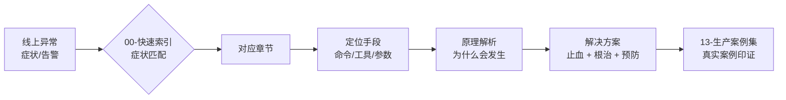
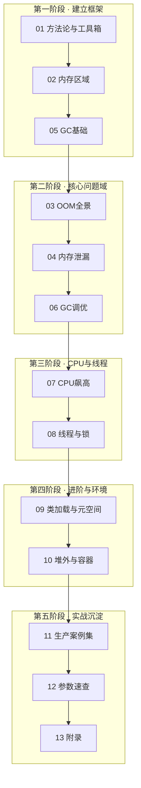

# Java 生产问题排查手册

> **定位**：面向生产环境的 Java 问题排查与解决方案手册。以 JVM 相关问题为主（内存、GC、CPU、线程、类加载、堆外/容器），按「**症状 → 定位 → 原理 → 解决**」四段式组织，既可当**应急快查手册**（线上出事时直接翻），也可当**体系化教程**（平时系统学）。
>
> **适用人群**：1 年以上 Java 后端工程师；对 JVM 有基本概念（堆/栈/GC 名词），但遇到线上问题不知道从哪下手，或知道工具却讲不清原理的工程师。

---

## 这本手册解决什么问题

生产问题的排查知识通常散落在博客、源码注释和一次次的故障复盘中，不成体系。本手册把它整理成三层：

每个问题域一章，每章统一结构：

| 结构段 | 内容 | 什么时候看 |
|--------|------|-----------|
| **📌 30 秒速览** | 本章核心结论速览 | 复习 / 快速回忆 |
| **背景原理** | 该问题域的底层机制 | 想搞懂"为什么" |
| **症状识别** | 典型表现、监控特征、误判排除 | 判断是不是这个问题 |
| **定位手段** | 具体命令、工具用法、输出怎么读 | 现场操作 |
| **解决方案** | 止血方案 → 根治方案 → 预防措施 | 落地修复 |
| **常见误区** | 高频踩坑点 | 避免二次事故 |
| **考点速查表** | 全章知识点一句话浓缩 | 最后过一遍 |

---

## 使用说明：三种模式

| 模式 | 场景 | 怎么用 |
|------|------|--------|
| **应急快查** | 线上正在出问题 | 直接打开 [00-快速索引](00-quick-index.md)，按症状找行 → 跳转对应章节「定位手段」 |
| **系统学习** | 平时提升 / 面试准备 | 按 [学习路线图](#学习路线图) 从 01 顺序读到 12，每章做一遍速查表 |
| **查漏补缺** | 只想补某个专题 | 目录表直达对应章节，先读「📌 30 秒速览」再决定是否细读 |

---

## 完整目录

| 文件 | 内容 | 关键词 |
|------|------|--------|
| [00-快速索引](00-quick-index.md) | 症状→原因→命令→章节 的总路由表，手册入口 | OOM/CPU/FGC/卡死 对照 |
| [01-排查方法论与工具箱](01-methodology-toolbox.md) | 排查四步法、止血优先原则、jcmd/jstat/jmap/jstack/JFR、Arthas、MAT、async-profiler 工具矩阵 | 工具选型 |
| [02-JVM运行时内存区域](02-memory-regions.md) | 堆/栈/元空间/代码缓存/直接内存布局，对象分配路径，内存水位怎么看 | 内存模型 |
| [03-OOM场景全景](03-oom-scenarios.md) | 8 种 OOM 的报错原文、根因分类、定位命令、解决方案对照 | heap space/metaspace/thread/direct buffer |
| [04-内存泄漏](04-memory-leak.md) | 泄漏 vs 正常缓存、经典泄漏模式 Top10、MAT 支配树实操、泄漏判定标准 | MAT/dominator tree |
| [05-GC基础与收集器演进](05-gc-fundamentals.md) | 分代假说、三色标记、安全点、CMS→G1→ZGC/Shenandoah 演进与选型 | 三色标记/写屏障 |
| [06-GC问题定位与调优](06-gc-tuning.md) | YGC 频繁/FGC 频繁/长停顿三大问题的定位流程、G1/ZGC 调优参数实战、GC 日志解读 | GC日志/停顿毛刺 |
| [07-CPU飙高](07-cpu-hot.md) | us/sy/wa 区分、top -Hp+printf 十六进制转换法、火焰图、正则回溯等高频根因 | top/arthas profiler |
| [08-线程与锁问题](08-thread-lock.md) | 死锁四条件与检测、线程池打满/拒绝策略、线程暴涨、服务假死 | jstack/死锁/线程池 |
| [09-类加载与元空间](09-classloading-metaspace.md) | 双亲委派、类加载器泄漏、动态类生成膨胀、NCDFE/CNFE 区分 | ClassLoader/元空间 |
| [10-堆外内存与容器环境](10-offheap-container.md) | DirectBuffer/Netty 堆外泄漏定位、K8s 内存 limit 与 OOMKilled(137)、CPU throttling、容器感知参数 | Netty/OOMKilled/throttle |
| [11-生产案例集](11-production-cases.md) | 15+ 个真实案例：症状→排查过程→根因→修复，含复盘要点 | 真实案例 |
| [12-JVM参数速查](12-jvm-flags.md) | 常用/易错参数表、容器推荐基线、各 JDK 版本默认值变化、危险参数黑名单 | 参数基线 |
| [13-附录·资料与版本事实](13-appendix-references.md) | JDK 版本时间线、GC 演进大事记（联网核实）、参考资料索引 | 版本事实 |

> 合并版单文件：[Java生产问题排查手册-完整版.md](Java生产问题排查手册-完整版.md)（全部章节按序合并，适合本地 Typora/VS Code 阅读）。

---

## 学习路线图

**最小应急技能集**（如果只学一天）：`01 章`的四步法 + `00 章`快速索引 + `07 章`的 top -Hp 法 + `08 章`的 jstack 死锁分析 —— 覆盖约 70% 的线上突发场景。

---

## 生产状态表

| 文件 | 行数 | 状态 |
|------|------|------|
| README.md | 116 | ✅ 完成 |
| 00-quick-index.md | 192 | ✅ 完成（含 5 张决策流程图） |
| 01-methodology-toolbox.md | 303 | ✅ 完成 |
| 02-memory-regions.md | 223 | ✅ 完成 |
| 03-oom-scenarios.md | 278 | ✅ 完成 |
| 04-memory-leak.md | 170 | ✅ 完成 |
| 05-gc-fundamentals.md | 220 | ✅ 完成 |
| 06-gc-tuning.md | 237 | ✅ 完成 |
| 07-cpu-hot.md | 188 | ✅ 完成 |
| 08-thread-lock.md | 291 | ✅ 完成（状态机/死锁/线程池/暴涨/锁竞争/假死） |
| 09-classloading-metaspace.md | 186 | ✅ 完成（双亲委派/Metaspace/泄漏/CNFE-NCDFE） |
| 10-offheap-container.md | 222 | ✅ 完成（NMT/OOMKilled/throttling/Netty） |
| 11-production-cases.md | 172 | ✅ 完成（10 个真实案例复盘+方法论） |
| 12-jvm-flags.md | 151 | ✅ 完成（参数表/容器基线/黑名单/版本变化） |
| 13-appendix-references.md | 77 | ✅ 完成（联网核实版本事实+来源索引） |
| 合并版完整文件 | 3080 | ✅ 已生成 |

全库合计约 **3000+ 行**、**36 张 mermaid 图**，全部章节按统一结构交付。

---

## 贡献指南

欢迎提交 Issue 和 Pull Request！

1. Fork 本仓库
2. 创建特性分支：`git checkout -b feature/your-feature`
3. 提交改动：`git commit -m "feat: 描述你的改动"`
4. 推送分支：`git push origin feature/your-feature`
5. 创建 Pull Request

**内容规范**：
- 每章保持统一结构：📌30秒速览 → 背景原理 → 症状识别 → 定位手段 → 解决方案 → 常见误区 → 考点速查表
- Mermaid 图中的中文节点/子图名必须加双引号
- 案例需注明出处（公开技术社区博客/官方文档）
- 版本号以 OpenJDK JEP 页面与 GitHub Releases API 为准

## 许可证

本项目采用 [MIT 许可证](LICENSE)，可自由使用、修改和分发。

---

## 维护约定

- 内容以 **JDK 8 / 11 / 17 / 21 / 25** 为主基线（生产主流 LTS），新特性标注适用版本起始。
- 所有版本号、JEP 编号、工具版本均经联网核实（2026-08），核实记录见 `13-附录`。
- 案例来自公开技术社区（美团技术团队、阿里云开发者社区、HeapDump 社区等），均已注明出处。
